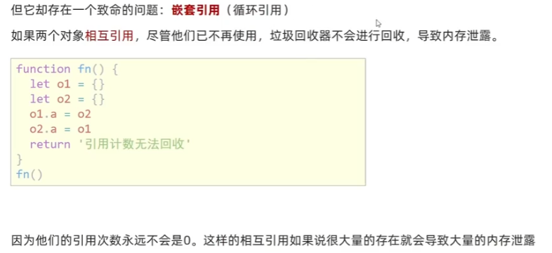

# 正则表达式

### 1、什么是正则表达式


### 2、正则表达式-定义规则和查找


#### （1）定义正则表达式语法


两种方法：

+ **字面量     `/表达式/`**    不用写引号
+ **内置构造函数     `new RegExp("表达式")`**

```html
  <script>
    // 1.字面量
    const reg = /abc/ // 含义：检查文本是否包含 abc 字符串
    console.log(reg) // /abc/
    //2. 内置构造函数
    const reg2 = new RegExp("abc")
    console.log(reg2) // /abc/
  </script>
```


#### （2）判断是否有符合规则的字符串`test()`


#### （3）检索（查找）符合规则的字符串`exec()`


判断文本**是否符合该正则表达式**，正则表达式调用**test()方法，返回true or false**

语法：**`正则表达式 .test('测试内容');`**

**截取文本符合该正则表达式的第一个字符串**，正则表达式调用**exec()方法**，返回**符合的第一个字符串**，**数组形式存储**。

语法：**`正则表达式 .exec('测试内容');`**

```html
  <script>
    const str = '我们在学习前端，希望学习前端能高薪毕业'
    // 正则表达式使用：
    // 1. 定义规则
    const reg = /前端/
    // const reg = /java/
    // 2. test()  是否匹配
    console.log(reg.test(str))  // true
    // 3. exec()
    console.log(reg.exec(str)) // 返回数组
  </script>
```


### 3、元字符


#### 基本元字符

**`\d`** 一位数字（表示0~9）

**`\D`** 一位非数字

**`\s`** 1位空白 （空格 缩进 换行）

 **`\S`** 1位 非空白

**`\w`** 字母 数字 下划线

 **`\W`** 非字母数字下划线

**`.`** 任意内容 （匹配除换行符之外的任何单个字符）

**`\ `**转义字符：比如  \ .    原本点代表任意内容，现在加了转义字符，它只能是一个点 


#### 边界符


**`^`** 开头边界

**`$`** 结尾边界


```js
    const reg = /\d/; //只要包含数字就行
    console.log(reg.test('aa1bb')); //true
    //上面讲的都是包含该表达式就符合

    // ^ 开头边界
    const reg2 = /^\d/; //开头是数字
    console.log(reg2.test('1aabb')); //true
    console.log(reg2.test('aa11bb')); //false

    //$ 结尾边界
    const reg3 = /\d$/; //结尾是数字
    console.log(reg3.test('aabb1')); //true
    console.log(reg3.test('aa11bb')); //false

    //^开头...结尾$ = 精确匹配，不是包含了
    const reg4 = /^abc$/; // 开头结尾都是abc  精确匹配abc
    console.log(reg4.test('abc')); //true
    console.log(reg4.test('abcabc')); //false
```


#### 量词


**` *`** 0~多次

**`+`**1~多次

**`?`** 0~1个

**`{n}`** 指定次数n

**`{n,}`** 大于等于>=n次数

**`{n,m}`** 大于等于>=n且小于等于m数

注意：**一般，量词只能作用前面一个“字符”**。量词的**作用范围**仅限于**<span style="color:red;">直接紧邻在其前面的字符、字符集合[]或分组()</span>**

1. 单个字符：量词作用于**前面的单个字符**，控制该字符的重复次数
   - `a*` 匹配 任意个连续 的字母 “a” （零次或多次）
   - `b+` 匹配 一个或多个连续 的字母 “b”
   - `c?` 匹配 零个或一个 字母 “c”
2. 字符集合：量词也可以应用于**字符集合**（使用方括号 `[] `表示的一组字符），控制整个字符集合的重复次数
   - `[abc]*` 匹配任意个连续的字符 “a”、“b” 或 “c” （零次或多次）
   - `[0-9]+` 匹配一个或多个连续的数字
3. 分组：量词还可以应用于**分组**（使用小括号`()` 将一部分正则表达式括起来），控制分组内的表达式的重复次数
   - `(ab)*` 匹配任意个连续的子字符串 “ab” （零次或多次）
   - `(xyz){2,4}` 匹配连续出现 2 到 4 次的字符串 “xyz”


#### 字符类

**`()`** 整体

 **`|`** 或，分割左右两边，作用两边整体

**`[]`** 代表1个，**包含里面 字符1个以上**，不用连起来，字符

​                  [a-zA-z0-9_]  等于\w

​                  [0-9]  等于\d

**`[^abc]`** 取反，不包含a b c


```js
    // 字符类   [abc]  只选1个
    // 开头和结尾都是abc中的一个
    console.log(/^[abc]$/.test('a')) // true
    console.log(/^[abc]$/.test('b')) // true
    console.log(/^[abc]$/.test('c')) // true
    console.log(/^[abc]$/.test('ab')) // false
    // 加量词
    console.log(/^[abc]{2}$/.test('ab')) // true
```


```js
    // 字符类   [a-z]  只选1个
    // 大写的字母
    console.log(/^[A-Z]$/.test('p')) // false 
    console.log(/^[A-Z]$/.test('P')) // true
    // 一个数字
    console.log(/^[0-9]$/.test(2)) // true
    // 大小写英文字母、数字
    console.log(/^[a-zA-Z0-9]$/.test(2)) // true
    console.log(/^[a-zA-Z0-9]$/.test('p')) // true
    console.log(/^[a-zA-Z0-9]$/.test('P')) // true
    
    console.log(/^[a-zA-Z0-9]{8}$/.test('123ABabc')) // true 精确匹配八位由数字、字母组成的字符串
```


```js
    console.log(/^[a-z]$/.test('a')) // true
    console.log(/^[^a-z]$/.test('a')) // false
    console.log(/^[^a-z]$/.test('1')) // true
    console.log(/^[a-zA-Z0-9]{8}$/.test('123ABabc')) // true 精确匹配八位由数字、字母组成的字符串
    console.log(/^[^a-zA-Z0-9]{8}$/.test('哈哈哈1a哈哈哈')) // false
    console.log(/^[^a-zA-Z0-9]{8}$/.test('我不包含数字字母')) // true
```


案例：


```html
  <style>
    span {
      display: inline-block;
      width: 250px;
      height: 30px;
      vertical-align: middle;
      line-height: 30px;
      padding-left: 15px;
    }

    .error {
      color: red;
      background: url(./images/error1.png) no-repeat left center;
    }

    .right {
      color: green;
      background: url(./images/right.png) no-repeat left center;
    }
  </style>

  <input type="text">
  <span></span>

  <script>
    const ipt = document.querySelector('input')
    const span = document.querySelector('span')
    // 1. 定义规则
    const reg = /^[a-zA-Z0-9-_]{6,16}$/ // 英文字母，数字，下划线或者短横线组成，长度6~16位
    ipt.addEventListener('blur',function() { // 表单失去焦点
      // 2. 查找
      if(reg.test(this.value)) {
        span.classList.add('right')
        span.innerHTML = '验证通过'
      } else {
        span.classList.add('error')
        span.innerHTML = '请输入6~16位的英文数字下划线'
      }
    })
  </script>
```


### 4、修饰符


```html
  <script>
    console.log(/^java$/.test('java')) // true
    console.log(/^java$/.test('JAVA')) // false 默认区分大小写
    console.log(/^java$/i.test('JAVA')) // true  /.../i：匹配时，不区分大小写
    console.log(/^java$/i.test('Java')) // true
      
    const str = 'java是一门编程语言， 学完JAVA工资很高'
    // const re = str.replace(/java|JAVA/g, '前端')
    const re = str.replace(/java/ig, '前端') // i-不区分大小写 g-全局标识符，匹配所有满足正则表达式的结果（全都查找出来，默认只匹配第一个）
    console.log(re) // 前端是一门编程语言， 学完前端工资很高
  </script>
```


### 5、捕获`exex()`

判断文本**是否符合该正则表达式**，正则表达式调用**test()方法，返回true or false**

语法：**正则表达式 .test('内容')；**

**截取文本符合该正则表达式的第一个字符串**，正则表达式调用**exec()方法**，返回符合的第一个字符串，**数组形式存储**。

语法：**正则表达式 .exec('内容')**

标识符： **g——全局标识符，解决exec() 懒惰问题      i——不区分大小写**

```js
        var datestr = 'time is from 2029-01-01 to 2029-01-02'
        // 标识符 g i
        var reg2 = /\d{4}-\d{1,2}-\d{1,2}/g //捕获不懒惰，第一个捕获完，捕获第二个，全局
        var newdatestr1 = reg2.exec(datestr);
        console.log(newdatestr1); //2029-01-01
        var newdatestr2 = reg2.exec(datestr);
        console.log(newdatestr2); //2029-01-02 ，捕获第二个，不懒惰了
        console.log(newdatestr1[0].split('-').join('/'));
        console.log(newdatestr2[0].split('-').join('/'));
        
        var myreg = /[a-z]/i  //忽略大小写
        console.log(myreg.test('aa'));//t
        console.log(myreg.test('AA'));//f t
```


### 6、正则表达式的两大特性

**懒惰**：只会捕获第一个符合的字符串

**贪婪**：次数取最大的

```js
        //1. 懒惰 使用全局标识符g解决  
         //懒惰：只会捕获第一个符合的字符串

        //2. 贪婪
        var reg = /\d{1,4}/ ; // 包含1~4个数字 字符串
        console.log(reg.exec('aa1234bb')); // 1234 取次数最多的

        //3. 非贪婪 解决 ? 0~1个
        var reg2 = /\d{1,4}?/ ;
        console.log(reg2.exec('aa1234bb')); // 1

        //非贪婪：用于一种范围
        /*
        *?
        +?
        ??
        {n,}?
        {n,m}?
        */
```


### 7、正则与字符串方法

```html
  <script>
    // 之前都是这样，写好正则，调用用法
    // 正则.test(字符串)
    // 正则.exec(字符串)

    // 字符串.replace search match
    const str = 'adearfa'

    // 1 .replace
    // const newstr = str.replace('a','*') // *dearfa 只替换第一次出现的字符
    const newstr = str.replace(/a/g, '*') // 匹配所有结果，都进行替换
    console.log(newstr) // *de*rf*

    // 2 .search
    console.log(str.search('fa')) // 5 返回查找到的第一个a的索引号
    console.log(str.search(/a/)) // 0

    // 3 .match 捕获内容
    // const str1 = 'adearfa'
    // console.log(str1.match('ad')) //伪数组 ad
    const datestr = 'time is from 2029-01-01 to 2029-01-02'
    console.log(datestr.match(/\d{4}-\d{1,2}-\d{1,2}/g)); //返回伪数组，两个元素2029-01-01和2029-01-02
  </script>
```


### 案例：过滤敏感字


```html
  <textarea name="" id="" cols="30" rows="10"></textarea>
  <button>发布</button>
  <div></div>

  <script>
    const tx = document.querySelector('textarea')
    const btn = document.querySelector('button')
    const div = document.querySelector('div')
    btn.addEventListener('click', function () {
      // console.log(tx.value)
      div.innerHTML = tx.value.replace(/激情|基情/g, '**') // g全局匹配 敏感词激情or基情，替换成**
      tx.value = ''
    })
  </script>
```


### 案例：小兔鲜页面注册


```html
<div class="xtx-wrapper">
    <div class="container">
      <!-- 卡片 -->
      <div class="xtx-card">
        <h3>新用户注册</h3>
        <form class="xtx-form">
          <div data-prop="username" class="xtx-form-item">
            <span class="iconfont icon-zhanghao"></span>
            <input name="username" type="text" placeholder="设置用户名称">
            <span class="msg"></span>
          </div>
          <div data-prop="phone" class="xtx-form-item">
            <span class="iconfont icon-shouji"></span>
            <input name="phone" type="text" placeholder="输入手机号码  ">
            <span class="msg"></span>
          </div>
          <div data-prop="code" class="xtx-form-item">
            <span class="iconfont icon-zhibiaozhushibiaozhu"></span>
            <input name="code" type="text" placeholder="短信验证码">
            <span class="msg"></span>
            <a class="code" href="javascript:;">发送验证码</a>
          </div>
          <div data-prop="password" class="xtx-form-item">
            <span class="iconfont icon-suo"></span>
            <input name="password" type="password" placeholder="设置6至20位字母、数字和符号组合">
            <span class="msg"></span>
          </div>
          <div data-prop="confirm" class="xtx-form-item">
            <span class="iconfont icon-suo"></span>
            <input name="confirm" type="password" placeholder="请再次输入上面密码">
            <span class="msg"></span>
          </div>
          <div class="xtx-form-item pl50">
            <i class="iconfont icon-queren"></i>
            已阅读并同意<i>《用户服务协议》</i>
          </div>
          <div class="xtx-form-item">
            <button class="submit">下一步</button>
            <!-- <a class="submit" href="javascript:;">下一步</a> -->
          </div>
        </form>
      </div>
    </div>
  </div>
```


```js
  (function () {
      // 1. 发送短信验证码模块
      const code = document.querySelector('.code')
      // 1.1 点击事件
      code.addEventListener('click', _.throttle(function () { // 节流（技能冷却）
        let i = 5
        // 点击后立马先显示信息，不需要一秒钟后
        code.innerHTML = `0${i}秒后重新获取`
        let timerId = setInterval(function () {
          i--
          code.innerHTML = `0${i}秒后重新获取`
          if (i === 0) {
            clearInterval(timerId)
            code.innerHTML = '重新获取'
          }
        }, 1000)
      }, 5000, {
        leading: true,
        trailing: false
      }))
    })();
```


```js
    // 2. 验证的是用户名
    // 2.1 获取用户名表单
    const username = document.querySelector('[name=username]')
    // 2.2 使用change事件  值发生变化的时候
    username.addEventListener('change', verifyName) //写函数名
    // 2.3 封装verifyName函数
    function verifyName() {
      const span = username.nextElementSibling
      // 2.4 定规则  用户名
      const reg = /^[a-zA-Z0-9-_]{6,10}$/
      if (!reg.test(username.value)) {
        span.innerHTML = '输入不合法,请输入6~10位'
        return false
      } 
      // 可以不写else，如果执行if，return就会结束函数，不执行if就自然执行下面的代码
        // 2.5 合法的 就清空提示span
        span.innerHTML = ''
        return true
    }

    // 3. 验证的是手机号
    // 3.1 获取手机号表单
    const phone = document.querySelector('[name="phone"]')
    // 3.2 使用change事件  值发生变化的时候
    phone.addEventListener('change', verifyPhone) //写函数名
    // 3.3 封装verifyPhone函数
    function verifyPhone() {
      const span = phone.nextElementSibling
      // 3.4 定规则  手机号
      const reg = /^1(3\d|4[5-9]|5[0-35-9]|6[567]|7[0-8]|8\d|9[0-35-9])\d{8}$/
      if (!reg.test(phone.value)) {
        span.innerHTML = '输入不合法,请输入正确的11位手机号码'
        return false
      } 
        // 3.5 合法的 就清空提示span
        span.innerHTML = ''
        return true
    }

    // 4. 验证的是验证码
    const codeInput = document.querySelector('[name="code"]')
    codeInput.addEventListener('change', verifyCode) //写函数名
    function verifyCode() {
      const span = codeInput.nextElementSibling
      const reg = /^\d{6}$/
      if (!reg.test(codeInput.value)) {
        span.innerHTML = '输入不合法,6 位数字'
        return false
      } 
        span.innerHTML = ''
        return true
    }

    // 5. 验证的是密码
    // 5.1 获取密码表单
    const password = document.querySelector('[name="password"]')
    // 5.2 使用change事件  值发生变化的时候
    password.addEventListener('change', verifyPassword) //写函数名
    // 5.3 封装verifyPassword函数
    function verifyPassword() {
      const span = password.nextElementSibling
      // 5.4 定规则  密码
      const reg = /^[a-zA-Z0-9-_]{6,20}$/
      if (!reg.test(password.value)) {
        span.innerHTML = '输入不合法,6~20位数字字母符号组成'
        return false
      } 
        // 5.5 合法的 就清空提示span
        span.innerHTML = ''
        return true
    }

    // 6. 密码的再次验证
    // 6.1 获取再次验证表单
    const confirm = document.querySelector('[name=confirm]')
    //6.2 使用change事件  值发生变化的时候
    confirm.addEventListener('change', verifyConfirm)
    // 6.3 verifyPhone
    function verifyConfirm() {
      const span = confirm.nextElementSibling
      // 6.4 当前表单的值不等于 密码框的值就是错误的
      if (confirm.value !== password.value) {
        span.innerText = '两次密码输入不一致'
        return false
      }
      // 6.5 合法的 就清空span
      span.innerText = ''
      return true
    }
```


```js
    // 7. 我同意
    const queren = document.querySelector('.icon-queren')
    queren.addEventListener('click', function () {
      // 切换类  原来有的就删掉，原来没有就添加
      this.classList.toggle('icon-queren2')
    })


    // 8. 提交模块
    const form = document.querySelector('form')
    form.addEventListener('submit', function (e) {
      // 判断是否勾选我同意模块 ，如果有 icon-queren2说明就勾选了，否则没勾选
      if (!queren.classList.contains('icon-queren2')) {
        alert('请勾选同意协议')
        // 阻止提交
        e.preventDefault()
      }
      // 依次判断上面的每个框框 是否通过，只要有一个没有通过的就阻止
      // console.log(verifyName())
      if (!verifyName()) e.preventDefault()
      if (!verifyPhone()) e.preventDefault()
      if (!verifyCode()) e.preventDefault()
      if (!verifyPassword()) e.preventDefault()
      if (!verifyConfirm()) e.preventDefault()
    })
```


# ES6

- 我们所说的 ES5 和 ES6 其实就是在 **js 语法的发展过程中的一个版本**而已

- ECMAScript 就是 js 的语法

  - 以前的版本没有某些功能
  - 在 ES5 这个版本的时候增加了一些功能
  - 在 ES6 这个版本的时候增加了一些功能

- 因为浏览器是浏览器厂商生产的

  - ECMAScript 发布了新的功能以后，浏览器厂商需要让自己的浏览器支持这些功能
  - 这个过程是需要时间的
  - 所以到现在，基本上大部分浏览器都可以比较完善的支持了
  - 只不过有些浏览器还是不能全部支持
  - 这就出现了兼容性问题
  - 所以我们写代码的时候就要考虑哪些方法是 ES5 或者 ES6 的，看看是不是浏览器都支持

  

## let 和 const 关键字

- 我们以前都是使用 `var` 关键字来**声明变量**的

- 在 ES6 的时候，多了两个关键字 `let` 和 `const`，也是用来**声明变量**的

- 只不过和 var 有一些区别

  1. `let` 和 `const` **不允许重复声明变量**

     ```javascript
     // 使用 var 的时候重复声明变量是没问题的，只不过就是后面会把前面覆盖掉（不合理）
     var num = 100
     var num = 200
     ```

     ```javascript
     // 使用 let 重复声明变量的时候就会报错了
     let num = 100
     let num = 200 // 这里就会报错了
     ```

     ```javascript
     // 使用 const 重复声明变量的时候就会报错
     const num = 100
     const num = 200 // 这里就会报错了
     ```

  2. `let` 和 `const` 声明的变量**不会在预解析的时候解析**（也就是**没有变量提升**）

     **变量预解析(变量提升)**：把所有**变量的声明**提升到**当前作用域**的**最前面**，但**不提升赋值操作（在原地**）。

     ```javascript
     // 因为预解析（变量提升）的原因，在前面是有这个变量的，只不过没有赋值
     console.log(num) // undefined
     var num = 100
     ```

     ```javascript
     // 因为 let 不会进行预解析（变量提升），所以直接报错了
     console.log(num) // 报错
     let num = 100
     ```

     ```javascript
     // 因为 const 不会进行预解析（变量提升），所以直接报错了
     console.log(num) // 报错
     const num = 100
     ```

  3. `let` 和 `const` 声明的变量**会被所有代码块限制作用范围**, **var** 声明的变量**只有函数能限制其作用域**，其他的{}不能限制

     ```javascript
     // var 声明的变量只有函数能限制其作用域，其他的{}不能限制
     if (true) {
       var num = 100
     }
     console.log(num) // 100
     ```

     ```javascript
     // let 声明的变量，除了函数可以限制，所有的代码块{}都可以限制其作用域（if/while/for/...）
     if (true) {
       let num = 100
       console.log(num) // 100
     }
     console.log(num) // 报错
     ```

     ```javascript
     // const 声明的变量，除了函数可以限制，所有的代码块都可以限制其作用域（if/while/for/...）
     if (true) {
       const num = 100
       console.log(num) // 100
     }
     console.log(num) // 报错
     ```

- `let` 和 `const` 的区别

  1. `let` 声明的变量的**值可以改变**，`const` 声明的变量的**值不可以改变，是一个常量**

     ```javascript
     let num = 100
     num = 200
     console.log(num) // 200
     ```

     ```javascript
     const num = 100
     num = 200 // 这里就会报错了，因为 const 声明的变量值不可以改变（我们也叫做常量）
     ```

  2. `let` **声明**的时候**可以不赋值**，`const` **声明**的时候**必须赋值（初始化）**

     ```javascript
     let num
     num = 100
     console.log(num) // 100
     ```

     ```javascript
     const num // 这里就会报错了，因为 const 声明的时候必须赋值
     ```


例子：


```js
  <script>
    const arr = ['red', 'pink']
    arr.push('blue')
    console.log(arr) // 可以
    // arr = [1, 2, 4] // 赋值一个新的数组，地址改变了
    // console.log(arr)  // 错误
  </script>
```


小结：


## 作用域


### 1）全局作用域


### 2）局部作用域

#### 函数作用域

**函数作用域**：**在函数内部**就是局部作用域，里面代码的名字**只在函数内部起作用**


#### 块级作用域

JS的作用域**在es6之前**，只有 **全局作用域** 和 **函数作用域**


**块级作用域**：**{}  if{} for{} while{}**，**一个代码块{}**


### 作用域链


## JS垃圾回收机制


**堆和栈空间分配**：


介绍两种常见的**浏览器垃圾回收算法**：**引用计数法**  和  **标记清除法**

### 1）引用计数法


如下：对象的引用次数最终都变为0，自动回收，释放内存


如下：o1.a = o2 将o2赋值给o1的a，同样将o1赋值给o2的a，互相引用，永远都有引用，这样函数执行完依然回收不了，大量调用就会大量的内存泄露。




### 2）标记清除法


## 闭包

### 1、闭包的组成


```html
  <script>
    // 简单的写法
    function outer() {
      let a = 10
      function fn() {
        console.log(a)
      }
      fn() // 调用一下，才叫使用
    }
    outer()
  </script>
```


### 2、闭包的作用-外部访问函数内部变量


```js
    // 闭包的形式1   外部可以访问使用 函数内部的变量
    function outer() {
      let a = 100
      function fn() {
        console.log(a)
      }
      return fn
    }
    // 原理：
    // outer()   ===  fn   ===  function fn() {}  函数名() = return后面的结果
    // const fun = function fn() { }

    // 闭包的形式2
    // function outer() {
    //   let a = 100
    //   return function () {
    //     console.log(a)
    //   }
    // }

    const fun = outer()
    fun() // 调用函数 打印 100 
```


### 3、闭包的应用-实现数据的私有


```html
<script>
    // 闭包应用：实现数据的私有
    // 统计函数调用的次数
    
    // 1、定义全局变量i，但是全局变量容易被修改
    /* let i = 0
    function fn() {
      i++;
      console.log(`函数被调用了${i}`);
    } */
    // 2、闭包实现数据的私有 这样不会被修改
    function outer() {
      let i = 0
      return function fn() {
        i++;
        console.log(`函数被调用了${i}`);
      }
    }
    const fun = outer()
</script>
```

1、


2、


注意：闭包可能存在问题：**<span style="color:red">内存泄漏</span>**


## 深浅拷贝


### 浅拷贝


```js
<script>
    const obj = {
      name:'pink',
      age:18
    }
    // 第一种：展开对象的方式
   /*  const o = {...obj} //展开对象
    console.log(o); //{name: 'pink', age: 18}
    o.age = 20
    console.log(o); //{name: 'pink', age: 20}
    console.log(obj); //{name: 'pink', age: 18} */
    // 第二种：Object.assgin()
    const o = {}
    Object.assign(o,obj)
    console.log(o); //{name: 'pink', age: 18}
    o.age = 20
    console.log(o); //{name: 'pink', age: 20}
    console.log(obj); //{name: 'pink', age: 18}
</script>

问题：
<script>
    // 浅拷贝：拷贝的是地址，对象里的简单数据类型拷贝值，但是如果是引用类型（对象、数组），也只是拷贝其地址。只拷贝第一层，多层就不行了
    const obj = {
      name:'pink',
      age:18,
      family:{
        baby:'小pink'
      }
    }
    const o = {}
    Object.assign(o,obj)
    o.family.baby = '老pink'
    console.log(o); 
    console.log(obj); // 这里的family里的baby也改变了
</script>
```


### 深拷贝


#### 递归函数实现

**递归函数**


```js
<script>
    let i =1
    function fn() {
      console.log(`这是第${i}次`);
      if(i >= 6){
        return
      }
      i++
      fn()
    }
    fn() // 调用
</script>
```

函数递归：利用递归函数实现 **setTimeout 模拟 setInterval 效果**

```js
<script>
    // 利用递归函数实现 setTimeout 模拟 setInterval 效果
    function getTime() {
      document.querySelector('div').innerHTML = new Date().toLocaleString()
      setTimeout(getTime,1000)
    }
    getTime()
    
    /* setInterval(getTime,1000) */
</script>
```

实现深拷贝

```js
<script>
    const obj = {
      uname: 'pink',
      age: 18,
      hobby: ['乒乓球', '足球'],
      family: {
        baby: '小pink'
      }
    }
    const o = {}
    // 拷贝函数
    function deepCopy(newObj, oldObj) {
      for (var k in oldObj) {
        // 处理数组的问题
        if (oldObj[k] instanceof Array) {
          newObj[k] = []
          // newObj[k] 接收 []
          // oldObj[k] ['乒乓球','足球']
          deepCopy(newObj[k], oldObj[k])
        } else if (oldObj[k] instanceof Object) {
          newObj[k] = {}
          deepCopy(newObj[k], oldObj[k])
        } else {
          // k--属性名   oldObj[k]--属性值
          // newObj[k] = newObj['uname'] = o.uname
          newObj[k] = oldObj[k]
        }
      }
    }
    deepCopy(o, obj) // 函数调用  两个参数 o新对象  obj旧对象
    console.log(o);
    o.age = 20
    o.hobby[0] = '篮球'
    o.family.baby = '老pink'
    console.log(obj);
</script>
```

面试回答利用递归函数实现深拷贝：深拷贝实现的是新对象的修改不会影响旧对象，当遇到普通拷贝的时候，直接赋值即可，但是如果遇到数组，递归调用函数，实现赋值。遇到对象，也是递归调用函数。注意：要先处理数组，在处理对象。


#### js库lodash里面cloneDeep

`_.cloneDeep(value)`：这个方法类似[`_.clone`](https://www.lodashjs.com/docs/lodash.cloneDeep#clone)，除了它会**递归拷贝 `value`。**（注：也叫**深拷贝**）。

```js
var objects = [{ 'a': 1 }, { 'b': 2 }];
 
var deep = _.cloneDeep(objects);
console.log(deep[0] === objects[0]);
// => false
```

```js
<!-- 引入在线的lodash -->
  <script src="https://cdn.bootcss.com/lodash.js/4.17.11/lodash.min.js"></script>
  <script>
    const obj = {
      uname: 'pink',
      age: 18,
      hobby: ['乒乓球', '足球'],
      family: {
        baby: '小pink'
      }
    }
    // 语法：_.cloneDeep(要被克隆的对象)
    const o = _.cloneDeep(obj)
    console.log(o);
    o.age = 20
    o.hobby[0] = '篮球'
    o.family.baby = '老pink'
    console.log(obj);
</script>
```


#### JSON.stringify( )实现

JSON 对象包含两个方法：

1. 用于**解析成 JSON 对象**的 `parse()`；
2. 用于**将对象转换为 JSON 字符串方法**的 `stringify()`。

+ **`JSON.stringify()`** 方法将一个 **JavaScript 对象或值**转换为 **JSON 字符串**，如果指定了一个 replacer 函数，则可以选择性地替换值，或者指定的 replacer 是数组，则可选择性地仅包含数组指定的属性。

```js
console.log(JSON.stringify({ x: 5, y: 6 }));
// Expected output: "{"x":5,"y":6}"

console.log(JSON.stringify([new Number(3), new String('false'), new Boolean(false)]));
// Expected output: "[3,"false",false]"

console.log(JSON.stringify({ x: [10, undefined, function(){}, Symbol('')] }));
// Expected output: "{"x":[10,null,null,null]}"

console.log(JSON.stringify(new Date(2006, 0, 2, 15, 4, 5)));
// Expected output: ""2006-01-02T15:04:05.000Z""
```

+ **`JSON.parse()`** 方法用来**解析 JSON 字符串**，**构造由字符串描述的 JavaScript 值或对象**。提供可选的 **reviver** 函数用以在返回之前对所得到的对象执行变换 (操作)。

```js
const json = '{"result":true, "count":42}';
const obj = JSON.parse(json);

console.log(obj.count);
// Expected output: 42

console.log(obj.result);
// Expected output: true
```

使用上面两个方法实现深拷贝

```js
<script>
    const obj = {
      uname: 'pink',
      age: 18,
      hobby: ['乒乓球', '足球'],
      family: {
        baby: '小pink'
      }
    }
    // 把 对象 转换成 JSON字符串
    // console.log(JSON.stringify(obj)); //{"uname":"pink","age":18,"hobby":["乒乓球","足球"],"family":{"baby":"小pink"}}
    // 先将对象转换为 JSON字符串，这样就成了简单数据类型
    const o = JSON.parse(JSON.stringify(obj))
    console.log(o);
    o.age = 20
    o.hobby[0] = '篮球'
    o.family.baby = '老pink'
    console.log(obj);
</script>
```


## 异常处理

+ throw抛异常
+ try / catch 捕获异常
+ debugger

了解JavaScript中程序异常处理的方法，提升代码运行的健壮性。

### throw 抛异常


```js
<script>
    function fn(x,y) {
      if(!x || !y) {
        // throw '没有传递参数进来'
        throw new Error('没有传递参数进来') //抛出异常信息，程序会终止
      }
      return x + y;
    }
    console.log(fn()); //没有传递参数，默认undefined（只声明，不赋值）任何类型+undefined = NaN
</script>
```


### try / catch 捕获异常


```html
<p>123</p>
  <script>
    function fn() {
      try {
        // 可能发生错误的代码，要写到 try 里面
        const p = document.querySelector('.p')
        p.style.color = 'red'
      } catch(err) {
        // 拦截错误，提示浏览器提供的错误信息，但是不中断程序的执行
        console.log(err.message); // message属性
        // 抛出异常，中断程序
        throw new Error('选择器错误') 
        // 需要加return，中断程序
        // return 
      }
      finally {
        // 不管程序有没有错误，最终都会执行finally里的代码
        alert('弹出对话框')
      }
      
      console.log('没被中断');
    }
    
    fn() // 调用
  </script>
```


### debugger

相当于打断点，程序代码太长，可以用。


## 卡顿现象-引入防抖与节流

正常情况（用户慢慢操作）：鼠标进入每一个一级分类h3，都会触发鼠标进入事件

非正常情况（用户操作很快）：本身全部的一级分类都应该触发鼠标进入事件，但是经过测试，只有部分h3触发了

就是由于用户行为过快，导致浏览器反应不过来。如果当前回调函数中有大量业务，有可能出现卡顿现象


### 函数的防抖debounce


防抖：前面的所有的触发都被取消，**最后一次执行，在规定的时间之后**才会触发，也就是说**如果连续快速的触发，只会执行一次**

**lodash插件**：里面封装函数的防抖与节流的业务【闭包+延时器】

(https://www.lodashjs.com/)  

`_.debounce(func, [wait=0], [options=])`：创建一个 debounced（防抖动）函数，该函数会**从上一次被调用后，延迟 `wait` 毫秒后调用 `func` 方法**。

1. `func` *(Function)*: 要**防抖动的函数**。
2. `[wait=0]` *(number)*: 需要**延迟的毫秒数**。
3. `[options=]` *(Object)*: 选项对象。
4. `[options.leading=false]` *(boolean)*: 指定在延迟开始前调用。
5. `[options.maxWait]` *(number)*: 设置 `func` 允许被延迟的最大值。
6. `[options.trailing=true]` *(boolean)*: 指定在延迟结束后调用。

```js
// 防抖：前面的所有的触发都被取消，最后一次执行在规定的时间之后才会触发，也就是说如果连续快速的触发，只会执行一次
  let input = document.querySelector('input');
  // 文本发生变化  input事件：当input的value值发生变化时就会触发
  input.oninput = _.debounce(function() {
    console.log('ajax发请求');
  },1000)
  // lodash插件：里面封装函数的防抖与节流的业务【闭包+延时器】
```


### 函数的节流throttle


节流：在**规定的间隔时间范围内不会重复触发回调**，只有**大于这个时间间隔才会触发回调**，把**频繁触发变为少量触发**

`_.throttle(func, [wait=0], [options=])`：创建一个节流函数，**在 wait 秒内最多执行 `func` 一次的函数**。

1. `func` *(Function)*: 要**节流的函数**。
2. `[wait=0]` *(number)*: 需要**节流的毫秒**。
3. `[options=]` *(Object)*: 选项对象。
4. `[options.leading=true]` *(boolean)*: 指定调用在节流开始前。
5. `[options.trailing=true]` *(boolean)*: 指定调用在节流结束后。

```js
// 计数器：在一秒之内，只能执行一次  （轮播图点击会用上）
  btn.onclick = _.throttle(function() {
    // 节流：目前这个回调函数1s执行一次
    // 假如这里面有很多的业务代码，是不是可以给浏览器充裕的时间去解析
    count++;
    span.innerHTML = count;
    console.log('执行');
  },1000)
```

```html
  <script>
    // 1. 发送短信验证码模块
    const code = document.querySelector('.code')
    // 1.1 点击事件
    code.addEventListener('click',_.throttle(function() {
      let i = 5
      // 点击后立马先显示信息，不需要一秒钟后
      code.innerHTML = `0${i}秒后重新获取` 
      let timerId = setInterval(function() {
        i--
        code.innerHTML = `0${i}秒后重新获取`
        if(i === 0) {
          clearInterval(timerId)
          code.innerHTML = '重新获取'
        }
      },1000)
    },5000,{leading:true, trailing:false}))
  </script>
```

小结：

防抖：用户操作很频繁，但是**只是执行一次**

节流：用户操作很频繁，但是**把频繁的操作变为少量操作**，可以给浏览器充裕的时间去解析

```js
<script>
    // 需求：鼠标在盒子上移动，里面的数字就会有变化
    let box = document.querySelector('.box')
    let count = 1
    function mouseMove() {
      box.innerHTML = count++
      // 如果里面存在大量消耗性能的代码
    }
    // box.addEventListener('mousemove',_.debounce(mouseMove,500))
    box.addEventListener('mousemove',_.throttle(mouseMove,500))
</script>
```


## 箭头函数


### 1、基本语法

**函数声明两种方式**：

第一种：<span style="color:red">**声明式（常见的）**</span>

声明：**`function 函数名(...) {函数体}`**

调用：**函数名(...)**;

第二种：<span style="color:red">**函数表达式**</span>

声明：**`let 变量名 = function(...) { 函数体 }`**

调用：**变量名(...)**;

- 箭头函数是 ES6 里面一个**简写函数的语法方式**

- 重点： **箭头函数只能简写  函数表达式（第二种），不能简写声明式函数。<span style="color:red">需要匿名函数的地方</span>**

  ```javascript
      function fn() {} // 不能简写
      const fun = function () {} // 可以简写,函数表达式——第二种方式
  
      const obj = {
        fn: function () {} // 对象里面的函数，可以简写
      }
  
      setTimeOut(function () {
        ...
      }, 毫秒数) //可以简写
  
      //函数声明的另一种方式：var/let/const 变量名 = function(...) {函数体}
      var test1 = function () {
        console.log('11111');
      }
  
      //箭头函数：
      //语法：(...) => {函数体}
      var test2 = () => {
        console.log('22222');
      }
      test1();
      test2();
  ```

- 语法： `(形参) => { 函数体 }`

  ```javascript
  const fn = function (a, b) {
    console.log(a)
    console.log(b)
  }
  // 可以使用箭头函数写成
  const fun = (a, b) => {
    console.log(a)
    console.log(b)
  }
  ```

  ```javascript
  const obj = {
    fn: function (a, b) {
      console.log(a)
      console.log(b)
    }
  }
  // 可以使用箭头函数写成
  const obj2 = {
    fn: (a, b) => {
      console.log(a)
      console.log(b)
    }
  }
  ```

  ```HTML
    <script>
      // const fn = function () {
      //   console.log(123)
      // }
      // 1. 箭头函数 基本语法
      const fn = () => {
        console.log(123)
      }
      fn()
      const fn1 = (x) => {
        console.log(x)
      }
      fn1(1)
  
      // 2. 只有一个形参的时候，可以省略小括号
      const fn2 = x => {
        console.log(x)
      }
      fn2(1)
  
      // 3. 只有一行代码的时候，我们可以省略大括号
      const fn3 = x => console.log(x)
      fn3(1)
  
      // 4. 只有一行代码的时候，可以省略return
      const fn4 = x => x + x
      console.log(fn4(1)) // 2
  
      // 5. 箭头函数可以直接返回一个对象
      const fn5 = (uname) => ({
        uname: uname
      })
      console.log(fn5('刘德华')) // {uname: '刘德华'}
    </script>
  ```
  
  

### 箭头函数的特殊性

- 箭头函数内部**没有 this**，箭头函数的this指向的是**父级作用域的**

  ```javascript
      const obj1 = {
              fn: function () {
                  console.log(this); //指向当前对象obj1
              },
              fun: () => {
                  console.log(this); //指向当前对象的上一级——父级作用域window
              }
          }
  
          obj1.fn()
          obj1.fun()
  ```

  - 按照我们之前的 this 指向来判断，两个都应该指向 obj
  - 但是 fun 因为是箭头函数，所以 this 不指向 obj，而是**指向 fun 的外层**，就是 window

- 箭头函数内部**没有 `arguments` 这个参数集合**

  复习：arguments里面**存储了所有传递过来的实参**，**伪数组形式**存储。

  ```javascript
  const obj = {
    fn: function () {
      console.log(arguments)
    },
    fun: () => {
      console.log(arguments)
    }
  }
  obj.fn(1, 2, 3) // 会打印一个伪数组 [1, 2, 3]
  obj.fun(1, 2, 3) // 会直接报错
  ```

- 函数**只有一个形参**的时候**可以不写 `()`** 其余情况必须写

  ```javascript
  const obj = {
    fn: () => {
      console.log('没有参数，必须写小括号')
    },
    fn2: a => {
      console.log('一个行参，可以不写小括号')
    },
    fn3: (a, b) => {
      console.log('两个或两个以上参数，必须写小括号')
    }
  }
  ```

- 函数体**只有一行代码**的时候，**可以不写 `{}`** ，并且**会自动 return**

  ```javascript
  const obj = {
    fn: a => {
      return a + 10
    },
      
    fun: a => a + 10
      
  }
  
  console.log(fn(10)) // 20
  console.log(fun(10)) // 20
  ```


### 函数传递参数的时候的默认值

- 我们在定义函数的时候，有的时候**需要一个默认值出现**

- 就是当我**不传递参数的时候，使用默认值**，传递参数了就使用传递的参数

  ```javascript
  function fn(a) {
    a = a || 10
    console.log(a)
  }
  fn()   // 不传递参数的时候，函数内部的 a 就是 10
  fn(20) // 传递了参数 20 的时候，函数内部的 a 就是 20
  ```

  - 可以直接**把默认值写在函数的形参位置**

  ```javascript
  function fn(a = 10) {
    console.log(a)
  }
  fn()   // 不传递参数的时候，函数内部的 a 就是 10
  fn(20) // 传递了参数 20 的时候，函数内部的 a 就是 20
  ```

  - 这个默认值的方式**箭头函数也可以使用**

  ```javascript
  const fn = (a = 10) => {
    console.log(a)
  }
  fn()   // 不传递参数的时候，函数内部的 a 就是 10
  fn(20) // 传递了参数 20 的时候，函数内部的 a 就是 20
  ```

  - 注意： **箭头函数如果你需要使用默认值的话，那么一个参数的时候也需要写 （）**


## 解构赋值

- 解构赋值，就是**快速的从 对象 或者 数组 中取出成员的一个语法方式**

  **一一对应**

### 解构对象`{}`

- **快速**的从对象中**获取成员**

  ```javascript
  // ES5 的方法向得到对象中的成员
  const obj = {
    name: 'Jack',
    age: 18,
    gender: '男'
  }
  
  let name = obj.name
  let age = obj.age
  let gender = obj.gender
  ```

  ```javascript
  // 解构赋值的方式从对象中获取成员
  const obj = {
    name: 'Jack',
    age: 18,
    gender: '男'
  }
  
  // 前面的 {} 表示我要从 obj 这个对象中获取成员了
  // name age gender 都得是 obj 中有的成员
  // obj 必须是一个对象
  let { name, age:myage, gender } = obj   //age重命名了
  
  //解构复杂对象
        var obj2 = {
              name:'zyk',
              age:100,
              location:{
                  province:'jiangxi',
                  city:'leping'
              },
              hobby:[111,222,333]
          }
   
          var{
              name, 
              age, 
              location:{
                  province,
                  city
              }, 
              hobby:[u,v,w]
          } = obj2;
          console.log(name,age,province,city,u,v,w);
  ```


### 解构数组`[]`

- 快速的从数组中获取成员

  ```javascript
  // ES5 的方式从数组中获取成员
  const arr = ['Jack', 'Rose', 'Tom']
  let a = arr[0]
  let b = arr[1]
  let c = arr[2]
  ```

  ```javascript
  // 使用解构赋值的方式从数组中获取成员
  const arr = ['Jack', 'Rose', 'Tom']
  
  // 前面的 [] 表示要从 arr 这个数组中获取成员了
  // a b c 分别对应这数组中的索引 0 1 2
  // arr 必须是一个数组
  let [a, b, c] = arr;
  consloe.log(a,b,c);
  ```

**注意**：

- `{}` 是专门**解构对象**使用的
- `[]` 是专门**解构数组**使用的
- **不能混用**


## 对象简写

对象的属性和属性值相同（变量名和参数相同），可以简写。

```javascript
    mybtn.addEventListener('click', function () {
      //获取输入值
      let username = myusername.value;
      let password = mypassword.value;
      console.log(username, password);

      const obj = {
        // username:username, 
        // password:password
        //变量名和参数一样，可以简写，直接写变量名
        username,
        password
      }
      console.log('发给后端的结构', obj);
    })
```


## 展开运算符`...`

ES6 里面号新添加了一个运算符 `...` ，叫做**展开运算符**，，**把`[] {}`打开**

### 展开数组

**`...数组名`**——展开数组


```html
  <script>
    const arr1 = [1, 2, 3]
    // 展开运算符 可以展开数组
    // console.log(...arr)

    // Math内置对象的方法 Math.max(...) 用于返回一组数值（不能是数组）中的最大值
    // console.log(Math.max(1, 2, 3)) // 3

    // ...arr1  === 1,2,3
    // 1 求数组最大值
    console.log(Math.max(...arr1)) // 3
    console.log(Math.min(...arr1)) // 1
    // 2. 合并数组  （还有数组的concat方法）
    const arr2 = [3, 4, 5]
    const arr = [...arr1, ...arr2]
    console.log(arr) // [1, 2, 3, 3, 4, 5]
  </script>
```

```javascript
    // concat方法
    const a = [1, 2, 3]
    const b = [4, 5, 6]
    console.log(a.concat(b)) // [1, 2, 3, 4, 5, 6]
    console.log(b.concat(a)) // [4, 5, 6, 1, 2, 3]
    // 展开运算符...
    const c = [...a, ...b] 
    console.log(c) // [1, 2, 3, 4, 5, 6]
```

```js
    //3. ...复制
    const a = [1, 2, 3]
    const b = a // 将数组a直接复制给d，将栈中的地址复制一份，指向的还是同一个堆中的数组
    b[0] = 'zyk'
    console.log(a, b) // ['zyk', 2, 3]  ['zyk', 2, 3]
    // 利用...展开符复制
    const c = [1, 2, 3]
    const d = [...c] // 将数组c复制给d 
    d[0] = 'zyk'
    console.log(c, d) // [1, 2, 3] ['zyk', 2, 3]
```

```javascript
    //4. ...参数-实参-形参
    let test = function () {
      console.log(arguments)
    }
    test(1, 2, 3, 4, 5) // Arguments(5) [1,2,3,4,5]
    //形参
    let test1 = (...arr) => { //箭头函数没有arguments
      console.log(arr)
    }
    test1(1, 2, 3, 4, 5) // Array(5) [1,2,3,4,5]

    let test2 = function (m, n, ...arr) {
      console.log(arr) // [3,4,5]
    }
    test2(1, 2, 3, 4, 5) // m=1,n=2,arr=[3,4,5]

    // 实参
    let arr = [1, 2, 3]
    let test = function (a, b, c) {
      console.log(a, b, c)
    }
    //test(arr[0],arr[1],arr[2]); 
    test(...arr);

    let res = Math.max(...arr)
    console.log(res); 
```

```javascript
    //5. ...伪数组转换——将伪数组展开，赋值给数组。
    const test = function () {
      var arr = [...arguments]
      console.log(arr) // [1, 2, 3, 4, 5]
    }
    test(1, 2, 3, 4, 5) 
    
    const lis = document.querySelectorAll('li')
    // console.log(lis.filter); //获取过来的是四个li，伪数组形式存储，不能使用数组方法
    const lisarr = [...lis]
    console.log(lisarr.filter)
```


### 展开对象

**`...对象`**——展开对象

```javascript
        //...对象——展开对象
        var obj1 = {
            name:'zyk',
            age:18,
        }
        var obj2 = {
            name:'lqh', 
            location:'jiangxi'
        }
        var obj = {
            //展开对象,属性重复的话，后者覆盖前者
            ...obj1, 
            ...obj2
        }
        console.log(obj);//{name: 'lqh', age: 18, location: 'jiangxi'}
```

案例：

```html
    <h2>修改</h2>
    <input type="text" id="myusername">
    <input type="number" id="myage">
    <button id="btn">修改</button>
    <div id="box"></div>
```

```javascript
    var obj = {
            name:'ker',
            age:100,
            location:'jiangxi',
            id:'2133515185564891'
        }
        //render()函数，将对象的属性显示在box里面
        //解构对象:形参是{} = 实参obj
        function render({name,age,location}){
            //console.log(obj);
            box.innerHTML = `name:${name}, age:${age}, location:${location}`
        }
        render(obj); 
        
        btn.onclick = function(){
            //获取新输入的值
            var name = myusername.value || obj.name
            var age = myage.value || obj.age
            var newobj = {//修改后新的对象
                ...obj,
                //新的name和age会覆盖原来的obj,对象简写，直接写变量名
                name, //name=name age=age
                age
            }
            console.log(newobj);
            
            //传给后端
            
            //重新渲染页面
            render(newobj);
        }
```


## 模块化语法

写代码过程中要解决的三个问题：

1. 私密不漏：

​    2. 重名不怕：

​    3. 依赖不乱：


## 模版字符串

- ES5 中我们表示字符串的时候使用 `''` 或者 `""`

- 在 ES6 中，我们还有一个东西可以表示字符串，就是 **``（反引号）**

  ```javascript
  let str = `hello world`
  console.log(typeof str) // string
  ```

- 反引号 和 单引号和双引号 的**区别**：

  1. **反引号``可以 换行书写**

     ```javascript
     // 这个单引号或者双引号不能换行，换行就会报错了
     let str = 'hello world' 
     
     // 下面这个就报错了
     let str2 = 'hello 
     world'
     ```

     ```javascript
     let str = `
     	hello
     	world
     `
     console.log(str) // 是可以使用的
     ```

2. **反引号``**可以**直接在字符串里面拼接变量**

   ```javascript
     // ES5 需要字符串拼接变量的时候
     let num = 100
     let str = 'hello' + num + 'world' + num
     console.log(str) // hello100world100
     
     // 直接写在字符串里面不好使
     let str2 = 'hellonumworldnum'
     console.log(str2) // hellonumworldnum
   ```

   ```javascript
     // 模版字符串拼接变量
     let num = 100
     let str = `hello${num}world${num}`
     console.log(str) // hello100world100
   ```

   - 在反引号里面的  **`${变量名}`**  就是用来**书写变量**的位置


## 面向对象

- 首先，我们要明确，面向对象不是语法，是一个思想，是一种 **编程模式**
- 面向： 面（脸），向（朝着）
- 面向过程： 脸朝着过程 =》 **关注着过程**的编程模式
- 面向对象： 脸朝着对象 =》 **关注着对象**的编程模式
- 实现一个效果
  - 在面向过程的时候，我们要关注**每一个元素，每一个元素之间的关系，顺序，。。。**
  - 在**面向对象**的时候，我们要关注的就是**找到一个对象来帮我做这个事情，我等待结果**
- 我们以前的编程思想是，每一个功能，都按照需求一步一步的逐步完成


### 创建对象的方式

- 因为面向对象就是一个找到对象的过程
- 所以我们先要了解如何创建一个对象

#### 字面量{}创建对象

**对象字面量**：就是**花括号{ }**里面包含了表达这个**具体事物**（对象）的**属性**和**方法**。

```js
//1.利用字面量————花括号{}创建对象
        var obj1 = {}; //创建了一个空的对象
        var obj = {
            u_name: '张三疯', //逗号
            age: 18,
            sex: '男',
            sayHi:function (){
                console.log('hi~');
            }
        }
```

说明：

1）里面的属性或者方法采取**键:值对的形式**——

      属性(键): 属性值(值)    
      方法名: function(...) {函数体}/ (...) => {函数体}

 2） 多个属性或者方法用 **逗号,** 隔开

 3）方法冒号后面跟的是一个**匿名函数**


#### new Object( )创建对象

跟前面创建数组 new Array( )差不多。

```js
//利用new Object() 创建对象
        var obj = new Object(); //创建了一个空的对象
        //添加属性和方法（字面量也可以通过这样添加属性和方法）：
        obj.u_name = '张三疯'; //分号
        obj.age = 18;
        obj.sex = '男';
        obj.sayHi = function(){
            console.log('hi~');
        }
```

说明：

1）利用 **等号=赋值** 的方法，**添加对象的属性和方法**--（在**字面量{}**创建对象中，也可以使用）

​      **对象名.属性 =  属性值**

​     **对象名.方法名 = function( ){ 方法体 }**

2）每个属性和方法之间用 **分号**结束


#### 工厂函数创建对象

- 先书写一个工厂函数

- 这个工厂函数里面可以创造出一个对象，并且给对象添加一些属性，还能把对象返回

- 使用这个工厂函数创造对象

  ```javascript
  // 1. 先创建一个工厂函数
  function createObj() {
    // 手动创建一个对象
    var obj = new Object()
  
    // 手动的向对象中添加成员
    obj.name = 'Jack'
    obj.age = 18
    obj.gender = '男'
  
    // 手动返回一个对象
    return obj;
  }
  
  // 2. 使用这个工厂函数创建对象
  var o1 = createObj()
  var o2 = createObj()
  ```


#### 构造函数创建对象

为什么要用构造函数创建对象？

  因为**前面两种**创建对象的方式**一次只能创建一个对象**


**构造函数：**是一种**特殊的函数**，主要用来**初始化对象**，即**为对象成员变量赋初始值**，**它总与new运算符一起使用**，我们可以把**对象**中一些**公共的属性和方法**抽取出来，然后**封装到这个函数**里面。

语法格式：

```js
  //构造函数的语法格式——跟函数差不多
        function 构造函数名(形参-属性值){
            this.属性 = 属性值（形参）;
            this.方法 = function(){
                //方法体
            }
        }
  //调用
        new 构造函数名(实参); //调用，初始化对象
```

```js
      //构造函数
function Star(u_name, age, sex){
    //this指向的是下面实例化的对象，ldh
            this.u_name = u_name; //左边是抽取的属性，右边是形参
            this.age = age;
            this.sex = sex;
            this.sing = function(sang){
                console.log(sang);
            }
        }
       //对象
        var ldh = new Star('刘德华', '18', '男'); //new调用
        console.log(typeof ldh); //object (null也是object)
        console.log(ldh.u_name);
        console.log(ldh['sex']);
        ldh.sing('冰雨');
```

说明：

​     1.构造函数名   **首字母大写**

​    2.构造函数**不需要return就可以返回结果**

​    3.**调用构造函数**，必须使用**new**

​    4.只要new Star()**调用函数**就**创建一个对象** 

​    5.属性和方法前面得加上 **this**.

- 和普通函数一样，只不过 **调用的时候要和 new 连用**，不然就是一个**普通函数调用**

  ```javascript
  function Person() {}
  var o1 = new Person()  // 能得到一个空对象
  var o2 = Person()      // 什么也得不到，这个就是普通函数调用
  ```

  - 注意： **不写 new 的时候就是普通函数调用，没有创造对象的能力**

- 当调用的时候如果**不需要传递参数可以不写 `()`**，建议都写上

  ```javascript
  function Person() {}
  var o1 = new Person()  // 能得到一个空对象
  var o2 = new Person    // 能得到一个空对象 
  ```

  - 注意： **如果不需要传递参数，那么可以不写 （），如果传递参数就必须写**

- **构造函数内部的 this**，由于和 new 连用的关系，**是指向当前实例化对象的**

  ```javascript
  function Person() {
    console.log(this)
  }
  var o1 = new Person()  // 本次调用的时候，this => o1
  var o2 = new Person()  // 本次调用的时候，this => o2
  ```

  - 注意： **每次 new 的时候，函数内部的 this 都是指向当前这次的实例化对象**

- 因为构造函数会自动返回一个对象，所以**构造函数内部不要写 return**

  - 你如果 return 一个**基本数据类型**，那么写了没有意义
  - 如果你 return 一个**引用数据类型**，那么**构造函数本身的意义就没有**了

  ```
   function CreateObj(name){
               this.name = name;
               return 100 //没用，不会返回
               return {  //会返回，但是构造函数没意义了
                    a:1,
                    b:2
               }
           }
          var obj1 = new CreateObj('zyk');
          console.log(obj1);
  ```

  

#### 使用构造函数创建一个对象

- 我们在使用构造函数的时候，可以通过一些代码和内容来向**当前的对象**中添加一些内容

  ```javascript
  function Person() {
    this.name = 'Jack'
    this.age = 18
  }
  
  var o1 = new Person()
  var o2 = new Person()
  ```

  - 我们得到的两个对象里面都有自己的成员 **name** 和 **age**

- 我们在写构造函数的时候，是不是也可以添加一些方法进去呢？

  ```javascript
  function Person() {
    this.name = 'Jack'
    this.age = 18
    this.sayHi = function () {
      console.log('hello constructor')
    }
  }
  
  var o1 = new Person()
  var o2 = new Person()
  ```

  - 显然是可以的，我们的到的**两个对象中都有** `sayHi` 这个函数
  - 也都可以正常调用

- 但是这样好不好呢？**缺点**在哪里？

  ```javascript
  function Person() {
    this.name = 'Jack'
    this.age = 18
    this.sayHi = function () {
      console.log('hello constructor')
    }
  }
  
  // 第一次 new 的时候， Person 这个函数要执行一遍
  // 执行一遍就会创造一个新的函数，并且把函数地址赋值给 this.sayHi
  var o1 = new Person()
  
  // 第二次 new 的时候， Person 这个函数要执行一遍
  // 执行一遍就会创造一个新的函数，并且把函数地址赋值给 this.sayHi
  var o2 = new Person()
  ```

  - 这样的话，那么我们两个对象内的 `sayHi` 函数就是**一个代码一摸一样，功能一摸一样**
  - 但是是两个空间函数，**占用两个内存空间**
  - 也就是说 `o1.sayHi` 是一个地址，`o2.sayHi` 是一个地址
  - 所以我们执行 `console.log(o1.sayHi === o2.sayHi)` 的到的结果是 `false`
  - 缺点： **一摸一样的函数出现了两次，占用了两个空间地址**——构造函数里面的函数，每一个实例化对象都有，都会开辟一个内存空间，但是功能都一样。

- 怎么解决这个问题呢？

  - 就需要用到一个东西，叫做 **原型**


### 原型

- 原型的出现，就是为了解决 **构造函数的缺点**
- 也就是给我们**提供了**一个**给  对象  添加函数  的方法**
- 不然构造函数**只能给对象 添加属性**，**不能合理的添加函数**就太 LOW 了

```html
    <div class="box1">
        <h1></h1>
        <ul></ul>
    </div>
    <div class="box2">
        <h1></h1>
        <ul></ul>
    </div>
```

```javascript
    <script>
        //后台数据，这里用对象存储
        var data1 = { //对象
            title:'体育',
            list:['体育-1','体育-2','体育-3'],
        }
        var data2 = { //对象
            title:'综艺',
            list:['综艺-1','综艺-2','综艺-3'],
        }

        function CreateList(select,data){ //构造函数
            this.ele = document.querySelector(select);
            this.title = data.title;
            this.list = data.list;
            
            // this.render = function (){
            //     //渲染页面
            //     var h1 = this.ele.querySelector('h1');
            //     var ul = this.ele.querySelector('ul');
            //     //console.log(h1,ul);
            //     h1.innerHTML = this.title;
            //     ul.innerHTML = this.list.map(item=>`<li>${item}</li>`).join("")
            // }
        }
        //1. 函数的原型prototype
        CreateList.prototype.render = function (){
                //渲染页面
                var h1 = this.ele.querySelector('h1');
                var ul = this.ele.querySelector('ul');
                //console.log(h1,ul);
                h1.innerHTML = this.title;
                ul.innerHTML = this.list.map(item=>`<li>${item}</li>`).join("")
        }

        //对象实例化
        var obj1 = new CreateList('.box1', data1);
        var obj2 = new CreateList('.box2', data2);
        //console.log(obj1);
        obj1.render();
        // console.log(obj2);
        obj2.render();
        //这两个对象的render()方法,代码功能都一样，但是却占据两个地址空间，造成浪费。把render()写到构造函数的prototype里面，实例化对象可以直接调用，因为对象有__proto__，这样就是共享render()函数

        //2. 对象的__proto__
        // 对象.__proto__ === 构造函数.prototype
        //下面两个一模一样
        console.log(obj1.__proto__);
        console.log(CreateList.prototype);
        console.log(obj1.__proto__ === CreateList.prototype); //true

        // obj1.toString()  //可以调用成功
        //3. 原型链的概念
        //先看实例化对象obj1本身有没有该方法，没有的话就通过__proto__去构造函数的原型prototype去找，还没有就通过构造函数的__proto__去上一级的原型prototype去找（顶级Object.prototype），依次类推。这就是原型链

    </script>
```


#### 函数的原型prototype

- **每一个函数天生自带一个成员，叫做 prototype，是一个对象** , prototype原型

- 即然每一个函数都有，构造函数也是函数，**构造函数也有prototype对象**

- 这个 `prototype` 对象空间可以由    **函数名.prototype  ** 来访问

  ```javascript
  function Person() {}
  console.log(Person.prototype) // 是一个对象
  ```

  - 即然是个对象，那么我们就可以向里面放入一些东西（属性和方法）

  ```javascript
  function Person() {}
  
  Person.prototype.name = 'prototype'
  Person.prototype.sayHi = function () {}
  ```

- 重点： 在**函数的 prototype 里面存储的内容**，不是给函数使用的，**是给函数的每一个实例化对象使用的**

- 那**实例化对象**为什么能**直接调用**？


#### 对象的 \__proto__

- **每一个对象都自带一个成员，叫做 `__proto__`，也是一个对象空间**

- 即然每一个对象都有，实例化对象也是对象，那么**每一个实例化对象也有`__proto__`**

- 这个 `__proto__` 对象空间是**给每一个对象使用的**

- 当你访问一个对象中的成员的时候

  - 如果这个对象**自己本身**有这个成员，那么就会直接给你结果
  - 如果没有，就会去 `__proto__` 这个对象空间里面找，里面有的话就给你结果
  - 未完待续。。。

- 对象的`__proto__` 指向哪里？

  - 这个对象**是由哪个构造函数 new 出来的**
  - 那么这个  **对象的 `__proto__`**   就  **指向所属构造函数的 `prototype`**

  ```javascript
  function Person() {}
  
  var p1 = new Person() //p1是Person()构造出来的对象
  
  console.log(p1.__proto__ === Person.prototype) // true
  ```

  - 我们发现    **实例化对象的 `__proto__`**     和所属的    **构造函数的 `prototype`     是一个对象空间**
  - 我们可以**通过构造函数名称来向 `prototype` 中添加成员**
  - 对象在访问的时候自己没有，可以自动去自己的 `__proto__` 中查找
  - 那么，我们之前构造函数的缺点就可以解决了
    - 我们可以把**方法**放在**构造函数的 `prototype` 中**
    - 实例化对象访问的时候，自己没有，就会**自动去 `__proto__` 中找**
    - 那么也可以使用了

  ```javascript
  function Person() {}
  
  Person.prototype.sayHi = function () {
    console.log('hello Person')
  }
  
  var p1 = new Person()
  p1.sayHi()
  ```

  - `p1` 自己没有 `sayHi` 方法，就会去自己的 `__proto__` 中查找
  - `p1.__proto__` 就是 `Person.prototype`
  - 我们又向 `Person.prototype` 中添加了 `sayHi` 方法
  - 所以 `p1.sayHi` 就可以执行了

- 到这里，当我们实例化多个对象的时候，每个对象里面都没有方法

  - **都是去所属的构造函数的原型 `protottype` 中查找**
  - 那么**每一个对象**使用的函数，其实**都是同一个函数**
  - 那么就解决了我们构造函数的缺点

  ```javascript
  function Person() {}
  
  Person.prototype.sayHi = function () {
    console.log('hello')
  }
  
  var p1 = new Person()
  var p2 = new Person()
  
  console.log(p1.sayHi === p2.sayHi) //true
  ```

  - `p1` 是 `Person` 的一个实例
  - `p2` 是 `Person` 的一个实例
  - 也就是说 `p1.__proto__` 和 `p2.__proto__` 指向的都是 `Person.prototype`
  - 当 `p1` 去调用 `sayHi` 方法的时候是去 `Person.prototype` 中找
  - 当 `p2` 去调用 `sayHi` 方法的时候是去 `Person.prototype` 中找
  - 那么两个实例化对象就是找到的一个方法，也是执行的一个方法

- 结论!!!!!!!!!!!!!!!!!!!!!!!

  - 当我们写构造函数的时候
  - **属性  直接写在 构造函数体内**
  - **方法  写在  构造函数的原型prototype上**


### 原型链

- 我们刚才聊过构造函数了，也聊了原型
- 那么问题出现了，我们说构造函数的 `prototype` 是一个对象
- 又说了每一个对象都天生自带一个 `__proto__` 属性
- 那么 **构造函数的 prototype 里面的 `__proto__` 属性**又指向哪里呢？


#### 对象所属的构造函数-constructor

- 每一个**对象**都有一个自己**所属的构造函数**

- 比如： 数组

  ```javascript
  // 数组本身也是一个对象
  var arr = []
  var arr2 = new Array()
  ```

  - 以上两种方式都是创造一个数组
  - 我们就说**数组**所属的**构造函数就是 `Array`**

- 比如： 函数

  ```javascript
  // 函数本身也是一个对象
  var fn = function () {}
  var fun = new Function()
  ```

  - 以上两种方式都是创造一个函数
  - 我们就说**函数**所属的**构造函数就是 `Function`**

**constructor**：

- **对象的 `__proto__`** 里面也有一个成员叫做 **`constructor`**
- 这个属性就是指向**当前这个对象所属的  构造函数**
- **对象.`__proto__`.constructor**   

```javascript
        var arr = new Array();//arr是一个数组对象,Array()是其所属的构造函数
        console.log(arr.__proto__.constructor);
        
        function Star(){}
        var obj3 = new Star();
        console.log(obj3.__proto__.constructor);
```


#### 链状结构

- 当一个对象我们不知道准确的是谁构造的时候，我们呢就把它看成 `Object` 的实例化对象
- 也就是说，我们的 **构造函数 的 prototype 的 `__proto__`** 指向的是 `Object.prototype`
- 那么 `Object.prototype` 也是个对象，那么它的 `__proto__` 又指向谁呢？
- 因为 `Object` 的 js 中的**顶级构造函数**，我们有一句话叫 **万物皆对象**
- 所以 `Object.prototype` 就**到顶了**，`Object.prototype` 的 `__proto__` 就是 **null**


#### 原型链的访问原则

- 我们之前说过，访问一个对象的成员的时候，自己没有就会去 `__proto__` 中找
- 接下来就是，如果 `__proto__` 里面没有就再去 `__proto__` 里面找
- 一直找到 `Object.prototype` 里面都没有，那么就会返回 `undefiend`


#### 对象的赋值

- 到这里，我们就会觉得，如果是赋值的话，那么也会按照原型链的规则来
- 但是： **并不是！并不是！并不是！** 重要的事情说三遍
- 赋值的时候，就是**直接给对象自己本身赋值**
  - 如果原先有就是修改
  - 原先没有就是添加
  - 不会和 `__proto__` 有关系


## ES6—类class

### class

#### 在ES6中提供class关键字来定义类

```javascript
//1. 在ES6中提供  class关键字  来定义类
        class Person{
            //3. 在ES6中提供 static关键字类 声明静态成员,是类的所有对象（实例）共享的属性
            static num = 1001;
            constructor(name,gender){//构造器函数
                this.name = name;
                this.gender = gender;
            }
            
            fun (){//普通成员方法
                console.log(`姓名：${this.name}，性别：${this.gender}`)//this代表的是实例或者是对象
            }
        }

        let p1 = new Person('张三','男');//构造方法里的this，代表的是p1中的对象
        p1.fun();
        console.log('编号：',Person.num)//编号： 1001
```


#### 取值函数getter和存值函数setter

getter、setter就是给 **class的属性读值、传值用的**。

在ES6中，支持getter和setter方法的定义，使用getter方法时，采用使用**get关键字**。使用setter方法时，采用使用**set关键字**

注意：

+ 当一个属性**只有getter**没有setter的时候，这个属性就是**只读属性，不能赋值**，第一次初始化也不行。

+ 如果**变量定义为私有的**（定义在**类的花括号外面**），就可以**只使用getter**不使用setter。

```javascript
    <script>
        class Person{
            constructor(name,gender){//构造函数
                this.name = name;
                this.gender = gender;
            }

            get name(){//用来获取name属性。对象名.name 就会调用该方法
                return this._name;
            }
            set name(newName){//用来设置name属性值。对象名.name='值' 就会调用该方法
                this._name = newName;
            }

            fun(){//普通函数
                console.log(`姓名：${this.name}，性别：${this.gender}`);
            }
        }
        var p1 = new Person('zyk','男');
        p1.fun();

        console.log(p1.name);
        p1.name = 'lqh';
        console.log(p1.name);

    </script>
```

```javascript
    <script>
        let data=[1,2,3,4];  //放在类外面属于私有变量，可以只读取，只使用getter
        class Person{
            //构造器函数
            constructor(x,y){
                this.x = x;
                this.y = y;
            }

            get x(){
                return this._name;
            }
            set x(x){
                this._name = x;
            }
            get data(){
                return data;//只读属性，属性返回的值只能是私有变量
            }

            todoSome(){
                alert(this.x + '的年龄是' + this.y + '岁');
            }
            static dayin(){
                alert('dayin');
            }
        }

        var test= new Person('haha','18');
        console.log(test.x);
        test.x="haha3";  //改变了实例化时候的x的值
        test.todoSome(); //输出：haha3的年龄是18岁。这里就已经不是实例化时候的haha了
        console.log(test.data);   //结果：打印[1,2,3,4]
    </script>
```


#### 静态方法和静态属性

静态方法和静态属性，是使用  **static关键字**  的属性和方法

**静态方法**：

```javascript
static classMethod(){
		console.log('123456');
	}
```

- 静态方法**不会被子类继承，子类不能调用**
- 静态方法中的**this**，**指向的是类class**，**不是类的实例**。因此**静态方法只能通过类名来调用**，**不能通过实例来调用**

```javascript
let p = new Point();
p.classMethod();  // 报错
```

**静态属性：**

```javascript
static prop = 1 ;  // 静态属性
```

- 静态属性**不能被子类继承，子类不能调用**
- 静态属性**只能通过 类名 来调用，不能通过类的实例来调**


#### 注意事项

1、在**类中定义方法**时候，**不可以给方法加上function关键字**，因为JS中构造函数是用function定义的，两个隔开。

2、所有方法**不要用逗号隔**开，否则会报错。


### 继承

#### 构造函数继承

构造函数继承——**继承其属性**

```javascript
        //构造函数Person
        function Person(name,age){
            this.name = name;
            this.age = age;
        }
        //在Person()的原型中添加方法say()
        Person.prototype.say = function (){
            console.log(this.name,'hello');
        }
```

```javascript
    function Student(name,age,grade){
    //执行Person()，里面this =（this）Student，后面两个参数name和age是赋值:this.name=name; this.age=age;
            //Person.call(this,name,age);
            Person.apply(this,[name,age]);
            this.grade = grade;
        }

    var obj = new Student('zyk',18,100);
    console.log(obj);//Student {name: 'zyk', age: 18, grade: 100}

    var obj2 = {
            grade:100;
        }
    //执行Person(),里面的this 指向= obj，obj.name='zyk'; obj.age=18
    Person.call(obj2,'zyk',18);
    console.log(obj2);//{grade: 100, name: 'zyk', age: 18}
```


#### 原型继承

原型继承——**继承其原型上的方法**

```javascript
       //2. 原型继承——继承其原型的方法
     Student.prototype = new Person();//函数.prototype = new 构造函数();

        //依然可以在自己原型上添加方法
        Student.prototype.print = function (){
            console.log(this.name,this.grade);
        }
        //可以覆盖继承过来的方法
        // Student.prototype.say = function(){
        //     console.log(this.name,'你好');
        // }
        //在别的方法里调用继承的方法,增强
        Student.prototype.say2 = function (){
            this.say();
            console.log(this.name,'你好');
        }

        var obj = new Student('zyk',18,100);
        console.log(obj);
        obj.say();
        obj.print();
        obj.say2();
```


#### 组合继承

**构造函数继承+原型继承**

```js
        //构造函数Person
        function Person(name,age){
            this.name = name;
            this.age = age;
        }
        //在Person()的原型中添加方法say()
        Person.prototype.say = function (){
            console.log(this.name,'hello');
        }

        function Student(name,age,grade){
            //1.构造函数继承————继承其属性
            Person.call(this,name,age);
            this.grade = grade;
        }
        //2. 原型继承——继承其原型的方法
     Student.prototype = new Person();//函数.prototype = new 构造函数();

        var obj = new Student('zyk',18,100);
        console.log(obj);
        obj.say();
```


#### ES6—继承

+ ES6标准中类的继承：通过**extends关键字**实现

+ 在**子类构造函数**中  **必须使用super()**。因为ES6继承是**先将父类实例对象的属性和方法，加到this上面**，然后**再调用子类的构造函数修改这个this**

  注意：继承中需要**调用super()方法继承父类的构造函数**。super()在使用过程中需要注意以下两点

  （1）在**访问this之前**一定要调用super()

  （2）如果不调用super(),可以让子类构造函数返还一个对象

- 如果子类没有定义constructor()方法，super()会**默认**添加上
- 子类会继承父类的方法和属性，但是**静态方法和属性**必须通过**子类的类名**来调用

```javascript
//父类
class Father{
    constructor(name){//构造函数
        this.name = name;
    }
    display(){
        console.log(`姓名：${this.name}`)
    }
}
//子类
class Son extends Father{
    constructor(name,heigth){//子类构造函数
        super(name); //调用super()来继承父类的构造函数
        this.heigth = heigth;
    }
    display(){
        super.display();
        console.log(`身高：${this.heigth}`)
    }
}
 
let s1 = new Son('张三','175com')
s1.display()
/*输出：
姓名：张三
身高：175com
*/
```

```javascript
    <script>
        //父类
        class Person{
            constructor(name,age){//构造器函数
                this.name = name;
                this.age = age;
            }
            say(){
                console.log(this.name,'hello');
            }
        }
        //子类
        class Student extends Person{
            constructor(name,age,grade){//子类构造函数
                super(name,age);//调用super()来继承父类的构造函数,写在this之前，类似 Person.call(this,name,age);
                this.grade = grade;
            }
            say(){
                super.say();
                console.log(this.name,'你好');
            }
        }

        var s1 = new Student('zyk',18,100);
        s1.say();
    </script>
```


​                                                           
