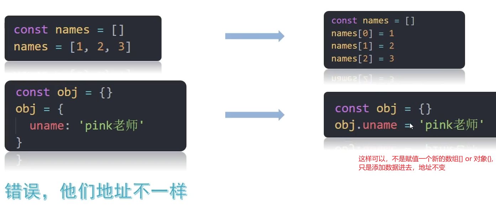
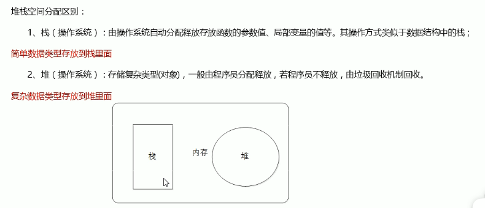
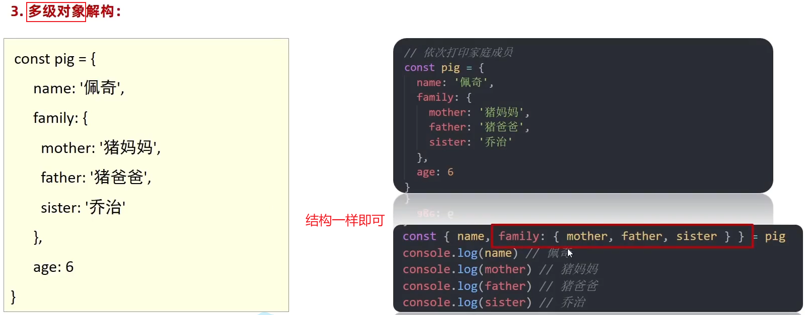
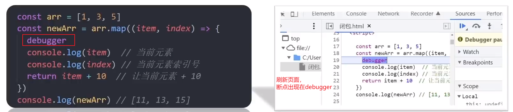
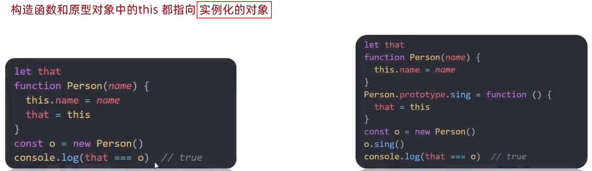

# 正则表达式

### 1、什么是正则表达式


### 2、正则表达式-定义规则和查找


#### （1）定义正则表达式语法


两种方法：

+ **字面量     `/表达式/`**    不用写引号
+ **内置构造函数     `new RegExp("表达式")`**

```html
  <script>
    // 1.字面量
    const reg = /abc/ // 含义：检查文本是否包含 abc 字符串
    console.log(reg) // /abc/
    //2. 内置构造函数
    const reg2 = new RegExp("abc")
    console.log(reg2) // /abc/
  </script>
```


#### （2）判断是否有符合规则的字符串`test()`


#### （3）检索（查找）符合规则的字符串`exec()`


判断文本**是否符合该正则表达式**，正则表达式调用**test()方法，返回true or false**

语法：**`正则表达式 .test('测试内容');`**

**截取文本符合该正则表达式的第一个字符串**，正则表达式调用**exec()方法**，返回**符合的第一个字符串**，**数组形式存储**。

语法：**`正则表达式 .exec('测试内容');`**

```html
  <script>
    const str = '我们在学习前端，希望学习前端能高薪毕业'
    // 正则表达式使用：
    // 1. 定义规则
    const reg = /前端/
    // const reg = /java/
    // 2. test()  是否匹配
    console.log(reg.test(str))  // true
    // 3. exec()
    console.log(reg.exec(str)) // 返回数组
  </script>
```


### 3、元字符


#### 基本元字符

**`\d`** 一位数字（表示0~9）

**`\D`** 一位非数字

**`\s`** 1位空白 （空格 缩进 换行）

 **`\S`** 1位 非空白

**`\w`** 字母 数字 下划线

 **`\W`** 非字母数字下划线

**`.`** 任意内容 （匹配除换行符之外的任何单个字符）

**`\ `**转义字符：比如  \ .    原本点代表任意内容，现在加了转义字符，它只能是一个点 


#### 边界符


**`^`** 开头边界

**`$`** 结尾边界


```js
    const reg = /\d/; //只要包含数字就行
    console.log(reg.test('aa1bb')); //true
    //上面讲的都是包含该表达式就符合

    // ^ 开头边界
    const reg2 = /^\d/; //开头是数字
    console.log(reg2.test('1aabb')); //true
    console.log(reg2.test('aa11bb')); //false

    //$ 结尾边界
    const reg3 = /\d$/; //结尾是数字
    console.log(reg3.test('aabb1')); //true
    console.log(reg3.test('aa11bb')); //false

    //^开头...结尾$ = 精确匹配，不是包含了
    const reg4 = /^abc$/; // 开头结尾都是abc  精确匹配abc
    console.log(reg4.test('abc')); //true
    console.log(reg4.test('abcabc')); //false
```


#### 量词


**` *`** 0~多次

**`+`**1~多次

**`?`** 0~1个

**`{n}`** 指定次数n

**`{n,}`** 大于等于>=n次数

**`{n,m}`** 大于等于>=n且小于等于m数

注意：**一般，量词只能作用前面一个“字符”**。量词的**作用范围**仅限于**<span style="color:red;">直接紧邻在其前面的字符、字符集合[]或分组()</span>**

1. 单个字符：量词作用于**前面的单个字符**，控制该字符的重复次数
   - `a*` 匹配 任意个连续 的字母 “a” （零次或多次）
   - `b+` 匹配 一个或多个连续 的字母 “b”
   - `c?` 匹配 零个或一个 字母 “c”
2. 字符集合：量词也可以应用于**字符集合**（使用方括号 `[] `表示的一组字符），控制整个字符集合的重复次数
   - `[abc]*` 匹配任意个连续的字符 “a”、“b” 或 “c” （零次或多次）
   - `[0-9]+` 匹配一个或多个连续的数字
3. 分组：量词还可以应用于**分组**（使用小括号`()` 将一部分正则表达式括起来），控制分组内的表达式的重复次数
   - `(ab)*` 匹配任意个连续的子字符串 “ab” （零次或多次）
   - `(xyz){2,4}` 匹配连续出现 2 到 4 次的字符串 “xyz”


#### 字符类

**`()`** 整体

 **`|`** 或，分割左右两边，作用两边整体

**`[]`** 代表1个，**包含里面 字符1个以上**，不用连起来，字符

​                  [a-zA-z0-9_]  等于\w

​                  [0-9]  等于\d

**`[^abc]`** 取反，不包含a b c


```js
    // 字符类   [abc]  只选1个
    // 开头和结尾都是abc中的一个
    console.log(/^[abc]$/.test('a')) // true
    console.log(/^[abc]$/.test('b')) // true
    console.log(/^[abc]$/.test('c')) // true
    console.log(/^[abc]$/.test('ab')) // false
    // 加量词
    console.log(/^[abc]{2}$/.test('ab')) // true
```


```js
    // 字符类   [a-z]  只选1个
    // 大写的字母
    console.log(/^[A-Z]$/.test('p')) // false 
    console.log(/^[A-Z]$/.test('P')) // true
    // 一个数字
    console.log(/^[0-9]$/.test(2)) // true
    // 大小写英文字母、数字
    console.log(/^[a-zA-Z0-9]$/.test(2)) // true
    console.log(/^[a-zA-Z0-9]$/.test('p')) // true
    console.log(/^[a-zA-Z0-9]$/.test('P')) // true
    
    console.log(/^[a-zA-Z0-9]{8}$/.test('123ABabc')) // true 精确匹配八位由数字、字母组成的字符串
```


```js
    console.log(/^[a-z]$/.test('a')) // true
    console.log(/^[^a-z]$/.test('a')) // false
    console.log(/^[^a-z]$/.test('1')) // true
    console.log(/^[a-zA-Z0-9]{8}$/.test('123ABabc')) // true 精确匹配八位由数字、字母组成的字符串
    console.log(/^[^a-zA-Z0-9]{8}$/.test('哈哈哈1a哈哈哈')) // false
    console.log(/^[^a-zA-Z0-9]{8}$/.test('我不包含数字字母')) // true
```


案例：


```html
  <style>
    span {
      display: inline-block;
      width: 250px;
      height: 30px;
      vertical-align: middle;
      line-height: 30px;
      padding-left: 15px;
    }

    .error {
      color: red;
      background: url(./images/error1.png) no-repeat left center;
    }

    .right {
      color: green;
      background: url(./images/right.png) no-repeat left center;
    }
  </style>

  <input type="text">
  <span></span>

  <script>
    const ipt = document.querySelector('input')
    const span = document.querySelector('span')
    // 1. 定义规则
    const reg = /^[a-zA-Z0-9-_]{6,16}$/ // 英文字母，数字，下划线或者短横线组成，长度6~16位
    ipt.addEventListener('blur',function() { // 表单失去焦点
      // 2. 查找
      if(reg.test(this.value)) {
        span.classList.add('right')
        span.innerHTML = '验证通过'
      } else {
        span.classList.add('error')
        span.innerHTML = '请输入6~16位的英文数字下划线'
      }
    })
  </script>
```


### 4、修饰符


```html
  <script>
    console.log(/^java$/.test('java')) // true
    console.log(/^java$/.test('JAVA')) // false 默认区分大小写
    console.log(/^java$/i.test('JAVA')) // true  /.../i：匹配时，不区分大小写
    console.log(/^java$/i.test('Java')) // true
      
    const str = 'java是一门编程语言， 学完JAVA工资很高'
    // const re = str.replace(/java|JAVA/g, '前端')
    const re = str.replace(/java/ig, '前端') // i-不区分大小写 g-全局标识符，匹配所有满足正则表达式的结果（全都查找出来，默认只匹配第一个）
    console.log(re) // 前端是一门编程语言， 学完前端工资很高
  </script>
```


### 5、捕获`exex()`

判断文本**是否符合该正则表达式**，正则表达式调用**test()方法，返回true or false**

语法：**正则表达式 .test('内容')；**

**截取文本符合该正则表达式的第一个字符串**，正则表达式调用**exec()方法**，返回符合的第一个字符串，**数组形式存储**。

语法：**正则表达式 .exec('内容')**

标识符： **g——全局标识符，解决exec() 懒惰问题      i——不区分大小写**

```js
        var datestr = 'time is from 2029-01-01 to 2029-01-02'
        // 标识符 g i
        var reg2 = /\d{4}-\d{1,2}-\d{1,2}/g //捕获不懒惰，第一个捕获完，捕获第二个，全局
        var newdatestr1 = reg2.exec(datestr);
        console.log(newdatestr1); //2029-01-01
        var newdatestr2 = reg2.exec(datestr);
        console.log(newdatestr2); //2029-01-02 ，捕获第二个，不懒惰了
        console.log(newdatestr1[0].split('-').join('/'));
        console.log(newdatestr2[0].split('-').join('/'));
        
        var myreg = /[a-z]/i  //忽略大小写
        console.log(myreg.test('aa'));//t
        console.log(myreg.test('AA'));//f t
```


### 6、正则表达式的两大特性

**懒惰**：只会捕获第一个符合的字符串

**贪婪**：次数取最大的

```js
        //1. 懒惰 使用全局标识符g解决  
         //懒惰：只会捕获第一个符合的字符串

        //2. 贪婪
        var reg = /\d{1,4}/ ; // 包含1~4个数字 字符串
        console.log(reg.exec('aa1234bb')); // 1234 取次数最多的

        //3. 非贪婪 解决 ? 0~1个
        var reg2 = /\d{1,4}?/ ;
        console.log(reg2.exec('aa1234bb')); // 1

        //非贪婪：用于一种范围
        /*
        *?
        +?
        ??
        {n,}?
        {n,m}?
        */
```


### 7、正则与字符串方法

```html
  <script>
    // 之前都是这样，写好正则，调用用法
    // 正则.test(字符串)
    // 正则.exec(字符串)

    // 字符串.replace search match
    const str = 'adearfa'

    // 1 .replace
    // const newstr = str.replace('a','*') // *dearfa 只替换第一次出现的字符
    const newstr = str.replace(/a/g, '*') // 匹配所有结果，都进行替换
    console.log(newstr) // *de*rf*

    // 2 .search
    console.log(str.search('fa')) // 5 返回查找到的第一个a的索引号
    console.log(str.search(/a/)) // 0

    // 3 .match 捕获内容
    // const str1 = 'adearfa'
    // console.log(str1.match('ad')) //伪数组 ad
    const datestr = 'time is from 2029-01-01 to 2029-01-02'
    console.log(datestr.match(/\d{4}-\d{1,2}-\d{1,2}/g)); //返回伪数组，两个元素2029-01-01和2029-01-02
  </script>
```


### 案例：过滤敏感字


```html
  <textarea name="" id="" cols="30" rows="10"></textarea>
  <button>发布</button>
  <div></div>

  <script>
    const tx = document.querySelector('textarea')
    const btn = document.querySelector('button')
    const div = document.querySelector('div')
    btn.addEventListener('click', function () {
      // console.log(tx.value)
      div.innerHTML = tx.value.replace(/激情|基情/g, '**') // g全局匹配 敏感词激情or基情，替换成**
      tx.value = ''
    })
  </script>
```


### 案例：小兔鲜页面注册


```html
<div class="xtx-wrapper">
    <div class="container">
      <!-- 卡片 -->
      <div class="xtx-card">
        <h3>新用户注册</h3>
        <form class="xtx-form">
          <div data-prop="username" class="xtx-form-item">
            <span class="iconfont icon-zhanghao"></span>
            <input name="username" type="text" placeholder="设置用户名称">
            <span class="msg"></span>
          </div>
          <div data-prop="phone" class="xtx-form-item">
            <span class="iconfont icon-shouji"></span>
            <input name="phone" type="text" placeholder="输入手机号码  ">
            <span class="msg"></span>
          </div>
          <div data-prop="code" class="xtx-form-item">
            <span class="iconfont icon-zhibiaozhushibiaozhu"></span>
            <input name="code" type="text" placeholder="短信验证码">
            <span class="msg"></span>
            <a class="code" href="javascript:;">发送验证码</a>
          </div>
          <div data-prop="password" class="xtx-form-item">
            <span class="iconfont icon-suo"></span>
            <input name="password" type="password" placeholder="设置6至20位字母、数字和符号组合">
            <span class="msg"></span>
          </div>
          <div data-prop="confirm" class="xtx-form-item">
            <span class="iconfont icon-suo"></span>
            <input name="confirm" type="password" placeholder="请再次输入上面密码">
            <span class="msg"></span>
          </div>
          <div class="xtx-form-item pl50">
            <i class="iconfont icon-queren"></i>
            已阅读并同意<i>《用户服务协议》</i>
          </div>
          <div class="xtx-form-item">
            <button class="submit">下一步</button>
            <!-- <a class="submit" href="javascript:;">下一步</a> -->
          </div>
        </form>
      </div>
    </div>
  </div>
```


```js
  (function () {
      // 1. 发送短信验证码模块
      const code = document.querySelector('.code')
      // 1.1 点击事件
      code.addEventListener('click', _.throttle(function () { // 节流（技能冷却）
        let i = 5
        // 点击后立马先显示信息，不需要一秒钟后
        code.innerHTML = `0${i}秒后重新获取`
        let timerId = setInterval(function () {
          i--
          code.innerHTML = `0${i}秒后重新获取`
          if (i === 0) {
            clearInterval(timerId)
            code.innerHTML = '重新获取'
          }
        }, 1000)
      }, 5000, {
        leading: true,
        trailing: false
      }))
    })();
```


```js
    // 2. 验证的是用户名
    // 2.1 获取用户名表单
    const username = document.querySelector('[name=username]')
    // 2.2 使用change事件  值发生变化的时候
    username.addEventListener('change', verifyName) //写函数名
    // 2.3 封装verifyName函数
    function verifyName() {
      const span = username.nextElementSibling
      // 2.4 定规则  用户名
      const reg = /^[a-zA-Z0-9-_]{6,10}$/
      if (!reg.test(username.value)) {
        span.innerHTML = '输入不合法,请输入6~10位'
        return false
      } 
      // 可以不写else，如果执行if，return就会结束函数，不执行if就自然执行下面的代码
        // 2.5 合法的 就清空提示span
        span.innerHTML = ''
        return true
    }

    // 3. 验证的是手机号
    // 3.1 获取手机号表单
    const phone = document.querySelector('[name="phone"]')
    // 3.2 使用change事件  值发生变化的时候
    phone.addEventListener('change', verifyPhone) //写函数名
    // 3.3 封装verifyPhone函数
    function verifyPhone() {
      const span = phone.nextElementSibling
      // 3.4 定规则  手机号
      const reg = /^1(3\d|4[5-9]|5[0-35-9]|6[567]|7[0-8]|8\d|9[0-35-9])\d{8}$/
      if (!reg.test(phone.value)) {
        span.innerHTML = '输入不合法,请输入正确的11位手机号码'
        return false
      } 
        // 3.5 合法的 就清空提示span
        span.innerHTML = ''
        return true
    }

    // 4. 验证的是验证码
    const codeInput = document.querySelector('[name="code"]')
    codeInput.addEventListener('change', verifyCode) //写函数名
    function verifyCode() {
      const span = codeInput.nextElementSibling
      const reg = /^\d{6}$/
      if (!reg.test(codeInput.value)) {
        span.innerHTML = '输入不合法,6 位数字'
        return false
      } 
        span.innerHTML = ''
        return true
    }

    // 5. 验证的是密码
    // 5.1 获取密码表单
    const password = document.querySelector('[name="password"]')
    // 5.2 使用change事件  值发生变化的时候
    password.addEventListener('change', verifyPassword) //写函数名
    // 5.3 封装verifyPassword函数
    function verifyPassword() {
      const span = password.nextElementSibling
      // 5.4 定规则  密码
      const reg = /^[a-zA-Z0-9-_]{6,20}$/
      if (!reg.test(password.value)) {
        span.innerHTML = '输入不合法,6~20位数字字母符号组成'
        return false
      } 
        // 5.5 合法的 就清空提示span
        span.innerHTML = ''
        return true
    }

    // 6. 密码的再次验证
    // 6.1 获取再次验证表单
    const confirm = document.querySelector('[name=confirm]')
    //6.2 使用change事件  值发生变化的时候
    confirm.addEventListener('change', verifyConfirm)
    // 6.3 verifyPhone
    function verifyConfirm() {
      const span = confirm.nextElementSibling
      // 6.4 当前表单的值不等于 密码框的值就是错误的
      if (confirm.value !== password.value) {
        span.innerText = '两次密码输入不一致'
        return false
      }
      // 6.5 合法的 就清空span
      span.innerText = ''
      return true
    }
```


```js
    // 7. 我同意
    const queren = document.querySelector('.icon-queren')
    queren.addEventListener('click', function () {
      // 切换类  原来有的就删掉，原来没有就添加
      this.classList.toggle('icon-queren2')
    })


    // 8. 提交模块
    const form = document.querySelector('form')
    form.addEventListener('submit', function (e) {
      // 判断是否勾选我同意模块 ，如果有 icon-queren2说明就勾选了，否则没勾选
      if (!queren.classList.contains('icon-queren2')) {
        alert('请勾选同意协议')
        // 阻止提交
        e.preventDefault()
      }
      // 依次判断上面的每个框框 是否通过，只要有一个没有通过的就阻止
      // console.log(verifyName())
      if (!verifyName()) e.preventDefault()
      if (!verifyPhone()) e.preventDefault()
      if (!verifyCode()) e.preventDefault()
      if (!verifyPassword()) e.preventDefault()
      if (!verifyConfirm()) e.preventDefault()
    })
```


# ES6

- 我们所说的 ES5 和 ES6 其实就是在 **js 语法的发展过程中的一个版本**而已

- ECMAScript 就是 js 的语法

  - 以前的版本没有某些功能
  - 在 ES5 这个版本的时候增加了一些功能
  - 在 ES6 这个版本的时候增加了一些功能

- 因为浏览器是浏览器厂商生产的

  - ECMAScript 发布了新的功能以后，浏览器厂商需要让自己的浏览器支持这些功能
  - 这个过程是需要时间的
  - 所以到现在，基本上大部分浏览器都可以比较完善的支持了
  - 只不过有些浏览器还是不能全部支持
  - 这就出现了兼容性问题
  - 所以我们写代码的时候就要考虑哪些方法是 ES5 或者 ES6 的，看看是不是浏览器都支持

  

## let 和 const 关键字

- 我们以前都是使用 `var` 关键字来**声明变量**的

- 在 ES6 的时候，多了两个关键字 `let` 和 `const`，也是用来**声明变量**的

- 只不过和 var 有一些区别

  1. `let` 和 `const` **不允许重复声明变量**

     ```javascript
     // 使用 var 的时候重复声明变量是没问题的，只不过就是后面会把前面覆盖掉（不合理）
     var num = 100
     var num = 200
     ```

     ```javascript
     // 使用 let 重复声明变量的时候就会报错了
     let num = 100
     let num = 200 // 这里就会报错了
     ```

     ```javascript
     // 使用 const 重复声明变量的时候就会报错
     const num = 100
     const num = 200 // 这里就会报错了
     ```

  2. `let` 和 `const` 声明的变量**不会在预解析的时候解析**（也就是**没有变量提升**）

     **变量预解析(变量提升)**：把所有**变量的声明**提升到**当前作用域**的**最前面**，但**不提升赋值操作（在原地**）。

     ```javascript
     // 因为预解析（变量提升）的原因，在前面是有这个变量的，只不过没有赋值
     console.log(num) // undefined
     var num = 100
     ```

     ```javascript
     // 因为 let 不会进行预解析（变量提升），所以直接报错了
     console.log(num) // 报错
     let num = 100
     ```

     ```javascript
     // 因为 const 不会进行预解析（变量提升），所以直接报错了
     console.log(num) // 报错
     const num = 100
     ```

  3. `let` 和 `const` 声明的变量**会被所有代码块限制作用范围**, **var** 声明的变量**只有函数能限制其作用域**，其他的{}不能限制

     ```javascript
     // var 声明的变量只有函数能限制其作用域，其他的{}不能限制
     if (true) {
       var num = 100
     }
     console.log(num) // 100
     ```

     ```javascript
     // let 声明的变量，除了函数可以限制，所有的代码块{}都可以限制其作用域（if/while/for/...）
     if (true) {
       let num = 100
       console.log(num) // 100
     }
     console.log(num) // 报错
     ```

     ```javascript
     // const 声明的变量，除了函数可以限制，所有的代码块都可以限制其作用域（if/while/for/...）
     if (true) {
       const num = 100
       console.log(num) // 100
     }
     console.log(num) // 报错
     ```

- `let` 和 `const` 的区别

  1. `let` 声明的变量的**值可以改变**，`const` 声明的变量的**值不可以改变，是一个常量**

     ```javascript
     let num = 100
     num = 200
     console.log(num) // 200
     ```

     ```javascript
     const num = 100
     num = 200 // 这里就会报错了，因为 const 声明的变量值不可以改变（我们也叫做常量）
     ```

  2. `let` **声明**的时候**可以不赋值**，`const` **声明**的时候**必须赋值（初始化）**

     ```javascript
     let num
     num = 100
     console.log(num) // 100
     ```

     ```javascript
     const num // 这里就会报错了，因为 const 声明的时候必须赋值
     ```





例子：


```js
  <script>
    const arr = ['red', 'pink']
    arr.push('blue')
    console.log(arr) // 可以
    // arr = [1, 2, 4] // 赋值一个新的数组，地址改变了
    // console.log(arr)  // 错误
  </script>
```


小结：


## ES6新增原始类型Symbol

ES5中包含5种原始类型：字符串、数字、布尔值、null和undefined。ES6引入了**第6种原始类型——Symbol**

引入原因：ES5 中**对象的属性名**都是**字符串**，这**容易造成属性名的冲突**。比如，你使用了一个他人提供的对象，但又想为这个对象添加新的方法（mixin 模式），新方法的名字就有可能与现有方法产生冲突。如果有一种机制，**保证每个属性的名字都是独一无二的**就好了，这样就从根本上防止属性名的冲突。这就是 ES6 引入Symbol的原因。

**Symbol 值**通过**`Symbol()`函数**生成。此时，对象的属性名现在可以有两种类型：一种是原来就有的字符串，另一种就是新增的 Symbol 类型。**凡是<span style="color:red">属性名属于 Symbol 类型，就都是独一无二的</span>**，可以**保证不会与其他属性名产生冲突**。

```js
let s = Symbol()
console.log(typeof s) // symbol
```

### 1、Symbol类型的特性

**（1）不可使用new操作符**

注意，Symbol函数前**不能使用new命令，否则会报错**。这是因为生成的 Symbol 是**一个原始类型的值**，不是对象。也就是说，由于**Symbol 值不是对象，所以不能添加属性**。基本上，它是一种类似于字符串的数据类型。

**（2）接收不同参数的情况**

**Symbol函数的参数**就是**<span style="color:red;">对 Symbol 实例的描述</span>**，为了控制台显示，用于**区分**各个Symbol 实例。

+ Symbol函数可以接受一个**字符串**作为参数，表示**对 Symbol 实例的描述**，主要是为了在控制台显示，或者转为字符串时，比较容易**区分**。

  ```js
  let s1 = Symbol('foo');
  let s2 = Symbol('bar');
  console.log(s1)// Symbol(foo)
  console.log(s2)// Symbol(bar)
  
  s1.toString() // "Symbol(foo)"
  s2.toString() // "Symbol(bar)"
  
  //上面代码中，s1和s2是两个 Symbol 值。如果不加参数，它们在控制台的输出都是Symbol()，不利于区分。有了参数以后，就等于为它们加上了描述，输出的时候就能够分清，到底是哪一个值。
  ```

+ 如果 Symbol 的**参数是一个对象，就会调用该对象的`toString`方法**，**将其转为字符串**，然后才生成一个 Symbol 值。

  ```js
  const obj = {
    toString() {
      return 'abc';
    }
  };
  const sym = Symbol(obj);
  sym // Symbol(abc)
  ```

注意，**Symbol函数的参数**只是表示**对当前 Symbol 值的描述**，因此即使是相同参数的Symbol函数（描述相同），其**返回值是不相等的**。因D:\zhangyongkang\Web front-end\TypeScript\TypeScript-资料\day-01\codes\05-原始类型.ts为每个Symbol实例都是独一无二的（尽管他们有着相同的描述）。

```js
// 没有参数的情况
let s1 = Symbol();
let s2 = Symbol();
s1 === s2 // false

// 有参数的情况
let s1 = Symbol('foo');
let s2 = Symbol('foo');
s1 === s2 // false

// 上面代码中，s1和s2都是Symbol函数的返回值，而且参数相同，但是它们是不相等的。
```

**（3）不能直接参与与其他类型的值的运算**

Symbol 值不能与其他类型的值进行运算，会报错

```js
let sym = Symbol('My symbol');

"your symbol is " + sym
// TypeError: can't convert symbol to string
`your symbol is ${sym}`
// TypeError: can't convert symbol to string
```

但是，Symbol 值可以显式转换字符串，Symbol 值不会被自动转换为字符串，需要调用 **`toString`** 方法或**`String()`**或使用**模板字符串**来进行转换。

```js
let sym = Symbol('My symbol');

String(sym) // 'Symbol(My symbol)'
sym.toString() // 'Symbol(My symbol)'

let symbol = Symbol("mySymbol");
console.log(`The symbol is ${symbol}`);  // "The symbol is Symbol(mySymbol)"
```

另外，Symbol 值也可以转为布尔值，利用**`Boolean(转换的内容)`**，但是**不能转为数值**。

```js
let sym = Symbol();
Boolean(sym) // true
!sym  // false

if (sym) {
  // ...
}

Number(sym) // TypeError
sym + 2 // TypeError
```


### 2、Symbol值作为对象的属性名（键）

Symbol 值可以用作对象属性的键，它们可以**确保属性名的唯一性**。例如：

```js
let mySymbol = Symbol("mySymbol");

// 第一种写法
let a = {};
a[mySymbol] = 'Hello!';

// 第二种写法
let a = {
  [mySymbol]: 'Hello!'
};
```


## 作用域


### 1）全局作用域


### 2）局部作用域

#### 函数作用域

**函数作用域**：**在函数内部**就是局部作用域，里面代码的名字**只在函数内部起作用**


#### 块级作用域

JS的作用域**在es6之前**，只有 **全局作用域** 和 **函数作用域**


**块级作用域**：**{}  if{} for{} while{}**，**一个代码块{}**


### 作用域链


## JS垃圾回收机制


**堆和栈空间分配**：




介绍两种常见的**浏览器垃圾回收算法**：**引用计数法**  和  **标记清除法**

### 1）引用计数法


如下：对象的引用次数最终都变为0，自动回收，释放内存


如下：o1.a = o2 将o2赋值给o1的a，同样将o1赋值给o2的a，互相引用，永远都有引用，这样函数执行完依然回收不了，大量调用就会大量的内存泄露。


### 2）标记清除法


## 闭包

### 1、闭包的组成


```html
  <script>
    // 简单的写法
    function outer() {
      let a = 10
      function fn() {
        console.log(a)
      }
      fn() // 调用一下，才叫使用
    }
    outer()
  </script>
```


### 2、闭包的作用-外部访问函数内部变量


```js
    // 闭包的形式1   外部可以访问使用 函数内部的变量
    function outer() {
      let a = 100
      function fn() {
        console.log(a)
      }
      return fn
    }
    // 原理：
    // outer()   ===  fn   ===  function fn() {}  函数名() = return后面的结果
    // const fun = function fn() { }

    // 闭包的形式2
    // function outer() {
    //   let a = 100
    //   return function () {
    //     console.log(a)
    //   }
    // }

    const fun = outer()
    fun() // 调用函数 打印 100 
```


### 3、闭包的应用-实现数据的私有


```html
<script>
    // 闭包应用：实现数据的私有
    // 统计函数调用的次数
    
    // 1、定义全局变量i，但是全局变量容易被修改
    /* let i = 0
    function fn() {
      i++;
      console.log(`函数被调用了${i}`);
    } */
    // 2、闭包实现数据的私有 这样不会被修改
    function outer() {
      let i = 0
      return function fn() {
        i++;
        console.log(`函数被调用了${i}`);
      }
    }
    const fun = outer()
</script>
```

1、


2、


注意：闭包可能存在问题：**<span style="color:red">内存泄漏</span>**


## 箭头函数


### 1、基本语法

**函数声明两种方式**：

第一种：<span style="color:red">**声明式（常见的）**</span>

声明：**`function 函数名(...) { 函数体 }`**

调用：**`函数名(...)`**;

第二种：<span style="color:red">**函数表达式**</span>

声明：**`let 变量名 = function(...) { 函数体 }`**

调用：**`变量名(...)`**;

- 箭头函数是 ES6 里面一个**简写函数的语法方式**

- 重点： **箭头函数只能简写  函数表达式（第二种），不能简写声明式函数。<span style="color:red">需要匿名函数的地方</span>**

  ```javascript
      function fn() {} // 不能简写
      const fun = function () {} // 可以简写,函数表达式——第二种方式
  
      const obj = {
        fn: function () {} // 对象里面的函数，可以简写
      }
  
      setTimeOut(function () {
        ...
      }, 毫秒数) //可以简写
  
      //函数声明的另一种方式：var/let/const 变量名 = function(...) {函数体}
      var test1 = function () {
        console.log('11111');
      }
  
      //箭头函数：
      //语法：(...) => {函数体}
      var test2 = () => {
        console.log('22222');
      }
      test1();
      test2();
  ```

- 语法： **`(形参) => { 函数体 }`**

  ```javascript
  const fn = function (a, b) {
    console.log(a)
    console.log(b)
  }
  // 可以使用箭头函数写成
  const fun = (a, b) => {
    console.log(a)
    console.log(b)
  }
  ```

  ```javascript
  const obj = {
    fn: function (a, b) {
      console.log(a)
      console.log(b)
    }
  }
  // 可以使用箭头函数写成
  const obj2 = {
    fn: (a, b) => {
      console.log(a)
      console.log(b)
    }
  }
  ```

  

### 2、箭头函数的特殊性

- 箭头函数内部**没有 `this`**，箭头函数的this指向的是**从自己的作用域链的上一层沿用this（即：指向上一层作用域的this的指向）**

  ```javascript
      const obj1 = {
              fn: function () {
                  console.log(this); //指向当前对象obj1
              },
              fun: () => {
                  console.log(this); //指向当前对象的上一级——父级作用域window
              }
          }
  
          obj1.fn()
          obj1.fun()
  ```

  - 按照我们之前的 `this` 指向来判断，两个都应该指向 obj
  - 但是 fun 因为是箭头函数，所以 `this` 不指向 obj，而是**指向 fun 的外层**，就是 window

- 箭头函数内部**没有 `arguments` 这个实参集合**

  复习：`arguments`里面**存储了所有传递过来的实参**，**伪数组形式**存储。

  ```javascript
  const obj = {
    fn: function () {
      console.log(arguments)
    },
    fun: () => {
      console.log(arguments)
    }
  }
  obj.fn(1, 2, 3) // 会打印一个伪数组 [1, 2, 3]
  obj.fun(1, 2, 3) // 会直接报错，arguments is not defined
  ```

- 函数**只有一个形参**的时候**可以不写小括号 `()`** 其余情况必须写

  ```javascript
  const obj = {
    fn: () => {
      console.log('没有参数，必须写小括号')
    },
    fn2: a => {
      console.log('一个行参，可以不写小括号')
    },
    fn3: (a, b) => {
      console.log('两个或两个以上参数，必须写小括号')
    }
  }
  ```

- 函数体**只有一行代码**的时候，**可以不写大括号 `{}`** ，并且**会自动 return**

  ```javascript
  const obj = {
    fn: a => {
      return a + 10
    },
      
    fun: a => a + 10
      
  }
  
  console.log(fn(10)) // 20
  console.log(fun(10)) // 20
  ```

+ 箭头函数可以**直接返回一个对象**。由于对象也是{}，函数体也是{}，这里把函数体的{}改成`()`，**（形参）=> ( {...} )**

  


```html
<script>
    // const fn = function () {
    //   console.log(123)
    // }
    // 1. 箭头函数 基本语法
    const fn = () => {
      console.log(123)
    }
    fn()
    const fn1 = (x) => {
      console.log(x)
    }
    fn1(1)

    // 2. 只有一个形参的时候，可以省略小括号
    const fn2 = x => {
      console.log(x)
    }
    fn2(1)

    // 3. 只有一行代码的时候，我们可以省略大括号{}
    const fn3 = x => console.log(x)
    fn3(1)

    // 4. 只有一行代码的时候，可以省略return
    const fn4 = x => x + x
    console.log(fn4(1)) // 2

    // 5. 箭头函数可以直接返回一个对象，由于对象也是{}，函数体也是{}，这里把函数体的{}改成()
    const fn5 = (uname) => ({
      uname: uname
    })
    console.log(fn5('刘德华')) // {uname: '刘德华'}
  </script>
```


### 3、箭头函数的参数

#### 没有`arguments`但有剩余参数


```js
    const obj = {
      fn: function () {
        console.log(arguments)
      },
      fun: () => {
        console.log(arguments)
      }
    }
    obj.fn(1, 2, 3) // 会打印一个伪数组 [1, 2, 3]
    obj.fun(1, 2, 3) // 会直接报错，arguments is not defined
```

```html
  <script>
    // 1. 利用箭头函数来求和
    const getSum = (...arr) => { // 剩余数组
      let sum = 0
      for (let i = 0; i < arr.length; i++) {
        sum += arr[i]
      }
      return sum
    }
    const result = getSum(2, 3, 4)
    console.log(result) // 9
  </script>
```


#### 函数传递参数的时候的默认值

- 我们在定义函数的时候，有的时候**需要一个默认值出现**

- 就是当我**不传递参数的时候，使用默认值**，传递参数了就使用传递的参数

  ```javascript
  function fn(a) {
    a = a || 10
    console.log(a)
  }
  fn()   // 不传递参数的时候，函数内部的 a 就是 10
  fn(20) // 传递了参数 20 的时候，函数内部的 a 就是 20
  ```

  - 可以直接**把默认值写在函数的形参位置**

  ```javascript
  function fn(a = 10) {
    console.log(a)
  }
  fn()   // 不传递参数的时候，函数内部的 a 就是 10
  fn(20) // 传递了参数 20 的时候，函数内部的 a 就是 20
  ```

  - 这个默认值的方式**箭头函数也可以使用**

  ```javascript
  const fn = (a = 10) => {
    console.log(a)
  }
  fn()   // 不传递参数的时候，函数内部的 a 就是 10
  fn(20) // 传递了参数 20 的时候，函数内部的 a 就是 20
  ```

  - 注意： **箭头函数如果你需要使用默认值的话，那么一个参数的时候也需要写 （）**


### 4、箭头函数this


```js
// 以前this的指向：  谁调用的这个函数，this 就指向谁
    console.log(this)  // window
    // 普通函数
    function fn() {
      console.log(this)  // window
    }
    window.fn()
    
    // 对象方法里面的this
    const obj = {
      name: 'andy',
      sayHi: function () {
        console.log(this)  // obj
      }
    }
    obj.sayHi()
```

```js
// 2. 箭头函数的this：指向上一层作用域的this的指向
    const fn = () => {
      console.log(this) // window  全局的变量、函数都是在window上
    }
    fn()
    // 对象方法箭头函数 this
    const obj = {
      username:'zyk',
      sayHi: function () {
        console.log(this) // obj
      },
      sayHello: () => {
        console.log(this) // window  全局的变量、函数都是在window上
      }
    }
    obj.sayHi()
    obj.sayHello() 

    const obj1 = {
      uname: 'pink老师',
      sayHi: function () {
        console.log(this) // obj
        let i = 10
        const count = () => {
          console.log(this) // obj 
        }
        count()
      }
    }
    obj1.sayHi()
```


## 对象简写

对象的**属性和属性值相同**（变量名和参数相同），可以简写。

```javascript
    mybtn.addEventListener('click', function () {
      //获取输入值
      let username = myusername.value;
      let password = mypassword.value;
      console.log(username, password);

      const obj = {
        // username:username, 
        // password:password
        //变量名和参数一样，可以简写，直接写变量名
        username,
        password
      }
      console.log('发给后端的结构', obj);
    })
```


## 解构赋值

- 解构赋值，就是**快速的从 对象 或者 数组 中取出成员的一个语法方式**

  **一一对应**

### 解构对象`{}`


- **快速**的从对象中**获取成员**

  ```javascript
  // ES5 的方法向得到对象中的成员
  const obj = {
    name: 'Jack',
    age: 18,
    gender: '男'
  }
  let name = obj.name
  let age = obj.age
  let gender = obj.gender
  
  // const uname = 'red老师' // 解构的变量名不要和外面的变量名冲突
  // 解构的语法
  const { uname, age } = {age: 18, uname: 'pink老师' } 
  // 等价于 const uname =  obj.uname
  // 要求属性名和变量名必须相同才可以
  console.log(uname) // pink老师
  console.log(age) // 18
  ```
  


```js
// 1. 对象解构的变量名 可以重新改名  旧变量名 : 新变量名
    const { uname: username, age } = { uname: 'pink老师', age: 18 }
    console.log(username) // pink老师
    console.log(age) // 18
```


```js
// 2. 解构数组对象
    const pig = [
      {
        uname: '佩奇',
        age: 6
      }
    ]
    // const [{ uname, age }] = pig
    const [{ age, uname }] = pig // 顺序不一样也可以，匹配变量名和对象的属性名or方法名相同的
    console.log(uname) // 佩奇
    console.log(age) // 6
```



```js
const person = [{
      name: '佩奇',
      family: {
        mother: '猪妈妈',
        father: '猪爸爸',
        sister: '乔治'
      },
      age: 6
    }]
    const [{
      name,
      family: {
        mother,
        father,
        sister
      }
    }] = person
    console.log(name)
    console.log(mother)
    console.log(father)
    console.log(sister)
```

```html
  <script>
    // 解构赋值的方式从对象中获取成员
    const obj = {
      name: 'Jack',
      age: 18,
      gender: '男'
    }

    // 前面的 {} 表示我要从 obj 这个对象中获取成员了
    // name age gender 都得是 obj 中有的成员
    // obj 必须是一个对象
    const {
      name,
      age: myage,
      gender
    } = obj // age重命名为myage
    console.log(name, myage, gender) // Jack 18 男
    // console.log(name, age, gender) // 报错，要用重命名后的名字


    //解构复杂对象
    const obj2 = {
      name1: 'zyk',
      age: 100,
      location: {
        province: 'jiangxi',
        city: 'leping'
      },
      hobby: [111, 222, 333]
    }

    const {
      name1,
      age,
      location: {
        province,
        city
      },
      hobby: [u, v, w]
    } = obj2
    console.log(name1, age, province, city, u, v, w) // zyk 100 jiangxi leping 111 222 333
  </script>
```

**4、只解构需要的属性or方法**

```html
  <script>
    // 1. 这是后台传递过来的数据
    const msg = {
      "code": 200,
      "msg": "获取新闻列表成功",
      "data": [{
          "id": 1,
          "title": "5G商用自己，三大运用商收入下降",
          "count": 58
        },
        {
          "id": 2,
          "title": "国际媒体头条速览",
          "count": 56
        },
        {
          "id": 3,
          "title": "乌克兰和俄罗斯持续冲突",
          "count": 1669
        }]
    }

    // 需求1： 请将以上msg对象  采用对象解构的方式 只选出 data 方便后面使用渲染页面
    // const { data } = msg
    // console.log(data)
    // 需求2： 上面msg是后台传递过来的数据，我们需要把data选出当做参数传递给 函数
    // const { data } = msg
    // msg 虽然很多属性，但是我们利用解构只要data值
    
    function render({ data }) {
      // const { data } = arr
      // 我们只要 data 数据
      // 内部处理
      console.log(data)
    }
    render(msg) // 实参msg传递给形参{data}：{ data } = msg 只解构msg中的data

    // 需求3， 为了防止msg里面的data名字混淆，要求渲染函数里面的数据名改为 myData
    function render({ data: myData }) {
      // 要求将 获取过来的 data数据 更名为 myData
      // 内部处理
      console.log(myData)
    }
    render(msg)
  </script>
```


### 解构数组`[]`


- 快速的从数组中获取成员

  ```javascript
  // ES5 的方式从数组中获取成员
  const arr = ['Jack', 'Rose', 'Tom']
  let a = arr[0]
  let b = arr[1]
  let c = arr[2]
  ```

  ```javascript
  // 使用解构赋值的方式从数组中获取成员
  const arr = ['Jack', 'Rose', 'Tom']
  
  // 前面的 [] 表示要从 arr 这个数组中获取成员了
  // a b c 分别对应这数组中的索引 0 1 2
  // arr 必须是一个数组
  let [a, b, c] = arr
  consloe.log(a,b,c) // Jack Rose Tom
  ```

```html
  <script>
    // const arr = [100, 60, 80]
    // 之前
    // const max = arr[0]
    // const min = arr[1]
    // const avg = arr[2]
    // 数组解构 赋值  将数组元素批量赋值给一系列变量
    // const [max, min, avg] = arr
    const [max, min, avg] = [100, 60, 80]
    console.log(max) // 100
    console.log(avg) // 80
    
    // 交换2个变量的值
    let a = 1
    let b = 2; // 这个分号一定要加
    [b, a] = [a, b]
    console.log(a, b) // 2 1
  </script>
```


```js
// 4. 防止 undefined 传递
    // const [a = 0, b = 0] = [1, 2]
    const [a = 0, b = 0] = []
    console.log(a) // 1  0
    console.log(b) // 2  0
```


**注意**：

- `{}` 是专门**解构对象**使用的
- `[]` 是专门**解构数组**使用的
- **不能混用**

**必须加分号`;`的情况**：


```html
  <script>
    // 1. 立即执行函数要加
    // (function () { })();
    // (function () { }());
    // 2. 使用数组的时候
    // const arr = [1, 2, 3]
    const str = 'pink';
    [1, 2, 3].map(function (item) {
      console.log(item)
    })

    let a = 1
    let b = 2;
    [b, a] = [a, b]

    console.log(a, b)
  </script>
```


案例：渲染商品列表案例


```html
  <style>
    * {
      margin: 0;
      padding: 0;
      box-sizing: border-box;
    }

    .list {
      width: 990px;
      margin: 0 auto;
      display: flex;
      flex-wrap: wrap;
      padding-top: 100px;
    }

    .item {
      width: 240px;
      margin-left: 10px;
      padding: 20px 30px;
      /* 过渡 */
      transition: all .5s;
      margin-bottom: 20px;
    }

    .item:nth-child(4n) {
      margin-left: 0;
    }

    .item:hover {
      box-shadow: 0px 0px 5px rgba(0, 0, 0, 0.2);
      /* 变形：3d平移，y轴负值向上平移 */
      transform: translate3d(0, -4px, 0); 
      cursor: pointer;
    }

    .item img {
      width: 100%;
    }

    .item .name {
      font-size: 18px;
      margin-bottom: 10px;
      color: #666;
    }

    .item .price {
      font-size: 22px;
      color: firebrick;
    }

    .item .price::before {
      content: "¥";
      font-size: 14px;
    }
  </style>

  <div class="list">
    <!-- <div class="item">
      
      <p class="name"></p>
      <p class="price"></p>
    </div> -->
  </div>

  <script>
    const goodsList = [
      {
        id: '4001172',
        name: '称心如意手摇咖啡磨豆机咖啡豆研磨机',
        price: '289.00',
        picture: 'https://yanxuan-item.nosdn.127.net/84a59ff9c58a77032564e61f716846d6.jpg',
      },
      {
        id: '4001594',
        name: '日式黑陶功夫茶组双侧把茶具礼盒装',
        price: '288.00',
        picture: 'https://yanxuan-item.nosdn.127.net/3346b7b92f9563c7a7e24c7ead883f18.jpg',
      },
      {
        id: '4001009',
        name: '竹制干泡茶盘正方形沥水茶台品茶盘',
        price: '109.00',
        picture: 'https://yanxuan-item.nosdn.127.net/2d942d6bc94f1e230763e1a5a3b379e1.png',
      },
      {
        id: '4001874',
        name: '古法温酒汝瓷酒具套装白酒杯莲花温酒器',
        price: '488.00',
        picture: 'https://yanxuan-item.nosdn.127.net/44e51622800e4fceb6bee8e616da85fd.png',
      },
      {
        id: '4001649',
        name: '大师监制龙泉青瓷茶叶罐',
        price: '139.00',
        picture: 'https://yanxuan-item.nosdn.127.net/4356c9fc150753775fe56b465314f1eb.png',
      },
      {
        id: '3997185',
        name: '与众不同的口感汝瓷白酒杯套组1壶4杯',
        price: '108.00',
        picture: 'https://yanxuan-item.nosdn.127.net/8e21c794dfd3a4e8573273ddae50bce2.jpg',
      },
      {
        id: '3997403',
        name: '手工吹制更厚实白酒杯壶套装6壶6杯',
        price: '99.00',
        picture: 'https://yanxuan-item.nosdn.127.net/af2371a65f60bce152a61fc22745ff3f.jpg',
      },
      {
        id: '3998274',
        name: '德国百年工艺高端水晶玻璃红酒杯2支装',
        price: '139.00',
        picture: 'https://yanxuan-item.nosdn.127.net/8896b897b3ec6639bbd1134d66b9715c.jpg',
      },
    ]

    // 1. 声明一个字符串变量
    let str = ''
    // 2. 遍历数据 
    goodsList.forEach(item => {
      // console.log(item)  // 可以得到每一个数组元素  对象 {id: '4001172'}
      // const {id} =  item  对象解构
      const { name, price, picture } = item
      str += `
      <div class="item">
        
        <p class="name">${name}</p>
        <p class="price">${price}</p>
      </div>
      `
    })
    // 3.生成的 字符串 添加给 list  innerHTML可以解析标签
    document.querySelector('.list').innerHTML = str
  </script>
```

升级：商品列表价格筛选


在上面代码的基础上：

```html
<div class="filter">
    <a data-index="1" href="javascript:;">0-100元</a>
    <a data-index="2" href="javascript:;">100-300元</a>
    <a data-index="3" href="javascript:;">300元以上</a>
    <a href="javascript:;">全部区间</a>
  </div>
  <div class="list">
    <!-- <div class="item">
      
      <p class="name"></p>
      <p class="price"></p>
    </div> -->
  </div>
```

```js
    const goodList = [...]

// 1. 渲染函数  封装
    function render(arr) {
      // 声明空字符串
      let str = ''
      // 遍历数组 
      arr.forEach(item => {
        // 解构
        const { name, picture, price } = item
        str += `
        <div class="item">
          
          <p class="name">${name}</p>
          <p class="price">${price}</p>
        </div> 
        `
      })
      // 追加给list 
      document.querySelector('.list').innerHTML = str
    }
    render(goodsList) // 页面一打开就需要渲染

    // 2. 过滤筛选  
    // 事件委托，点击子元素，通过事件冒泡，触发父级以上的同名事件，来影响其子元素
    document.querySelector('.filter').addEventListener('click', e => {
      // console.log(e.target)
      // e.target返回触发事件的对象（DOM元素） 
      // DOM元素的属性：dataset（自定义属性data-）和标签名tagName   e.target.dataset.index   e.target.tagName
      const { tagName, dataset } = e.target
      // 判断 
      if (tagName === 'A') {
        // arr 返回的新数组
        let arr = goodsList
        if (dataset.index === '1') {
          arr = goodsList.filter(item => item.price > 0 && item.price <= 100)
        } else if (dataset.index === '2') {
          arr = goodsList.filter(item => item.price >= 100 && item.price <= 300)
        } else if (dataset.index === '3') {
          arr = goodsList.filter(item => item.price >= 300)
        }
        // 渲染函数
        render(arr)
      }
    })
```


## 展开运算符`...`

ES6 里面号新添加了一个运算符 `...` ，叫做**展开运算符**，，**把`[] {}`打开**

### 展开数组

**`...数组名`**——展开数组


```html
  <script>
    const arr1 = [1, 2, 3]
    // 展开运算符 可以展开数组
    // console.log(...arr)

    // Math内置对象的方法 Math.max(...) 用于返回一组数值（不能是数组）中的最大值
    // console.log(Math.max(1, 2, 3)) // 3

    // ...arr1  === 1,2,3
    // 1 求数组最大值
    console.log(Math.max(...arr1)) // 3
    console.log(Math.min(...arr1)) // 1
    // 2. 合并数组  （还有数组的concat方法）
    const arr2 = [3, 4, 5]
    const arr = [...arr1, ...arr2]
    console.log(arr) // [1, 2, 3, 3, 4, 5]
  </script>
```

```javascript
    // concat方法
    const a = [1, 2, 3]
    const b = [4, 5, 6]
    console.log(a.concat(b)) // [1, 2, 3, 4, 5, 6]
    console.log(b.concat(a)) // [4, 5, 6, 1, 2, 3]
    // 展开运算符...
    const c = [...a, ...b] 
    console.log(c) // [1, 2, 3, 4, 5, 6]
```

```js
    //3. ...复制
    const a = [1, 2, 3]
    const b = a // 将数组a直接复制给d，将栈中的地址复制一份，指向的还是同一个堆中的数组
    b[0] = 'zyk'
    console.log(a, b) // ['zyk', 2, 3]  ['zyk', 2, 3]
    // 利用...展开符复制
    const c = [1, 2, 3]
    const d = [...c] // 将数组c复制给d 
    d[0] = 'zyk'
    console.log(c, d) // [1, 2, 3] ['zyk', 2, 3]
```

```javascript
    //4. ...参数-实参-形参
    let test = function () {
      console.log(arguments)
    }
    test(1, 2, 3, 4, 5) // Arguments(5) [1,2,3,4,5]
    //形参
    let test1 = (...arr) => { //箭头函数没有arguments
      console.log(arr)
    }
    test1(1, 2, 3, 4, 5) // Array(5) [1,2,3,4,5]

    let test2 = function (m, n, ...arr) {
      console.log(arr) // [3,4,5]
    }
    test2(1, 2, 3, 4, 5) // m=1,n=2,arr=[3,4,5]

    // 实参
    let arr = [1, 2, 3]
    let test = function (a, b, c) {
      console.log(a, b, c)
    }
    //test(arr[0],arr[1],arr[2]); 
    test(...arr);

    let res = Math.max(...arr)
    console.log(res); 
```

```javascript
    //5. ...伪数组转换——将伪数组展开，赋值给数组。
    const test = function () {
      var arr = [...arguments]
      console.log(arr) // [1, 2, 3, 4, 5]
    }
    test(1, 2, 3, 4, 5) 
    
    const lis = document.querySelectorAll('li')
    // console.log(lis.filter); //获取过来的是四个li，伪数组形式存储，不能使用数组方法(filter)
    const lisarr = [...lis]
    console.log(lisarr.filter)
```


### 展开对象

**`...对象`**——展开对象

```javascript
        //...对象——展开对象
        var obj1 = {
            name:'zyk',
            age:18,
        }
        var obj2 = {
            name:'lqh', 
            location:'jiangxi'
        }
        var obj = {
            //展开对象,属性重复的话，后者覆盖前者
            ...obj1, 
            ...obj2
        }
        console.log(obj);//{name: 'lqh', age: 18, location: 'jiangxi'}
```

案例：

```html
    <h2>修改</h2>
    <input type="text" id="myusername">
    <input type="number" id="myage">
    <button id="btn">修改</button>
    <div id="box"></div>
```

```js
    const obj = {
      name: 'ker',
      age: 100,
      location: 'jiangxi',
      id: '2133515185564891'
    }
    // render()函数，将对象的属性显示在box里面
    // 解构对象：形参是{} = 实参obj
    function render({
      name,
      age,
      location
    }) {
      // console.log(obj)
      box.innerHTML = `name:${name}, age:${age}, location:${location}`
    }
    render(obj)

    btn.onclick = function () {
      //获取新输入的值
      const name = myusername.value || obj.name
      const age = myage.value || obj.age
      const newobj = { //修改后新的对象
        ...obj,
        //新的name和age会覆盖原来的obj,对象简写，直接写变量名
        name, //name=name age=age
        age
      }
      console.log(newobj)

      //传给后端
      //重新渲染页面
      render(newobj);
    }
```


## 深浅拷贝

复制一个对象，因为对象是引用类型，其实只是把在**栈中的堆地址复制**了，指向的还是同一个堆中的对象。


### 1）浅拷贝


**<span style="color:red">浅拷贝</span>**：拷贝的是**地址**，对象里的**<span style="color:red">简单数据类型拷贝其值</span>**，但是如果是**<span style="color:red">引用类型（对象、数组），也只是拷贝其堆地址</span>**。

```html
<script>
    const obj = {
      name: 'pink',
      age: 18
    }
    // （1）展开对象的方式
    const o = { ...obj } 
    console.log(o) // {name: 'pink', age: 18}
    o.age = 20
    console.log(o) // {name: 'pink', age: 20}
    console.log(obj) // {name: 'pink', age: 18}

    // （2）Object.assign(obj1,obj2)
    const o = {}
    Object.assign(o, obj) // 将obj 拷贝（合并）给o
    console.log(o) // {name: 'pink', age: 18}
    o.age = 20
    console.log(o) // {name: 'pink', age: 20}
    console.log(obj) // {name: 'pink', age: 18}
</script>

但是会出现问题：
<script>
  // 浅拷贝：拷贝的是地址，对象里的简单数据类型拷贝值，但是如果是引用类型（对象、数组），也只是拷贝其地址。只拷贝第一层，多层就不行了
    const obj = {
      name: 'pink',
      age: 18,
      family: {
        baby: '小pink' // 第二层
      }
    }
    // （1）展开对象的方式
    const o = { ...obj } 
    o.family.baby = '老pink'
    console.log(o)
    console.log(obj) // 这里的family里的baby也改变了

    // （2）Object.assign(obj1,obj2)
    const o = {}
    Object.assign(o, obj) // 将obj 拷贝（合并）给o
    o.family.baby = '老pink'
    console.log(o)
    console.log(obj) // 这里的family里的baby也改变了
</script>
```


### 2）深拷贝


#### 递归函数实现


```js
    let i =1
    function fn() {
      console.log(`这是第${i}次`);
      if(i >= 6){
        return
      }
      i++
      fn()
    }
    fn() // 调用
```

函数递归：利用递归函数实现 **setTimeout 模拟 setInterval 效果**

```html
<script>
    // 利用递归函数实现 setTimeout 模拟 setInterval 效果
    function getTime() {
      document.querySelector('div').innerHTML = new Date().toLocaleString()
      setTimeout(getTime,1000)
    }
    getTime()
    
    /* setInterval(getTime,1000) */
</script>
```

实现深拷贝

```html
<script>
    const obj = {
      uname: 'pink',
      age: 18,
      hobby: ['乒乓球', '足球'],
      family: {
        baby: '小pink'
      }
    }
    const o = {}
    // 拷贝函数
    function deepCopy(newObj, oldObj) {
      for (var k in oldObj) {
        // 处理数组的问题
        if (oldObj[k] instanceof Array) {
          newObj[k] = []
          // newObj[k] 接收 []
          // oldObj[k] ['乒乓球','足球']
          deepCopy(newObj[k], oldObj[k])
        } else if (oldObj[k] instanceof Object) {
          newObj[k] = {}
          deepCopy(newObj[k], oldObj[k])
        } else {
          // k--属性名   oldObj[k]--属性值
          // newObj[k] = newObj['uname'] = o.uname
          newObj[k] = oldObj[k]
        }
      }
    }
    deepCopy(o, obj) // 函数调用  两个参数 o新对象  obj旧对象
    console.log(o);
    o.age = 20
    o.hobby[0] = '篮球'
    o.family.baby = '老pink'
    console.log(obj);
</script>
```

面试回答利用递归函数实现深拷贝：深拷贝实现的是新对象的修改不会影响旧对象，当遇到普通拷贝的时候，直接赋值即可，但是如果遇到数组，递归调用函数，实现赋值。遇到对象，也是递归调用函数。注意：要先处理数组，在处理对象。


#### js库lodash里面`cloneDeep`


`_.cloneDeep(value)`：这个方法类似[`_.clone`](https://www.lodashjs.com/docs/lodash.cloneDeep#clone)，除了它会**递归拷贝 `value`。**（注：也叫**深拷贝**）。

```js
    var objects = [{'a': 1}, {'b': 2}]

    var deep = _.cloneDeep(objects)
    console.log(deep) // [{'a': 1}, {'b': 2}]
    console.log(deep[0] === objects[0]) // false
```

```html
  <!-- 引入在线的lodash -->
  <script src="https://cdn.bootcss.com/lodash.js/4.17.11/lodash.min.js"></script>
  <script>
    const obj = {
      uname: 'pink',
      age: 18,
      hobby: ['乒乓球', '足球'],
      family: {
        baby: '小pink'
      }
    }
    // 语法：_.cloneDeep(要被克隆的对象)
    const o = _.cloneDeep(obj)
    console.log(o) // 这里打印的就是下面修改的结果了？
    o.age = 20
    o.hobby[0] = '篮球'
    o.family.baby = '老pink'
    // console.log(o)
    console.log(obj)
  </script>
```


#### `JSON.stringify()`实现

JSON 对象包含两个方法：

1. 用于**解析成 JSON 对象**的 **`parse()`**
2. 用于**将对象转换为 JSON 字符串方法**的 **`stringify()`**

+ **`JSON.stringify()`** 方法将一个 **JavaScript 对象或值**转换为 **JSON 字符串**，如果指定了一个 `replacer` 函数，则可以选择性地替换值，或者指定的 replacer 是数组，则可选择性地仅包含数组指定的属性。

```js
console.log(JSON.stringify({ x: 5, y: 6 }))
// Expected output: "{"x":5,"y":6}"

console.log(JSON.stringify([new Number(3), new String('false'), new Boolean(false)]))
// Expected output: "[3,"false",false]"

console.log(JSON.stringify({ x: [10, undefined, function(){}, Symbol('')] }))
// Expected output: "{"x":[10,null,null,null]}"

console.log(JSON.stringify(new Date(2006, 0, 2, 15, 4, 5)))
// Expected output: ""2006-01-02T15:04:05.000Z""
```

+ **`JSON.parse()`** 方法用来**解析 JSON 字符串**，**构造由字符串描述的 JavaScript 值或对象**。提供可选的 **`reviver`** 函数用以在返回之前对所得到的对象执行变换 (操作)。

```js
const json = '{"result":true, "count":42}'
const obj = JSON.parse(json)

console.log(obj.count)
// Expected output: 42

console.log(obj.result)
// Expected output: true
```

使用上面两个方法实现深拷贝：**<span style="color:red">`JSON.parse(JSON.stringify(obj))`</span>**

```html
  <script>
    const obj = {
      uname: 'pink',
      age: 18,
      hobby: ['乒乓球', '足球'],
      family: {
        baby: '小pink'
      }
    }
    // 把 对象 转换成 JSON字符串
    console.log(JSON.stringify(obj))
    //{"uname":"pink","age":18,"hobby":["乒乓球","足球"],"family":{"baby":"小pink"}}
    // 先将 对象 转换成 JSON字符串，这样就成了简单数据类型
    const o = JSON.parse(JSON.stringify(obj))
    console.log(o)
    o.age = 20
    o.hobby[0] = '篮球'
    o.family.baby = '老pink'
    console.log(obj)
  </script>
```


## 异常处理

+ `throw`抛异常
+ `try / catch` 捕获异常
+ `debugger`

了解JavaScript中程序异常处理的方法，提升代码运行的健壮性。

### 1、`throw`抛异常


```js
    function fn(x,y) {
      if(!x || !y) {
        // throw '没有传递参数进来'
        throw new Error('没有传递参数进来') //抛出异常信息，程序会终止
      }
      return x + y
    }
    console.log(fn()) // 没有传递参数，默认undefined（只声明，不赋值）任何类型+undefined = NaN
```


### 2、`try / catch`捕获异常


```html
  <p>123</p>
  <script>
    function fn() {
      try {
        // 可能发生错误的代码，要写到 try 里面
        const p = document.querySelector('.p') // 获取元素错误
        p.style.color = 'red'
      } catch (err) { // err保存了浏览器提供的信息
        // 拦截错误，提示浏览器提供的错误信息，但是不中断程序的执行（如果没有错误，不执行catch(){}里的代码）
        console.log(err.message) // message属性
        // 抛出异常，中断程序
        throw new Error('选择器错误')
        // 需要加return，中断程序，这里可以结合throw抛异常
        // return 
      } finally {
        // 不管程序有没有错误，最终都会执行finally里的代码
        alert('弹出对话框')
      }

      console.log('没被中断')
    }

    fn() // 调用
  </script>
```


### 3、`debugger`

相当于打断点，程序代码太长，可以用。

当执行代码时，刷新一下，断点就会出现在`debugger`的位置。




## 防抖与节流

正常情况（用户慢慢操作）：鼠标进入每一个一级分类h3，都会触发鼠标进入事件

非正常情况（用户操作很快）：本身全部的一级分类都应该触发鼠标进入事件，但是经过测试，只有部分h3触发了

就是由于用户行为过快，导致浏览器反应不过来。如果当前回调函数中有大量业务，有可能出现卡顿现象


### 1）函数的防抖`debounce`


防抖：前面的所有的触发都被取消，**最后一次执行，在规定的时间之后**才会触发，也就是说**如果连续快速的触发，只会执行一次**

**lodash插件**：里面封装函数的防抖与节流的业务【闭包+延时器】

(https://www.lodashjs.com/)  

**`_.debounce(func, [wait=0], [options=])`**：创建一个 `debounced`（防抖动）函数，该函数会**从上一次被调用后，延迟 `wait` 毫秒后调用 `func` 方法**。

1. `func` *(Function)*: 要**防抖动的函数**。
2. `[wait=0]` *(number)*: 需要**延迟的毫秒数**。
3. `[options=]` *(Object)*: 选项对象。
4. `[options.leading=false]` *(boolean)*: 指定在延迟开始前调用。
5. `[options.maxWait]` *(number)*: 设置 `func` 允许被延迟的最大值。
6. `[options.trailing=true]` *(boolean)*: 指定在延迟结束后调用。

**返回值**：返回新的 debounced（防抖动）函数。

```js
// 防抖：前面的所有的触发都被取消，最后一次执行在规定的时间之后才会触发，也就是说如果连续快速的触发，只会执行一次
  let input = document.querySelector('input');
  // 文本发生变化  input事件：当input的value值发生变化时就会触发
  input.oninput = _.debounce(function() {
    console.log('ajax发请求');
  },1000)
  // lodash插件：里面封装函数的防抖与节流的业务【闭包+延时器】
```


### 2）函数的节流`throttle`


节流：在**规定的间隔时间范围内不会重复触发回调**，只有**大于这个时间间隔才会触发回调**，把**频繁触发变为少量触发**

**`_.throttle(func, [wait=0], [options=])`**：创建一个节流函数，**在 wait 秒内最多执行 `func` 一次的函数**。

1. `func` *(Function)*: 要**节流的函数**。
2. `[wait=0]` *(number)*: 需要**节流的毫秒**。
3. `[options=]` *(Object)*: 选项对象。
4. `[options.leading=true]` *(boolean)*: 指定调用在节流开始前。
5. `[options.trailing=true]` *(boolean)*: 指定调用在节流结束后。

**返回值**：返回节流的新函数

```js
// 计数器：在一秒之内，只能执行一次  （轮播图点击会用上）
  btn.onclick = _.throttle(function() {
    // 节流：目前这个回调函数1s执行一次
    // 假如这里面有很多的业务代码，是不是可以给浏览器充裕的时间去解析
    count++;
    span.innerHTML = count;
    console.log('执行');
  },1000)
```

```html
  <script>
    // 1. 发送短信验证码模块
    const code = document.querySelector('.code')
    // 1.1 点击事件
    code.addEventListener('click',_.throttle(function() {
      let i = 5
      // 点击后立马先显示信息，不需要一秒钟后
      code.innerHTML = `0${i}秒后重新获取` 
      let timerId = setInterval(function() {
        i--
        code.innerHTML = `0${i}秒后重新获取`
        if(i === 0) {
          clearInterval(timerId)
          code.innerHTML = '重新获取'
        }
      },1000)
    },5000,{leading:true, trailing:false}))
  </script>
```

小结：

防抖：用户操作很频繁，但是**只是执行一次**

节流：用户操作很频繁，但是**把频繁的操作变为少量操作**，可以给浏览器充裕的时间去解析

```html
<script>
    // 需求：鼠标在盒子上移动，里面的数字就会有变化
    let box = document.querySelector('.box')
    let count = 1
    function mouseMove() {
      box.innerHTML = count++
      // 如果里面存在大量消耗性能的代码
    }
    // box.addEventListener('mousemove',_.debounce(mouseMove,500))
    box.addEventListener('mousemove',_.throttle(mouseMove,500))
</script>
```


## 处理`this`


### 1、`this`指向

**1）普通函数**：**谁调用** `this` 就**指向谁**


```html
  <button>点击</button>
  <script>
    // 普通函数：谁调用我，this就指向谁
    console.log(this) // window

    function fn() {
      console.log(this) // window    
    }
    window.fn()

    window.setTimeout(function () {
      console.log(this) // window 
    }, 1000)

    document.querySelector('button').addEventListener('click', function () {
      console.log(this) // 指向 button
    })
    
    const obj = {
      sayHi: function () {
        console.log(this) // 指向 obj
      }
    }
    obj.sayHi()
  </script>
```


**2）箭头函数**：函数内**不存在`this`**，**沿用上一级的**，过程：**向外层作用域，一层一层查找`this`，直到有`this`的定义**


### 2、改变`this`


#### 1）`call(this指向, 参数)`


```js
    // function fn() {
    //   console.log(this) // window
    // }
    // fn() // this指向window

    const obj = {
      uname: 'pink'
    }
    function fn(x, y) {
      console.log(this) // obj
      console.log(x + y)
    }
    // 1. 调用函数  
    // 2. 改变 this 指向
    fn.call(obj, 1, 2) // 第一个参数是this指向的值，后面就是函数的参数
    // 3. 返回值  本身就是在调用函数，所以返回值就是函数的返回值
```


#### 2）`apply(this指向, [参数])`


```js
    const obj = {
      age: 18
    }

    function fn(x, y) {
      console.log(this) // {age: 18}
      console.log(x + y)
    }
    // 1. 调用函数
    // 2. 改变this指向 
    //  fn.apply(this指向谁, 数组参数)
    fn.apply(obj, [1, 2])
    // 3. 返回值   本身就是在调用函数，所以返回值就是函数的返回值
```

说明：和`call()`方法差不多，唯一区别就是**`apply()`使用数组传递参数**

使用场景：


```js
    // Math.max()/min() 返回一组数值中的最大（小）值
    // const max1 = Math.max(1, 2, 3)
    // console.log(max1) // 3
    
    // 使用场景： 求 数组 最大值
    // 1. Math.max/min.apply(Math, 数组) 返回数组的最大（小）值
    const arr = [100, 44, 77]
    const max = Math.max.apply(Math, arr)
    const min = Math.min.apply(null, arr)
    console.log(max, min) // 100 44
    // 2. 展开运算符
    console.log(Math.max(...arr)) // 100
```


#### 3）`bind(this指向, 参数)`


```js
    const obj = {
      age: 18
    }

    function fn() {
      console.log(this) 
    }
    // 1. bind 不会调用函数 
    // 2. 能改变this指向
    // 3. 返回值是仅改变了 this 值的原函数拷贝（新函数），这里新函数赋值给fun
    const fun = fn.bind(obj)
    console.log(fun) 
    console.log(fn) 
    console.log(fun == fn) // false
    fun()

```


```js
    // 需求，有一个按钮，点击里面就禁用，2秒钟之后开启
    document.querySelector('button').addEventListener('click', function () {
      // 禁用按钮
      this.disabled = true
      window.setTimeout(function () {
        // 在这个回调函数里面，我们要this由原来的window 改为 btn
        // 开启按钮 2s
        this.disabled = false // 原本不能直接用this，用DOM元素
      }.bind(this), 2000) // 这里的this 和 btn 一样
    })
```


#### call、apply、bind总结


## 模块化语法

写代码过程中要解决的三个问题：

1. 私密不漏：

​    2. 重名不怕：

​    3. 依赖不乱：


## 模版字符串

- ES5 中我们表示字符串的时候使用 `''` 或者 `""`

- 在 ES6 中，我们还有一个东西可以表示字符串，就是 **``（反引号）**

  ```javascript
  let str = `hello world`
  console.log(typeof str) // string
  ```

- 反引号 和 单引号和双引号 的**区别**：

  1. **反引号``可以 换行书写**

     ```javascript
     // 这个单引号或者双引号不能换行，换行就会报错了
     let str = 'hello world' 
     
     // 下面这个就报错了
     let str2 = 'hello 
     world'
     ```

     ```javascript
     let str = `
     	hello
     	world
     `
     console.log(str) // 是可以使用的
     ```

2. **反引号``**可以**直接在字符串里面拼接变量**

   ```javascript
     // ES5 需要字符串拼接变量的时候
     let num = 100
     let str = 'hello' + num + 'world' + num
     console.log(str) // hello100world100
     
     // 直接写在字符串里面不好使
     let str2 = 'hellonumworldnum'
     console.log(str2) // hellonumworldnum
   ```

   ```javascript
     // 模版字符串拼接变量
     let num = 100
     let str = `hello${num}world${num}`
     console.log(str) // hello100world100
   ```

   - 在反引号里面的  **`${变量名}`**  就是用来**书写变量**的位置


## 编程思想

- 首先，我们要明确，面向对象不是语法，是一个思想，是一种 **编程模式**
- 面向： 面（脸），向（朝着）
- 面向过程： 脸朝着过程 =》 **关注着过程**的编程模式
- 面向对象： 脸朝着对象 =》 **关注着对象**的编程模式
- 实现一个效果
  - 在面向过程的时候，我们要关注**每一个元素，每一个元素之间的关系，顺序，。。。**
  - 在**面向对象**的时候，我们要关注的就是**找到一个对象来帮我做这个事情，我等待结果**
- 我们以前的编程思想是，每一个功能，都按照需求一步一步的逐步完成

### 1）面向过程编程


### 2）面向对象编程（oop）


对比：


### 创建对象的方式

- 因为面向对象就是一个找到对象的过程
- 所以我们先要了解如何创建一个对象

#### 1）字面量`{}`创建对象

**对象字面量**：就是**花括号{ }**里面包含了表达这个具体事物（对象）的**属性**和**方法**。

```js
//1.利用字面量————花括号{}创建对象
    const obj1 = {}; //创建了一个空的对象
    const obj = {
      u_name: '张三疯', //逗号
      age: 18,
      sex: '男',
      //方法
      sayHi: function () {
        console.log('hi~')
      },
      sayHi2() { // 简写写法（ES6+）
        console.log('hi2~')
      }
    }
```


#### 2）`new Object()`创建对象

跟前面创建数组 new Array( )差不多。

```js
//利用new Object() 创建对象
  const obj = new Object() // 创建一个空对象
    obj.uname = 'pink老师'
    obj.age = 18;
    obj.sex = '男';
    obj.sayHi = function () {
      console.log('hi~');
    }
    console.log(obj) // {uname: 'pink老师', age: 18, sex: '男', sayHi: ƒ}

    const obj1 = new Object({
      uname: 'pink'
    })
    console.log(obj1) // {uname: 'pink'}
```


#### 3）工厂函数创建对象

- 先书写一个工厂函数

- 这个工厂函数里面可以**创造出一个对象**，并且给对象添加一些属性，还能**把对象返回**

- 使用这个工厂函数创造对象

  ```javascript
      // 1. 先创建一个工厂函数
      function createObj() {
        // 手动创建一个对象
        var obj = new Object()
        // 手动的向对象中添加成员
        obj.name = 'Jack'
        obj.age = 18
        obj.gender = '男'
        // 手动返回一个对象
        return obj;
      }
  
      // 2. 调用这个工厂函数创建对象
      var o1 = createObj()
      var o2 = createObj()
      console.log(o1)
      console.log(o2)
      console.log(o1 === o2) // false 虽然两个对象的值一样
  ```


#### 4）构造函数创建对象

为什么要用构造函数创建对象？

  因为**前面两种**创建对象的方式**一次只能创建一个对象**

**构造函数：**是一种**特殊的函数**，主要用来**<span style="color:red">初始化对象</span>**，即**为对象成员变量赋初始值**，**它总与`new`运算符一起使用**，我们可以把**对象**中一些**公共的属性和方法**抽取出来，然后**封装到这个函数**里面。


说明：属性和方法前面得加上 **this.**


语法格式：

```js
    //构造函数的语法格式——跟函数差不多
    function 构造函数名(形参) {
      this.属性 = 属性值（ 形参）
      this.方法 = function () {
        //方法体
      }
    }
    //调用
    new 构造函数名(实参); //调用，初始化对象
```

```js
    //构造函数Star
    function Star(u_name, age, sex) {
      // this指向的是下面实例化的对象（谁调用指向谁），ldh
      this.name = u_name // 左边是抽取的属性，右边是形参
      this.age = age
      this.sex = sex
      this.sing = function (sang) {
        console.log(sang)
      }
    }
    //对象
    var ldh = new Star('刘德华', '18', '男') // new调用，创建对象并实例化
    console.log(typeof ldh) // object (null也是object)
    console.log(ldh.name) // 刘德华
    console.log(ldh['sex']) // 男
    ldh.sing('冰雨') // 冰雨
```

- 和普通函数一样，只不过 **调用的时候要和 new 连用**，不然就是一个**普通函数调用**

  ```javascript
  function Person() {}
  var o1 = new Person()  // 能得到一个空对象
  var o2 = Person()      // 什么也得不到，这个就是普通函数调用
  ```

  - 注意： **不写 new 的时候就是普通函数调用，没有创造对象的能力**

- 当调用的时候如果**不需要传递参数可以不写 `()`**，建议都写上

  ```javascript
  function Person() {}
  var o1 = new Person()  // 能得到一个空对象
  var o2 = new Person    // 能得到一个空对象 
  ```

  - 注意： **如果不需要传递参数，那么可以不写 （），如果传递参数就必须写**

- **构造函数内部的 `this`**，由于和 new 连用的关系，**是指向当前实例化对象的**

  ```javascript
  function Person() {
    console.log(this)
  }
  var o1 = new Person()  // 本次调用的时候，this => o1
  var o2 = new Person()  // 本次调用的时候，this => o2
  ```

  - 注意： **每次 new 的时候，函数内部的 this 都是指向当前这次的实例化对象**

- 因为构造函数会自动返回一个对象，所以**构造函数内部不要写 return**

  - 你如果 return 一个**基本数据类型**，那么写了没有意义
  - 如果你 return 一个**引用数据类型**，那么**构造函数本身的意义就没有**了

  ```js
  function CreateObj(name){
     this.name = name;
     return 100 //没用，不会返回
     return {  //会返回，但是构造函数没意义了
        a:1,
        b:2
     }
  }
  var obj1 = new CreateObj('zyk');
  console.log(obj1)
  ```


#### new调用构造函数创建对象

**new关键字的执行过程：**


- 我们在使用构造函数的时候，可以通过一些代码和内容来向**当前的对象**中添加一些内容

  ```javascript
  function Person() {
    this.name = 'Jack'
    this.age = 18
  }
  
  var o1 = new Person()
  var o2 = new Person()
  ```

  - 我们得到的两个对象里面都有自己的成员 **name** 和 **age**

- 我们在写构造函数的时候，是不是也可以添加一些方法进去呢？

  ```javascript
  function Person() {
    this.name = 'Jack'
    this.age = 18
    this.sayHi = function () {
      console.log('hello constructor')
    }
  }
  
  var o1 = new Person()
  var o2 = new Person()
  ```

  - 显然是可以的，我们的到的**两个对象中都有** `sayHi` 这个函数
  - 也都可以正常调用

- 但是这样好不好呢？**缺点**在哪里？

  ```javascript
  function Person() {
    this.name = 'Jack'
    this.age = 18
    this.sayHi = function () {
      console.log('hello constructor')
    }
  }
  
  // 第一次 new 的时候， Person 这个函数要执行一遍
  // 执行一遍就会创造一个新的函数，并且把函数地址赋值给 this.sayHi
  var o1 = new Person()
  
  // 第二次 new 的时候， Person 这个函数要执行一遍
  // 执行一遍就会创造一个新的函数，并且把函数地址赋值给 this.sayHi
  var o2 = new Person()
  ```

  - 这样的话，那么我们两个对象内的 `sayHi` 函数就是**一个代码一摸一样，功能一摸一样**
  - 但是是两个空间函数，**占用两个内存空间**
  - 也就是说 `o1.sayHi` 是一个地址，`o2.sayHi` 是一个地址
  - 所以我们执行 `console.log(o1.sayHi === o2.sayHi)` 的到的结果是 `false`
  - 缺点： **一摸一样的函数出现了两次，占用了两个空间地址**——构造函数里面的函数，每一个实例化对象都有，都会开辟一个内存空间，但是功能都一样。

  

- 怎么解决这个问题呢？

  
  
  - 就需要用到一个东西，叫做 **原型**


### 原型

- 原型的出现，就是为了解决 **构造函数的缺点**
- 也就是给我们**提供了**一个**给  对象  添加函数  的方法**
- 不然构造函数**只能给对象 添加属性**，**不能合理的添加函数**就太 LOW 了

```html
    <div class="box1">
        <h1></h1>
        <ul></ul>
    </div>
    <div class="box2">
        <h1></h1>
        <ul></ul>
    </div>
```

```html
  <script>
    //后台数据，这里用对象存储
    var data1 = { //对象
      title: '体育',
      list: ['体育-1', '体育-2', '体育-3'],
    }
    var data2 = { //对象
      title: '综艺',
      list: ['综艺-1', '综艺-2', '综艺-3'],
    }

    function CreateList(select, data) { //构造函数
      this.ele = document.querySelector(select);
      this.title = data.title;
      this.list = data.list;
      // 添加方法，渲染页面
      // this.render = function (){
      //     //渲染页面
      //     var h1 = this.ele.querySelector('h1');
      //     var ul = this.ele.querySelector('ul');
      //     //console.log(h1,ul);
      //     h1.innerHTML = this.title;
      //     ul.innerHTML = this.list.map(item=>`<li>${item}</li>`).join("")
      // }
    }
    //1. 函数的原型prototype
    CreateList.prototype.render = function () {
      //渲染页面
      var h1 = this.ele.querySelector('h1');
      var ul = this.ele.querySelector('ul');
      //console.log(h1,ul);
      h1.innerHTML = this.title;
      ul.innerHTML = this.list.map(item => `<li>${item}</li>`).join("")
    }

    //对象实例化
    var obj1 = new CreateList('.box1', data1);
    var obj2 = new CreateList('.box2', data2);
    //console.log(obj1);
    obj1.render()
    // console.log(obj2);
    obj2.render()
    //这两个对象的render()方法,代码功能都一样，但是却占据两个地址空间，造成浪费。把render()写到构造函数的prototype里面，实例化对象可以直接调用，因为对象有__proto__，这样就是共享render()函数

    //2. 对象的__proto__
    // 对象.__proto__ === 构造函数.prototype
    //下面两个一模一样
    console.log(obj1.__proto__);
    console.log(CreateList.prototype);
    console.log(obj1.__proto__ === CreateList.prototype); //true

    // obj1.toString()  //可以调用成功
    //3. 原型链的概念
    //先看实例化对象obj1本身有没有该方法，没有的话就通过__proto__去构造函数的原型prototype去找，还没有就通过构造函数的__proto__去上一级的原型prototype去找（顶级Object.prototype），依次类推。这就是原型链
  </script>
```


#### 函数的原型`prototype`


- **每一个函数天生自带一个成员，叫做 `prototype`，是一个对象** 。  prototype原型

- 即然每一个函数都有，构造函数也是函数，**构造函数也有`prototype`对象**

- 这个 `prototype` 对象空间可以由 **`函数名.prototype`**来访问

  ```js
  function Person() {}
  console.log(Person.prototype) // 是一个对象
  ```

  - 即然是个对象，那么我们就可以向里面放入一些东西（属性和方法）

  ```js
  function Person() {}
  
  Person.prototype.name = 'prototype'
  Person.prototype.sayHi = function () {}
  ```

- 重点： 在**函数的原型 `prototype` 里面存储的内容**，不是给函数使用的，**是给<span style="color:red">函数的每一个实例化对象</span>使用的**

- 那**实例化对象**为什么能**直接调用**？


#### 对象的` __proto__`

- **每一个对象都自带一个成员，叫做 `__proto__`，也是一个对象空间**

- 即然每一个对象都有，实例化对象也是对象，那么**每一个实例化对象也有`__proto__`**

- 这个 `__proto__` 对象空间是**给每一个对象使用的**

- 当你访问一个对象中的成员的时候

  - 如果这个对象**自己本身**有这个成员，那么就会直接给你结果
  - 如果没有，就会去 `__proto__` 这个对象空间里面找，里面有的话就给你结果
  - 未完待续。。。

- 对象的`__proto__` 指向哪里？

  - 这个对象**是由哪个构造函数 `new` 出来的**
  - 那么这个  **<span style="color:red">对象的 `__proto__`</span>**   就指向 **<span style="color:red">所属构造函数的原型 `prototype`</span>**

  ```javascript
  function Person() {}
  
  var p1 = new Person() //p1是Person()构造出来的对象
  
  console.log(p1.__proto__ === Person.prototype) // true
  ```

  - 我们发现    **实例化对象的 `__proto__`**     和  **所属构造函数的 `prototype` 是同一个对象空间**
  - 我们可以**通过`构造函数名.prototype`来向其原型 `prototype` 中添加成员**
  - 对象在访问的时候自己没有，可以自动去自己的 `__proto__` 中查找
  - 那么，我们之前构造函数的缺点就可以解决了
    - 我们可以把**方法**放在**构造函数的 `prototype` 中**
    - 实例化对象访问的时候，自己没有，就会**自动去 `__proto__` 中找**
    - 那么也可以使用了

  ```javascript
  function Person() {}
  
  Person.prototype.sayHi = function () {
    console.log('hello Person')
  }
  
  var p1 = new Person()
  p1.sayHi()
  ```

  - `p1` 自己没有 `sayHi` 方法，就会去自己的 `__proto__` 中查找
  - `p1.__proto__` 就是 `Person.prototype`
  - 我们又向 `Person.prototype` 中添加了 `sayHi` 方法
  - 所以 `p1.sayHi` 就可以执行了

- 到这里，当我们实例化多个对象的时候，每个对象里面都没有方法

  - **都是去所属的构造函数的原型 `protottype` 中查找**
  - 那么**每一个对象**使用的函数，其实**<span style="color:red">都是同一个函数</span>**
  - 那么就解决了我们构造函数的缺点

  ```javascript
  function Person() {}
  
  Person.prototype.sayHi = function() {
    console.log('hello')
  }
  
  var p1 = new Person()
  var p2 = new Person()
  
  console.log(p1.sayHi === p2.sayHi) //true，同一个sayHi函数
  ```

  - `p1` 是 `Person` 的一个实例
  - `p2` 是 `Person` 的一个实例
  - 也就是说 `p1.__proto__` 和 `p2.__proto__` 指向的都是 `Person.prototype`
  - 当 `p1` 去调用 `sayHi` 方法的时候是去 `Person.prototype` 中找
  - 当 `p2` 去调用 `sayHi` 方法的时候是去 `Person.prototype` 中找
  - 那么两个实例化对象就是找到的一个方法，也是执行的一个方法

- 结论!!!!!!!!!!!!!!!!!!!!!!!

  - 当我们写构造函数的时候
  - **属性  直接写在 构造函数体内**
  - **<span style="color:red">方法  写在  构造函数的原型`prototype`上</span>**
  
  ```html
    <script>
      // 构造函数  公共的属性和方法 封装到 Star 构造函数里面了
      // 1.公共的属性写到 构造函数里面
      function Star(uname, age) {
        this.uname = uname
        this.age = age
        // this.sing = function () {
        //   console.log('唱歌')
        // }
      }
      // 2. 公共的方法写到原型对象身上   节约了内存
      Star.prototype.sing = function () {
        console.log('唱歌')
      }
      const ldh = new Star('刘德华', 55)
      const zxy = new Star('张学友', 58)
      ldh.sing() //调用
      zxy.sing() //调用
      // console.log(ldh === zxy)  // false
      console.log(ldh.sing === zxy.sing) // true
      console.dir(Star.prototype)
    </script>
  ```


#### 构造函数和原型的`this`指向



```js
    let that1
    let that2
    function Star(uname) {
      that1 = this
      console.log(this)
      this.uname = uname
    }
    // 2. 原型对象里面的函数的this 也指向 实例对象 ldh
    Star.prototype.sing = function () {
      that2 = this
      console.log('唱歌')
    }
    // 实例对象 ldh   
    // 1. 构造函数里的this 指向 实例对象 ldh
    const ldh = new Star('刘德华')
    ldh.sing()
    console.log(that1 === ldh) // true 构造函数里的this 指向 实例对象 ldh
    console.log(that2 === ldh) // true 原型对象里面的函数的this 也指向 实例对象 ldh
```

案例：给数组Array扩展方法

```html
  <script>
    // 自己定义 数组扩展方法  求和 和 最大值 
    // 1. 我们定义的这个方法，任何一个数组实例对象都可以使用
    // 2. 自定义的方法写到  数组.prototype 身上
    // 1. 最大值
    Array.prototype.max = function () {
      // 展开运算符
      return Math.max(...this)
      // 原型函数里面的this 指向谁？ 实例对象 arr
    }
    // 2. 最小值
    Array.prototype.min = function () {
      // 展开运算符
      return Math.min(...this)
      // 原型函数里面的this 指向谁？ 实例对象 arr
    }
    const arr = [1, 2, 3]
    console.log(arr.max()) // 3
    console.log([2, 5, 9].max()) // 9
    console.log(arr.min()) // 1 
    // const arr = new Array(1, 2)
    // console.log(arr)
    // 3. 求和 方法 
    Array.prototype.sum = function () {
      return this.reduce((prev, item) => prev + item, 0)
    }
    console.log([1, 2, 3].sum()) // 6
    console.log([11, 21, 31].sum()) // 63
  </script>
```


### 原型链

- 我们刚才聊过构造函数了，也聊了原型
- 那么问题出现了，我们说构造函数的 `prototype` 是一个对象
- 又说了每一个对象都天生自带一个 `__proto__` 属性
- 那么 **构造函数的 prototype 里面的 `__proto__` 属性**又指向哪里呢？


#### 对象所属的构造函数-`constructor`属性

- 每一个**对象**都有一个自己**所属的构造函数**

- 比如： 数组

  ```javascript
  // 数组本身也是一个对象
  var arr = []
  var arr2 = new Array()
  ```

  - 以上两种方式都是创造一个数组
  - 我们就说**数组**所属的**构造函数就是 `Array`**

- 比如： 函数

  ```javascript
  // 函数本身也是一个对象
  var fn = function () {}
  var fun = new Function()
  ```

  - 以上两种方式都是创造一个函数
  - 我们就说**函数**所属的**构造函数就是 `Function`**

**`constructor`属性**：

- **对象的 `__proto__`（构造函数的`prototype`）** 里面也有一个成员叫做 **`constructor`**
- 这个属性就是指向**当前这个对象所属的构造函数**
- **`对象.__proto__.constructor`**    or  **`构造函数名.prototype.constructor`**


```js
    const arr = new Array(); //arr是一个数组对象,Array()是其所属的构造函数
    console.log(arr.__proto__.constructor)
    console.log(Array.prototype.constructor)

    function Star() {}
    const obj = new Star();
    console.log(obj.__proto__.constructor)
    console.log(Star.prototype.constructor)
```


```js
    function Star() {}
    // 这样给构造函数的原型上加方法 比较麻烦
    // Star.prototype.sing = function () {
    //   console.log('唱歌')
    // }
    // Star.prototype.dance = function () {
    //   console.log('跳舞')
    // }
    console.log(Star.prototype) // 返回一个对象，里面有Star的原型上的一些方法和属性constructor
    // 写成对象的形式，但是会覆盖掉原先的值
    Star.prototype = {
      // 添加constructor属性，从新指回创造这个原型对象的 构造函数
      constructor: Star,
      sing: function () {
        console.log('唱歌')
      },
      dance: function () {
        console.log('跳舞')
      },
    }
    console.log(Star.prototype)
    console.log(Star.prototype.constructor) // Star
    const ldh = new Star()
    console.log(Star.prototype.constructor === Star) // true
```


#### 链状结构

- 当一个对象我们不知道准确的是谁构造的时候，我们呢就把它看成 `Object` 的实例化对象
- 也就是说，我们的 **构造函数 的 `prototype` 的 `__proto__`** 指向的是 **`Object.prototype`**
- 那么 `Object.prototype` 也是个对象，那么它的 `__proto__` 又指向谁呢？
- 因为 `Object` 的 js 中的**顶级构造函数**，我们有一句话叫 **万物皆对象**
- 所以 `Object.prototype` 就**到顶了**，`Object.prototype` 的 `__proto__` 就是 **`null`**


#### 原型链的查找原则

- 我们之前说过，访问一个对象的成员的时候，自己没有就会去 `__proto__` 中找
- 接下来就是，如果 `__proto__` 里面没有就再去 `__proto__` 里面找
- 一直找到 `Object.prototype` 里面都没有，那么就会返回 `undefiend`


**`instanceof`** **运算符**用于检测**构造函数的 `prototype` 属性** 是否出现在 **某个实例对象的原型链上**。返回一个**布尔值**。

语法：`object instanceof constructor`      `object`某个实例对象，`constructor`某个构造函数

```js
    function Person() {}
    const ldh = new Person()
    // console.log(ldh.__proto__ === Person.prototype)
    // console.log(Person.prototype.__proto__ === Object.prototype)
    console.log(ldh instanceof Person) // true
    console.log(ldh instanceof Object) // true
    console.log(ldh instanceof Array) // flase
    console.log([1, 2, 3] instanceof Array) // true
    console.log(Array instanceof Object) // true
```


#### 对象的赋值

- 到这里，我们就会觉得，如果是赋值的话，那么也会按照原型链的规则来
- 但是： **并不是！并不是！并不是！** 重要的事情说三遍
- 赋值的时候，就是**直接给对象自己本身赋值**
  - 如果原先有就是修改
  - 原先没有就是添加
  - 不会和 `__proto__` 有关系


### 原型继承


解决：使用**构造函数**，`new`出来的对象：结构一样，但对象彼此独立。**`函数.prototype = new 构造函数()`**

总结：原型继承——**构造函数的原型** 继承 **抽取了公共部分属性和方法的构造函数（new调用）**。   则该**构造函数的原型上**就包含了这些**<span style="color:red">公共属性和方法，以及其原型上的方法和属性</span>**。因此，该构造函数的实例对象的原型（`__proto__`）就可以使用。

```js
    // 使用对象
    // const Person = {
    //   eyes: 2,
    //   head: 1
    // }
    // 使用构造函数  new出来的对象：结构一样，但是对象彼此独立
    function Person() {
      this.eyes = 2
      this.head = 1
    }
    console.log(new Person)


    // 女人  构造函数   继承  想要 继承 Person
    function Woman() {}
    // Woman 通过原型来继承 Person
    // 父构造函数（父类）   子构造函数（子类）
    // 子类的原型 =  new 父类  
    Woman.prototype = new Person() // {eyes: 2, head: 1} 
    // 指回原来的构造函数
    Woman.prototype.constructor = Woman
    // 给女人添加一个方法  生孩子
    Woman.prototype.baby = function () {
      console.log('宝贝')
    }
    console.log(Woman.prototype)

    const w = new Woman()
    console.log(w)


    // 男人 构造函数  继承  想要 继承 Person
    function Man() {}
    // 通过 原型继承 Person
    Man.prototype = new Person()
    Man.prototype.constructor = Man
    console.log(Man.prototype)

    const m = new Man()
    console.log(m)
```


## ES6—类`class`

### 1、类`class`

#### （1）ES6提供`class`关键字来定义类

```javascript
    // 1. 在ES6中提供  class关键字  来定义类
    class Person {
      // 3. 在ES6中提供 static关键字类 声明静态成员
      static num = 1001
      constructor(name, gender) { // 构造器函数
        this.name = name
        this.gender = gender
      }
      fun() { // 普通成员方法
        console.log(`姓名：${this.name}，性别：${this.gender}`) // this代表的是实例或者是对象
      }
    }

    let p1 = new Person('张三', '男') // 构造方法里的this，代表的是p1这个对象
    p1.fun() // 姓名：张三，性别：男
    console.log('编号：', Person.num) // 编号： 1001
    console.log('编号：', p1.num) // 实例不能使用静态成员，仅供类本身使用
```


#### （2）取值函数`getter`和存值函数`setter`

`getter`、`setter`就是给 **class的属性读值、传值用的**。

在ES6中，支持getter和setter方法的定义，使用getter方法时，采用使用**`get`关键字**。使用setter方法时，采用使用**`set`关键字**

注意：

+ 当一个属性**只有`getter`没有`setter`**的时候，这个属性就是**只读属性，不能赋值**，第一次初始化也不行。

+ 如果**变量定义为私有的**（定义在**类的花括号外面**），就可以**只使用getter**不使用setter。

```js
    class Person {
      constructor(name, gender) { // 构造函数
        this.name = name
        this.gender = gender
      }

      get name() { // 用来获取name属性。对象名.name 就会调用该方法
        return this._name
      }
      set name(newName) { // 用来设置name属性值。对象名.name='值' 就会调用该方法
        this._name = newName
      }

      fun() { //普通函数
        console.log(`姓名：${this.name}，性别：${this.gender}`)
      }
    }

    var p1 = new Person('zyk', '男')
    p1.fun() // 姓名：zyk，性别：男
    console.log(p1.name) // zyk 调用 get name() 函数
    p1.name = 'lqh' // 调用 set name() 函数
    console.log(p1.name) // lqh 调用 get name() 函数
```

```js
    let data = [1, 2, 3, 4]; // 2. 放在类外面属于私有变量，可以只读取，只使用getter

    class Person {
      //构造器函数
      constructor(x, y) {
        this.x = x
        this.y = y
      }

      get x() {
        return this._name
      }
      set x(x) {
        this._name = x
      }
      // 1. 当一个属性只有getter没有setter的时候，是只读属性，不能赋值，第一次初始化也不行
      get z() {
        return data[0]
      }

      get data() {
        return data // 只读属性，属性返回的值只能是私有变量
      }

      todoSome() {
        alert(this.x + '的年龄是' + this.y + '岁')
      }
      static dayin() {
        alert('dayin')
      }
    }

    var test = new Person('zyk', '18')
    console.log(test.x) // zyk
    // 使用只读属性
    console.log(test.z) // 1 
    console.log(test.data) // [1, 2, 3, 4]
    // x都有，所以可以修改
    test.x = "lqh" // 改变了实例化时候的x的值
    test.todoSome() // 弹出：lqh的年龄是18岁。这里就已经不是实例化时候的zyk了
```


#### （3）静态方法和静态属性`static`

静态方法和静态属性，是使用  **static关键字**  的属性和方法

**静态方法**：

```javascript
static classMethod(){
	console.log('123456')
}
```

- 静态方法**不会被子类继承，子类不能调用**
- 静态方法中的**this**，**指向的是类class**，**不是类的实例**。因此**静态方法只能通过类名来调用**，**不能通过实例来调用**

```javascript
let p = new Point();
p.classMethod();  // 报错
```

**静态属性：**

```javascript
static prop = 1 ;  // 静态属性
```

注意：使用`static`关键字的属性和方法，是**静态成员**，**只供类本身使用**，**<span style="color:red">子类不能继承，实例不能使用</span>**

- 静态属性**不能被子类继承，子类不能调用**
- 静态属性**只能通过 类名 来调用，不能通过 类的实例 来调**

**注意事项**

1、在**类中定义方法**时候，**不可以给方法加上function关键字**，因为JS中构造函数是用function定义的，两个隔开。

2、所有方法**不要用逗号隔**开，否则会报错。

```html
  <script>
    /* 
	  总结：
		1.类中的构造器不是必须要写的，要对实例进行一些初始化的操作，如添加指定属性时才写。
		2.如果A类继承了B类，且A类中写了构造器，那么A类构造器中的super是必须要调用的。
		3.类中所定义的方法，都放在了类的原型对象上，供实例去使用。
        4.使用static关键字的属性和方法，是静态成员，只供类本身使用，子类不能继承，实例不能使用
		*/

    //创建一个Person类
    class Person {
      //构造器方法
      constructor(name, age) {
        //构造器中的this是谁？—— 类的实例对象
        this.name = name
        this.age = age
      }
      //一般方法
      speak() {
        //speak方法放在了哪里？——类的原型对象上，供实例使用
        //通过Person实例调用speak时，speak中的this就是Person实例
        console.log(`我叫${this.name}，我年龄是${this.age}`);
      }
    }
    //创建一个Student类，继承于Person类
    class Student extends Person {
      constructor(name, age, grade) {
        super(name, age)
        this.grade = grade
        this.school = '尚硅谷'
      }
      //重写从父类继承过来的方法
      speak() {
        console.log(`我叫${this.name}，我年龄是${this.age},我读的是${this.grade}年级`);
        this.study()
      }
      study() {
        //study方法放在了哪里？——类的原型对象上，供实例使用
        //通过Student实例调用study时，study中的this就是Student实例
        console.log('我很努力的学习');
      }
    }
    const p = new Person('zyk', 18)
    console.log(p) // Person {name: 'zyk', age: 18}  Person是该实例属于哪个类，后面{...}才是实例
    p.speak() // 我叫zyk，我年龄是18
    const s = new Student('lqh', 18, 6)
    console.log(s)
    s.speak()


    class Car {
      constructor(name, price) {
        this.name = name
        this.price = price
        // this.wheel = 4
      }
      //类中可以直接写赋值语句,如下代码的含义是：给Car的实例对象添加一个属性，名为a，值为1
      a = 1
      wheel = 4
      static demo = 100 // 静态成员（静态属性和方法，static关键字定义，只供类访问）
    }
    const c1 = new Car('奔驰c63', 199)
    console.log(c1)
    console.log(Car.demo) // 100
  </script>
```


### 2、继承

#### 1）构造函数继承

构造函数继承——**继承其属性**

```javascript
    // 构造函数Person
    function Person(name, age) {
      this.name = name
      this.age = age
    }
    // 在Person()的原型中添加方法say()
    Person.prototype.say = function () {
      console.log(this.name, 'hello')
    }
```

```js
    // 1. 构造函数继承
    function Student(name, age, grade) {
      // 执行Person()，里面this =（this）Student，后面两个参数name和age是赋值:this.name=name; this.age=age;
      // Person.call(this,name,age);
      Person.apply(this, [name, age])
      this.grade = grade
    }
    const obj = new Student('zyk', 18, 100)
    console.log(obj) // Student {name: 'zyk', age: 18, grade: 100}

    const obj2 = {
      grade: 100
    }
    // 执行Person()，里面的this 指向= obj，obj.name='zyk'; obj.age=18
    Person.call(obj2, 'zyk', 18)
    console.log(obj2) // {grade: 100, name: 'zyk', age: 18}
```


#### 2）原型继承

原型继承

```js
    // 2. 原型继承
    Student.prototype = new Person() // 函数.prototype = new 构造函数() 

    // 依然可以在自己原型上添加方法
    Student.prototype.print = function () {
      console.log(this.name, this.grade)
    }
    // 可以覆盖继承过来的方法
    // Student.prototype.say = function () {
    //   console.log(this.name, '你好')
    // }
    // 在别的方法里调用继承的方法,增强
    Student.prototype.say2 = function () {
      this.say()
      console.log(this.name, '你好')
    }

    const obj3 = new Student('zyk', 18, 100) 
    console.log(obj3) // Student {name: 'zyk', age: 18, grade: 100}
    obj3.say() // zyk hello  原型继承 Person的say方法
    obj3.print() // zyk 100
    obj3.say2() // zyk hello  zyk 你好
```


#### 3）组合继承

**构造函数继承+原型继承**

```js
    //构造函数Person
    function Person(name, age) {
      this.name = name
      this.age = age
    }
    // 在Person()的原型中添加方法say()
    Person.prototype.say = function () {
      console.log(this.name, 'hello')
    }

    function Student(name, age, grade) {
      // 1.构造函数继承————继承其属性
      Person.call(this, name, age)
      this.grade = grade
    }
    // 2. 原型继承——继承其原型的方法
    Student.prototype = new Person() // 函数.prototype = new 构造函数()

    var obj = new Student('zyk', 18, 100)
    console.log(obj) // Student {name: 'zyk', age: 18, grade: 100}
    obj.say() // zyk hello
```


#### 4）ES6—继承

+ ES6标准中类的继承：通过**`extends`关键字**实现

+ 在**子类构造函数**中  **必须使用`super()`**。因为ES6继承是**先将父类实例对象的属性和方法，加到this上面**，然后**再调用子类的构造函数修改这个this**

  注意：继承中需要**调用`super()`方法继承父类的构造函数**。`super()`在使用过程中需要注意以下两点

  （1）在**访问`this`之前**一定要调用`super()`

  （2）如果不调用`super()`，可以让子类构造函数返还一个对象

- 如果**子类没有定义自己的构造函数**，则会**自动继承父类的构造函数**。当子类没有显式地定义构造函数时，JavaScript会默认为子类**创建一个空的构造函数，并自动调用父类的构造函数**。

  ```js
      class Parent {
        constructor(name) {
          this.name = name
        }
      }
      // 继承
      class Child extends Parent {}
      
      const child = new Child('John')
      console.log(child.name) // John
  ```

- 子类会继承父类的方法和属性，但是**静态成员（静态属性和静态方法）**不会继承

```js
    // 父类
    class Father {
      constructor(name) { // 构造函数
        this.name = name
      }
      display() {
        console.log(`姓名：${this.name}`)
      }
    }
    // 子类
    class Son extends Father {
      constructor(name, heigth) { // 子类构造函数
        super(name) // 调用super()来继承父类的构造函数
        this.heigth = heigth
      }
      display() {
        super.display()
        console.log(`身高：${this.heigth}`)
      }
    }
    
    let s1 = new Son('张三', '175com')
    s1.display()
    /*
    姓名：张三
    身高：175com
    */
```

```js
    // 父类
    class Person {
      constructor(name, age) { // 构造器函数
        this.name = name
        this.age = age
      }
      say() {
        console.log(this.name, 'hello')
      }
    }
    // 子类
    class Student extends Person {
      constructor(name, age, grade) { // 子类构造函数
        super(name, age) // 调用super()来继承父类的构造函数,写在this之前，类似 Person.call(this,name,age);
        this.grade = grade;
      }
      say() {
        super.say();
        console.log(this.name, '你好')
      }
    }

    var s1 = new Student('zyk', 18, 100)
    s1.say()
    // zyk hello
    // zyk 你好
```


​                                                           
