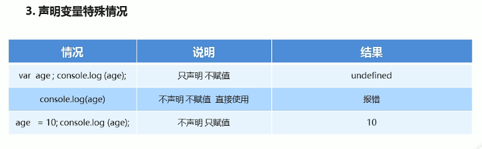
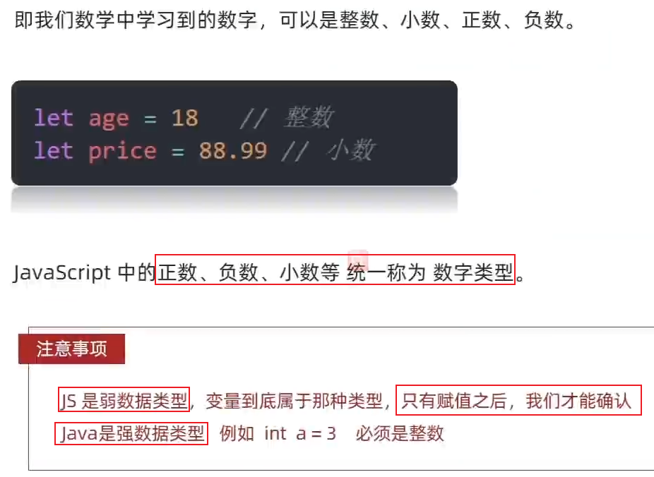
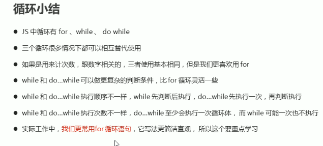
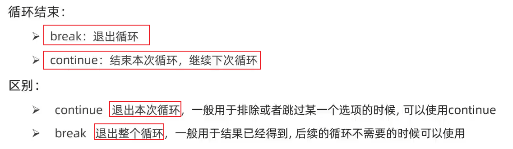
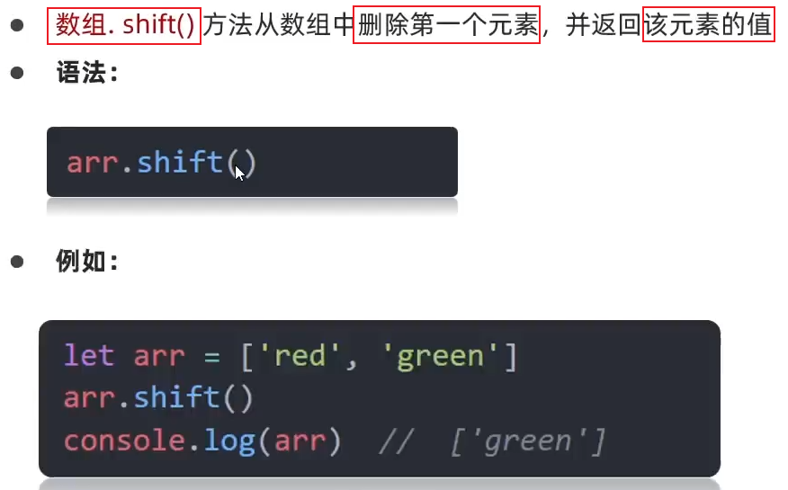
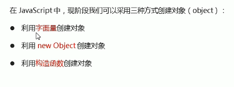
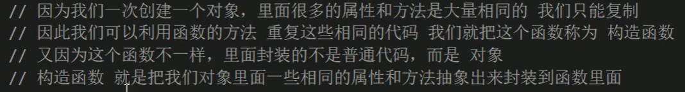
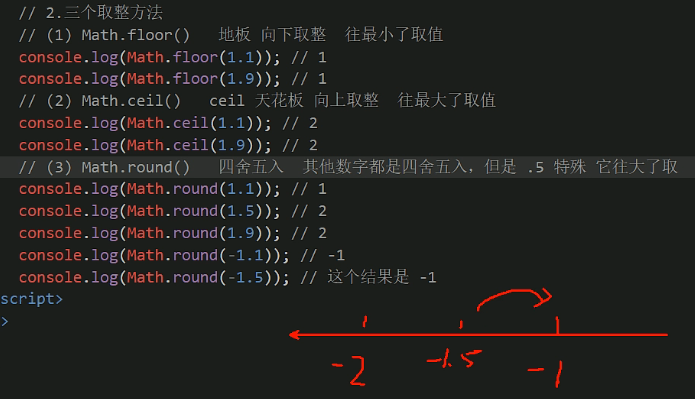
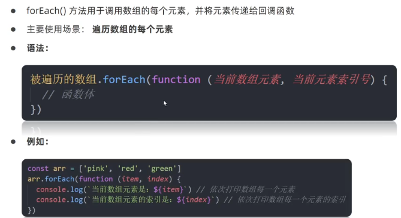
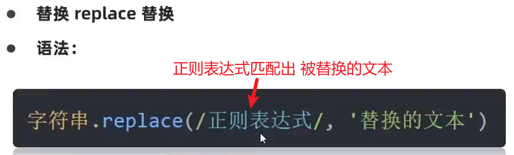

# JS基础

二级空两行，三级空一行  JS=JavaScript

## 介绍

### 1、JS是什么？

是一种**运行在客户端（浏览器）**的编程语言，实现人机交互效果。


### 2、JS作用


### 3、HTML/CSS/JS的关系

**HTML**：决定**网页结构和内容**（决定看到什么），相当于人的身体骨骼。

**CSS**：决定网页**呈现给用户的模样**（决定好不好看），相当于给人穿衣服、化妆。

**JS**：实现**业务逻辑和页面控制**（决定功能），相当于人的各种动作。


### 4、浏览器执行JS

浏览器分成两部分：**渲染引擎**和**JS引擎**


**浏览器本身并不会执行JS代码**，而是通过内置**JavaScript引擎（JS解释器）**来执行JS代码。JS引擎执行代码时**<span style="color:red">逐行解释</span>每一句源码**（转换为**机器语言**），然后由计算机去执行，所以JavaScript语言归为脚本语言，会**逐行解释执行**


### 5、JS的组成（三部分）


**1.ECMAScript**：规定了**JS的编程语法和基础核心知识**，是所有浏览器厂商共同遵守的一套JS语法工业标准。（理解为就是JS）


**2.DOM**——**页面文档对象模型**


**3.BOM——浏览器对象模型**


## JS书写位置


### 1）行内式

行内式——直接把JS代码**书写在标签身上**


case1：a 标签—**书写在 href属性 上：**

```html
<a href="javascript:js代码 ">内容</a>
```

case2：非a 标签——**书写在行为属性上：**

```html
<div onclick=" js代码 ">内容</div>
```

将单行或少量 js代码写在**html标签的事件属性**中（以 on 开头的属性），如：onclick。

注意单双引号的使用：在html中我们推荐使用双引号, JS 中我们推荐使用单引号

### 2）内嵌式


将多行JS代码写到 **script 标签**中，**书写的位置尽量写到文档末尾`</body>`前面**。（这是学习时常用的方式）

内嵌式JS代码，**不需要依赖任何行为，打开页面就会执行**


```html
<body>
  <!-- html代码-->
  
  <!-- 内部js -->
  <script>
    // 页面弹出警示框
    alert('你好，js~')
  </script>
</body>
```

### 3）外链式

外链式——把JS代码直接写在一个 **.js 文件内**

外链式JS代码，**不需要依赖任何行为，打开页面就会执行**

使用**script标签的`src`属性**引入指定JS文件。引用外部 JS文件的 **script 标签中间不可以写代码**


```html
  <script src="./js/my.js">
    // 中间不要写内容
  </script>
```


## JS注释和结束语

（1）// 单行注释  **ctrl+/**


（2）/*多行注释  ，默认值shift+alt +A  修改---设置--快捷键，**ctrl+shift+/**

*/


（3）结束符；


## JS输入输出语法

什么是**语法**：


### 输入prompt('...')

+ **`prompt('输入框上面提示信息')；`**  是一个**输入框**，注意：输入的值是**字符串型**。

  可以将输入的信息**用变量存储**：**var info = prompt('提示信息')；**这样变量info就保存了输入的信息。
  
  

### 输出


**`console.dir()`**是JavaScript中的一个调试功能，用于**打印一个对象的属性和方法列表到控制台**。

这个方法**接受一个 对象 作为参数**，并输出该对象的所有可枚举的属性和方法到控制台。它会以**树状结构显示对象的结构**，方便开发者查看对象的层次关系和内容。

```javascript
  <script>
    // 1. 文档输出内容，可以解析标签
    document.write('我是div标签')
    document.write('<h1>我是标题</h1>')
    // 2. 控制台打印输出 给 程序员
    console.log('看看对不对')
    console.log('日志')
    // 3. 页面弹出警告对话框
    alert('警告')

    // 输入语句prompt
    prompt('请输入您的年龄：')
    
    // 4. 控制台打印对象
    const person = {
      name: 'John',
      age: 30,
      address: {
        street: '123 Main St',
        city: 'New York',
        country: 'USA'
      }
    };

    console.dir(person);
  </script>
```


### JS代码执行顺序


我们发现，当JS代码中有`alert()`和`prompt()`语句时，先执行这个，网页显示转圈圈，页面未被渲染。


## 字面量


## JS变量

### 1、什么是变量

本质：**变量**是程序在内存中**申请的一块用来存放数据的空间**。

变量就是一个**容器**，用来存放数据的。


### 2、变量的基本使用

**step1--声明变量**   `var age;`  //声明一个名称为age的变量，**age指向这个内存空间**


  **step2--赋值**   `age = 18;` //**把值存入变量中**

  **变量的初始化**   ` var age = 18;  `**声明一个变量的同时并赋值**，称之为变量初始化

```js
//step1:输入框，用户输入姓名，并存储到一个myname的变量里面
        var my_name = prompt('请输入姓名：');
//step2:输出这个用户名
        alert(my_name);

    // 1. 声明一个年龄变量
    let age
    // 2. 赋值   =  赋值
    age = 18
    // console.log(age)
    // 3. 声明的同时直接赋值  即变量的初始化
    // let age = 18
    // 小案例
    let num = 20
    let uname = 'pink老师'
    console.log(num)
    console.log(uname)
```


### 3、变量的扩展


```js
   // var a = b = c = 9;
   //相当于 var a = 9; b = 9; c = 9; b和c没有声明var，直接赋值，当作全局变量。

  //集体声明 var a = 9, b = 9, c = 9;
```

注意：**没有声明，只有赋值的变量**——当作**全局变量**



```javascript
    // 1 声明的同时直接赋值  变量的初始化
    // let age = 18
    // age = 19
    // // let age = 19
    // console.log(age)
    // 2. 声明多个变量    
    // let age = 18, uname = '迪丽热巴'
    // console.log(age, uname)
    // 提倡声明的方式
    let age = 19
    let uname = '迪丽热巴'
    console.log(age, uname)
```

**案例：交换变量的值**，为后面冒泡排序做准备


```javascript
  <script>
    // let if = 10
    let num1 = 'pink老师'
    let num2 = '戚薇'
    let temp
    // 都是把右边给左边
    temp = num1
    num1 = num2
    num2 = temp
    console.log('num1:' + num1, 'num2:' + num2)
  </script>
```


### 4、变量的本质

变量只是一个**内存空间**，是一个“容器”，存放数据。


### 5、变量的命名规则与规范


**name** 尽量不要使用name作为变量名


### 6、变量拓展-let和var的区别


### 7、变量拓展-数组


## JS常量


```javascript
    // 1.常量 不允许更改值
    const PI = 3.14
    console.log(PI)
    PI = 3.15
    console.log(PI) // 报错

    // 2. 常量声明的时候必须赋值
    const PI  // 报错
```


## JS数据类型


引用数据类型也称**复杂数据类型**

JS变量的数据类型只有**在程序运行过程**中，根据  **等号右边  的值来确定的**。变量的数据类型：就看**给变量赋值是什么**


### 1、基本（简单）数据类型

#### 1）数字型Number




```javascript
    // js 弱数据类型的语言 只有当我们赋值了，根据等号右边赋的值才知道是什么数据类型
    // let num = 'pink'
    let num = 10.11
    console.log(num)
    console.log(1 + 1)
    console.log(1 * 1)
    console.log(1 / 1)
    console.log(4 % 2) // 求余数  0
    console.log(5 % 3) // 求余数  2 
    console.log(3 % 5) // 求余数  3 
    // java 强数据类型的语言    int num = 10  一定是整数
```

var n1 = 100 

var n5 = **2e5**   代表**2*10^5**

**八进制**， 0~7，程序中，数字前面加**0或0o**，表示该数字为八进制

**十六进制**，0~9 a~f 数字前面加**0x**

**二进制**，0和1，前面数字加**0b**


+ **isNaN()** 方法用来**判断非数字**，返回一个**布尔值**，如果是数字返回false，如果不是数字返回true。


#### 2）字符串型String


var str = **abc** ；这样会报错，**没使用引号**

当**字符串里面有引号**怎么办——引号嵌套使用，**外单内双**或者**外双内单**，还可以使用**转义符**。

```js
    console.log('pink老师讲课非常有"基情"')
    console.log("pink老师讲课非常有'基情'")
    console.log('pink老师讲课非常有\"基情\'')
```


                                                                                                                                                                                                                                                                                                                                                                                                                                                                                                                                                                                                                                                                                                                                                                                                                                                                                                                                                                                                                                                                                                                                                                                                                                                                                                                                                                                                                                                                                                                                                                                                                                                                                                                                                                                                                                                                                                                                                                                                                                                                                                                                                                                                                                                                                                                                                                                                                                                                                                                                                                                                                                                                                                                   


```js
        //案例
        //输入框，并定义一个变量保存这个变量
        var age = prompt('请输入您的年龄：');
        //alert输出，用字符串拼接
        alert('您今年' + age + '岁啦');
```


##### 模板字符串`${变量}`

让拼接字符串更简便。


```javascript
<script>
    // 模板字符串: `...${变量名}...  `
    let age = 18
    document.write(`我今年${age}岁`);

    var age1 = prompt('请输入年龄')
    var username = prompt('请输入姓名')
    document.write(`我是${username},我今年${age1}岁了`)
</script>
```


#### 3）布尔型Boolean


```js
        var flag = true;
        var flag1 = false;
        console.log(flag + 1); //2   值true参与加法运算当1来看
        console.log(flag1 + 1); //1  值false参与加法运算当0来看
        console.log(3 > 4) // false
```


#### 4）空类型null undefined

##### 未定义类型undefined


##### 空类型null


```js
    // 计算有区别
    console.log(undefined + 1)  // NaN
    console.log(null + 1) // 1
```


### 2、检测数据类型typeof

#### （1）typeof


null返回的是object，返回的是一个空的对象


#### （2）根据变量在控制台的颜色

```js
        //看看各个变量在控制台的颜色
        console.log(18); //数字型--蓝色
        console.log('18'); //字符串型--黑色
        console.log(true); //布尔型--蓝色
        console.log(undefined); //Undefined--浅灰色
        console.log(null); //null--浅灰色
```


### 3、JS数据类型转换

为什么需要类型转换？


#### 1）隐式转换


```js
  <script>
    console.log(1 + 1)
    console.log('pink' + 1) // pink1
    console.log(2 + 2)
    console.log(2 + '2') // 22

    console.log(2 - 2)
    console.log(2 - '2')  // 0  

    console.log(+12) // 12
    console.log(+'123')  // 转换为数字型
  </script> 
```


#### 2）显示转换


##### 转数字型

把其他数据类型转换成 **数字类型**


**<span style="color:red">+号作为正号</span>**，解析也可以转换为**数字型**。比如：+'11'=11。（隐式转换）


当转换的内容是**非数字**时，`Number()`会转换成**NaN**(not a number)；`parseInt()`和`parseFloat()`会**一个一个解析**，**遇到非数字就停止**，**保留前面的数字**，比如：'100abc'，会转换成100。

当转换的内容是**小数**时，前两个只会保留整数部分，**parseFloat()会转换为小数。**

案例：求两个输入值之和

```js
  <script>
    // 1. 用户输入   prompt 得到是字符串类型 要转换为 数字型
    let num1 = +prompt('请输入第一个数字：')
    let num2 = +prompt('请输入第二个数字：')
    // 2. 输出
    alert(`两个数相加的和是:${num1 + num2}`)
  </script>
```


##### 转字符串型

把其他数据类型转换成 **字符串类型**


+ **`要转换的值.toString()`**
+ **`String(要转换的值)`**


##### 转布尔型

把其他数据类型转换成 布尔类型

+ **Boolean(转换的内容)**

转换的值是true 还是 false？？**除了以下五个是false，其余都是true**


```js
console.log(Boolean(2)) // true
```


**案例：渲染表格**

```html
  <style>
    * {
      margin: 0;
      padding: 0;
    }

    h2 {
      text-align: center;
    }

    table {
      /* 相邻边框合并 */
      border-collapse: collapse;
      height: 80px;
      margin: 20px auto;
      text-align: center;
    }

    th {
      padding: 5px 30px;
    }

    table,
    td,
    th {
      border: 1px solid black;
    }
  </style>


  <h2>订单确认</h2>
  <script>
    var proPrice = prompt('请输入商品价格')
    var proNumber = prompt('请输入商品数量')
    var total = +proPrice * +proNumber
    var address = prompt('请输入收货地址')
    // 向页面打印，会解析标签的
    document.write(`
    <table>
    <thead>
      <tr>
        <th>商品名称</th>
        <th>商品价格</th>
        <th>商品数量</th>
        <th>总价</th>
        <th>收货地址</th>
      </tr>
    </thead>
    <tbody>
      <tr>
        <td>iPhone 14 Pro Max</td>
        <td>${proPrice}</td>
        <td>${proNumber}</td>
        <td>${total}</td>
        <td>${address}</td>
      </tr>
    </tbody>
  </table>`)
  </script>
```


### 4、扩展-术语解释


### 5、基本数据类型和引用数据类型


#### （1）简单类型和复杂类型


#### （2）堆和栈


注意：JavaScript中没有堆栈的概念


#### （3）简单数据类型的内存分配

**简单数据类型的内存分配：**存放到**栈**里面，里面**开辟一个空间**存放的是**值**


#### （4）复杂数据类型的内存分配

**复杂数据类型的内存分配**：数据存放到**堆**里面，在**栈**里面**存放十六进制的地址**，然后这个**地址指向存放在堆里面的数据**


#### （5）简单类型传参


```js
       function fn(a){
            a++;
            console.log(a); //11
        }
        var x = 10;
        fn(x); // x在栈空间的值复制了一份给形参，在fn函数里面对形参做任何修改，也不会影响到x
        console.log(x); // 10 不变
```


#### （6）复杂类型传参

复杂类型传参：其实就是把变量在**栈**空间保存的**<span style="color:red">堆地址复制了一份</span>**，**两个变量保存相同的堆地址**，**指向的还是同一个对象**


```js
  <script>
    let num1 = 10
    let num2 = num1 // 值复制了一份
    num2 = 20
    console.log(num1) // 结果是？10


    let obj1 = {
      age: 18
    }
    let obj2 = obj1 // 在栈空间的堆地址复制了一份，指向同一个堆中保存的对象
    // 修改属性
    obj2.age = 20
    console.log(obj1.age) // 20
  </script>
```


```js
        function Person(name){ //构造函数
            this.name = name;
        }

        function f1(x){  //x = p  栈里存放的地址复制一份给形参x，指向同一个存放在堆里面的对象，所以操作的是同一个对象
            console.log(x.name); //2.刘德华
            x.name = '张学友';
            console.log(x.name); //3.张学友
        }

        var p = new Person('刘德华');  //栈里面存放地址，指向存放在堆里面的对象
        console.log(p.name);  //1.刘德华

        f1(p);
        console.log(p.name); //4.张学友 ！！！
```


## JS运算符

几个概念：运算符、表达式、返回值

**运算符（operator）**也被称为**操作符**，是用于实现赋值、比较和执行算数运算等功能的符号。

**表达式**：是由数字、运算符、变量等**以能求得数值的有意义排列方法所得的组合**。简单理解：是由**数字、运算符、变量等组成的式子**。比如：1+1  x=7  num++

**返回值：**表达式最终都会有一个**结果返回**，称为返回值。


### 1）赋值运算符


```js
  <script>
    let num = 1
    // num = num + 3
    // 采取赋值运算符
    num += 3
    console.log(num) // 4
    let a = 5
    a %= 3
    console.log(a) // 2
  </script>
```


### 2）算数运算符


注意： **+的两个用法**：字符串拼接，和数的数据类型为字符串类型

​            **浮点数**在**算数运算中有问题**。

```js
var n = 0.1 + 0.2; //0.300000000004
console.log(n == 0.3); //false
```


### 3）比较运算符


注意：

**==   !=  只比较 值** 是不是相等，**不考虑数据类型**；也可以说是==和!=会**默认转换数据类型，只比较值**，其实**除了===，比较运算符都有隐式转换**

**===  !===   不仅比较值，而且比较数据类型**

​      ===有其一不相等，就是false；

​      !===有其一不相等，就是true

等号小结：


```js
    // 比较运算符有隐式转换 把'2' 转换为 2  双等号 只判断值
    console.log(2 == '2')  // true
    // console.log(undefined === null)
    // === 全等判断 值和数据类型 都一样才行
    // 以后判断是否相等 请用 ===  
    console.log(2 === '2') // false
    console.log(NaN === NaN) // false (NaN 不等于任何人，包括他自己)
    console.log(2 !== '2')  // true  
    console.log(2 != '2') // false 
    
    console.log('a' < 'b') // true
    console.log('aa' < 'ab') // true 先比第一个相等，再比第二个
    console.log('aa' < 'aac') // true
```


### 4）逻辑运算符


注意：逻辑运算符是用来进行**<span style="color:red;">布尔值进行运算的运算符</span>**，其**结果返回的**也是一个**布尔值**


**&&与（and）**：真真才真    **||或（or）**：假假才假

```js
  <script>
    // 1. 用户输入
    let num = +prompt('请输入一个数字:')
    // 2. 弹出结果
    alert(num % 4 === 0 && num % 100 !== 0)
  </script>
```


#### 逻辑运算的短路：

开发中经常会遇到：当需要一个数据，但是这个数据暂时没有传过来，可以用一个值先来代替


主要思想：如果多个表达式，**前面表达式已经可以得出这个逻辑运算的结果**，**后面的表达式就不运行了**。


但是用 123 && 456 用值或者表达式参与运算。注意：**这些值或者表达式会被转换成布尔类型**，值是true or false 

```js
//1.逻辑运算符是布尔值参与运算，返回结果也是布尔值。
//2.但是用 123 && 456 用值或者表达式参与运算。注意：这些值或者表达式会被转换成布尔类型，值是true or false 
//如果表达式1为真，则返回表达式2；如果表达式1为假，则返回表达式1
   console.log(123 && 456); // 456
   console.log(0 && 456); // 0是false，返回表达式1
   console.log(0 && 1+2 && 456 && 56789); // 0是false，返回表达式1
```


```js
    console.log(false && 22) //false
    console.log(false && 3 + 5) //false
    let age = 18
    console.log(false && age++) // false  age++ 不执行  一假则假
    console.log(age) // 18

    console.log(true || age++) // true  age++不执行 一真则真
    console.log(age) // 18


    // console.log(11 && 22)  // 都是真，这返回最后一个真值
    // console.log(11 || 22)  //  输出第一个真值
```


### 5）自增自减运算符

一元运算符：

单独对一个变量进行+1或者-1的操作


```js
       //前置递增++a：先使变量a+1，再返回值
        var p = 10;
        console.log(++p + 10); //p先加1，再返回值，21
```


```js
       //后置递增a++：先返回a原值，再自加1
        var p = 10;
        console.log(p++ + 10);//p先返回原值10，再自加1,20
```


```js
    let i = 1
    console.log(i++ + ++i + i) // 1 + 3 + 3
```


### 运算符的优先级


## 流程控制

### 表达式和语句


### 1、顺序结构

顺序结构是程序中最简单、最基本的流程控制，没有特定的语法结构，程序会**按照代码的先后顺序，依次执行**，程序中**大多数的代码**都是这样执行的。


### 2、JS流程控制--分支

由上到下执行代码的过程中，根据**不同的条件**，**执行不同的路径代码**（执行**代码多选一**的过程），从而得到**不同的结果**。


#### 1）if语句

**1、if单分支语句**


执行思路：如果if里面的**条件表达式结果为真**，则**执行{}里的代码**，**否则，不运行**

**2、if-else双分支语句**

语法结构：


执行思路：如果**if条件表达式为真**，则**执行语句1**；**否则执行语句2**。**<span style="color:red;">二选一执行</span>**。


**3、if - else if多分枝语句**

语法结构：


注意：

+ 多分支语句还是**<span style="color:red;">多选一执行</span>**，最后**只有一个语句执行**；

+ **else if() {}**的个数**可任意多个**。else if中间有空格


#### 2）三元运算符


**三元表达式**：含三目运算符的表达式，称为三元表达式。

语法结构：**条件表达式 ？ 表达式1  :  表达式2**

执行思路：如果条件表达式为**真**，则**返回表达式1的值**；如果条件表达式为**假**，则**返回表达式2的值**。（类似 **if-else双分支**语句）

这里表达式1和2可以是语句。

```js
  <script>
    // 三元运算符
    // 条件 ? 代码1 : 代码2
    console.log(3 > 5 ? 3 : 5)
    if (3 < 5) {
      alert('真的')
    } else {
      alert('假的')
    }
    3 < 5 ? alert('真的')  : alert('假的')
    // 一般用来取值
    let sum = 3 < 5 ? 3 : 5
    console.log(sum)
  </script>
```

案例：输入两个数，输出其较大的值

```js
  <script>
    let num1 = +prompt('输入一个数')
    let num2 = +prompt('输入一个数')
    // console.log(num1 > num2 ? num1 : num2);
    num1 > num2 ? alert(`最大值是：${num1}`) : alert(`最大值是：${num2}`)
  </script>
```

案例：数字补0案例


```js
  // 1. 用户输入 
    let num = prompt('请您输入一个数字:')
    // 2. 判断输出- 小于10才补0
    // num = num < 10 ? 0 + num : num
    num = num >= 10 ? num : 0 + num
    alert(num) 
```


#### 3）switch语句

switch语句也是**多分支语句**，也可以实现**<span style="color:red">多选一执行</span>**。

语法结构：


执行思路：利用我们的**表达式的值** 和 **case后面的选项值** 相匹配，如果**匹配上**，就**执行该case里面的语句**；**否则执行default里面的语句**。

注意：

+ **`switch（表达式）`**，表达式经常写成**变量**

+ 我们**表达式的值**，和**case里面的值**相匹配时，要求是 **全等===——必须是值和数据类型都相同**
+ break不能忘。如果当前的case里面**没有break**，则不会退出switch，而是**继续执行下一个**。

**switch语句**和**if-else if语句**的区别：

+ 一般情况下可以相互替换。
+ switch（）...case语句通常处理case为**比较确定值的情况**，而if...else if...语句更加灵活，常**用于范围判断**（大于等于某个范围）
+ **switch语句**进行条件判断后**直接跳到**对应case的执行语句，**效率更高**。而if...else if语句有几种条件，就得判断多少次。
+ 当分支较少时，使用if...else if
+ 当分支较多，使用switch语句

```js
  <script>
    let num = +prompt('选择1 2 or 3')
    switch (num) {
      case 1:
        console.log('您选择的是1')
        break  // 退出switch
      case 2:
        console.log('您选择的是2')
        break  // 退出switch
      case 3:
        console.log('您选择的是3')
        break  // 退出switch
      default:
        console.log('没有符合条件的')
    }
  </script>
```

案例：简单的计算器

```js
  <script>
    // 1.用户输入  2个数字 +  操作符号  + - *  / 
    let num1 = +prompt('请您输入第一个数字:')
    let num2 = +prompt('请您输入第二个数字:')
    let sp = prompt('请您输入 + - * / 其中一个:')
    // 2. 判断输出
    switch (sp) {
      case '+':
        alert(`两个数的加法操作是${num1 + num2}`)
        break
      case '-':
        alert(`两个数的减法操作是${num1 - num2}`)
        break
      case '*':
        alert(`两个数的乘法操作是${num1 * num2}`)
        break
      case '/':
        alert(`两个数的除法操作是${num1 / num2}`)
        break
      default:
        alert(`你干啥咧，请输入+-*/`)
    }
  </script>
```


### 3、JS流程控制--循环

**断点调试**

浏览器按**F12**（检查）--> **sources** --> 找到需要**调试的文件** --> 在程序的**某一行设置断点（这一行还没有执行了）**  -->  **网页刷新一下**。


循环的**目的**：在实际问题中，有许多**具有规律性的重复操作**，因此在程序中要完成这类操作就需要**重复执行某些语句**。

在程序中，**一组被重复执行的语句**被称之为**循环体**，能否继续重复执行，取决于**循环的终止条件**。由循环体及循环的终止条件组成的语句，称之为**循环语句**。


#### while循环

while语句可以在**条件表达式为真**的前提下，**一直循环**执行循环体，**直到表达式不为真时结束循环**。


```js
    let end = +prompt('请输入次数:')
    // 1. 变量的起始值
    let i = 1
    // 2. 终止条件
    while (i <= end) {
      document.write(`我要循环${end}次 <br>`)
      // 3. 变量的变化量
      i++
    }
```

```js
    // 3. 页面输出1~100 偶数和
    let i = 1
    let sum = 0
    while (i <= 100) {
      // 筛选偶数 只有偶数才累加
      if (i % 2 === 0) {
        sum = sum + i
      }
      // 每次循环都要自加
      i++
    }
    console.log(sum)
```

案例：简易ATM取款机案例


```js
  <script>
    // 1. 开始循环 输入框写到 循环里面
    // 3. 准备一个总的金额
    let money = 100
    while (true) {
      let re = +prompt(`
        请您选择操作：
        1.存钱
        2.取钱
        3.查看余额
        4.退出
        `)
      // 2. 如果用户输入的 4 则退出循环， break  写到if 里面，没有写到switch里面， 因为4需要break退出循环
      if (re === 4) {
        break // 跳出整个循环
      }
      // 4. 根据输入做操作
      switch (re) {
        case 1:
          // 存钱
          let cun = +prompt('请输入存款金额')
          money = money + cun
          break
        case 2:
          // 取钱
          let qu = +prompt('请输入取款金额')
          if (money >= qu) {
            money = money - qu
          } else {
            alert('余额不足')
          }
          break
        case 3:
          // 余额
          alert(`您的银行卡余额是${money}`)
          break
      }
    }
  </script>
```


#### do...while循环

do...while语句其实是while语句的一个变体。该循环会**先执行一次代码（循环体）**，然后才**对条件表达式进行判断**，如果条件为真，就会重复执行循环体，直到条件表达式为假，退出循环。


#### for循环


```js
    let arr = ['刘德华', '刘晓强', '刘晓庆', '刘若英', '刘热巴', 'pink老师']
    // console.log(arr[0])
    // console.log(arr[1])
    // console.log(arr[2])
    // console.log(arr[3])
    // 必须从0开始，因为数组索引号从0开始  arr.length = 6
    // 遍历数组 ：  从第一个循环到最后一个
    for (let i = 0; i < arr.length; i++) {
      console.log(arr[i])
    }
```


**for循环——重复执行相同的代码**

```js
    for(var i = 1;i <= 10; i++){
          console.log('hello');
     }
    //可以让用户控制输出的次数，改变终止条件
     var num = prompt('请你输入次数：');
     for(var i = 1; i <= num; i++){
          console.log('hello');  
        }
```

**for循环——重复执行不相同的代码**：这主要是因为使用了计数器，**计数器变量在每次循环过程中都会有变化**。

```js
    //输出一个人1~100岁
        for(var i = 1; i <= 100; i++){
            console.log('我今年' + i + '岁了');//计算器变化的
         }
```

**for循环——重复某些相同操作**：for循环因为有了计数器的存在，我们还可以**重复的执行某些操作**，比如做一些算术运算。


#### for循环嵌套


语法结构：


我们可以把**里面的循环**看作是**外层循环的循环体**

 **外层循环一次**，**里面的循环全部执行**！！！

```js
    let row = +prompt('请输入行数:')
    let col = +prompt('请输入列数:')
    // 外层循环打印行数
    for (let i = 1; i <= row; i++) {
      // 里层循环打印几个星星
      for (let j = 1; j <= col; j++) {
        document.write('☆')
      }
      // 进行换行显示
      document.write('<br>')
    }
```

案例：打印直角三角形

```js
  <script>
    // 1. 外层循环控制行数
    for (let i = 1; i <= 6; i++) {
      // 2. 里层循环控制列数（几个星星）
      for (let j = 1; j <= i; j++) {
        document.write('◆')
      }
      // 换行
      document.write('<br>')
    }
  </script>
```

案例：九九乘法表

```js
  <script>
    // 1. 外层循环控制行数
    for (let i = 1; i <= 9; i++) {
      // 2. 里层循环控制列数
      for (let j = 1; j <= i; j++) {
        document.write(`<span> ${j} x ${i} = ${i * j} </span>`)
      }
      // 换行
      document.write('<br>')
    }
  </script>
```


**for循环小结：**


#### 总结



#### continue 和 break



`continue`关键字：**退出本次循环**，**继续执行剩余次数循坏**，就是说，直接跳到 i++。

`break`关键字：立即**跳出整个循环（循环结束）**。

例如：吃5个包子，吃到第3个发现里面有虫子，其余的都不吃了。

```js
    let i = 1
    while (i <= 5) {
      if (i === 3) {
        break // 退出整个循环
      }
      console.log(i) // 1 2
      i++
    }

    let i = 1
    while (i <= 5) {
      if (i === 3) {
        i++
        continue
      }
      console.log(i) //1 2 4 5
      i++
    }
```

```js
     for (let i = 1; i <= 5; i++) {
      if (i === 3) {
        continue  // 退出本次循环，本次循环中 continue下面的语句不在执行
      }
      console.log(i) // 1 2 4 5
    }

    for (let i = 1; i <= 5; i++) {
      if (i === 3) {
        break  // 退出整个循环 结束循环
      }
      console.log(i) // 1 2 
    }
    
    // 无限循环
    // for (; ;) {
    //   console.log(11)
    // }
```


## JS数组

### 1、什么是数组

数组是指**一组数据的集合**，其中每个数据被称为**元素**，数组可以**混合存放任意类型的元素**。


### 2、数组的基本使用


JS中**创建数组**有两种方式：

+ 利用 **new Array( )**创建数组
+ 利用**数组字面量——中括号[ ]** 创建数组 （常用）

```js
  <script>
    // 1. 字面量声明数组
    let arr = [1, 2, 'pink', true]
    console.log(arr)
    // 2. 使用new Array 构造函数声明   了解
    let arr1 = new Array(1, 2, 3, 4)
    console.log(arr1)
  </script>
```


**遍历**：就是把数组中的**每个元素从头到尾都访问一次**（类似我们每天早上学生的点名）。

用for循环实现：里面的**i是计数器**，**当成索引号使用**，arr[i]是数组元素第i个数组元素

```js
    // 4.遍历数组
    let arr2 = [1, 2, 3, 'pink', false]
    for (let i = 0; i < arr2.length; i++) {
      // 取元素 arr2[i]
      console.log(arr2[i])
    }
```


### 3、数组的长度.length

使用” **`数组名.length`** “可以访问**数组元素的数量**（数组长度）。

**数组长度=元素的个数**，不要跟**索引号（下标，从0开始）**混淆

**arr.length** **动态监测数组元素的个数**

```js
 for(var i = 0; i < arr.length; i++){
          console.log(arr[i]);
      }
    console.log(arr.length);
```

案例：求数组元素的之和和平均数

```js
  <script>
    let nums = [10, 18, 20, 30, 20]
    // 求和的变量
    let sum = 0;
    for (let i = 0; i < nums.length; i++) {
      // sum = sum + nums[i]
      sum += nums[i]
    }
    console.log(`数组的元素之和为：${sum}`)
    console.log(`数组的元素平均值为：${sum / nums.length}`)
  </script>
```

案例：求数组中最大值和最小值

```js
  <script>
    let arr = [2, 6, 1, 77, 52, 25, 7]
    // max里面要存的是最大值
    let max = arr[0]
    // min 要存放的是最小值
    let min = arr[0]
    for (let i = 0; i < arr.length; i++) {
      // if (max < arr[i]) {
      //   max = arr[i]
      // }
      max = max < arr[i] ? arr[i] : max
      // if (min > arr[i]) {
      //   min = arr[i]
      // }
      min = min > arr[i] ? arr[i] : min
    }
    console.log(`数组的最大值是${max}，最小值是${min}`)
  </script>
```


### 4、操作数组


#### 1）新增数组元素

+ **通过修改 length 长度新增数组元素**

​     可以通过**修改 length 长度**来实现**数组扩容**的目的

​     **length 属性是可读写的**


```js
        //1.新增数组元素 ：通过修改length长度实现数组扩容
        var arr = ['red','green','blue'];
        console.log(arr.length); //3
        arr.length=5; //把数组长度修改为5，则元素应该有5个
        console.log(arr); //5个元素 
        console.log(arr[3],arr[4]); 
        //此时输出第4，5个元素=undefined 默认值
```

+ **通过修改数组索引新增数组元素**

​       可以通过**修改 数组索引** 的方式**追加**数组元素

注意：

追加索引号，必须**按顺序追加**，否则没用。

给数组名赋值，会使得元素全没了，不是数组了，成了一个变量

```js
        //2.修改索引号  追加数组元素
        var arr1 = ['red','green','blue'];
        arr1[3] = 'pink'; //arr1原本只有索引号0，1，2,追加一个索引3
        console.log(arr1); //此时数组多了一个元素pink
        arr1[4] = 'yellow'; 
        console.log(arr1); //又多了一个元素yellow
        
        arr1 = '哈哈'; //给数组名赋值，会使得元素全没了，不是数组了，成了一个变量
        console.log(arr1);
  
    let arr = []
    console.log(arr) //[] 空数组
    console.log(arr[0])  // undefined
    arr[0] = 1
    arr[1] = 5
    console.log(arr) //[1,5]
```

其实这两种方法不常用。最常用下面两种方法：


```js
  <script>
    let arr = ['pink', 'hotpink']
    // push 末尾追加
    console.log(arr.push('deeppink'))  // 3，返回新增后的新数组长度length
    arr.push( 'linghtpink')
    console.log(arr)
    // unshift 开头新增
    arr.unshift('red')
    console.log(arr)
  </script>
```

案例：数组筛选，将一个数组中大于等于10的元素选出来，放入一个新数组


```js
  <script>
    // 重点案例
    let arr = [2, 0, 6, 1, 77, 9, 54, 3, 78, 7]
    // 1. 声明新的空的数组
    let newArr = []
    // 2. 遍历旧数组
    for (let i = 0; i < arr.length; i++) {
      if (arr[i] >= 10) {
        // 3. 满足条件 追加给新的数组
        newArr.push(arr[i])
      }
    }
    // 4. 输出新的数组
    console.log(newArr) 
  </script>
```


#### 2）删除数组元素





如果省略，将会**从指定的索引号start开始，删除后面所有**。

```js
    let arr = ['red', 'green', 'blue']
    // 3. splice 删除指定元素  splice(起始位置-索引号, 删除几个)
    arr.splice(1, 1)  // 是从索引号1的位置开始删， 只删除1个
    // arr.splice(1) // 从green 删除到最后
    console.log(arr)
```

删除数组元素总结：


#### 3）修改数组元素

直接  **重新赋值**  即可。

```js
    let arr1 = ['pink', 'red', 'green']
    // 修改
    // arr1[0] = 'hotpink'
    // console.log(arr1) // 第一个元素变成了 hotpink
    // 给所有的数组元素后面加个老师  修改
    for (let i = 0; i < arr1.length; i++) {
      // console.log(arr[i])
      arr1[i] = arr1[i] + '老师'
    }
    console.log(arr1) // ['pink老师', 'red老师', 'green老师']
```


## JS函数


### 1、为什么需要函数


### 2、函数的概念


**函数**：就是封装了一段可以**被重复执行调用的代码块**。

目的：让大量代码可以重复使用

```js
// 声明
    function sheet99() {
      for (let i = 1; i <= 9; i++) {
        // 2. 里层循环控制列数
        for (let j = 1; j <= i; j++) {
          // 解析html标签同时利用``插入变量
          document.write(`<span>${j} X ${i} = ${i * j}</span>`)
        }
        // 换行
        document.write('<br>')
      }
    }
    // 调用
    sheet99()
    sheet99()
    sheet99()
    sheet99()
```


### 3、函数的使用

函数的使用分为两步：**声明函数**  和   **调用函数**

**step1--声明函数** 


**step2--调用函数**


```js
  <script>
    // let num = 10
    // console.log(num)
    // 1. 函数的声明   
    function sayHi() {
      console.log('hi~~~')
    }
    // 2. 函数调用   函数不调用，自己不执行
    sayHi()
    sayHi()
    sayHi()

    // 2. 求 1~100 累加和
    function getSum() {
      let sum = 0
      for (let i = 1; i <= 100; i++) {
        sum += i
      }
      console.log(sum)
    }
    getSum()
  </script>
```

**函数的封装：**


### 4、函数的形参和实参

**形参**和**实参**


```js
//函数的参数：形参和实参
    function getSum(start, end) {   // end = 50
      // 形参  形式上的参数  
      // console.log(end)
      let sum = 0
      for (let i = start; i <= end; i++) {
        sum += i
      }
      console.log(sum)
    }
    getSum(1, 50)  // 调用的小括号里面 实参 - 实际的参数
    getSum(100, 200)  // 实参 - 实际的参数
```

注意：

   在声明函数时，形参可以有，也可以没有

   多个参数之间**逗号`，`**隔开

   **形参**可以看作**不用声明的变量**，**等实参值传给形参**。

#### 形参和实参个数不匹配的问题


**实参过多**：实参的个数多于形参的个数，会**从前面开始取，其余的实参被忽略**（5、动态参数和剩余参数）

**形参过多**：实参的个数少于形参的个数，**多的形参默认为undefined**（给定形参默认值）

```js
//函数形参实参个数匹配
        function getSum(num1,num2){
            console.log(num1 + num2);
        }
        //1.实参的个数和形参的个数相等，则正常输出
        getSum(1,2); // 3
        //2.实参的个数多于形参的个数，会从前面开始取，其余的实参被忽略（函数内部有一个arguments，里面装着所有的实参）。
        getSum(1,2,3); // 3
        //3.实参的个数少于形参的个数，多的形参默认为undefined
        getSum(1); //1 + undefined = NaN
```


#### 给定形参默认值（`undefined`）


```js
    function getSum(start = 0, end = 0) {   // end = 50
      // 形参  形式上的参数
      // console.log(end)
      let sum = 0
      for (let i = start; i <= end; i++) {
        sum += i
      }
      console.log(sum)
    }
    getSum(1, 50)  // 调用的小括号里面 实参 - 实际的参数
    getSum(100, 200)  // 实参 - 实际的参数
    getSum()
```

注意：在JavaScript中，**形参的默认值**是**`undefined`**，（前面学习的变量，**只声明，不赋值**，默认值也是undefined）


### 5、动态参数和剩余参数

#### 1）动态参数`arguments`(所有实参)


```html
  <script>
    // arguments的使用,只有函数才有arguments对象，内置的
    function fn() {
      console.log(arguments); // arguments里面存储了所有传递过来的实参
      console.log(arguments.length); // 3   5
      console.log(arguments[1]); // 3   2
      //可以遍历数组的方式遍历arguments
      for (var i = 0; i < arguments.length; i++) {
        console.log(arguments[i]);
      }
    }
    fn(2, 3, 4);
    fn(1, 2, 3, 4, 5);
    
      
    // 写一个求和函数：不管用户传入几个实参，都将其和求出来
    function getSum() {
      // arguments 动态参数 只存在于 函数里面
      // 是伪数组 里面存储的是传递过来的实参
      // console.log(arguments)  [2,3,4]
      let sum = 0
      for (let i = 0; i < arguments.length; i++) {
        sum += arguments[i]
      }
      console.log(sum)
    }
    getSum(2, 3, 4) // 9
    getSum(1, 2, 3, 4, 2, 2, 3, 4) // 21
  </script>
```


#### 2）剩余参数（接收多余实参）


```html
  <script>
    function getSum(a, b, ...arr) {
      console.log(arr)  // 使用的时候不需要写 ...展开运算符
    }
    getSum(2, 3) // [] 2给了a 3给了b 无剩余，arr=[]
    getSum(1, 2, 3, 4, 5) // [3, 4, 5] 1给了a 2给了b 剩余给了arr,arr=[3,4,5]
  </script>
```

和`arguments`的区别？


### 6、函数的返回值`return`


**return语句**：有的时候，我们会希望**函数将值返回给调用者**，此时通过使用`return`语句就可以实现。

```js
  //函数的返回值格式
       function 函数名（）{
            return 需要返回的结果;
        }
        函数名（）;

    // 函数的返回值
    function fn() {
      return 20
    }
    // fn()就是调用者  相当于执行了fn() = 20
    // return 的值返回给调用者
    // console.log(fn())
    let re = fn()
    console.log(re)
```

只要函数遇到`return`，就**把后面的结果返回给函数的  调用者，即函数名()**，**<span style="color:red">函数名() = return后面的结果</span>**

说明：


1、**return会终止函数**：return语句之后的代码**不执行**

```js
//return终止函数
        function getSum(num1,num2){
            return num1 + num2;
            alert('return后面的代码不被执行');
        }
        console.log(getSum(1,2));
```

2、**return只能返回一个值**，如果用**逗号隔开**多个值，以**最后一个**为准。

```js
//2.return只能返回一个值，多个值用逗号隔开，则返回最后一个值
        function fn(num1,num2){
            return num1,num2;  //只会返回num2
        }
        console.log(fn(1,2)); //返回最后一个值2
```

如果想要返回多个值，可以**返回一个数组[]**。return [....]；

```js
 function getResult(num1,num2){
      return [num1+num2, num1-num2, num1*num2, num1 / num2] //返回多个值可以用返回一个数组
      }
        console.log(getResult(2,1));
```

3、函数如果有renturn，则返回的是return后面的值；如果函数**没有return**，则**默认返回undefined**。

```js
    function fn() {
      // 没有return语句
    }
    let re1 = fn()
    console.log(re1)  // undefined
```

4、**break、continue、return的区别**


案例：求一个任意数组的最大值和最小值

```js
  function getArrValue(arr=[]) {
      let max = arr[0]
      let min = arr[0]
      for(let i=0;i<arr.length;i++) {
        max = max < arr[i] ? arr[i] : max
        min = min > arr[i] ? arr[i] : min
      }
      // 当返回多个值时，可以返回一个数组
      return [max,min]
    }
    let newArr = getArrValue([1,2,3,4,5,11,7,8,9,10,0])
    console.log(`数组的最大值是:${newArr[0]}`);
    console.log(`数组的最小值是:${newArr[1]}`);
```


### 7、函数可以调用另外一个函数

因为每个函数都是**独立的代码块**，用于完成**某种功能**，因此经常会用到**函数相互调用**的情况。


### 8、匿名函数

匿名函数——**`function() {...}`**


**匿名函数的使用：**


#### 1）函数表达式


函数表达式，必须**先声明函数表达式，后调用**

```js
    // 1. 函数表达式
    fn(1, 2)  //错误
    let fn = function (x, y) {
      console.log('我是函数表达式')
      console.log(x + y)
    }
    fn(1,2) 

    // 函数表达式和 具名函数的不同   function fn() {}
    // 1. 具名函数的调用可以写到任何位置（函数声明会提升）
    // 2. 函数表达式，必须先声明函数表达式，后调用
```

使用场景：


#### 2）立即执行函数

立即执行函数最大的作用就是： **独立创建了一个作用域**, 里面所有的变量都是**局部变量** 不会有命名冲突的情况


+ 第一种写法 **`(function[可以有名字](形参) {})(实参);`**  即`(匿名函数)();`
+ 第二种写法 **`(function(形参) {}(实参));`** 即`(匿名函数());`

注意：**`!function(){}() `**// 这样写也可以，在前面加一个! + ~ 都可以，也是立即执行函数

```js
     !(function () { })();
     !function () { }() // 这样写也可以，在前面加一个! + ~ 都可以，也是立即执行函数
```

```js
  <script>
    // 全局变量污染
    // let num = 10
    // let num = 20

    (function () {
      console.log(11) // 11
    })(); // 必须要有;分号

    // 解决
    (function () {
      let num = 10
    })();

    (function () {
      let num = 20
    })();

    // 1. 第一种写法 (function(形参){函数体})(实参);  即(匿名函数)();
    (function (x, y) {
      console.log(x + y)
      let num = 10
      let arr = []
    })(1, 2); // 3

    // 2.第二种写法 (function(形参){函数体}(实参)); 即(匿名函数());
    (function (x, y) {
      let arr = []
      console.log(x + y)
    }(1, 3)); // 4


    // (function(){})();
    // (function(){}());
  </script>
```


注意：**<span style="color:red">立即执行函数必须要用分号`;`</span>**


当我们引入第三方的js时，用一个大的立即执行函数，就不用担心和我们的变量有冲突


### 9、函数的两种声明方式

第一种：<span style="color:red">**声明式（常见的）**</span>

声明：**`function 函数名(...) {函数体}`**

调用：**函数名(...)**;

第二种：<span style="color:red">**函数表达式**</span>

声明：**`let 变量名 = function(...) { 函数体 }`**

调用：**变量名(...)**;


注意：函数表达式和 具名函数的不同   function fn() {}

1. **具名函数的调用**可以写到**任何位置**（函数声明会提升）
2.  函数表达式的调用，必须**先声明函数表达式，后调用**


综合案例：转换时间案例


```js
  <script>
    // age = age + 1
    // 1. 用户输入
    let second = +prompt('请输入秒数:')
    // 2.封装函数
    function getTime(t) {
      // console.log(t)  // 总的秒数
      // 3. 转换
      // 小时：h = parseInt(总秒数 / 60 / 60 % 24)
      // 分钟：m = parseInt(总秒数 / 60 % 60)
      // 秒数: s = parseInt(总秒数 % 60) 
      let h = parseInt(t / 60 / 60 % 24)
      let m = parseInt(t / 60 % 60)
      let s = parseInt(t % 60)
      h = h < 10 ? '0' + h : h
      m = m < 10 ? '0' + m : m
      s = s < 10 ? '0' + s : s
      // console.log(h, m, s)
      return `转换完毕之后是${h}小时${m}分${s}秒`
    }
    let str = getTime(second) // 得到返回值
    document.write(str)
    // console.log(h) // 错误
  </script>
```


## JS作用域

### 1、作用域概念


+ **全局作用域**：**整个script标签**，或者一个单独的**js文件**，**全局都起作用**

+ **局部作用域（函数作用域）**：**在函数内部**就是局部作用域，里面代码的名字**只在函数内部起作用**


### 2、变量的作用域（全局和局部）


**变量的作用域**：根据**作用域的不同** ，变量分为全局变量和局部变量

+ **全局变量**：在**全局作用域**下的变量，或者   **<span style="color:red">在函数内部没有声明，直接赋值</span>**的变量也是全局变量。全局变量在**全局都能使用**

+ **局部变量**：在**局部作用域 = 函数内部**下的变量，只在局部、内部起作用。注意：**<span style="color:red">函数的形参</span>**也看作是局部变量。

区别：


```js
  <script>
    // 1. 全局变量
    let num = 10  
    console.log(num) // 10
    function fn() {
      console.log(num) // 10
    }
    fn()

    // 2. 局部变量
    function fun() {
      let str = 'pink'
    }
    console.log(str)  // 错误，str是局部变量，只在函数内部使用
  </script>
```


```js
    let num = 20
    function fn() {
      num = 10  // 函数内部无声明，直接赋值，全局变量来看，还会覆盖前面同名的全局变量 强烈不允许
    }
    fn()
    console.log(num) // 10
```

```js
    function fun(x, y) {
      // 形参可以看做是函数的局部变量
      console.log(x) // 1
    }
    fun(1, 2)
    // console.log(x) // 错误
```


### 3、JS没有块级作用域{}


### 4、变量的访问原则（作用域链）

**作用域链**：内部函数访问外部函数的变量，采取的是**链式查找**的方式来决定取那个值。（**就近原则）**


```js
    let num = 10
    function fn() {
      // let num = 20
      function fun() {
        // let num = 30
        console.log(num)
      }
      fun()
    }
    fn()
```

```js
    var num = 10;

    function fn() { //外部函数
      var num = 20;
      function fun() { //内部函数
        console.log(num); //内部函数可以访问外部函数变量
        //链式查找，就近原则20
      }
      fun();
    }
    fn();
```

练习：


   答案：**123**


答案： 4  22


## JS预解析

前面我们知道：浏览器通过内置**JavaScript引擎（JS解释器）**来执行JS代码。JS引擎执行代码时**逐行解释每一句源码并执行**。

**JS引擎（JS解释器）**：运行js代码分为两步：**预解析**  **代码执行**

**step1—预解析**：JS引擎会把js代码中**<span style="color:red">所有的 var 和 function 的声明</span>** **提升到** **<span style="color:red">它当前作用域 的最前面</span>**；

**step2—代码执行**：按照代码书写的顺序，从上往下逐行执行。

预解析分为 **变量预解析(变量提升)** 和 **函数预解析(函数提升)**

### 1）变量预解析(变量提升)

把所有 **<span style="color:red">var变量的声明</span>** 提升到**当前作用域**的**最前面**，但**不提升赋值操作（在原地**）。

```js
console.log(num); // undefined (?为什么没有报错) 
// 因为变量的声明会被提升到当前作用域的最前面，但是赋值操作不提升，所以这里的num没有值，为undefined
var num = 10;
```

等于如下代码：

```js
var num;
console.log(num); // undefined
num = 10;
```


### 2）函数预解析(函数提升)

把所有 **<span style="color:red">函数的声明</span>** 提升到**当前作用域**的**最前面**，但**不提升调用函数（在原地）**。

（函数的使用分为两步：**声明函数**  和   **调用函数**）

```js
        fn();  // 11 正常
        function fn(){
            console.log(11);
        }
```

等于如下代码：

```js
        function fn(){
            console.log(11);
        }
        fn();  // 11
```


案例1：

```js
    var num = 10;
    fun();
    function fun(){
        console.log(num);
        var num = 20;
     } 
        
```

等于如下代码：

```js
     var num;
     function fun(){
         var num;
         console.log(num); // undefined
         num = 20;
     }

     num = 10; // 给全局变量num赋值
     fun();
```

案例2：

```js
        var num =10;
        function fn(){
            console.log(num);
            var num = 20;
            console.log(num);
        }
        fn();
```

等于如下代码：

```js
        var num;
        function fn(){
            var num;
            console.log(num); //undefined
            num = 20;
            console.log(num); //20
        }
        num  = 10;
        fn();
```

案例4：

```js
//案例4（面试题）
        f1();
        console.log(c);
        console.log(b);
        console.log(a);
        function f1(){
            var a = b = c = 9;
            console.log(c);
            console.log(b);
            console.log(a);
        }
```

等于如下代码:

```js
        function f1(){
            //var a = b = c = 9;
            //相当于 var a = 9; b = 9; c = 9; b和c没有声明var，直接赋值，当作全局变量。
            //集体声明 var a = 9, b = 9, c = 9;
            var a;
            a = b = c = 9;
            console.log(c); //9
            console.log(b); //9
            console.log(a); //9
         }
         f1();
         console.log(c); //9
         console.log(b); //9
         console.log(a); //报错
```


## JS对象object


### 1、对象的概念


对象是由 **属性** 和 **方法** 组成的：

+ **属性**：**事物的特征**，在对象中用属性来表示（常用**名词**）
+ **方法**：**事物的行为**，在对象中用方法来表示（常用**动词**）


作用：


### 2、对象的使用


```js
  let obj = {
      uname: '刘德华',
      // 方法
      song: function (x, y) {
        // console.log('冰雨')
        console.log(x + y)
      },
      dance: function () {}
    }
    // 方法调用 对象名.方法名
    // console.log(obj.song(1, 2)) // undefined 函数名() = return返回值，这里没有return，默认返回值为undefined
    obj.song(1, 2)
```


#### 对象的增删改查


当属姓名使用了' '或者" "，则不能用**对象.属性**，一定要使用**对象['属性']**

```js
    // 1.声明对象
    let pink = {
      uname: 'pink老师',
      age: 18,
      gender: '女'
    }
    console.log(pink)
    console.log(typeof pink) // object
    // 查 性别
    console.log(pink.age)
    // 查的另外一种属性：
    // 对象名['属性名']
    console.log(pink['age'])
    console.log(pink['gender']);
    // 改 把性别的女改为男
    pink.gender = '男'
    console.log(pink)
    // 增
    pink.hobby = '足球'
    console.log(pink)
    // 删 (了解)
    delete pink.age
    console.log(pink)


    let obj = {
      'goods-name': '小米10青春版', // 如果属性名有特殊符号（空格、-），属性名可以用''或""包裹
      num: '100012816024',
      weight: '0.55kg',
      address: '中国大陆'
    }
    // console.log(obj.goods - name)  // 不可以
    // 查的另外一种属性：
    // 对象名['属性名']
    console.log(obj['goods-name'])
    console.log('---'+obj['address']);
```


### 3、创建对象的三种方式



#### 1）字面量{}创建对象

**对象字面量**：就是**花括号{ }**里面包含了表达这个具体事物（对象）的**属性**和**方法**。

```js
//1.利用字面量————花括号{}创建对象
        var obj1 = {}; //创建了一个空的对象
        var obj = {
            u_name: '张三疯', //逗号
            age: 18,
            sex: '男',
            //方法
            sayHi:function (){
                console.log('hi~');
            }
            sayHi2() {
                console.log('hi2~')
            }
        }
```

说明：

1）里面的属性或者方法采取**键:值对的形式**——

​      **`属性(键): 属性值(值)`**      

​      **`方法名: function() {函数体}`**

 2） 多个属性或者方法用 **逗号,** 隔开

 3）方法冒号后面跟的是一个**匿名函数**


#### 对象的调用


```js
        //2.使用对象
        //(1)调用对象的属性————对象名.属性  .理解为的
        console.log(obj.u_name);
        //(2)调用属性另一种方法————对象名['属性']
        console.log(obj['age']);
        //(3)调用对象的方法————对象名.方法名( )
        obj.sayHi();
```

**变量、属性、函数、方法的区别**

**1、变量和属性**

相同点：都是**用来存储数据**的

```js
var age =10; //变量
var obj = {
    age: 18 //属性
}
```

不同点：

变量——单独**声明并赋值**，使用时**直接写变量名**，单独存在

属性——在对象里面的属性不需要声明，直接 **属性: 属性值**，使用的时候是 **对象名.属性**

**2、函数和方法**

相同点：都是**实现某种功能**，做某件事

```js
function fn(){
    //函数体
}

var obj = {
    fn: function(){
        //方法体
    }
}
```

不同点：

函数——单独声明（两种方式），调用时 **函数名( )**，单独存在

方法——在对象里，**方法名: function( ) {方法体}**，调用时 **对象名. 方法名( )**


#### 2）new Object( )创建对象

跟前面创建数组 new Array( )差不多。

```js
//利用new Object() 创建对象
        var obj = new Object(); //创建了一个空的对象
        //添加属性和方法（字面量也可以通过这样添加属性和方法）：
        obj.u_name = '张三疯'; //分号
        obj.age = 18;
        obj.sex = '男';
        obj.sayHi = function(){
            console.log('hi~');
        }
```

说明：

1）利用 **等号=赋值** 的方法，**添加对象的属性和方法**--在字面量创建对象中，也可以使用

​      **对象名.属性 =  属性值**

​     **对象名.方法名 = function( ){ 方法体 }**

2）每个属性和方法之间用 **分号**结束


#### 3）构造函数创建对象

为什么要用构造函数创建对象？

  因为**前面两种**创建对象的方式**一次只能创建一个对象**



**构造函数：**是一种**特殊的函数**，主要用来**<span style="color:red">初始化对象</span>**，即**为对象成员变量赋初始值**，**它总与new运算符一起使用**，我们可以把**对象**中一些**公共的属性和方法**抽取出来，然后**封装到这个函数**里面。

语法格式：

```js
  //构造函数的语法格式——跟函数差不多
        function 构造函数名(形参){
            this.属性 = 属性值（形参）;
            this.方法 = function(){
                //方法体
            }
        }
  //调用
        new 构造函数名(实参); //调用，初始化对象
```

```js
//构造函数Star
    function Star(u_name, age, sex) {
      //this指向的是下面实例化的对象，ldh
      this.name = u_name; //左边是抽取的属性，右边是形参
      this.age = age;
      this.sex = sex;
      this.sing = function (sang) {
        console.log(sang);
      }
    }
    //对象
    var ldh = new Star('刘德华', '18', '男'); //new调用
    console.log(typeof ldh); //object (null也是object)
    console.log(ldh.name);
    console.log(ldh['sex']);
    ldh.sing('冰雨');
```

说明：

​     1.构造函数名**首字母大写**

​    2.构造函数**不需要return就可以返回结果**

​    3.**调用构造函数**，必须使用**new**

​    4.只要`new 构造函数名(实参)`就**创建一个对象** 

​    5.属性和方法前面得加上 **this.**

**new关键字的执行过程：**


#### 构造函数和对象的区别

**构造函数**: Stars(...)，抽象了对象的**公共部分**，**封装**到了函数里面，**泛指某一大类**， 它类似于java语言里面的**类（class）**

**对象**：new Stars(...)**，特指一个具体的事物**，利用**构造函数创建对象**的过程也称为**对象的实例化**


### 4、遍历对象 for in 


使用**for...in语句**遍历对象

语法格式：

```js
       for(变量k in 对象名){
            k--输出属性名
            对象名[k]--输出属性值
        }
        //使用for...in语句，里面的变量。一般写k或key
```

```js
    var obj = {
      u_name: 'pink老师',
      age: 18,
      sex: '男',
      fn: function () {
        console.log('haha');
      }
    }
    //遍历对象
    for (var k in obj) {
      console.log(k); //k输出的是：对象obj的属性名
      console.log(obj[k]); //obj[k]输出的是：obj的属性值
    }
```


```js
    let arr = ['pink', 'red', 'blue']
    // for in 我们不推荐遍历数组
    for (let k in arr) {
      console.log(k) // 数组的下标 索引号  但是是字符串 '0' '1' '2'
      console.log(arr[k]) // arr[k]
    }
    
    let obj = {
      uname: 'pink老师',
      age: 18,
      gender: '男'
    }
    // 2. 遍历对象
    for (let k in obj) { 
      console.log(k) // 属性名 'uname' 'age' 'gender' 换行显示，且是字符串类型
      // console.log(obj.uname)
      // console.log(obj.k) // undefined 相当于下面这一行写法
      // console.log(obj.'uname')
      // console.log(obj['uname'])   'uname'  === k
      console.log(obj[k]) // 属性值  obj[k]
    }
```


案例：遍历数组对象（开发中的数据大都是这样的）


```js
    let students = [{
        name: '小明',
        age: 18,
        gender: '男',
        hometown: '河北省'
      },
      {
        name: '小红',
        age: 19,
        gender: '女',
        hometown: '河南省'
      },
      {
        name: '小刚',
        age: 17,
        gender: '男',
        hometown: '山西省'
      },
      {
        name: '小丽',
        age: 18,
        gender: '女',
        hometown: '山东省'
      }
    ]
    for (let i = 0; i < students.length; i++) {
      // console.log(i)  // 下标索引号
      // console.log(students[i]) // 每个对象
      console.log(students[i].name)
      console.log(students[i].hometown)
    }
```


```html
  <style>
    table {
      width: 600px;
      /* 文字居中 */
      text-align: center;
    }

    table,
    th,
    td {
      border: 1px solid #ccc;
      /* 合并相邻边框 */
      border-collapse: collapse;
    }

    caption {
      font-size: 18px;
      margin-bottom: 10px;
      font-weight: 700;
    }

    tr {
      height: 40px;
      /* 鼠标样式 */
      cursor: pointer;
    }

    table tr:nth-child(1) {
      background-color: #ddd;
    }

    table tr:not(:first-child):hover {
      background-color: #eee;
    }
  </style>

  <h2>学生信息</h2>
  <p>将数据渲染到页面中...</p>
  <table>
    <caption>学生列表</caption>
    <tr>
      <th>序号</th>
      <th>姓名</th>
      <th>年龄</th>
      <th>性别</th>
      <th>家乡</th>
    </tr>
      
    <!-- script写到这里 -->
    <script>
      // 1. 数据准备
      let students = [{
          name: '小明',
          age: 18,
          gender: '男',
          hometown: '河北省'
        },
        {
          name: '小红',
          age: 19,
          gender: '女',
          hometown: '河南省'
        },
        {
          name: '小刚',
          age: 17,
          gender: '男',
          hometown: '山西省'
        },
        {
          name: '小丽',
          age: 18,
          gender: '女',
          hometown: '山东省'
        },
        {
          name: '晓强',
          age: 16,
          gender: '女',
          hometown: '蓝翔技校'
        }
      ]
      // 2. 渲染页面
      for (let i = 0; i < students.length; i++) {
        document.write(`
                <tr>
                    <td>${i + 1}</td>
                    <td>${students[i].name}</td>
                    <td>${students[i].age}</td>
                    <td>${students[i].gender}</td>
                    <td>${students[i].hometown}</td>
                </tr>
                `)
      }
    </script>
  </table>
```


## JS内置对象


### 1、什么是内置对象


JavaScript 提供了多个内置对象：**Math、 Date 、Array、String**等


### 2、查MDN文档

查找文档：学习一个**内置对象**的使用，只要学会**其常用成员的使用**即可，我们可以通过查文档学习，可以通过**MDN/W3C**来查询。
**Mozilla 开发者网络（MDN）**：提供了有关开放网络技术（Open Web）的信息，包括 HTML、CSS 和万维网及 HTML5 应用的 API。
MDN:   https://developer.mozilla.org/zh-CN/

如何学习对象中的方法：


### 1）Math对象

https://developer.mozilla.org/zh-CN/docs/Web/JavaScript/Reference/Global_Objects/Math    

每个内置对象都有其**属性**和**方法**

#### Math介绍

**`Math`** 是一个内置对象，它拥有一些**数学常用属性和数学函数方法**。`Math` 不是一个函数对象。

`Math` 用于 `Number` 类型。它不支持 `BigInt`。

与其他全局对象不同的是，`Math` **不是一个构造器（构造函数）**。`Math` 的所有属性与方法都是**静态的**。`Math` 的常量是使用 JavaScript 中的**全精度浮点数**来定义的。


#### **封装自己的数学对象**(自定义对象)：

```js
//利用对象封装自己的数学 对象，里面有PI、最大值和最小值  
        var myMath = {
            PI: 3.141592653,
            max:function(){
                var max = arguments[0];
                for(var i = 0; i < arguments.length; i++){
                    if(arguments[i] > max){
                        max = arguments[i];
                    }
                }
                return max;
            },
            min:function(){
                var min = arguments[0];
                for(var i = 0; i < arguments.length; i++){
                    if(arguments[i] < min){
                        min = arguments[i];
                    }
                }
                return min;
            }
        }
        console.log(myMath.PI); //属性
        console.log(myMath.max(1,9,20,10)); //20
        console.log(myMath.min(1,9,20,10)); //1
```


#### **Math绝对值和三个取整方法**


**`Math.max()`**：用于返回**一组数值中的最大值**。它可以接受任意数量的参数，并返回其中的最大值。

```js
console.log(Math.max(1, 2, 3));    // 输出: 3
console.log(Math.max(-1, -2, -3)); // 输出: -1
console.log(Math.max(10, 5, 8));   // 输出: 10
```

也可以使用**数组**作为参数，通过使用**展开运算符 `...`** 将数组元素展开作为参数传递给 `Math.max()` 函数：

```js
const numbers = [1, 2, 3, 4, 5];
console.log(Math.max(...numbers)); // 输出: 5
```

`Math.min()`同理


**绝对值：**

**`Math.abs(x)`** 函数返回一个数字的绝对值

```js
语法：Math.abs(x)  //x是一个数
```

**强制转换参数**：`Math.abs()` 将其**参数强制转换**为**数字**。无法强制转换的值将变成 `NaN`，使 `Math.abs()` 也返回 `NaN`。


三种**取整方法**： floor-地板   ceil天花板  round周围



```js
<script>
    // 属性
    console.log(Math.PI)
    // 方法
    // ceil 天花板  向上取整
    console.log(Math.ceil(1.1)) // 2 
    console.log(Math.ceil(1.5)) // 2 
    console.log(Math.ceil(1.9)) // 2 
    // floor 地板  向下取整
    console.log(Math.floor(1.1)) // 1
    console.log(Math.floor(1.5)) // 1
    console.log(Math.floor(1.9)) // 1
    console.log(Math.floor('12px')) // NaN
    console.log('----------------')
    // 四舍五入 round
    console.log(Math.round(1.1)) // 1
    console.log(Math.round(1.49)) // 1
    console.log(Math.round(1.5)) // 2
    console.log(Math.round(1.9)) // 2
    console.log(Math.round(-1.1)) // -1 
    console.log(Math.round(-1.5)) // -1
    console.log(Math.round(-1.51)) // -2

    // 取整函数 parseInt(1.2)   // 1  跟Math.floor(数字)很像
    // 取整函数 parseInt('12px')   // 12 区别

    console.log(Math.max(1, 2, 3, 4, 5)) // 5
    console.log(Math.min(1, 2, 3, 4, 5)) // 1
    console.log(Math.abs(-1)); // 1

    // null  类似 let obj = {} 空对象
    // typeof null = object
    let obj = null
    console.log(typeof obj); // object
  </script>
```


#### `random()`-生成任意范围随机数

1.**随机数方法 `random( )`**：函数**返回一个浮点数**，伪随机数在范围从0 到小于1，即 **[0，1）**。然后您**可以缩放到所需的范围**。

2.这个方法里面**不跟参数**，**语法：`Math.random( )`**

3.**返回值**—一个**浮点型**伪随机数字，在 **[0，1）**之间。


例子：

```js
//得到一个两数之间的随机数 [min,max)，返回了一个在指定值之间的随机数
        function getRandomArbitrary(min, max) {
           return Math.random() * (max - min) + min;
        }
        console.log(getRandomArbitrary(1,10));
```

```js
//得到一个两数之间的随机整数 [min,max)，返回了一个在指定值之间的随机整数，加了Math.floor(数字)。这个值不小于 min （如果 min 不是整数，则不小于 min 的向上取整数），且小于（不等于）max。
        function getRandomInt(min, max) {
            min = Math.ceil(min);
            max = Math.floor(max);
            return Math.floor(Math.random() * (max - min)) + min; //不含最大值，含最小值
        }
        console.log(getRandomInt(1.1,10.9)); //[2,10)
```

```js
//得到一个两数之间的随机整数 [min,max]，包含这两个数在内
        function getRandomIntInclusive(min, max) {
            min = Math.ceil(min);
            max = Math.floor(max);
            return Math.floor(Math.random() * (max - min + 1)) + min; //含最大值，含最小值
        }  
        console.log(getRandomIntInclusive(1.1,10.9));//[2,10]
```

```js
  <script>
    // 左闭右开 能取到 0 但是取不到 1 中间的一个随机小数
    console.log(Math.random())

    // 0~ 10 之间的整数 [0,10)  只需要在后面 *11
    console.log(Math.floor(Math.random() * 11))
    let arr = ['red', 'green', 'blue']
    // [0,arr.length) = [0,arr.length-1]
    let random = Math.floor(Math.random() * arr.length) // 常用
    console.log(random)
    console.log(arr[random])
    
    // 取到 N ~ M 的随机整数
    function getRandom(N, M) {
      return Math.floor(Math.random() * (M - N + 1)) + N
    }
    console.log(getRandom(4, 8))
  </script>
```

案例：

随机点名案例


```js
    let arr = ['赵云', '黄忠', '关羽', '张飞', '马超', '刘备', '曹操']
    // 1. 得到一个随机数， 作为数组的索引号， 这个随机整数 0~6 => [0,7)--[0,6]的随机整数   Math.randon()*7
    let random = Math.floor(Math.random() * arr.length)
    // 2. 页面输出数组里面的元素 
    document.write(`点名：${random}--${arr[random]}`)

    // 3. splice(起始位置(下标), 删除几个元素)
    arr.splice(random, 1)
    console.log(arr)
```


```html
  <h1></h1>
  <button>点击</button>
  <script>
    let h = document.querySelector('h1')
    let btn = document.querySelector('button')
    let arr = ['赵云', '黄忠', '关羽', '张飞', '马超', '刘备', '曹操']
    btn.onclick = function () {
      // 1. 得到一个随机数， 作为数组的索引号， 这个随机整数 0~6 => [0,7)--[0,6]的随机整数   Math.randon()*7
      let random = Math.floor(Math.random() * arr.length)
      // 2. 页面输出数组里面的元素 
      h.innerHTML = `点名：${random}--${arr[random]}`

      // 3. splice(起始位置(下标), 删除几个元素)
      arr.splice(random, 1)
      console.log(arr)
    }
  </script>
```


```js
  <script>
    // 1. 随机生成一个数字 1~10
    // 取到 N ~ M 的随机整数
    function getRandom(N, M) {
      return Math.floor(Math.random() * (M - N + 1)) + N
    }
    let random = getRandom(1, 10)
    console.log(random)
    // 需要不断的循环
    while (true) {
      // 2. 用户输入一个值
      let num = +prompt('请输入你猜的数字:')
      // 3. 判断输出
      if (num > random) {
        alert('您猜大了')
      } else if (num < random) {
        alert('您猜小了')
      } else {
        alert('猜对啦，真厉害')
        break  // 退出循环
      }
    }
  </script>
```

限定次数，三次：

```js
  <script>
    // 1. 随机生成一个数字 1~10
    // 取到 N ~ M 的随机整数
    function getRandom(N, M) {
      return Math.floor(Math.random() * (M - N + 1)) + N
    }
    let random = getRandom(1, 10)
    // 2. 设定三次  三次没猜对就直接退出
    let flag = true // 开关变量 
    for (let i = 1; i <= 3; i++) {
      let num = +prompt('请输入1~10之间的一个数字:')
      if (num > random) {
        alert('您猜大了，继续')
      } else if (num < random) {
        alert('您猜小了，继续')
      } else {
        flag = false
        alert('猜对了，真厉害')
        break
      }
    }
    // 写到for的外面来
    if (flag) {
      alert('次数已经用完')
    }
  </script>
```


```js
  <script>
    // 1. 自定义一个随机颜色函数
    function getRandomColor(flag = true) {
      if (flag) {
        // 3. 如果是true 则返回 #ffffff
        let str = '#'
        let arr = ['0', '1', '2', '3', '4', '5', '6', '7', '8', '9', 'a', 'b', 'c', 'd', 'e', 'f']
        // 利用for循环随机抽6次 累加到 str里面
        for (let i = 1; i <= 6; i++) {
          // 每次要随机从数组里面抽取一个  
          // random 是数组的索引号 是随机的
          let random = Math.floor(Math.random() * arr.length)
          str += arr[random]
        }
        return str
      } else {
        // 4. 否则是 false 则返回 rgb(255,255,255)
        let r = Math.floor(Math.random() * 256) 
        let g = Math.floor(Math.random() * 256) 
        let b = Math.floor(Math.random() * 256)
        return `rgb(${r},${g},${b})`
      }

    }
    
    // 2. 调用函数 getRandomColor(布尔值)
    console.log(getRandomColor(false))
    console.log(getRandomColor(true))
    console.log(getRandomColor())
    // 
    document.body.style.backgroundColor = `${getRandomColor(false)}`


    // let str = '#'
    // str = str + 'f'
  </script>
```


### 2）Date日期对象


#### （1）实例化`new Date(['time'])`


创建一个 JavaScript `Date` 实例，该实例呈现**时间中的某个时刻**。Date()日期对象**是一个构造函数**，必须用**new来调用创建日期对象**。对象则基于 [Unix Time Stamp](https://pubs.opengroup.org/onlinepubs/9699919799/basedefs/V1_chap04.html#tag_04_16)，即自 1970 年 1 月 1 日（UTC）起经过的毫秒数。

语法：

```js
new Date();
new Date(value);
new Date(dateString);
new Date(year, monthIndex [, day [, hours [, minutes [, seconds [, milliseconds]]]]]);
```

**参数**

- 如果**没有输入任何参数**，则 Date 的构造器会依据**系统设置的<span style="color:red">当前时间</span>**来创建一个 Date 对象。
- 如果提供了**至少两个参数**，其余的参数均会默认设置为 1（如果没有指定 day 参数）或者 0（如果没有指定 day 以外的参数）。

1、**没有参数**：如果没有提供参数，那么新创建的 Date 对象表示实例化时刻的**系统的日期和时间**。

2、参数的写法 **数字型**：2019, 10, 01  ，但是返回的是11月（从0开始，0代表一月）

3、或者是**字符串型**：'2019-10-1 8:8:8' 或者 '2019/10/1 08:30:00'。正常返回


```html
  <script>
    //参数个数：
    // 1. 得到当前时间，没有参数
    const date = new Date();
    console.log(date); // 没参数，返回的是系统的当前时间
      
    // 2. 指定时间，参数的常用写法 数字型：2019, 10, 01  或者是字符串型： '2019-10-1 8:8:8'
    const date1 = new Date(2019, 10, 1);
    console.log(date1); // 返回的是11月Nov不是10月Oct，从0开始
    const date2 = new Date('2019-10-1 8:8:8');
    console.log(date2); // 正常返回10月
    const date3 = new Date('2019/10/1 08:30:00')
    console.log(date3);
  </script>
```


4、**分别提供日期与时间的每一个成员**

当至少提供了**年份与月份**时，这一形式的 `Date()` 返回的 `Date` 对象中的每一个成员都来自下列参数。**没有提供的**成员将使用**最小可能值**（对**日期`day`**为`1`，其他为`0`）。

```js
new Date(year, monthIndex [, day [, hours [, minutes [, seconds [, milliseconds]]]]]);
```


#### （2）日期对象方法   


```html
  <script>
    const date = new Date()
    console.log(date.getFullYear()) // 年份
    console.log(date.getMonth() + 1) // 0-11月份，记得月份要+1
    console.log(date.getDate()) // 日份
    console.log(date.getDay()) // 0-6星期几，周日是0

    //写一个2022年 10月 26日 星期三
    const year = date.getFullYear()
    const month = date.getMonth() + 1 // 返回0-11，月数+1
    const dates = date.getDate()
    const arr = ['星期日', '星期一', '星期二', '星期三', '星期四', '星期五', '星期六', ]
    const day = arr[date.getDay()]
    console.log('今天是' + year + '年' + month + '月' + dates + '日' + day)
  </script>
```


三种方法：

+ **`toLocaleString()`**    返回：年/月/日 时:分:秒
+ **`toLocaleDateString()`**   返回：年/月/日 
+ **`toLocaleTimeString() `**   返回：时:分:秒

```js
    const div = document.querySelector('div')
    // 得到日期对象
    const date = new Date()
    // 三种方法：
    div.innerHTML = date.toLocaleString() // 返回：年/月/日 时:分:秒 2023/7/22 11:54:04
    div.innerHTML = date.toLocaleDateString()  // 返回：年/月/日 2023/7/22
    div.innerHTML = date.toLocaleTimeString()  //返回：时:分:秒 11:57:02
```

##### 案例：时分秒，格式08:08:08

```html
//时分秒
<script>
    // const date = new Date()
    // console.log(date.getHours())
    // console.log(date.getMinutes())
    // console.log(date.getSeconds())

    // 封装一个函数getTimer，返回当前时间的时分秒
    function getTimer() {
      // 获取当前时间 new Date()
      const date = new Date()
      let h = date.getHours()
      let m = date.getMinutes()
      let s = date.getSeconds()
      h = h < 10 ? '0' + h : h
      m = m < 10 ? '0' + m : m
      s = s < 10 ? '0' + s : s
      return  h+':'+m+':'+s;
    }
    console.log(getTimer()); // 调用函数
  </script>
```

##### 案例：格式化时间


```html
  <style>
    div {
      width: 300px;
      height: 40px;
      border: 1px solid pink;
      text-align: center;
      line-height: 40px;
    }
  </style>

  <div></div>

  <script>
    const div = document.querySelector('div')
    // 封装一个函数，返回格式化时间：今天是: xxxx年xx月xx号 08:08:08
    function getMyDate() {
      const date = new Date() // 获取当前时间
      let h = date.getHours()
      let m = date.getMinutes()
      let s = date.getSeconds()
      h = h < 10 ? '0' + h : h
      m = m < 10 ? '0' + m : m
      s = s < 10 ? '0' + s : s
      return `今天是: ${date.getFullYear()}年${date.getMonth() + 1}月${date.getDate()}号 ${h}:${m}:${s}`
    }
    // 调用getMyDate()函数，改变div的内容
    div.innerHTML = getMyDate()
    // 每过一秒（1000ms），调用函数，改变内容
    setInterval(function () {
      div.innerHTML = getMyDate()
    }, 1000)
  </script>
```


还有快速写法：利用方法

```html
  <style>
    div {
      width: 300px;
      height: 40px;
      border: 1px solid pink;
      text-align: center;
      line-height: 40px;
    }
  </style>

  <div></div>
  
  <script>
    const div = document.querySelector('div')
    // 得到日期对象
    const date = new Date()
    // 三种方法：
    div.innerHTML = date.toLocaleString() // 返回：年/月/日 时:分:秒 2023/7/22 11:54:04
    // div.innerHTML = date.toLocaleDateString()  // 返回：年/月/日 2023/7/22
    // div.innerHTML = date.toLocaleTimeString()  //返回：时:分:秒 11:57:02
    setInterval(function () {
      const date = new Date()
      div.innerHTML = date.toLocaleString() // 2022/4/1 09:41:21
    }, 1000)
  </script> 
```


#### （3）Date总的毫秒数（时间戳）


```html
  <script>
    // 1. getTime()
    const date = new Date()
    console.log(date.getTime())
    // 2. +new Date()  +正号：转为数字型
    console.log(+new Date())
    // 3. Date.now()
    console.log(Date.now());

    // 返回的时间戳都是数字型  前两种可以返回指定时间的时间戳
    // 2. +new Date()
    console.log(+new Date())
    console.log('-----------------');
    console.log(+new Date('2022-4-1 18:30:00')) // 1648809000000 不变

    // 我要根据日期 Day()  0 ~ 6  返回的是 星期一
    const arr = ['星期天', '星期一', '星期二', '星期三', '星期四', '星期五', '星期六']
    // const date = new Date()
    console.log(arr[new Date().getDay()])
  </script>
```


#### 案例：**倒计时**


```html
  <script>
    // 1.剩余时间=输入的时间 - 现在的时间
    // 2.用时间戳来运算，得到剩余时间的毫秒数
    // 3.把剩余时间的毫秒数转换为天、时、分、秒（时间戳转换时分秒）
      
    function countDown(time) { // 输入的时间time
      // 1. 剩余时间总的秒数
      let nowTime = +new Date(); // 返回当前时间总的毫秒数
      let inputTime = +new Date(time); // 返回输入时间总的毫秒数
      let times = (inputTime - nowTime) / 1000; // time=剩余时间总的秒数 注意： /1000 得到秒数
      // 2. 把剩余时间总的秒数 转换为 天、时、分、秒
      let d = parseInt(times / 60 / 60 / 24); //天
      d = d < 10 ? '0' + d : d;
      let h = parseInt(times / 60 / 60 % 24); //时
      h = h < 10 ? '0' + h : h;
      let m = parseInt(times / 60 % 60); //分
      m = m < 10 ? '0' + m : m;
      let s = parseInt(times % 60); //秒
      s = s < 10 ? '0' + s : s;
      return d + '天' + h + '时' + m + '分' + s + '秒';
    }
    console.log(countDown('2023-10-26 12:00:00'));
  </script>
```


```html
  <style>
    .countdown {
      width: 240px;
      height: 305px;
      text-align: center;
      line-height: 1;
      color: #fff;
      background-color: brown;
      /* background-size: 240px; */
      /* float: left; */
      overflow: hidden;
      margin: 200px auto;
    }

    .countdown .next {
      font-size: 16px;
      margin: 25px 0 14px;
    }

    .countdown .title {
      font-size: 33px;
    }

    .countdown .tips {
      margin-top: 80px;
      font-size: 23px;
    }

    .countdown small {
      font-size: 17px;
    }

    .countdown .clock {
      width: 142px;
      margin: 18px auto 0;
      overflow: hidden;
    }

    .countdown .clock span,
    .countdown .clock i {
      display: block;
      text-align: center;
      line-height: 34px;
      font-size: 23px;
      float: left;
    }

    .countdown .clock span {
      width: 34px;
      height: 34px;
      border-radius: 2px;
      background-color: #303430;
    }

    .countdown .clock i {
      width: 20px;
      font-style: normal;
    }
  </style>

  <div class="countdown">
    <p class="next">今天是xxxx年xx月xx日</p>
    <p class="title">下班倒计时</p>
    <p class="clock">
      <span id="hour">00</span>
      <i>:</i>
      <span id="minutes">25</span>
      <i>:</i>
      <span id="scond">20</span>
    </p>
    <p class="tips">18:00:00下班</p>
  </div>
```

```html
  <script>
    // 显示当前时间
    const myDate = document.querySelector('.next')
    // 封装一个函数，返回格式化时间：今天是: xxxx年xx月xx号
    function getMyDate() {
      const date = new Date() // 获取当前时间
      return `今天是: ${date.getFullYear()}年${date.getMonth() + 1}月${date.getDate()}号`
    }
    myDate.innerHTML = getMyDate()
    // 随机颜色函数
    // 1. 自定义一个随机颜色函数
    function getRandomColor(flag = true) {
      if (flag) {
        // 3. 如果是true 则返回 #ffffff
        let str = '#'
        let arr = ['0', '1', '2', '3', '4', '5', '6', '7', '8', '9', 'a', 'b', 'c', 'd', 'e', 'f']
        // 利用for循环随机抽6次 累加到 str里面
        for (let i = 1; i <= 6; i++) {
          // 每次要随机从数组里面抽取一个  
          // random 是数组的索引号 是随机的
          let random = Math.floor(Math.random() * arr.length)
          // str = str + arr[random]
          str += arr[random]
        }
        return str
      } else {
        // 4. 否则是 false 则返回 rgb(255,255,255)
        let r = Math.floor(Math.random() * 256) // 55
        let g = Math.floor(Math.random() * 256) // 89
        let b = Math.floor(Math.random() * 256) // 255
        return `rgb(${r},${g},${b})`
      }
    }
    // 页面刷新随机得到颜色
    const countdown = document.querySelector('.countdown')
    countdown.style.backgroundColor = getRandomColor()

    // 封装函数 getCountTime，形参time，是输入的未来时间
    function getCountTime(time) {
      // 1. 得到当前的时间戳
      const nowTime = +new Date();
      // 2. 得到将来的时间戳
      const inputTime = +new Date(time);
      // 3. 得到剩余的时间戳count  记得：转换为 秒数
      const count = (inputTime - nowTime) / 1000;

      // 4. 将剩余时间总的秒数 转换为 时、分、秒
      // h = parseInt(总秒数 / 60 / 60 % 24) // 小时
      // m = parseInt(总秒数 / 60 % 60) // 分
      // s = parseInt(总秒数 % 60) // 秒
      // let d = parseInt(count / 60 / 60 / 24) // 天
      let h = parseInt(count / 60 / 60 % 24)
      h = h < 10 ? '0' + h : h
      let m = parseInt(count / 60 % 60)
      m = m < 10 ? '0' + m : m
      let s = parseInt(count % 60)
      s = s < 10 ? '0' + s : s

      //  5. 把时分秒写到对应的盒子里面
      document.querySelector('#hour').innerHTML = h
      document.querySelector('#minutes').innerHTML = m
      document.querySelector('#scond').innerHTML = s
    }

    // 先调用一次
    getCountTime('2023-7-24 18:00:00')
    // 开启定时器
    // setInterval(getCountTime('2023-7-24 18:00:00'), 1000) // 写函数名 这样写是函数调用的结果
    setInterval(function() {
      getCountTime('2023-7-24 18:00:00')
    },1000)
  </script>
```


### 3）Array数组对象

- **JavaScript 数组是可调整大小的**，**并且可以包含不同的[数据类型](https://developer.mozilla.org/zh-CN/docs/Web/JavaScript/Data_structures)**。（当不需要这些特征时，可以使用[类型化数组](https://developer.mozilla.org/zh-CN/docs/Web/JavaScript/Typed_arrays)）
- **JavaScript 数组不是关联数组**，因此，[不能使用任意字符串作为索引访问数组元素](https://developer.mozilla.org/zh-CN/docs/Web/JavaScript/Reference/Global_Objects/Array#备注)，但必须使用**非负整数**（或它们各自的字符串形式）作为索引访问。
- **JavaScript 数组的[索引从 0 开始](https://zh.wikipedia.org/zh-cn/從零開始的編號)**：数组的第一个元素在索引 `0` 处，第二个在索引 `1` 处，以此类推，最后一个元素是数组的 [`length`](https://developer.mozilla.org/zh-CN/docs/Web/JavaScript/Reference/Global_Objects/Array/length) 属性减去 `1` 的值。

#### 创建数组的两种方式

JS中**创建数组**有两种方式：

+ 利用 **new Array( )**创建数组
+ 利用**数组字面量——中括号[ ]** 创建数组

```js
      //2.利用 new Array( ) 创建数组
      //var arr1 = new Array(); //创建一个空的数组
        var arr1 = new Array(2); //一个值：2表示数组的长度为2，里面含两个空的数组元素
        console.log(arr1);
        var arr2 = new Array(2,3);//多个值：2，3代表两个数组元素
        console.log(arr2);
```


#### 检测是否为数组的两种方式

+ **instanceof 运算符**用来检测是否为数组

  **`检测值  instanceof  检测目标`  (数组Array、对象Object)**

```js
//1.instanceof 运算符用来检测是否为数组
        var arr = [];
        console.log(arr instanceof Array); //true
        var obj = {};
        console.log(obj instanceof Array); //false
        console.log(obj instanceof Object); //true
```

+ **Array.isArray(检测的值)**，返回值是**布尔值**

  如果值是 `Array`，则为 `true`；否则为 `false`。

```js
//2.Array.isArray(检测的值)方法，返回值是布尔值
        console.log(Array.isArray(arr)); //true
        console.log(Array.isArray([1,2,3])); //true
        console.log(Array.isArray(1)); //false
```


#### 增加和删除数组元素


+ **`push()`** 方法将一个或多个元素**添加到数组的末尾**，并返回该数组的**新长度**。返回值：新长度。

  语法：**`push(element0, element1, /* … ,*/ elementN)`**

+ **`unshift()`** 方法将一个或多个元素**添加到数组的开头**，并返回该数组的**新长度**。返回值：新长度。

  语法：**`unshift(element0, element1, /* … ,*/ elementN)`**

  ```js
    <script>
      let arr = ['pink', 'hotpink']
      // push 末尾追加
      console.log(arr.push('deeppink'))  // 3，返回新增后的新数组长度length
      arr.push( 'linghtpink')
      console.log(arr)
      // unshift 开头新增
      arr.unshift('red')
      console.log(arr)
    </script>
  ```

+ **`pop()`** 方法从数组中**删除最后一个元素**，并返回该元素的值。此方法会更改数组的长度。返回值：返回从数组中**删除的元素**（当数组为空时返回`undefined`）。

+ **`shift()`** 方法从数组中**删除第一个元素**，并返回该元素的值。此方法更改数组的长度。返回值：返回从数组中**删除的元素**; 如果数组为空则返回`undefined` 。

+ **`splice(start, deleteCount)`**  下面的splice方法可以实现删除元素

  **start：**指定删除的开始位置（从 0 计数）。**从哪个位置开始**

  **deleteCount**：整数，表示**要移除的数组元素的个数**。**从上面start开始，包含start，删除的元素个数**
  
  删除指定下标`splice(下标，1)`


#### 数组排序


**sort():**

语法：

```
// 无函数
sort()
// 箭头函数
sort((a, b) => { /* … */ } )
// 比较函数
sort(compareFn)
// 内联比较函数
sort(function compareFn(a, b) { /* … */ })
```

**case1**:如果省略，元素按照**转换为的字符串的各个字符的 Unicode 位点**进行排序。例如 "Banana" 会被排列到 "cherry" 之前。当数字按由小到大排序时，9 出现在 80 之前，但因为（没有指明 `compareFn`），比较的数字会**先被转换为字符串**，所以在 Unicode 顺序上 "80" 要比 "9" 要靠前。

**case2**:如果指明了 `compareFn` ，那么数组会**按照调用该函数的返回值排序**。

```js
要比较数字而非字符串，比较函数可以简单的用 a 减 b，如下的函数将会将数组升序排列
function compareNumbers(a, b) {
  return a - b; //升序
  return b - a; //降序
}
```


#### 获取数组元素的索引号indexOf


+ **`indexOf()`** 方法返回在数组中可以**找到给定元素的第一个索引**，如果**不存在则返回 -1**。

  语法：

  ```js
  indexOf(searchElement)
  indexOf(searchElement, fromIndex)
  searchElement——要查找的元素。
  fromIndex 可选——开始查找的位置。默认为0，
  ```

  `indexOf` 使用**全等运算**（与 `===`，或称为三等号运算符的方法相同）判断 `searchElement` 与数组中包含的元素之间的关系。

+ **`lastIndexOf()`** 方法返回指定元素在数组中的**最后一个的索引**，如果**不存在则返回 -1**。从数组的**后面向前查找**，从 `fromIndex` 处开始。

  语法：

  ```js
  lastIndexOf(searchElement)
  lastIndexOf(searchElement, fromIndex)
  searchElement——被查找的元素。
  fromIndex 可选——从此位置开始逆向查找。默认为数组的长度减 1(arr.length - 1)=最后一个元素，即整个数组都被查找
  ```

重点案例：**数组去重**


```js
//数组去重
        function unique(arr){
            var newArr = [];
            for(var i=0; i < arr.length; i++){
                if(newArr.indexOf(arr[i]) === -1){
                    newArr.push(arr[i]);
                }
            }
            return newArr;
        }
```


#### findIndex()方法

**`findIndex()`** 方法返回数组中**满足提供的测试函数的  第一个元素的索引**。若没有找到对应元素则返回 -1。

```js
findIndex(function(element,index,array))
element
数组中当前正在处理的元素。
index
正在处理的元素在数组中的索引。
array
调用了 findIndex() 的数组本身。
```


#### 数组转换为字符串toString、join方法


+ **`数字名.toString()`** 方法**返回一个字符串**，表示指定的数组及其元素。

  返回值：一个表示数组**所有元素的字符串**。

+ **`join('分隔符')`** 方法**将一个数组的所有元素<span style="color:red">连接成一个字符串</span>**并**返回这个字符串**，用**逗号或指定的分隔符字符串分隔**。如果数组只有一个元素，那么将返回该元素而不使用分隔符。

  所有数组元素被转换成字符串并连接到一个字符串中。如果一个元素是 `undefined` 或 `null`，**它（仅仅是这个元素）**将被转换为**空字符串**，而不是字符串 `"undefined"` 或 `"null"`。
  
  

```html
  <script>
    // 1.toString() 返回一个字符串，表示指定的数组及其元素
    const arr = [1, 2, 3, 'pink'];
    console.log(arr.toString()); // 1,2,3,pink
      
    // 2.join('分隔符')
    const arr1 = ['green', 'blue', 'pink'];
    console.log(arr1.join()); // green,blue,pin 默认逗号隔开
    console.log(arr1.join('/')); // green/blue/pink
    console.log(arr1.join('&')); // green&blue&pink（常用）

    const arr3 = ['red', 'blue', 'green']
    // 把数组元素转换为字符串
    console.log(arr3.join('*'))
  </script>
```


#### 数组合并concat方法

+ **`数组1.concat(数组2)`**

```javascript
    // concat方法
    const a = [1, 2, 3]
    const b = [4, 5, 6]
    console.log(a.concat(b)) // [1, 2, 3, 4, 5, 6]
    console.log(b.concat(a)) // [4, 5, 6, 1, 2, 3]
    // 展开运算符...
    const c = [...a, ...b] 
    console.log(c) // [1, 2, 3, 4, 5, 6]
```


#### splice方法

[Array.prototype.splice() - JavaScript | MDN (mozilla.org)](https://developer.mozilla.org/zh-CN/docs/Web/JavaScript/Reference/Global_Objects/Array/splice)

splice方法通过**删除或替换现有元素或者原地添加新的元素来修改数组**，并**以数组形式返回被修改的内容**。此方法会改变原数组。

```
splice(start)
splice(start, deleteCount)
splice(start, deleteCount, item1)
splice(start, deleteCount, item1, item2, itemN)
```

**start：**指定修改的开始位置（从 0 计数）。**从哪个索引号开始**

**deleteCount**：整数，表示**要移除的数组元素的个数**。从上面start开始，**包含start**，删除的元素个数。如果省略，将会从指定的索引号start开始，删除后面所有。

**item1,item2...**：要添加进数组的元素，从`start` 位置开始。如果不指定，则 `splice()` 将只删除数组元素

**返回值**：由**被删除的元素组成的一个数组**。如果只删除了一个元素，则返回只包含一个元素的数组。如果没有删除元素，则返回空数组。

```js
eg：从索引 2 的位置开始删除 0 个元素，插入“drum”
var myFish = ["angel", "clown", "mandarin", "sturgeon"];
var removed = myFish.splice(2, 0, "drum");
// 运算后的 myFish: ["angel", "clown", "drum", "mandarin", "sturgeon"]
// 被删除的元素：[], 没有元素被删除

从索引 2 的位置开始删除 1 个元素，插入“trumpet”
var myFish = ['angel', 'clown', 'drum', 'sturgeon'];
var removed = myFish.splice(2, 1, "trumpet");
// 运算后的 myFish: ["angel", "clown", "trumpet", "sturgeon"]
// 被删除的元素：["drum"]
```


#### forEach方法

[Array.prototype.forEach() - JavaScript | MDN (mozilla.org)](https://developer.mozilla.org/zh-CN/docs/Web/JavaScript/Reference/Global_Objects/Array/forEach)

**`forEach()`** 方法对**数组的<span style="color:red">每个元素执行一次给定的函数（只是用来遍历数组）</span>**。



语法：

```js
// 箭头函数
forEach((element) => { /* … */ })
forEach((element, index) => { /* … */ })
forEach((element, index, array) => { /* … */ })

// 回调函数
forEach(callbackFn)
forEach(callbackFn, thisArg)

// 内联回调函数
forEach(function(element) { /* … */ })
forEach(function(element, index) { /* … */ })
forEach(function(element, index, array){ /* … */ })
forEach(function(element, index, array) { /* … */ }, thisArg)
```

可依次向 `callbackFn` 函数传入三个参数：

1. **数组当前项的值** （必写）
2. **数组当前项的索引**
3. **数组对象本身**

返回值：undefined（没有返回值的话，就默认返回undefined）

注意：需要注意的是，**`forEach` 方法没有返回值**，它**只是用来遍历数组**。如果你想要对数组中的每个元素进行某种计算或操作，并返回一个新的数组，可以考虑使用 `map` 方法。


#### map方法—迭代数组


**map()** 方法定义在JavaScript的Array中，它**<span style="color:red">返回一个新的数组</span>**，数组中的元素为**原始数组调用函数处理后的值**。

值得注意的是：**1、map()函数不会对空数组进行检测；2、map()函数不会改变原始数组，它形成的是 一个新的数组**

语法：**`array.map(function(currentValue, index, arr), thisIndex)`**

- `function(currentValue, index, arr)`：***必须***。为一个函数，数组中的**每个元素都会执行这个函数**。其中函数参数：
  1. `currentValue`：***必须***。表述**当前元素的的值(item)**
  2. `index`：***可选***。当前元素的索引也就是第几个数组元素。
  3. `arr`：***可选***。当前元素属于的数组对象
- `thisValue`：***可选***。对象作为该执行回调时使用，传递给函数，用作"this"的值

```js
let array = [1, 2, 3, 4, 5];
let newArray = array.map((item) => {
    return item * item;
})
console.log(newArray)  // [1, 4, 9, 16, 25]
```

```js
const numbers = [1, 2, 3, 4];
const filteredNumbers = numbers.map((num, index) => {
  if (index < 3) {
    return num;
  }
});

// index 从 0 开始，因此 filterNumbers 为 1、2、3 和 undefined。
// filteredNumbers 是 [1, 2, 3, undefined]
// numbers 依旧是 [1, 2, 3, 4]
```

```html
  <script>
    const arr = ['red', 'blue', 'green']
    // map 方法也是遍历数组  但是能处理数据  可以返回一个数组
    const newArr = arr.map(function (item, i) {
      console.log(item)  // 数组元素  'red'
      console.log(i)  // 下标
      return item + '老师'
    })
    console.log(newArr) // ['red老师', 'blue老师', 'green老师']
    
    const arr1 = [10, 20, 30]
    const newArr1 = arr1.map(function (item) {
      return item + 10
    })
    console.log(newArr1) // [20, 30, 40]
  </script>
```


### 4）String字符串对象

#### 基本包装类型

```js
        var str = 'andy';
        console.log(str.length); //4
        //对象 以及 复杂数据类型 才有属性和方法
        //基本（简单）数据类型为什么会有length属性呢？
        //基本包装类型：就是把简单数据类型 包装成为了 复杂数据类型
```

基本包装类型：就是把**简单(基本)数据类型** 包装成为 **复杂数据类型**，这样简单数据类型就**有了属性和方法**


#### 字符串不可变

字符串的不可变：指的是**里面的值不变**，虽然看上去内容改变了，但其实**是地址变了，内存中新开辟了一个内存空间**。


```js
//字符串不可变
        var str = 'andy';
        console.log(str);
        str = 'red'; //又开辟了一个内存空间，存放red，用str指向它，原先存放andy的内存空间还在
        console.log(str);
        //因为字符串不可变，所以不要大量的拼接字符串
        var str = '';
        for(var i = 1; i <= 1000; i++){
            str += i;
        }
        console.log(str);
```


#### 根据字符返回位置indexOf

字符串**所有的方法**，都**不会修改字符串本身**（字符串是不可变的），操作完成会**返回一个新的字符串**。

对比前面获取数组元素的**索引号**

+ **`indexOf()`** 方法，给定一个参数：要搜索的子字符串，搜索整个调用字符串，并**返回指定子字符串第一次出现的索引号**。给定第二个参数：一个数字，该方法将返回指定子字符串在**大于或等于**指定数字的索引处的第一次出现。没有找到就**返回-1**

  ```js
  indexOf(searchString) 
  indexOf(searchString, position)
  searchString——要查找的字符
  position——查找的起始位置，默认为0
  使用===全等判断
  ```

+ **`lastIndexOf()`** 方法返回调用`String` 对象的指定值**最后一次出现的索引**，在一个字符串中的指定位置 `fromIndex`处**从后向前搜索**。如果没找到这个特定值则**返回 -1**。

  ```js
  str.lastIndexOf(searchValue[, fromIndex])
  searchValue——要查找的字符
  fromIndex可选——从此位置开始逆向查找。默认为最后一个字符
  ```

+ **`search(searchString)`** :返回查找到的**第一个子字符串的索引号**。

案例：**求某个字符位置和次数**


```js
        var str = 'abcoefoxyozzopp';
        var index = str.indexOf('o'); //3
        var count = 0;
        while(index !== -1){
            console.log(index); //3 6 9 12
            count++;
            index = str.indexOf('o',index+1);
        }
        console.log(count);
```


#### 根据位置返回字符（重点）


+ **charAt(index)** 方法从一个字符串中**返回指定位置的字符**。

  语法：

  ```js
  str.charAt(index)
  参数index——索引号，一个介于 0 和字符串长度减 1 之间的整数。(0~length-1) 如果没有提供索引，charAt() 将使用 0。
  ```

  描述：

  字符串中的字符**从左向右索引**，第一个字符的索引值为 0，最后一个字符（假设该字符位于字符串 stringName 中）的索引值为 `stringName.length - 1`。如果指定的 index 值**超出了该范围**，则返回一个**空字符串**。

  

+ **`charCodeAt(index)`** 方法返回 `0` 到 `65535` 之间的整数，获取**指定位置处字符的ASCll码（index索引号）**

  语法：

  ```
  str.charCodeAt(index)
  参数index——索引号，一个大于等于0，小于字符串长度的整数。如果不是一个数值，则默认为 0。
  ```

  目的：判断用户按下了那个键

+ **str[index]** 获取指定位置处字符 （数组名[索引号]，访问数组元素差不多）。HTML5新增

```js
        //1.charAt(index) 方法从一个字符串中返回指定位置的字符。
        var str = 'andy';
        console.log(str.charAt(2));// d
        //运用——遍历所有字符
        for(var i = 0; i < str.length; i++){
            console.log(str.charAt(i));
        }

        //2.charCodeAt(index) 方法返回 `0` 到 `65535` 之间的整数，获取指定位置处字符的ASCll码（index索引号）
        console.log(str.charCodeAt(0)); //97
        
        //3.str[index]
        console.log(str[1]);//n
```


#### 拼接、截取字符串


+ **`concat()`** 方法将**一个或多个字符串与原字符串连接合并**，形成一个**新的字符串并返回**。**等效于 +**

  语法：

  ```
  str.concat(str2, [, ...strN])
  ```

  描述：

  `concat()` 方法将一个或多个字符串与原字符串连接合并，形成一个新的字符串并返回。 `concat` 方法并不影响原字符串。

  如果参数**不是字符串**类型，它们在连接之前将会**被转换成字符串**。

  

+ **`substr()`** 方法返回一个字符串中从**指定位置开始到指定字符数的字符**。

  语法：

  ```js
  str.substr(start,[length])
  start——开始提取字符的位置。
  length——可选。提取的字符数。
  如果 start 为正值，且大于或等于字符串的长度，则 substr 返回一个空字符串。
  如果 start 为负值，则被看作 strLength + start，其中 strLength 为字符串的长度（例如，如果 start 为 -3，则被看作 strLength + (-3)）。
  如果 length 为 0 或负值，则 substr 返回一个空字符串。如果不写length，则 substr 提取字符，直到字符串末尾。
  ```

  描述：

  `start` 是一个字符的索引，从0开始。`substr()` 从 `start` 位置开始提取字符，提取 `length` 个字符（或直到字符串的末尾）。

  

+ **slice(start,end)** 方法**从start开始，截取到end位置，end取不到**（start和end**都是索引号**）

+ **substring(start,end)** 方法和slice(start,end)差不多，但是**不接受负值**


#### replace替换字符串

**替换字符串**——**`replace('被替换的字符','替换为的字符')`**

注意：只会**<span style="color:red">替换第一次出现的字符</span>**

结合正则表达式：**匹配被替换的字符**



```js
        var str = 'andyandy';
        console.log(str.replace('a','b')); // bndyandy
        // 有一个字符串 abcoefoxyozzopp,把里面所有的o替换为
        var str1 = 'abcoefoxyozzopp';
        while(str1.indexOf('o') !== -1){
            str1 = str1.replace('o','*'); // 一次一次把o替换，直到没有o，返回-1，退出循环
        }
        console.log(str1);

    const str = 'java是一门编程语言， 学完JAVA工资很高'
    // const re = str.replace(/java|JAVA/g, '前端')
    const re = str.replace(/java/ig, '前端') // i-不区分大小写 g-全局标识符，匹配所有满足正则表达式的结果（全都查找出来，默认只匹配第一个）
    console.log(re) // 前端是一门编程语言， 学完前端工资很高
```


#### split分割为数组

**字符串分割为数组——`split('分隔符')`**。分隔符也叫分割符

case1:在字符串中，**遇到该分割符就分割成如干个数组元素**。如一把刀砍断这个字符串。

case2:如果在 str 中省略或**不出现分隔符**，则返回的数组包含**一个**由整个字符串组成的**元素**。

case3:如果分隔符为**空字符串''（不是空格）**，则将 str 原字符串中**每个字符**都成为一个数组元素

```js
        var str3 = 'red, blue, pink';
        console.log(str3.split(',')); 
        var str5 = 'red& blue& pink';
        console.log(str5.split('&'));
        //case1 ['red','blue','pink']

        var str4 = 'red& blue& pink';
        console.log(str3.split('-')); //case2分隔符在字符串里面找不到，转换后的数组只有一个元素，就是该字符串['red& blue& pink']

        var str6 = '1234567';
        console.log(str6.split(''));//case3分割符为空字符串，将每一个字符都分割 [1,2,3,4,5,6,7]
        
```


### 5）Object对象

#### Object.keys(obj)的用法

参数：要返回其枚举自身属性的**对象**

返回值：一个表示给定对象的**所有枚举属性的字符串数组**


#### Object.defineProperty()方法

define 定义   property属性

[Object.defineProperty() - JavaScript | MDN (mozilla.org)](https://developer.mozilla.org/zh-CN/docs/Web/JavaScript/Reference/Global_Objects/Object/defineProperty)

**`Object.defineProperty()`** 方法会直接在一个对象上定义一个新属性，或者修改一个对象的现有属性，并返回此对象。

用法：

**`Object.defineProperty( 对象名,  '属性名',  {对该属性的设置} )`**——**给对象添加属性**

```js
<script>
    let number = 18
    let person = {
      name: '张三',
      sex: '男',
      // age:18
      // age:number //number变了，但是age不会变
    }
    
    Object.defineProperty(person, 'age', { //Object.defineProperty(对象名, '属性名', {对该属性的设置})--给对象添加属性
      // value: 20,
      // enumerable:true, //控制属性是否可以枚举，默认值是false  enumerable可枚举的
      // writable:true, //控制属性是否可以被修改，默认值是false
      // configurable:true //控制属性是否可以被删除，默认值是false
      
      //当有人读取person的age属性时，get(getter)函数就会被调用，且返回值作为age的值(赋值给age)
      get: function () {
        console.log('有人读取age属性');
        return number;
      },
      //当有人修改person的age属性时，set(setter)函数就会被调用，且会收到修改的具体值
      set(value) {
        console.log('有人修改age属性，且值是' + value);
        number = value;
      }
    })
    
    // 使用defineProperty添加的属性，默认不参与枚举（遍历）
    // console.log(Object.keys(person));  //该方法是枚举person的属性，返回一个字符串数组
    console.log(person);
</script>
```

注意age属性：


