# Web APIs


### 1、Web APIs 和 JS 基础关联性


JS基础学习 ECMAScript基础语法为后面作铺垫，Web APIs是**JS的应用**，大量使用JS基础语法**做交互效果**。


### 2、API和Web API


API和Web API总结：


# DOM


https://developer.mozilla.org/zh-CN/docs/Glossary/DOM

### 1、什么是DOM

DOM——**文档对象模型（Document Object Model）**，是W3C组织推荐的**处理可扩展标记语言（HTML或者XML）**的  **标准编程接口**。

W3C已经定义了一系列的DOM接口，通过这些**DOM接口**可以对**页面的各种元素进行操作**，**改变网页的内容、结构和样式**。


### 2、DOM树


### 3、DOM对象（重要）


```html
  <!-- html标签 -->
  <div>123</div>
  
  <script>
    const div = document.querySelector('div')
    // 打印对象
    console.dir(div) // dom对象
  </script>
```


## 获取DOM元素


其他获取DOM元素方法：


### 1）根据 Id 获取

**getElementById( )**方法——获取**带有该ID的 元素对象**。

`Document`的方法 `getElementById()`**返回一个匹配特定 ID的元素**。由于元素的 **ID** 在大部分情况下要求是**独一无二的**，这个方法自然而然地成为了一个高效**查找特定元素的方法**。

语法：

```js
const element = document.getElementById('id名');
```

返回值：返回**一个匹配到 ID 的 DOM 元素对象**。若在当前 [`Document`](https://developer.mozilla.org/zh-CN/docs/Web/API/Document) 下没有找到，则**返回 null**。


**`console.dir(element);`**打印我们返回的**元素对象**，更好地查看**里面的属性和方法**


### 2）根据 标签名 获取

**getElementByTagName( )**方法——返回**带有指定标签名**的**对象的集合**

返回一个**包括所有给定标签名称的元素的 HTML 集合**`HTMLCollection`，以**伪数组**形式存储。整个文件结构都会被搜索，包括根节点。返回的 `HTML 集合`是**动态的**，意味着它可以**自动更新**自己来保持和 DOM 树的同步而不用再次调用

语法：

```js
const elements = document.getElementsByTagName(‘标签名’);
```

返回值：返回的是 **获取的元素对象的HTML集合——HTMLCollection**，以**伪数组**形式存储。即使页面只有一**个该元素**，也是返回仅有一个元素对象的**伪数组**；即使页面没有元素，返回的是一个空的伪数组。

还可以**获取某个元素对象（父元素）内部**所有**指定标签名的子元素**

语法：**`element.getElementsByTagName('标签名')`**

注意：

此时调用`getElementsByTagName()` 的不是那个文件节点 document，事实上是使用这个方法 `element.getElementsByTagName()`

**父元素**必须是**单个对象（必须指明是哪一个元素对象**ol[0]，不能是一整个元素对象的集合ol[...]），获取的时候**不包括父元素自己**。


### 3）根据 CSS选择器 获取（重要）


**小结：**


```html
  <div class="box">123</div>
  <div class="box">abc</div>
  <p id="nav">导航栏</p>
  <ul class="nav">
    <li>测试1</li>
    <li>测试2</li>
    <li>测试3</li>
  </ul>
```

```js
    // 1. 获取匹配的第一个元素
    // const box = document.querySelector('div')
    const box = document.querySelector('.box')
    console.log(box) //获取匹配的第一个元素
    const nav = document.querySelector('#nav')
    console.log(nav)
    // 可以直接修改
    nav.style.color = 'red'
```


```js
    //2.根据指定选择器，返回指定选择器的 所有元素对象 ，NodeList集合
    // 1. 获取第一个小 ulli
    const li = document.querySelector('ul li:first-child')
    console.log(li)
    // 2. 选择所有的小li
    const lis = document.querySelectorAll('ul li')
    console.log(lis)

    // 1.获取元素
    const lis1 = document.querySelectorAll('.nav li')
    // 通过遍历得到每一个li对象
    for (let i = 0; i < lis1.length; i++) {
      console.log(lis1[i]) // 每一个小li对象
    }

    const p = document.querySelectorAll('#nav')
    console.log(p) //即使一个元素，也是返回伪数组
    // 操作匹配的第一个元素，用数组的下标访问（不可以直接修改）
    p[0].style.color = 'red'
```


```js
    //3.根据 类名 获取某些元素,同样返回一个HTML集合HTMLCollection
    const boxs = document.getElementsByClassName('box')
    console.log(boxs);
```


### 4）获取 body 和 html 元素


```js
    //获取body元素
    const bodyEle = document.body;
    console.log(bodyEle);
    //返回的是一个元素对象
    console.dir(bodyEle);

    //获取html元素
    //const htmlEle = document.html;
    const htmlEle = document.documentElement;
    console.log(htmlEle);
```


## 元素操作

JavaScript的**DOM操作**可以**改变网页内容、结构和样式**，我们可以利用**DOM操作元素来改变元素里面的内容、属性等**。


**注意以下都是  元素对象的属性**：

### 1、操作元素内容


注意：

+ 只能改变一些**普通盒子**比如div标签里面内容，**不能改变表单里面的值（但是button按钮可以用）**

+ 上述两种方法操作元素内容，会**替换掉原先的文本内容**

+ **获取内容**时，二者不一样，区别如下：

  

```html
  <div class="box1"><span>我是文字的内容</span></div>
  <div class="box2"><span>我是box2</span></div>

  <script>
    // const obj = {
    //   name: 'pink老师'
    // }
    // console.log(obj.name)
    // obj.name = 'red老师'
    // 获取元素
    const box1 = document.querySelector('.box1')
    const box2 = document.querySelector('.box2')

    // 1. 对象.innerText 属性
    console.log(box1.innerText) // 获取纯文字内容-我是文字的内容
    // box1.innerText = '我是一个盒子'  // 修改文字内容
    box1.innerText = '<strong>我是一个盒子</strong>' // 不解析标签

    // 2. 对象.innerHTML 解析标签
    console.log(box2.innerHTML) // 不仅仅只获取文字内容，包括标签、空格等全部内容
    // box2.innerHTML = '我要更换'
    box2.innerHTML = '<strong>我要更换</strong>' // 解析标签
  </script>
```


案例：


```html
<div class="wrapper">
    <strong>传智教育年会抽奖</strong>
    <h1>一等奖：<span id="one">???</span></h1>
    <h3>二等奖：<span id="two">???</span></h3>
    <h5>三等奖：<span id="three">???</span></h5>
  </div>
  <script>
    // 1.声明数组
    const personArr = ['周杰伦', '刘德华', '周星驰', 'Pink老师', '张学友']
    
    // 2. 先做一等奖
    // 2.1 随机数 数组的下标
    const random = Math.floor(Math.random() * personArr.length)
    // console.log(personArr[random])
    // 2.2 获取one 元素 
    const one = document.querySelector('#one')
    // 2.3 把名字给 one
    one.innerHTML = personArr[random]
    // 2.4 删除数组这个名字
    personArr.splice(random, 1)
    // console.log(personArr)

    // 3. 二等奖
    // 2.1 随机数 数组的下标
    const random2 = Math.floor(Math.random() * personArr.length)
    // console.log(personArr[random])
    // 2.2 获取one 元素 
    const two = document.querySelector('#two')
    // 2.3 把名字给 one
    two.innerHTML = personArr[random2]
    // 2.4 删除数组这个名字
    personArr.splice(random2, 1)

    // 4. 三等奖
    // 2.1 随机数 数组的下标
    const random3 = Math.floor(Math.random() * personArr.length)
    // console.log(personArr[random])
    // 2.2 获取one 元素 
    const three = document.querySelector('#three')
    // 2.3 把名字给 one
    three.innerHTML = personArr[random3]
    // 2.4 删除数组这个名字
    personArr.splice(random3, 1)
  </script>
```


### 2、操作元素属性


#### 1）操作元素 常用属性


```js
  
  <script>
    // 1. 获取图片元素
    const img = document.querySelector('img')
    // 2. 修改图片对象的属性   对象.属性 = 值
    img.src = './images/2.webp'
    img.title = 'pink老师的艺术照'
  </script>
```

```html

<div>上午好</div>
<script>
        //1.获取元素   
        var img = document.querySelector('img');
        var div = document.querySelector('div');
        //2.得到当前的小时数
        var date = new Date(); //调用Date（）创建对象
        var h = date.getHours();
        //3.判断小时数改变图片和文字信息
        if(h < 12){ 
            div.innerHTML = '亲，上午好'; //改变元素内容
            img.src = 'images/img001.jpg'; //改变元素src属性
        }else if(h < 18){
            div.innerHTML = '亲，下午好';
            img.src = 'images/img02.jpg';
        }else{
            div.innerHTML = '亲，晚上好';
            img.src = 'images/img03.jpg';
        }
</script>
```

案例：提前准备好几张图片：1.webp  2.webp  3.webp.....


```html
  
  <script>
    // 取到 N ~ M 的随机整数
    function getRandom(N, M) {
      return Math.floor(Math.random() * (M - N + 1)) + N
    }
    // 1. 获取图片对象
    const img = document.querySelector('img')
    // 2. 随机得到序号
    const random = getRandom(1, 6)
    // 3. 更换路径
    img.src = `./images/${random}.webp`
  </script>
```


#### 2）操作元素 样式属性

三种方法：


##### 1）**`element.style`** 修改元素样式

通过 **`style` 属性**操作CSS，产生的是**行内样式**，权重比较高

注意：采取**小驼峰命名法**，区别CSS里面的属性名


```html
  <style>
    .box {
      width: 200px;
      height: 200px;
      background-color: pink;
    }
  </style>

  <div class="box"></div>

  <script>
    // 1. 获取元素
    const box = document.querySelector('.box')
    // console.dir(box.style);
    //2. 修改样式属性 对象.style.样式属性 = '值'  别忘了跟单位
    box.style.width = '300px'
    // 多组单词的采取 小驼峰命名法
    box.style.backgroundColor = 'hotpink'
    box.style.border = '2px solid blue'
    box.style.borderTop = '2px solid red'

    console.log(box);
  </script>
```


案例：


```html
  <style>
    body {
      /* /cover 表示将背景图像保持纵横比并尽可能填充整个背景区域，超过区域的部分将被裁剪掉 */
      background: url(./images/desktop_1.jpg) no-repeat top center/cover;
    }
  </style>

  <script>
    // console.log(document.body)
    // 取到 N ~ M 的随机整数
    function getRandom(N, M) {
      return Math.floor(Math.random() * (M - N + 1)) + N
    }
    // 随机数
    const random = getRandom(1, 10)
    document.body.style.backgroundImage = `url(./images/desktop_${random}.jpg)`
  </script>
```


##### 2）`element.className`重选class类样式

使用**element.className**获得**修改样式属性**，相当于**<span style="color:red;">重选它的class类样式</span>**


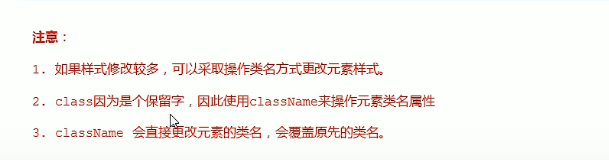

```html
  <div>文本</div>
  <script>
    var test = document.querySelector('div');
    test.onclick = function () {
      //1.使用element.style 获得修改元素样式
      /* this.style.backgroundColor = 'purple';
      this.style.color = '#fff';
      this.style.fontSize = '25px';
      this.style.marginTop = '100px'; */

      //2.使用element.className 获得修改元素样式，让我们当前元素的类名改为了change  相当于重选它的类名样式
      //适合于样式较多或者功能复杂的情况
      //this.className = 'change';
      //3.默认情况下会覆盖原本的.class设置的样式（一开始就显示）,如果想要保留原先的类名，可以这么做,再加上去就行
      this.className = 'first change'
    }
  </script>
```

```html
  <style>
    div {
      width: 200px;
      height: 200px;
      background-color: pink;
    }

    .nav {
      color: red;
    }

    .box {
      width: 300px;
      height: 300px;
      background-color: skyblue;
      margin: 100px auto;
      padding: 10px;
      border: 1px solid #000;
    }
  </style>

  <div class="nav">123</div>

  <script>
    // 1. 获取元素
    const div = document.querySelector('div')
    // 2.添加类名  class 是个关键字 我们用 className
    div.className = 'nav box'
  </script>
```


##### 3）`element.classList`操作类控制CSS


注意：**<span style="color:red">类名不加点，并且是字符串</span>**


```html
  <style>
    .box {
      width: 200px;
      height: 200px;
      color: #333;
    }

    .active {
      color: red;
      background-color: pink;
    }
  </style>

  <div class="box active">文字</div>
  <script>
    // 通过classList添加
    // 1. 获取元素
    const box = document.querySelector('.box')
    // 2. 修改样式
    // 2.1 追加类  add() 类名不加点，并且是字符串
    box.classList.add('active')
    // 2.2 删除类  remove() 类名不加点，并且是字符串
    box.classList.remove('box')
    // 2.3 切换类  toggle()  有还是没有啊，有就删掉，没有就加上
    box.classList.toggle('active')
  </script
```

案例：产生一个随机数，获取数组中某个对象，更换图片、文字内容、底部背景颜色、对应小圆圈高亮

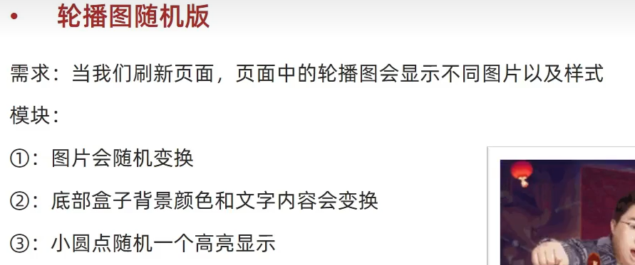


```html
  <div class="slider">
    <!-- 背景图片 -->
    <div class="slider-wrapper">
      
    </div>
    <!-- 底部 -->
    <div class="slider-footer">
      <p>对人类来说会不会太超前了？</p>
      <ul class="slider-indicator">
        <li></li>
        <li></li>
        <li></li>
        <li></li>
        <li></li>
        <li></li>
        <li></li>
        <li></li>
      </ul>
      <div class="toggle">
        <button class="prev">&lt;</button>
        <button class="next">&gt;</button>
      </div>
    </div>
  </div>

  <script>
    // const arr = [1, 3]
    // arr[0]
    // 1. 初始数据（数组里面若干个对象）
    const sliderData = [
      { url: './images/slider01.jpg', title: '对人类来说会不会太超前了？', color: 'rgb(100, 67, 68)' },
      { url: './images/slider02.jpg', title: '开启剑与雪的黑暗传说！', color: 'rgb(43, 35, 26)' },
      { url: './images/slider03.jpg', title: '真正的jo厨出现了！', color: 'rgb(36, 31, 33)' },
      { url: './images/slider04.jpg', title: '李玉刚：让世界通过B站看到东方大国文化', color: 'rgb(139, 98, 66)' },
      { url: './images/slider05.jpg', title: '快来分享你的寒假日常吧~', color: 'rgb(67, 90, 92)' },
      { url: './images/slider06.jpg', title: '哔哩哔哩小年YEAH', color: 'rgb(166, 131, 143)' },
      { url: './images/slider07.jpg', title: '一站式解决你的电脑配置问题！！！', color: 'rgb(53, 29, 25)' },
      { url: './images/slider08.jpg', title: '谁不想和小猫咪贴贴呢！', color: 'rgb(99, 72, 114)' },
    ]

    // 1. 需要一个随机数，作为数组的索引号
    const random = parseInt(Math.random() * sliderData.length)
    // console.log(sliderData[random]) // 对应的数组里面的对象

    // 2. 把对应的数据渲染到标签里面
    // 2.1 获取图片
    const img = document.querySelector('.slider-wrapper img')
    // 2.2. 修改图片路径  =  对象.url
    img.src = sliderData[random].url

    // 3. 把p里面的文字内容更换
    // 3.1 获取p
    const p = document.querySelector('.slider-footer p')
    // 3.2修改p
    p.innerHTML = sliderData[random].title

    // 4. 修改背景颜色
    const footer = document.querySelector('.slider-footer')
    footer.style.backgroundColor = sliderData[random].color

    // 5. 小圆点
    const li = document.querySelector(`.slider-indicator li:nth-child(${random + 1})`)
    // 让当前这个小li 添加 active这个类
    li.classList.add('active')
  </script>
```


#### 3）操作 表单元素属性


```html
  <div>
    <input type="text" value="电脑">
  </div>
  <div>
    复选框<input type="checkbox" name="" id="">
  </div>
  <button>点击</button>
  <script>
    // 1 获取元素
    const uname = document.querySelector('input[type = text]')
    // console.log(uname);
    // 2. 获取值  获取表单里面的值：表单.value
    console.log(uname.value) // 电脑
    console.log(uname.type) // text
    // console.log(uname.innerHTML)  innertHTML 得不到表单的内容
    // 3. 设置表单的值value、类型type等属性
    uname.value = '我要买电脑'
    uname.type = 'password'
    console.log(uname.value) // 我要买电脑
    console.log(uname.type) // password

    // 1. 获取
    const ipt = document.querySelector('input[type = checkbox]')
    // console.log(ipt);
    console.log(ipt.checked) // false，默认不选择  只接受布尔值
    ipt.checked = true // 勾选复选框 checked属性
    // ipt.checked = 'true'  // 会选中，不提倡  有隐式转换为Boolean

    // 1.获取
    const button = document.querySelector('button')
    // console.log(button.disabled)  // 默认false 不禁用
    button.disabled = true // 禁用按钮
  </script>
```


```html
  <button>按扭</button>
  <input type="text" value="输入内容">
  <script>
    //1.获取元素
    var btn = document.querySelector('button');
    var input = document.querySelector('input');
    //2.注册事件，处理程序
    btn.onclick = function () {
      //input.innerHTML = '点击了';//innerHTML只能改变一些普通盒子比如div标签里面内容，不能改变表单里面的值
      //表单里面的值，文字内容是通过 value 来修改的
      input.value = '被点击了';
      //点击后，表单被禁用  disabled 想要这个按扭button被禁用
      this.disabled = true;
      //this指向事件函数的调用者 btn
    }
  </script>
```

**this.指向事件函数的使用者**


#### 4）自定义属性


h5新增**获取自定义属性**的方法 它**只能去掉data-开头**

```js
console.log(div.dataset['index']);
console.log(div.dataset.index); //获取自定义属性data-index
```

**dataset 是一个集合**，里面存放了所有以**data开头**的自定义属性

注意：获取很长的自定义属性：里面**有多个 - 链接的单词**，我们采取**小驼峰命名法**

```js
  //获取data-list-name="andy"      
  console.log(div.dataset.listName);
  console.log(div.dataset['listName']);
```

```html
  <div data-id="1" data-spm="不知道">1</div>
  <div data-id="2">2</div>
  <div data-id="3">3</div>
  <div data-id="4">4</div>
  <div data-id="5">5</div>
  <script>
    // 获取第一个div
    const one = document.querySelector('div')
    // dataset属性
    console.log(one.dataset); //存放该元素的自定义属性，去掉了data-
    // 可以不写data-，其余的：没有-就直接写，多个-用小驼峰命名
    console.log(one.dataset.id) // 1
    console.log(one.dataset.spm) // 不知道
  </script>
```


### 排他思想


```html
    <button>按扭1</button>
    <button>按扭2</button>
    <button>按扭3</button>
    <button>按扭4</button>
    <button>按扭5</button>
    <script>
        //1获取所有按扭元素
        var btns = document.getElementsByTagName('button');
        //2.循环注册事件  得到的btns是一个伪数组，里面的每一个元素btns[i]
        for(var i = 0; i < btns.length; i++){
            btns[i].onclick = function(){
                //(1)先把所有按扭的背景颜色去掉
                for(var j=0; j<btns.length; j++){
                    btns[j].style.backgroundColor='';
                }
                //(2)然后才让当前的元素背景颜色为pink，this指向当前的对象btn
                this.style.backgroundColor = 'pink';
            }
        }
        //排他思想：首先排除其他人样式，然后才设置自己的样式
    </script>
```


### 案例-表格隔行变色效果


```html
<table>
    <theade>
        <tr>
           <th>...</th>
        </tr>
    </theade>
    <tbody>
        <tr>
            <td>..</td>
            ...
        </tr>
        ....
    </tbody>
</table>
<script>
        //1.获取元素  获取的是 tbody里面所有的行tr
        var trs = document.querySelector('tbody').querySelectorAll('tr');
        //2.利用循环注册事件
        for(var i=0; i<trs.length; i++){
            //3.鼠标经过事件 onmouseover
            trs[i].onmouseover = function(){
                //方法2 可以先去掉所有行的背景颜色
                /* for(var j=0; j<trs.length; j++){
                    trs[j].className = '';
                } */
                this.className = 'bg';
            }
            //鼠标离开事件 onmouseout
            trs[i].onmouseout = function(){
                this.className = '';
            }
        }
</script>
```


### 全选和取消全选


```html
  <style>
    /* 选择被勾选的复选框 */
    .ck:checked {
      width: 20px;
      height: 20px;
    }
  </style>

  <input type="checkbox" name="" id="" class="ck">
  <input type="checkbox" name="" id="" class="ck">
  <input type="checkbox" name="" id="" class="ck">
  <input type="checkbox" name="" id="" class="ck">
```


```html
  <style>
    * {
      margin: 0;
      padding: 0;
    }

    table {
      /* 取消相邻的边框线 */
      border-collapse: collapse;
      border-spacing: 0;
      border: 1px solid #c0c0c0;
      width: 500px;
      margin: 100px auto;
      text-align: center;
    }

    th {
      background-color: #09c;
      font: bold 16px "微软雅黑";
      color: #fff;
      height: 24px;
    }

    td {
      border: 1px solid #d0d0d0;
      color: #404060;
      padding: 10px;
    }

    .allCheck {
      width: 80px;
    }
      
    /* 选择被勾选的复选框 */
    /* .ck:checked {...} */
  </style>

  <table>
    <tr>
      <th class="allCheck">
        <input type="checkbox" name="" id="checkAll"> <span class="all">全选</span>
      </th>
      <th>商品</th>
      <th>商家</th>
      <th>价格</th>
    </tr>
    <tr>
      <td>
        <input type="checkbox" name="check" class="ck">
      </td>
      <td>小米手机</td>
      <td>小米</td>
      <td>￥1999</td>
    </tr>
    <tr>
      <td>
        <input type="checkbox" name="check" class="ck">
      </td>
      <td>小米净水器</td>
      <td>小米</td>
      <td>￥4999</td>
    </tr>
    <tr>
      <td>
        <input type="checkbox" name="check" class="ck">
      </td>
      <td>小米电视</td>
      <td>小米</td>
      <td>￥5999</td>
    </tr>
  </table>

  <script>
    // 获取大复选框
    const checkAll = document.querySelector('#checkAll')
    // 获取所有小的复选框
    const cks = document.querySelectorAll('.ck')
    // 1. 为大复选框绑定事件
    checkAll.addEventListener('click', function () {
      for (let i = 0; i < cks.length; i++) {
        // 遍历所有的小复选框 让小复选框的checked  =  大复选框的 checked
        // 效果：点击全选，下面的所有复选框都选中 or 都不选中
        cks[i].checked = this.checked
      }
    })
    // 2. 为所有的小复选框绑定事件  小复选框控制大复选框
    for (let i = 0; i < cks.length; i++) {
      cks[i].addEventListener('click',function() {
        // 判断 选中的小复选框个数 等于 总的小复选框个数
        // 伪类e:checked  选择每个被选中的元素e
        // console.log(document.querySelectorAll('.ck:checked')) // 返回选中的小复选框，伪数组
        checkAll.checked = document.querySelectorAll('.ck:checked').length === cks.length
      })
    }
  </script>
```


## 属性操作（了解）

### 1、获取元素的属性值


### 2、设置属性值


### 3、移除属性


```html
    <div id="demo" index="1" class="nav"></div>

    <script>
        var div = document.querySelector('div');
        //1.获取元素的属性值
        //(1) element.属性 获取标准属性的值（元素本身自带的属性）
        console.log(div.id); //demo
        //console.log(div.index);//不可以
        //(2) element.getAttribute('属性') 主要获取自定义属性的属性值（标准），即我们程序员自己添加的属性的属性值
        console.log(div.getAttribute('id')); //demo
        console.log(div.getAttribute('index')); //1

        //2.设置属性值
        //(1) element.属性 = '值'
        div.id = 'test';
        div.className = 'header'
        console.log(div.id); // test
        //(2) element.setAttribute('属性' , '值'); 主要设置自定义属性
        div.setAttribute('index','2');
        console.log(div.getAttribute('index')); //2
        div.setAttribute('class' , 'footer');

        //3.移除属性 removeAttribute(属性)
        div.removeAttribute('index');
    </script>
```


## 节点操作


### 1、DOM节点

节点概述：网页中**所有内容（标签、属性、文本、注释等）**都是**节点node**


### 2、查找（元素）节点

利用DOM树可以把节点划分为不同的**层级关系**，常见的是**父、子、兄**层级关系


以下都是**元素对象的属性**

#### 1）父节点—`子元素.parentNode`


这里得到的是 **<span style="color:red">父元素节点</span>**，父节点**只有一个**

```html
  <div class="grandfather">
    <div class="father">
      <div class="son">x</div>
    </div>
  </div>
  <script>
    const son = document.querySelector('.son')
    console.log(son)  // 返回dom对象
    console.log(son.parentNode)  // 返回dom对象 父元素节点
    console.log(son.parentNode.parentNode)  // 返回dom对象
  </script>
```


案例：关闭广告

```html
  <style>
    .box {
      width: 1000px;
      height: 200px;
      /* 父相对定位，不脱离文档流，偏移参照自己原先位置 */
      position: relative;
      background-color: pink;
      margin: 100px auto;
      text-align: center;
      font-size: 50px;
      line-height: 200px;
      font-weight: 700;
    }

    .box1 {
      width: 20px;
      height: 20px;
      /* 子绝对，脱离文档流，参照物看祖先元素有无定位，谁有参照谁 */
      position: absolute;
      right: 20px;
      top: 10px;
      background-color: skyblue;
      text-align: center;
      line-height: 20px;
      font-size: 16px;
      cursor: pointer;
    }
  </style>

  <div class="box">
    我是广告
    <div class="box1">X</div>
  </div>
  
  <script>
    // // 1. 获取事件源
    // const box1 = document.querySelector('.box1')
    // //  获取大盒子 （关闭的是大盒子）
    // const box = document.querySelector('.box')
    // // 2. 事件侦听
    // box1.addEventListener('click', function () {
    //   // display: none;
    //   box.style.display = 'none'
    // })

    // 1. 获取事件源
    const box1 = document.querySelector('.box1')
    // 2. 事件侦听
    box1.addEventListener('click', function () {
      // console.log(this.parentNode) // this返回绑定事件的对象,谁调用函数
      this.parentNode.style.display = 'none'
    })
  </script>
```


升级：多个广告，但是结构相同

```html
  <div class="box">
    我是广告1
    <div class="box1">X</div>
  </div>
  <div class="box">
    我是广告2
    <div class="box1">X</div>
  </div>
  <div class="box">
    我是广告3
    <div class="box1">X</div>
  </div>
  
  <script>
    // // 1. 获取事件源
    // const box1 = document.querySelector('.box1')
    // // 2. 事件侦听
    // box1.addEventListener('click', function () {
    //   this.parentNode.style.display = 'none'
    // })

    // 1. 获取三个关闭按钮
    const closeBtn = document.querySelectorAll('.box1')
    for (let i = 0; i < closeBtn.length; i++) {
      closeBtn[i].addEventListener('click', function () {
        // 关闭我的爸爸 所以只关闭当前的父元素
        this.parentNode.style.display = 'none'
      })
    }
  </script>
```


#### 2）子节点—`父元素.children`


获取**所有子元素节点**——**`parentNode.children`**——**返回所有<span style="color:red;">子元素集合HTMLCollection</span>，伪数组**——通过**索引`parentNode.children[i]`**可以**访问每一个子元素节点**。包括下面讲的

```html
  <ul>
    <li>1</li>
    <li>2</li>
    <li>3</li>
    <li>4</li>
    <li>5</li>
  </ul>
  <script>
    const ul = document.querySelector('ul')  // ul
    console.log(ul.childNodes)
    console.log(ul.children)  // 得到伪数组  选择的是 亲儿子 
  </script>
```


查找**第一个子元素和最后一个子元素**


```js
       //1.parentNode.firstNode 第一个 子节点（不等于第一个子元素节点；同理 parentNode.lastNode 最后一个子节点
        console.log(ol.firstChild); //第一个子节点
        console.log(ol.lastChild);//最后一个子节点

        //2.parentNode.firstElementChild-第一个子元素节点；同理parentNod.lastElementChild-最后一个子元素节点
        console.log(ol.firstElementChild);
        console.log(ol.lastElementChild);  

        //3.实际开发中访问 所有子元素节点parentNode.children这个伪数组
        console.log(ol.children[0]);//第一个子元素
        console.log(ol.children[o].children.length-1]);
```


#### 3）兄弟节点—`next/previousElementSibling`

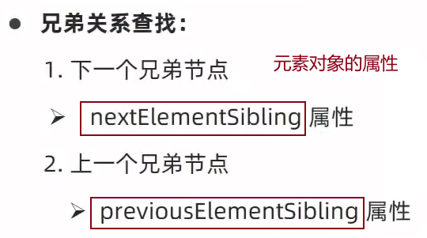

```html
  <ul>
    <li>1</li>
    <li>2</li>
    <li>3</li>
    <li>4</li>
    <li>5</li>
  </ul>
  <script>
    const li2 = document.querySelector('ul li:nth-child(2)')
    console.log(li2.previousElementSibling) // 上一个兄弟
    console.log(li2.nextElementSibling) // 下一个兄弟
  </script>
```


小结：


补充知识：


### 3、创建和添加节点


#### step1-创建节点


#### step2-添加节点


```javascript
        //1.创建节点-元素节点
        const li = document.createElement('li');
        const lili= document.createElement('li');
        //2.添加节点 
        //(1)node.appendChild(child) node父级 child子级，元素节点从后面添加进去  类似于数组的push
        ul.appendChild(li);
        //(2)node.insertBefore(child,指定元素) -元素节点插入到指定元素节点的前面
        ul.insertBefore(lili,ul.children[0]);
```

```html
  <ul>
    <li>我是老大</li>
  </ul>
  
  <script>
    // 1. 创建节点
    const div = document.createElement('div')
    // console.log(div)
    // 2. 追加节点  作为最后一个子元素
    document.body.appendChild(div)

    const ul = document.querySelector('ul')
    // 1. 创建节点
    const li = document.createElement('li')
    li.innerHTML = '我是li' // 为新节点添加内容
    // ul.appendChild(li) // 作为最后一个子元素
    // ul.children // 所有子元素
    // 2. 追加节点
    // insertBefore(插入的元素, 放到哪个元素的前面)
    ul.insertBefore(li, ul.children[0])
  </script>
```


按照数据渲染页面


#### 克隆节点`元素.cloneNode([true])`


```html
  <ul>
    <li>1</li>
    <li>2</li>
    <li>3</li>
  </ul>

  <script>
    const ul = document.querySelector('ul')
    
    // 1. node.cloneNode(); -浅拷贝，括号里面为空或者false，只复制标签不复制里面的内容
    // 2. node.cloneNode(true);-深拷贝，复制标签以及里面的内容，常用
    const lii1 = ul.children[0].cloneNode() // 复制ul第一个子元素节点，赋值给lii1
    ul.appendChild(lii1)
    const lii2 = ul.children[0].cloneNode(true)
    ul.appendChild(lii2)
  </script>
```


### 4、删除节点


+ **`父元素.removeChild(要删除的子元素)`**  删除的子元素通过**`父元素.children[i]`**获取
+ **`node.remove();`**   直接删除node节点。不常用

```html
  <style>
    .box {
      /* 隐藏,但是节点还是存在的 */
      display: none;
    }
  </style>

  <div class="box">123</div>
  <ul>
    <li>没用了</li>
  </ul>
  
  <script>
    const ul = document.querySelector('ul')
    // 删除节点  父元素.removeChlid(子元素)
    ul.removeChild(ul.children[0]) // 从html中删除节点,不存在
  </script>
```


```html
  <ul>
    <li>1</li>
    <li>2</li>
    <li>3</li>
    <li>4</li>
    <li>5</li>
  </ul>
  <button>删除</button>

  <script>
    const ul = document.querySelector('ul')
    const btn = document.querySelector('button')
    // 点击按钮,删除第一个子元素
    btn.addEventListener('click', function () {
      if (ul.children.length == 0) {
        // 没有子元素了,就禁用按钮
        this.disabled = true
      } else {
        //删除ul的第一个子元素节点
        ul.removeChild(ul.children[0])
      }
    })
  </script>
```


### 三种创建节点的区别


## 总结


关于dom操作，主要针对于元素的操作。主要有 **创建、增、删、改、查、属性操作、事件操作**。


## 事件基础

### 1、事件监听


JavaScript使我们有能力创建动态页面，而**事件**是可以被JavaScript侦测到的**行为**。

网页中的**每个元素（对象）**都可以**产生某些可以触发JavaScript的事件**，例如，我们可以在用户点击某按扭时产生一个事件，去执行某些操作。

```html
  <button>点击</button>
  <script>
    // 需求： 点击了按钮，弹出一个对话框
    // 1. 事件源   按钮  
    // 2.事件类型 点击鼠标   click 字符串
    // 3. 事件处理程序 弹出对话框
    const btn = document.querySelector('button')
    btn.addEventListener('click', function () {
      alert('你早呀~')
    })
  </script>
```

```html
   <button id="btn">唐伯虎</button>
    <script>
        //点击按扭，弹出对话框
        const btn = document.getElementById('btn');
        btn.onclick = function(){
            alert('点秋香');
        }
    </script>
```

案例：广告的关闭：点击X元素，即可关闭整个广告。给X元素绑定一个点击事件，函数功能可以隐藏掉整个广告

```html
  <style>
    .box {
      width: 1000px;
      height: 200px;
      /* 父相对定位，不脱离文档流，偏移参照自己原先位置 */
      position: relative;
      background-color: pink;
      margin: 100px auto;
      text-align: center;
      font-size: 50px;
      line-height: 200px;
      font-weight: 700;
    }

    .box1 {
      width: 20px;
      height: 20px;
      /* 子绝对，脱离文档流，参照物看祖先元素有无定位，谁有参照谁 */
      position: absolute;
      right: 20px;
      top: 10px;
      background-color: skyblue;
      text-align: center;
      line-height: 20px;
      font-size: 16px;
      cursor: pointer;
    }
  </style>

  <div class="box">
    我是广告
    <div class="box1">X</div>
  </div>
  
  <script>
    // 1. 获取事件源
    const box1 = document.querySelector('.box1')
    //  获取大盒子 （关闭的是大盒子）
    const box = document.querySelector('.box')
    // 2. 事件侦听
    box1.addEventListener('click', function () {
      // display: none;
      box.style.display = 'none'
    })
  </script>
```


案例：随机点名


```html
  <h2>随机点名</h2>
  <div class="box">
    <span>名字是：</span>
    <div class="qs">这里显示姓名</div>
  </div>
  <div class="btns">
    <button class="start">开始</button>
    <button class="end">结束</button>
  </div>

  <script>
    // 数据数组
    const arr = ['马超', '黄忠', '赵云', '关羽', '张飞']
    // 定时器的全局变量
    let timerId = 0
    // 随机号要全局变量
    let random = 0
    // 获取元素：显示名字
    const qs = document.querySelector('.box .qs')

    // 开始按钮：点击时，开启间隔定时器，随机显示姓名
    const start = document.querySelector('.start')
    start.addEventListener('click', function () {
      timerId = setInterval(function () {
        random = Math.floor(Math.random() * arr.length)
        // 显示随机名字
        qs.innerHTML = arr[random]
      }, 40)

      // 如果数组里面只有一个值了，还需要抽取吗？  不需要  让两个按钮禁用就可以
      if (arr.length === 1) {
        // start.disabled = true
        // end.disabled = true
        start.disabled = end.disabled = true
      }
    })

    // 结束按钮：点击时，暂停间隔定时器，显示随机到的名字
    const end = document.querySelector('.end')
    end.addEventListener('click', function () {
      // 关闭定时器
      clearInterval(timerId)
      // 结束了，可以删除掉当前抽取的那个数组元素
      arr.splice(random, 1)
      console.log(arr)
    })
  </script>
```


注意：

```html
  <button>点击</button>

  <script>
    const num = 10 
    const btn = document.querySelector('button')
    btn.addEventListener('click', function () {
      // 垃圾回收机制，每点击一次，都会销毁num变量
      const num = Math.random()
      console.log(num)
    })
  </script>
```


## 事件高级


### 1、事件监听版本

注册事件有两种方式：**传统方式** 和 **方法监听注册方式**，前者前面学过


+ **`元素对象.on事件 = 回调函数`**

+ **`元素对象.addEventListener（'事件类型', 回调函数, [,useCapture]）` 事件监听方式**

addEventListener( )同一个元素同一个事件可以**注册多个监听器**，**按注册顺序执行**


```html
  <button class="btn1">点击1</button>
  <button class="btn2">点击2</button>
  
  <script>
    const btn1 = document.querySelector('.btn1')
    // 传统方法，事件会被覆盖
    btn1.onclick = function () {
      alert(11)
    }
    btn1.onclick = function () {
      alert(22)
    }
    // 相当于let变量，重复赋值，覆盖前面的值
    // let num = 10
    // num = 20

    const btn2 = document.querySelector('.btn2')
    // 事件按顺序依次执行
    btn2.addEventListener('click', function () {
      alert(11)
    })
    btn2.addEventListener('click', function () {
      alert(22)
    })
  </script>
```


### 2、事件类型


**change事件**：`change`事件通常用于在**用户改变了一个表单元素的值时触发（在表单失去焦点时，判断值是否变化，变化了就触发，否则不触发（区别blur失去焦点事件））**。可以将`change`事件应用于各种表单元素，如`<input>、<select>和<textarea>`等。

```html
  <input type="text">
  <!-- <input type="checkbox" name="" id=""> -->

  <script>
    const input = document.querySelector('input')
    // change 事件 内容发生了变化
    input.addEventListener('change', function () {
      console.log(111)
    })
  </script>
```

**submit事件**：是在表单（form）中的**提交按钮**被点击或者按下回车键时触发的事件。

它常用于在用户提交表单数据之前执行一些操作，或者阻止表单的默认提交行为。

```js
    const form = document.querySelector('form')
    form.addEventListener('submit', function (e) {
      // 判断是否勾选我同意模块 ，如果有 icon-queren2说明就勾选了，否则没勾选
      if (!queren.classList.contains('icon-queren2')) {
        alert('请勾选同意协议')
        // 阻止默认提交行为
        e.preventDefault()
      }
      // 依次判断上面的每个框框 是否通过，只要有一个没有通过的就阻止
      // console.log(verifyName())
      if (!verifyName()) e.preventDefault()
      if (!verifyPhone()) e.preventDefault()
      if (!verifyCode()) e.preventDefault()
      if (!verifyPassword()) e.preventDefault()
      if (!verifyConfirm()) e.preventDefault()
    })
```

**鼠标经过事件：**


note：利用js**自动调用点击事件click()**  一定加小括号调用函数：**`next.click()`** 相当于点击了next元素

鼠标触发：

```html
  <div></div>
  
  <script>
    const div = document.querySelector('div')
    // 鼠标经过
    div.addEventListener('mouseenter', function () {
      console.log(`轻轻的我来了`)
    })
    // 鼠标离开
    div.addEventListener('mouseleave', function () {
      console.log(`轻轻的我走了`)
    })
  </script>
```

表单获得光标：

```html
  <input type="text">
  <script>
    const input = document.querySelector('input')
    input.addEventListener('focus', function () {
      console.log('获得焦点，触发')
    })
    input.addEventListener('blur', function () {
      console.log('失去焦点，触发')
    })
  </script>
```

键盘触发 和 表单输入触发：

```js
  <input type="text">
  <script>
    const input = document.querySelector('input')
    // 1. 键盘事件
    input.addEventListener('keydown', function () {
      console.log('键盘按下了')
    })
    input.addEventListener('keyup', function () {
      console.log('键盘谈起了')
    })
    // 2. 用户输入文本事件  input
    input.addEventListener('input', function () {
      console.log(input.value)
    })
  </script>
```

案例：

小米搜索框案例：


```html
  <style>
    * {
      margin: 0;
      padding: 0;
      /* 怪异盒模型，width包含了内容、padding、border */
      box-sizing: border-box;
    }

    ul {
      list-style: none;
    }

    .mi {
      /* 父相对 */
      position: relative;
      width: 223px;
      margin: 100px auto;
    }

    .mi input {
      width: 223px;
      height: 48px;
      padding: 0 10px;
      font-size: 14px;
      line-height: 48px;
      border: 1px solid #e0e0e0;
      /* 给表单添加，去掉默认的蓝色边框 */
      outline: none;
    }

    .mi .search {
      border: 1px solid #ff6700;
    }

    .result-list {
      /* 默认隐藏，等表单获得焦点时，显示 */
      display: none;
      /* 子绝，控制在有定位的父元素的偏移 */
      position: absolute;
      left: 0;
      top: 48px;
      width: 223px;
      border: 1px solid #ff6700;
      border-top: 0;
      background: #fff;
    }

    .result-list a {
      display: block;
      padding: 6px 15px;
      font-size: 12px;
      color: #424242;
      /* 去掉a链接的默认下划线 */
      text-decoration: none;
    }

    .result-list a:hover {
      background-color: #eee;
    }
  </style>


  <div class="mi">
    <input type="search" placeholder="小米笔记本">
    <ul class="result-list">
      <li><a href="#">全部商品</a></li>
      <li><a href="#">小米11</a></li>
      <li><a href="#">小米10S</a></li>
      <li><a href="#">小米笔记本</a></li>
      <li><a href="#">小米手机</a></li>
      <li><a href="#">黑鲨4</a></li>
      <li><a href="#">空调</a></li>
    </ul>
  </div>
  <script>
    // 1. 获取元素
    const input = document.querySelector('[type=search]')
    const ul = document.querySelector('.result-list')
    // console.log(input)
    // 2. 监听事件 获得焦点
    input.addEventListener('focus', function () {
      // ul显示
      ul.style.display = 'block'
      // 添加一个带有颜色边框的类名
      input.classList.add('search')
    })
    // 3. 监听事件 失去焦点
    input.addEventListener('blur', function () {
      // ul隐藏
      ul.style.display = 'none'
      input.classList.remove('search')
    })
  </script>
```

轮播图点击切换：


```html
  <div class="slider">
    <div class="slider-wrapper">
      
    </div>
    <div class="slider-footer">
      <p>对人类来说会不会太超前了？</p>
      <ul class="slider-indicator">
        <li class="active"></li>
        <li></li>
        <li></li>
        <li></li>
        <li></li>
        <li></li>
        <li></li>
        <li></li>
      </ul>
      <div class="toggle">
        <button class="prev">&lt;</button>
        <button class="next">&gt;</button>
      </div>
    </div>
  </div>
  <script>
    // 1. 初始数据（数组里面若干个对象）
    const sliderData = [
      { url: './images/slider01.jpg', title: '对人类来说会不会太超前了？', color: 'rgb(100, 67, 68)' },
      { url: './images/slider02.jpg', title: '开启剑与雪的黑暗传说！', color: 'rgb(43, 35, 26)' },
      { url: './images/slider03.jpg', title: '真正的jo厨出现了！', color: 'rgb(36, 31, 33)' },
      { url: './images/slider04.jpg', title: '李玉刚：让世界通过B站看到东方大国文化', color: 'rgb(139, 98, 66)' },
      { url: './images/slider05.jpg', title: '快来分享你的寒假日常吧~', color: 'rgb(67, 90, 92)' },
      { url: './images/slider06.jpg', title: '哔哩哔哩小年YEAH', color: 'rgb(166, 131, 143)' },
      { url: './images/slider07.jpg', title: '一站式解决你的电脑配置问题！！！', color: 'rgb(53, 29, 25)' },
      { url: './images/slider08.jpg', title: '谁不想和小猫咪贴贴呢！', color: 'rgb(99, 72, 114)' },
    ]
      
    // 获取元素
    const img = document.querySelector('.slider-wrapper img')
    const p = document.querySelector('.slider-footer p')
    const footer = document.querySelector('.slider-footer')
    // 1. 右按钮业务
    // 1.1 获取右侧按钮 
    const next = document.querySelector('.next')
    let i = 0 // 信号量 控制播放图片张数
    // 1.2 注册点击事件
    next.addEventListener('click', function () {
      // console.log(11)
      i++
      // 1.6判断条件  如果大于8 就复原为 0
      i = i >= data.length ? 0 : i
      // 1.3 得到对应的对象
      // console.log(data[i])
      // 调用函数
      toggle()
    })

    // 2. 左侧按钮业务
    // 2.1 获取左侧按钮 
    const prev = document.querySelector('.prev')
    // 1.2 注册点击事件
    prev.addEventListener('click', function () {
      i--
      // 判断条件  如果小于0  则爬到最后一张图片索引号是 7
      i = i < 0 ? data.length - 1 : i
      // 1.3 得到对应的对象
      // console.log(data[i])
      // 调用函数
      toggle()
    })

    // 声明一个渲染的函数作为复用
    function toggle() {
      // 1.4 渲染对应的数据
      img.src = data[i].url
      p.innerHTML = data[i].title
      footer.style.backgroundColor = data[i].color
      // 1.5 更换小圆点：先移除原来的类名，当前li再添加 active这个类名
      document.querySelector('.slider-indicator .active').classList.remove('active')
      document.querySelector(`.slider-indicator li:nth-child(${i + 1})`).classList.add('active')
    }


    // 3. 自动播放模块
    let timerId = setInterval(function () {
      // 利用js自动调用点击事件click()  一定加小括号调用函数
      next.click() // 相当于点击了next元素
    }, 1000)


    // 4. 鼠标经过大盒子，停止定时器
    const slider = document.querySelector('.slider')
    // 注册事件
    slider.addEventListener('mouseenter', function () {
      // 停止定时器
      clearInterval(timerId)
    })

    // 5. 鼠标离开大盒子，开启定时器
    // 注册事件
    slider.addEventListener('mouseleave', function () {
      // 停止定时器
      if (timerId) clearInterval(timerId)
      // 开启定时器
      timerId = setInterval(function () {
        // 利用js自动调用点击事件  click()  一定加小括号调用函数
        next.click()
      }, 1000)
    })
  </script>
```

评论字数统计：


```html
  <div class="box">
    <input type="text">
    <button>发布</button>
    <div class="box1">
      0/200
    </div>
  </div>

  <script>
    const btn = document.querySelector('button')
    const ipt = document.querySelector('input')
    const box1 = document.querySelector('.box1')
    console.log(box1);
    // 输入框获得焦点，
    ipt.addEventListener('focus',function() {
      ipt.classList.add('input1')
      box1.style.display = 'block'
    })
    // 失去焦点
    ipt.addEventListener('blur',function() {
      ipt.classList.remove('input1')
      box1.style.display = 'none'
    })
    // 表单输入触发
    ipt.addEventListener('input',function() {
      // console.log(ipt.value.length) // 输入的值的长度
      box1.innerHTML = `${ipt.value.length}/200`
    })
  </script>
```


### 3、解绑事件


```html
  <button>点击1</button>
  <button>点击2</button>

  <script>
    const btn = document.querySelectorAll('button')
    btn[0].onclick = function () {
      alert('点击了')
      // L0 事件移除解绑
      btn[0].onclick = null
    }

    function fn() {
      alert('点击了')
      btn[1].removeEventListener('click', fn)
    }
    btn[1].addEventListener('click', fn)
    // L2 事件移除解绑
    // btn.removeEventListener('click', fn)
  </script>
```


### 4、获取事件对象


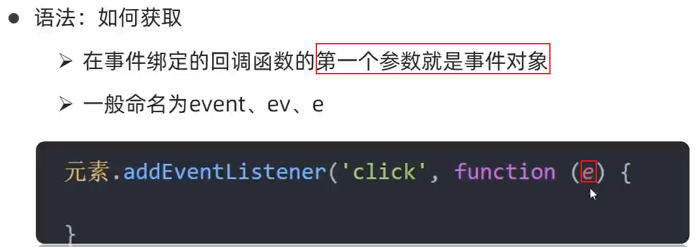

```html
  <button>点击</button>
  <input type="text">

  <script>
    const btn = document.querySelector('button')
    btn.addEventListener('click', function (e) {
      console.log(e)
    })
    const input = document.querySelector('input')
    input.addEventListener('keyup', function (e) {
      // console.log(11)
      console.log(e.key)
      if (e.key === 'Enter') {
        console.log('我按下了回车键')
      }
    })
  </script>
```


### 5、事件对象e的常见属性和方法


#### `target`属性

**`e.target`** ——返回的是**触发事件的对象**。

**`this`**——返回的是**绑定事件的对象（元素）**。

区别 ： **e.target 点击了哪个元素触发的事件，就返回哪个元素** ，**this 哪个元素绑定了这个点击事件，那么就返回谁**。

1、target： 是**触发事件的对象**，通俗一点说： 在屏幕哪点击的就会触发当前点击的对象

2、currentTarget**是绑定事件的对象**，也可将**currentTarget当作this**
（只是在绑定事件中可以将其当作this，因为this代表的意思有好多种）

**`e.target.tagName`** ==**`对象.tagName`**——得到触发事件的**对象的标签名（大写）**

#### `type`属性

type 返回要**触发的事件类型**，但是注意事件类型是不加 on。比如 ： click mouseover …

#### `key`属性

返回用户**按下的键盘健的值**

```html
  <input type="text">
  <script>
    const ipt = document.querySelector('input')
    ipt.addEventListener('keyup',function(e) {
      console.log(e.key);
      if (e.key === 'Enter') {
        console.log('我按下了回车键')
      }
    })
  </script>
```


#### `screenX`与`screenY`

+ screenX 鼠标点击的坐标**距电脑屏幕**水平方向的距离
+ screenY 鼠标点击的坐标**距电脑屏幕**垂直方向的距离


#### `offsetX` 与`offsetY`

+ offsetX 鼠标点击的坐标**相对于当前DOM元素左上角水平**方向元素的距离，不受滚动条影响
+ offsetY 鼠标点击的坐标**相对于当前DOM元素左上角垂直**方向元素的距离， 不受滚动条影响


#### `clientX`与`clientY`

+ clientX 鼠标点击的坐标**相对于浏览器可见窗口水平**方向元素的距离
+ clientY 鼠标点击的坐标**相对于浏览器可见窗口垂直**方向元素的距离


#### 阻止默认行为`e.preventDefault()`

 **`e.preventDefault()`**：比如让链接a不跳转，或者提交按扭submit不提交表单

```html
  <!-- submit 点击提交按钮，会把表单数据发送到对应地方 -->
  <form action="http://www.itcast.cn">
    <input type="submit" value="免费注册">
  </form>
  <!-- a 标签 会实现页面跳转 -->
  <a href="http://www.baidu.com" target="_blank">百度一下</a>

  <script>
    const form = document.querySelector('form')
    form.addEventListener('submit', function (e) {
      // 阻止默认行为  提交
      e.preventDefault()
    })

    const a = document.querySelector('a')
    a.addEventListener('click', function (e) {
      e.preventDefault()
    })
  </script>
```


#### 阻止事件冒泡`e.stopPropagation()`

 **`e.stopPropagation();`** 阻止冒泡  dom 推荐的标准                 stop停止 proragation传播

```js
       son.addEventListener('click',function(e){
            alert('son');//son 就停止了，不向上冒泡了
            e.stopPropagation(); //stop停止 propagation传播
            e.cancelBubble = true; // 非标准 cancel 取消 bubble 泡泡
        },false);
```


案例：评论回车发布


```html
  <div class="box">
    <input type="text">
    <button>发布</button>
    <div class="box1">
      0/200
    </div>
  </div>
  <!--留言模块-->
  <div class="list">
    <div class="item" style="display: none;">
      <i class="avatar"></i>
      <div class="info">
        <p class="name">清风徐来</p>
        <p class="text">大家都辛苦啦，感谢各位大大的努力，能圆满完成真是太好了[笑哭][支持]</p>
        <p class="time">2022-10-10 20:29:21</p>
      </div>
    </div>
  </div>

  <script>
    const btn = document.querySelector('button')
    const ipt = document.querySelector('input')
    const box1 = document.querySelector('.box1')
    const pl = document.querySelector('.item')
    const tx = document.querySelector('.item .text')
    // console.log(box1);
    // 输入框获得焦点，
    ipt.addEventListener('focus', function () {
      ipt.classList.add('input1')
      box1.style.display = 'block'
    })
    // 失去焦点
    ipt.addEventListener('blur', function () {
      ipt.classList.remove('input1')
      box1.style.display = 'none'
    })
    // 表单输入触发
    ipt.addEventListener('input', function () {
      // console.log(ipt.value.length) // 输入的值的长度
      box1.innerHTML = `${ipt.value.length}/200`
    })
    // 发布评论：按下回车发布评论
    ipt.addEventListener('keyup', function (e) {
      if (e.key == 'Enter') {
        if (ipt.value.trim()) { // 如果用户输入的不为空就显示和打印，且trim可以去除输入值的前后空格
          pl.style.display = 'block'
          tx.innerHTML = ipt.value
        }
        // 发布后，把输入框清空
        ipt.value = ''
      }
    })
  </script>
```


### 6、环境对象


```html
  <button>点击</button>
  <script>
    // 每个函数里面都有this 环境对象  普通函数里面this指向的是window
    function fn() {
      console.log(this)
    }
    // fn()
    window.fn()

    const btn = document.querySelector('button')
    btn.addEventListener('click', function () {
      console.log(this) // btn 对象
      // btn.style.color = 'red'
      this.style.color = 'red'
    })
  </script>
```


### 7、回调函数

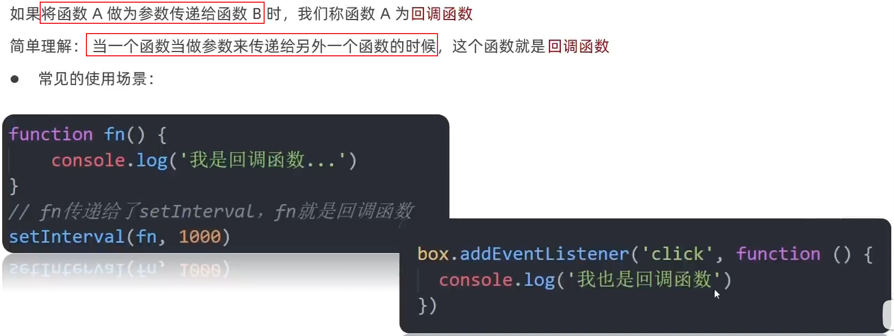


### 8、DOM事件流

#### （1）事件流

**事件在元素节点之间的传播过程**


#### （2）事件捕获 和 事件冒泡


补充：事件监听版本（两种方式）


```html
  <style>
    .father {
      width: 500px;
      height: 500px;
      background-color: pink;
    }

    .son {
      width: 200px;
      height: 200px;
      background-color: purple;
    }
  </style>

  <div class="father">
    <div class="son"></div>
  </div>
```

事件捕获：爷爷(document)---爸爸---儿子

```html
  <script>
    // 山东  济南  蓝翔   目标（pink老师）  捕获阶段
    //  蓝翔  济南   山东   冒泡阶段
    const fa = document.querySelector('.father')
    const son = document.querySelector('.son')
    document.addEventListener('click', function () {
      alert('我是爷爷')
    }, true)
    fa.addEventListener('click', function () {
      alert('我是爸爸')
    }, true)
    son.addEventListener('click', function () {
      alert('我是儿子')
    }, true)
  </script>
```

事件冒泡：儿子---爸爸---爷爷(document)

```html
  <script>
    // 山东  济南  蓝翔   目标（pink老师）  捕获阶段
    //  蓝翔  济南   山东   冒泡阶段
    const fa = document.querySelector('.father')
    const son = document.querySelector('.son')
    document.addEventListener('click', function () {
      alert('我是爷爷')
    })
    fa.addEventListener('click', function () {
      alert('我是爸爸')
    })
    son.addEventListener('click', function () {
      alert('我是儿子')
    })
  </script>
```


#### （3）阻止冒泡`e.stopPropagation()`


如下：阻断儿子事件冒泡：点击儿子，触发click事件，但是不会触发爸爸和爷爷的click同名事件。     Propagation 传播

```html
  <script>
    // 山东  济南  蓝翔   目标（pink老师）  捕获阶段
    //  蓝翔  济南   山东   冒泡阶段
    const fa = document.querySelector('.father')
    const son = document.querySelector('.son')
    document.addEventListener('click', function () {
      alert('我是爷爷')
    })
    fa.addEventListener('click', function () {
      alert('我是爸爸')
    })
    son.addEventListener('click', function (e) {
      alert('我是儿子')
      // 组织流动传播  事件对象.stopPropagation()
      e.stopPropagation()
    })
  </script>
```


#### （4）两种注册事件的区别


### 9、事件委托

原理：即使**子元素不注册点击事件**，但是点击了子元素，**也会产生冒泡事件**，**父级的同名事件（click）也会触发**，利用冒泡来影响每个子元素（减少每个子元素循环注册事件）。


```html
  <ul>
    <li>第个1孩子</li>
    <li>第个2孩子</li>
    <li>第个3孩子</li>
    <li>第个4孩子</li>
    <li>第个5孩子</li>
    <p>我不需要变色</p>
  </ul>

  <script>
    // 点击每个小li 当前li 背景颜色红色
    // 按照事件委托的方式  委托给父级，事件写到父级身上
    const ul = document.querySelector('ul')
    // 事件写到父级
    ul.addEventListener('click', function (e) {
      for (let i = 0; i < ul.children.length; i++) {
        // 排他 
        ul.children[i].style.backgroundColor = ''
      }
      // console.dir(e.target) // 就是我们点击的那个对象
      // console.log(e.target.tagName); // LI 得到点击的那个对象的标签名（大写）
       // 我的需求，我们只有点击li才会有效果
      if (e.target.tagName == 'LI') {
        e.target.style.backgroundColor = 'green'
      }
    })
  </script>
```


### 10、其他事件

目标：掌握新的事件，做更强的交互


结合下面知识点 offset、client、scroll系列

#### 1）页面加载事件`load` `DOMContentLoaded`


**（1）页面所有（或特定）资源**加载完毕：


```html
<body>
  <script>
    // 写在这里，连DOM元素都找不到，代码从上到下执行，所有还没有加载
    const btn = document.querySelector('button')
    btn.addEventListener('click',function() {
      alert('11') // 没用
    })
  </script>
  <button>点击</button>
</body>
```

```html
  <script>
    // 把script标签写在body上方
    // 等待页面所有资源加载完毕，就回去执行回调函数
    window.addEventListener('load', function () {
      // 等页面加载完毕，有了DOM元素
      const btn = document.querySelector('button')
      btn.addEventListener('click', function () {
        alert(11)
      })
    })
    
    // 也可以针对某个资源绑定load事件
    img.addEventListener('load', function () {
      // 等待图片加载完毕，再去执行里面的代码
    })
  </script>
</head>

<body>
  <button>点击</button>
</body>
```

**（2）HTML文档**加载完毕：


```html
<script>
    document.addEventListener('DOMContentLoaded',function() {
      const btn =document.querySelector('button')
      // console.log(btn); // 能拿到DOM元素
      btn.addEventListener('click',function() {
        alert('11')
      })
    })
  </script>
</head>
<body>
  <!-- <script>
    // 写在这里，连DOM元素都找不到，代码从上到下执行，所有还没有加载
    const btn = document.querySelector('button')
    btn.addEventListener('click',function() {
      alert('11')
    })
  </script> -->
  <button>点击</button>
</body>
```


#### 2）元素滚动事件`scroll`


```html
  <style>
    body {
      height: 3000px;
    }
  </style>

<body>
  <script>
    document.documentElement.scrollTop = 800  // 可读写  效果：一开始就被卷去头部800，观察滚动条位置，不是在最上面
    window.addEventListener('scroll', function () {
      // 必须写到里面，一滚动就触发事件，获取最新的被卷去的头部scrollTop的值
      const n = document.documentElement.scrollTop
      // 得到是什么数据   数字型 不带单位
      console.log(n)
    })
  </script>
</body>
```

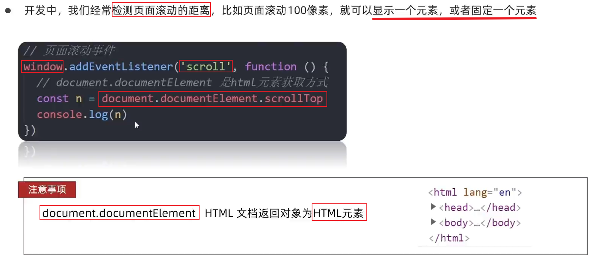

```html
  <style>
    body {
      padding-top: 100px;
      height: 3000px;
    }

    div {
      /* 默认隐藏 */
      display: none;
      margin: 100px;
      /* 规定溢出的内容：滚动条显示，没有溢出也显示滚动条   区别auto（溢出就滚动条显示，没溢出正常显示） */
      overflow: scroll;
      width: 200px;
      height: 200px;
      border: 1px solid #000;
    }
  </style>

<body>
  <div>
    我里面有很多很多的文字
    我里面有很多很多的文字
    我里面有很多很多的文字
    我里面有很多很多的文字
    我里面有很多很多的文字
    我里面有很多很多的文字
    我里面有很多很多的文字
    我里面有很多很多的文字
    我里面有很多很多的文字
    我里面有很多很多的文字
    我里面有很多很多的文字
    我里面有很多很多的文字
    我里面有很多很多的文字
    我里面有很多很多的文字
  </div>
  <script>
    const div = document.querySelector('div')
    // 页面滚动事件
    window.addEventListener('scroll', function () {
      console.log('页面滚动条滚动') // 页面一滚动，就会触发事件
      // 获取html元素：document.documentElement  
      // 页面滚动了多少像素=被卷去了多少头部  scrollTop
      console.log(document.documentElement.scrollTop) // 数字型 页面被卷去的头部
      const n = document.documentElement.scrollTop
      if (n >= 100) {
        div.style.display = 'block'
      } else {
        div.style.display = 'none'
      }
    })

    // div滚动条滚动事件
    div.addEventListener('scroll', function () {
      console.log('div滚动条滚动') // div的滚动条一滚动，就会触发事件
      // scrollTop 被卷去的头部
      console.log(div.scrollTop)
    })
  </script>
</body>
```

当页面滚动了100px（页面被卷去了100px = `document.documentElement.scrollTop` ），div显示


**滚动到指定的坐标`元素.scrollTo(x,y)`**

+ **`scrollTo(x,y)`**：scrollTo 是一个**用于滚动页面的函数**。接受两个参数：**x 和 y**，分别表示页面滚动的水平和垂直距离
+ **`window.scrollTo(0, 0) `**   **页面滚动到左上角(0,0)**的位置，即**页面的顶部**（常用）


##### 案例：电梯导航的显示和隐藏   返回顶部

```html
  <!-- 电梯 -->
  <div class="xtx-elevator">
    <ul class="xtx-elevator-list">
      <li><a href="javascript:;" data-name="new">新鲜好物</a></li>
      <li><a href="javascript:;" data-name="popular">人气推荐</a></li>
      <li><a href="javascript:;" data-name="brand">热门品牌</a></li>
      <li><a href="javascript:;" data-name="topic">最新专题</a></li>
      <li><a href="javascript:;" id="backTop"><i class="sprites"></i>顶部</a></li>
    </ul>
  </div>
```

```js
  // 第一大模块，页面滑动可以显示和隐藏
    (function () {
      // 获取元素
      const elevator = document.querySelector('.xtx-elevator')
      // 1. 当页面滚动大于 300像素，就显示 电梯导航
      // 2. 给页面添加滚动事件
      window.addEventListener('scroll', function () {
        // 被卷去的头部大于 300 
        const n = document.documentElement.scrollTop // 获取页面被卷去的头部
        // if (n >= 300) {
        //   elevator.style.opacity = 1
        // } else {
        //   elevator.style.opacity = 0
        // }
        // 简写
        // elevator.style.opacity = n >= 300 ? 1 : 0  // 写死
        elevator.style.opacity = n >= entry.offsetTop ? 1 : 0 // 某一个元素偏移浏览器顶部的值 效果当滚动到该元素entry时（该元素处于浏览器最顶部）电梯导航显示
      })

      // 点击返回页面顶部
      const backTop = document.querySelector('#backTop')
      backTop.addEventListener('click', function () {
        // 可读写
        // 法一：让页面被卷去的头部设为0，回到最上面
        document.documentElement.scrollTop = 0
        // 法二：用scrollTo(x,y)：scrollTo 是一个用于滚动页面的函数。接受两个参数：x 和 y，分别表示页面滚动的水平和垂直距离。
        // window.scrollTo(x, y)
        window.scrollTo(0, 0) // 页面滚动到左上角(0,0)的位置，即页面的顶部
      })
    })();
```


#### 3）页面尺寸事件`resize`


```html
  <style>
    div {
      /* 行内块元素：默认宽度就是自身内容的宽度 */
      display: inline-block;
      /* width: 200px; */
      height: 200px;
      background-color: pink;
      padding: 10px;
      border: 20px solid red;
    }
  </style>

  <div>123123123123123123123123123123123123123</div>
  <script>
    const div = document.querySelector('div')
    console.log(div.clientWidth) // 返回div元素的宽度：padding + 内容  不含单位，不包括边框
    // resize 浏览器窗口大小发生变化的时候触发的事件
    window.addEventListener('resize', function () {
      console.log('浏览器窗口变化了')
    })
  </script>
```


### 综合案例：Tab栏切换

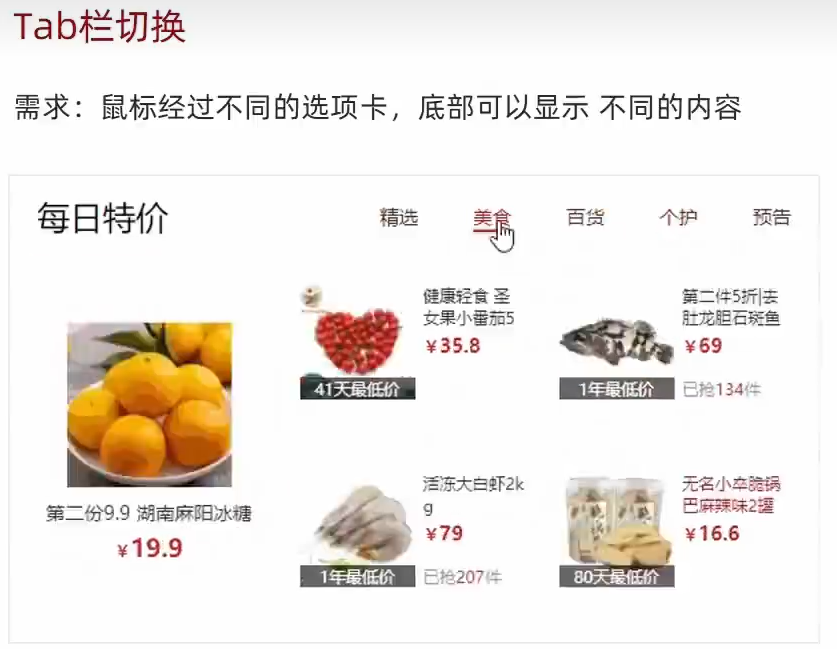

```html
  <style>
    * {
      margin: 0;
      padding: 0;
    }

    .tab {
      width: 590px;
      height: 340px;
      margin: 20px;
      border: 1px solid #e4e4e4;
    }

    .tab-nav {
      width: 100%;
      height: 60px;
      line-height: 60px;
      display: flex;
      justify-content: space-between;
    }

    .tab-nav h3 {
      font-size: 24px;
      font-weight: normal;
      margin-left: 20px;
    }

    .tab-nav ul {
      list-style: none;
      /* 弹性盒模型：控制子元素的布局方式 */
      display: flex;
      /* 子元素在主轴右端对齐 */
      justify-content: flex-end;
    }

    .tab-nav ul li {
      margin: 0 20px;
      font-size: 14px;
    }

    .tab-nav ul li a {
      text-decoration: none;
      border-bottom: 2px solid transparent;
      color: #333;
    }

    .tab-nav ul li a.active {
      border-color: #e1251b;
      color: #e1251b;
    }

    .tab-content {
      padding: 0 16px;
    }

    .tab-content .item {
      display: none;
    }

    .tab-content .item.active {
      display: block;
    }
  </style>

  <div class="tab">
    <div class="tab-nav">
      <h3>每日特价</h3>
      <ul>
        <li><a class="active" href="javascript:;">精选</a></li>
        <li><a href="javascript:;">美食</a></li>
        <li><a href="javascript:;">百货</a></li>
        <li><a href="javascript:;">个护</a></li>
        <li><a href="javascript:;">预告</a></li>
      </ul>
    </div>
    <div class="tab-content">
      <div class="item active"></div>
      <div class="item"></div>
      <div class="item"></div>
      <div class="item"></div>
      <div class="item"></div>
    </div>
  </div>

  <script>
    const as = document.querySelectorAll('.tab-nav a')
    // for循环，给每个对象注册鼠标经过事件
    for (let i = 0; i < as.length; i++) {
      as[i].addEventListener('mouseenter',function() {
        // 排他思想
        // 移除别人的active类
        document.querySelector('.tab-nav .active').classList.remove('active')
        // 让我=当前元素对象添加active类
        this.classList.add('active')
        // 让别人对应的模块都不显示 去除active类
        document.querySelector('.tab-content .active').classList.remove('active')
        // 让我=当前元素对象对应的模块显示 添加active类
        document.querySelector(`.tab-content .item:nth-child(${i + 1})`).classList.add('active')
      })
    }
  </script>
```


### Tab栏切换改造—事件委托


```html
  <style>
    * {
      margin: 0;
      padding: 0;
    }

    .tab {
      width: 590px;
      height: 340px;
      margin: 20px;
      border: 1px solid #e4e4e4;
    }

    .tab-nav {
      width: 100%;
      height: 60px;
      line-height: 60px;
      display: flex;
      justify-content: space-between;
    }

    .tab-nav h3 {
      font-size: 24px;
      font-weight: normal;
      margin-left: 20px;
    }

    .tab-nav ul {
      list-style: none;
      /* 弹性盒模型：控制子元素的布局方式 */
      display: flex;
      /* 子元素在主轴右端对齐 */
      justify-content: flex-end;
    }

    .tab-nav ul li {
      margin: 0 20px;
      font-size: 14px;
    }

    .tab-nav ul li a {
      text-decoration: none;
      border-bottom: 2px solid transparent;
      color: #333;
    }

    .tab-nav ul li a.active {
      border-color: #e1251b;
      color: #e1251b;
    }

    .tab-content {
      padding: 0 16px;
    }

    .tab-content .item {
      /* 模块都不显示 */
      display: none;
    }

    .tab-content .item.active {
      display: block;
    }
  </style>

  <div class="tab">
    <div class="tab-nav">
      <h3>每日特价</h3>
      <ul>
        <li><a class="active" href="javascript:;" data-id="0">精选</a></li>
        <li><a href="javascript:;" data-id="1">美食</a></li>
        <li><a href="javascript:;" data-id="2">百货</a></li>
        <li><a href="javascript:;" data-id="3">个护</a></li>
        <li><a href="javascript:;" data-id="4">预告</a></li>
      </ul>
    </div>
    <div class="tab-content">
      <div class="item active"></div>
      <div class="item"></div>
      <div class="item"></div>
      <div class="item"></div>
      <div class="item"></div>
    </div>
  </div>

  <script>
    // tab栏切换改造——事件委托
    // 1. 获取 ul 父元素 因为 ul只有一个
    const ul = document.querySelector('.tab-nav ul')
    // 获取 5个 item 
    const items = document.querySelectorAll('.tab-content .item')
    // 2. 添加事件 鼠标经过 不能用mouseenter（没用冒泡） 要用mouseover
    ul.addEventListener('mouseover',function(e) {
      // console.log(e.target); // 返回触发事件的对象——点击了哪个元素触发的事件，就返回哪个元素
      // 我们只有点击了 a 才会 进行 添加类和删除类操作 
      // console.log(e.target.tagName)  // e.target.tagName 点击那个对象的 标签名
      if(e.target.tagName == 'A') {
        // 排他思想 ，先移除别人的active  
        document.querySelector('.tab-nav .active').classList.remove('active')
        // 让我=当前元素对象添加active类
        // this 指向ul(指向绑定事件的对象) 不能用this 
        e.target.classList.add('active')
        // 对应的模块
        // console.log(e.target.dataset.id) // 得到自定义属性id的值
        const i = +e.target.dataset.id
        // 让别人对应的模块都不显示 去除active类
        document.querySelector('.tab-content .active').classList.remove('active')
        // 让我=当前元素对象对应的模块显示 添加active类
        // document.querySelector(`.tab-content .item:nth-child(${i + 1})`).classList.add('active')
        items[i].classList.add('active')
      }
    })

  </script>
```


### 常用的鼠标事件


#### 鼠标事件对象PointerEvent


# BOM


## BOM（浏览器对象模型）

BOM——**浏览器对象模型（Browser Object Model）**，它提供了**独立于内容**而**<span style="color:red">与浏览器窗口进行交互的 对象</span>**，其核心对象是**<span style="color:red">`window`</span>**

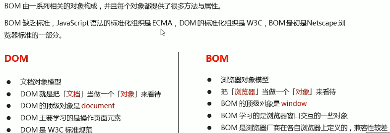


BOM的构成：BOM比DOM更大，它包含DOM


## 定时器方法

### 1、定时器函数介绍

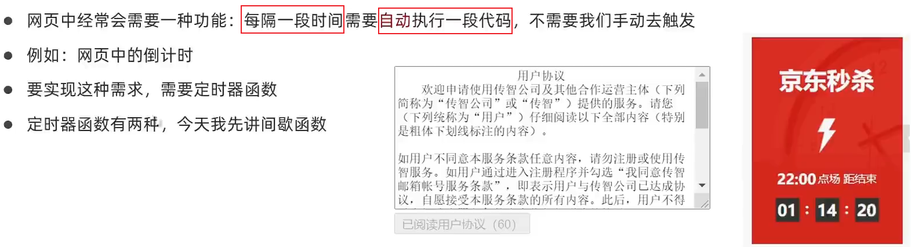


两种定时器：**window对象**给我们提供了2个非常好用的**方法**——定时器

+ **`setTimeout( )`**
+ **`setInterval( )`**


### 2、定时器函数基本使用

#### 1）`setTimeout( )`延时

**（1）用法：**


给定时器赋值，就是**取个名字，返回的是系统给定时器的编号**。

比如：给定时器取名`timer`：**`var timer = setTimeout(调用函数，毫秒)`**；

**（2）回调函数callback：**


**（3）停止定时器`clearTimeout(timeoutID)`**

**`window.clearTimeout(timeoutID)`** ——这里面参数`timeoutID`就是前面讲的**给定时器赋值，取的名字**。


```html
    <button>点击停止定时器</button>

    <script>
        var btn = document.querySelector('button');
        //设置定时器
        var timer1 = setTimeout(function(){
            console.log('爆炸了');
        },5000);
        btn.addEventListener('click',function(){
            // 清除定时器timer1
            clearTimeout(timer1);
        });
    </script>
```

**（4）案例：**


```html
  <style>
    img {
      /* 固定定位，脱离文档流，偏移参照浏览器可视窗口 */
      position: fixed;
      /* 左下角 */
      left: 0;
      bottom: 0;
    }
  </style>

  

  <script>
    // 1.获取元素
    const img = document.querySelector('img')
    setTimeout(function () {
      img.style.display = 'none'
    }, 5000)
  </script>
```


#### 2）`setInterval( )`间隔

interval时间间隔，和setTimeout( )差不多，但是**第二个参数含义不一样**。

二者区别：

setTimeout  **延时时间到了**，就去调用这个回调函数，**只调用一次** 就结束了这个定时器

setInterval  **每隔这个延时时间**，就去调用这个回调函数，会调用很多次，**重复调用这个函数**

**（1）用法：**


```js
//语法规范: window.setInterval(调用函数, 间隔毫秒数);
        setInterval(function(){
            console.log('继续输出');
        },1000);//每个1000ms=1s 重复调用该函数
```

**（2）回调函数**

一样...

**（3）停止定时器`clearInterval(intervalID)`**


```html
    <button class="begin">开启定时器</button>
    <button class="stop">停止计时器</button>
 
    <script>
        var timer = null;//得是全局变量，null是一个空对象
        var begin = document.querySelector('.begin');
        var stop = document.querySelector('.stop');
        
        begin.addEventListener('click',function(){
            timer = setInterval(function(){
                console.log('定时器开始');
            },1000);
        });
        
        stop.addEventListener('click',function(){
            clearInterval(timer);
        });
    </script>
```

```js
  <script>
    // setInterval(函数, 间隔时间)
    // 1. 直接写函数
    setInterval(function () {
      console.log('一秒执行一次')
    }, 1000)

    function fn() {
      console.log('一秒执行一次')
    }
    // setInterval(函数名, 间隔时间) 
    // 2. 直接写函数名，不要加小括号
    let n = setInterval(fn, 1000)
    // 3. 写成：'函数名()'  不推荐
    // let n = setInterval('fn()', 1000)
    
    console.log(n) // 3 定时器返回的是一个id数字，标识每个定时器都是独一无二的

    // 关闭定时器
    clearInterval(n)

    let m = setInterval(function () {
      console.log(11)
    }, 2000)
    console.log(m) // 4
  </script>
```

**（4）案例：**


```html
  <textarea name="" id="" cols="60" rows="10">
        用户注册协议
        欢迎注册成为京东用户！在您注册过程中，您需要完成我们的注册流程并通过点击同意的形式在线签署以下协议，请您务必仔细阅读、充分理解协议中的条款内容后再点击同意（尤其是以粗体或下划线标识的条款，因为这些条款可能会明确您应履行的义务或对您的权利有所限制）。
        【请您注意】如果您不同意以下协议全部或任何条款约定，请您停止注册。您停止注册后将仅可以浏览我们的商品信息但无法享受我们的产品或服务。如您按照注册流程提示填写信息，阅读并点击同意上述协议且完成全部注册流程后，即表示您已充分阅读、理解并接受协议的全部内容，并表明您同意我们可以依据协议内容来处理您的个人信息，并同意我们将您的订单信息共享给为完成此订单所必须的第三方合作方（详情查看
    </textarea>
  <br>
  <button class="btn" disabled>我已经阅读用户协议(5)</button>

  <script>
    // 1. 获取元素
    const btn = document.querySelector('.btn')
    // console.log(btn.innerHTML) // butto按钮特殊，操作按钮内容可以用innerHTML
    // 2. 倒计时
    let i = 5
    // 2.1 开启定时器
    let n = setInterval(function () {
      i--;
      btn.innerHTML = `我已经阅读用户协议(${i})`
      if (i === 0) {
        clearInterval(n) // 关闭定时器
        // 定时器停了，就可以开按钮
        btn.disabled = false
        btn.innerHTML = '同意'
      }
    }, 1000)
  </script>
```


```html
  <div class="slider">
    <!-- 背景图片 -->
    <div class="slider-wrapper">
      
    </div>
    <!-- 底部 -->
    <div class="slider-footer">
      <p>对人类来说会不会太超前了？</p>
      <ul class="slider-indicator">
        <li class="active"></li>
        <li></li>
        <li></li>
        <li></li>
        <li></li>
        <li></li>
        <li></li>
        <li></li>
      </ul>
      <div class="toggle">
        <button class="prev">&lt;</button>
        <button class="next">&gt;</button>
      </div>
    </div>
  </div>
  <script>
    // const arr = [1, 3]
    // arr[0]
    // 1. 初始数据（数组里面若干个对象）
    const sliderData = [
      { url: './images/slider01.jpg', title: '对人类来说会不会太超前了？', color: 'rgb(100, 67, 68)' },
      { url: './images/slider02.jpg', title: '开启剑与雪的黑暗传说！', color: 'rgb(43, 35, 26)' },
      { url: './images/slider03.jpg', title: '真正的jo厨出现了！', color: 'rgb(36, 31, 33)' },
      { url: './images/slider04.jpg', title: '李玉刚：让世界通过B站看到东方大国文化', color: 'rgb(139, 98, 66)' },
      { url: './images/slider05.jpg', title: '快来分享你的寒假日常吧~', color: 'rgb(67, 90, 92)' },
      { url: './images/slider06.jpg', title: '哔哩哔哩小年YEAH', color: 'rgb(166, 131, 143)' },
      { url: './images/slider07.jpg', title: '一站式解决你的电脑配置问题！！！', color: 'rgb(53, 29, 25)' },
      { url: './images/slider08.jpg', title: '谁不想和小猫咪贴贴呢！', color: 'rgb(99, 72, 114)' },
    ]

    // 获取元素
    // 获取图片
    const img = document.querySelector('.slider-wrapper img')
    // 获取p
    const p = document.querySelector('.slider-footer p')
    const footer = document.querySelector('.slider-footer')
    // 1. 需要一个数，作为数组的索引号
    let i = 0;
    // console.log(sliderData[i]);

    // 2. 开启间隔定时器
    let n = setInterval(function () {
      i++;
      if (i >= sliderData.length) {
        i = 0
      }
      // 修改图片
      img.src = sliderData[i].url
      // 修改底部文字内容
      p.innerHTML = sliderData[i].title
      // 修改底部背景颜色
      footer.style.backgroundColor = sliderData[i].color
      // 小圆点
      // 先删除以前的active（默认第一个有）
      document.querySelector('.slider-indicator .active').classList.remove('active')
      // 只让当前li添加active
      document.querySelector(`.slider-indicator li:nth-child(${i + 1})`).classList.add('active')
    }, 1000)

  </script>
```


### 3、this指向问题

this 指向问题 一般情况下this的最终指向的是**那个调用它的对象**

case1: **全局作用域**或者**普通函数**中this指向**全局对象window**（ 注意定时器里面的this指向window）

case2: **函数方法调用**中**谁调用this指向谁**

case3: **构造函数**中this**指向构造函数的实例化对象**


## JS执行队列


### 1、JS是单线程


### 2、同步和异步

​         **为了解决单线程问题**，利用**多核CPU的计算能力**，HTML5提出Web Worker标准，**允许JavaScript脚本创建多个线程**。于是，JS中出现了 **同步** 和 **异步**。


```js
        //第一个问题
        console.log(1);
        setTimeout(function() {
            console.log(2);
        }, 5000);
        console.log(3);
        //1  3  2 因为js允许异步执行，当3在执行的同时，也可以执行别的任务
```

```js
        //第二个问题
        console.log(1);
        setTimeout(function(){
            console.log(2);
        },0);// 延迟为0
        console.log(3);
        //1  3  2 为什么延迟为0 还是先打印3,再打印2？
```

JS把所有**任务分为两大类**：


### 3、JS执行机制


```html
  <script>
    console.log(1)
    console.log(2)
    setTimeout(function () {
      console.log(3)
    }, 0)
    console.log(4);
    // 顺序：1  2  4  3
  </script>
```

```js
    // 多个异步任务
    console.log(1);
    // 函数放入 异步进程处理，异步任务完毕=点击触发，才会放入任务队列
    document.onclick = function () {
      console.log('click');
    }
    console.log(2);
    // 先放入异步进程处理，异步任务完毕=3秒后，放入任务队列中
    setTimeout(function () {
      console.log(3)
    }, 3000)

    // 顺序：1  2  3和click不确定，看click是在三秒前点击，还是三秒后。
```

**异步进程处理**：存放**异步任务**，等**事件被触发（异步任务完毕），才把回调函数放入 任务队列**中。

**事件循环（event loop）**（重要概念）：可以重复触发事件，又按上述执行一次。


总结：


## location对象


```js
    console.log(window.location) // location——对象
    console.log(location) // 可以省略window
```


补充知识

**URL**：**统一资源定位符(Uniform Resource Locator, URL)**  是互联网上标准资源的地址。互联网上的**<span style="color:red">每个文件都有一个唯一的URL</span>**，它包含的信息**指出文件的位置以及浏览器应该怎么处理它**。


### 1、location对象的属性


**重点记住：href 和 search**

#### `href`


```html
  <script>
    // 得到当前文件URL地址
    console.log(location.href) 
    // 1. href 经常用href 利用js的方法去跳转页面
    location.href = 'http://www.baidu.com'
  </script>
```


#### `search`


```html
  <form action="">
    <input type="text" name="username">
    <input type="password" name="pwd">
    <button>提交</button>
  </form>
```


#### `hash`


```html
  <a href="#/my">我的</a>
  <a href="#/friend">关注</a>
  <a href="#/download">下载</a>
```


案例：


```html
  <a href="http://www.itcast.cn">支付成功<span>5</span>秒钟之后跳转到首页</a>
  <script>
    // 1. 获取元素
    const a = document.querySelector('a')
    // 2.开启定时器
    // 3. 声明倒计时变量
    let num = 5
    let timerId = setInterval(function () {
      num--
      a.innerHTML = `支付成功<span>${num}</span>秒钟之后跳转到首页`
      if (num === 0) { // 5秒后，不点击链接，就自动跳转，且停止定时器
        clearInterval(timerId)
        // 4. 跳转  修改location.href
        location.href = 'http://www.itcast.cn'
      }
    }, 1000)
  </script>
```

**获取URL参数**


login.html

```html
<div class="login">
    <h2>登录</h2>
    <!-- action指向处理表单数据的url地址 -->
    <form action="index.html">
      <div class="box1">
        用户名：<input type="text" name="username">
      </div>
      <div class="box2">
        密&ensp;&ensp;码：<input type="password" name="psw">
      </div>
      <input type="submit" value="登录">
      <input type="reset" value="清空">
    </form>
  </div>
```

index.html

```html
  <div></div>
  
  <script>
    const div = document.querySelector('div')
    
    console.log(location.search) // 获取URL参数 ?username=zyk&psw=123
    // 1.先去掉？ substr(起始的位置[，截取几个字符])  后面一个不写，默认截取到最后
    let params = location.search.substr(1)
    // console.log(params) // username=zyk&psw=123
    // 2. 利用=把字符串分割为数组 split('=')
    let arr = params.split('=')
    console.log(arr) // ['username', 'zyk&psw', '123']
    let arr1 = arr[1].split('&')
    console.log(arr1) // ['zyk', 'psw']
    div.innerHTML = `${arr1[0]}，欢迎您`
  </script>
```


### 2、location对象的方法

常见方法：


```html
  <button class="reload">刷新</button>
  <button class="assign">assign</button>
  <button class="replace">replace</button>

  <script>
    const reload = document.querySelector('.reload')
    const assign = document.querySelector('.assign')
    const replace = document.querySelector('.replace')

    reload.addEventListener('click', function () {
      //重新加载页面方法
      // location.reload() // 相当于f5
      location.reload(true) // 强制刷新，相当于ctrl+f5
    })

    assign.addEventListener('click', function () {
      // 记录浏览历史，所以可以实现后退功能
      location.assign('https://www.baidu.com') //和location.href属性一样，可以跳转页面，有区别
    })

    replace.addEventListener('click', function () {
      // 不记录浏览历史，所以不可以实现后退功能
      location.replace('http://www.itcast.cn')
    })
  </script>
```


## navigator对象


navigator对象**包含有关浏览器的信息**，它**有很多属性**，我们最常用的是 **`userAgent`**，该属性可以**返回由客户机发送服务器的user-agent头部的值**。


下面前端代码可以判断用户那个终端打开页面，实现跳转：

```html
  <script>
    // 检测 userAgent（浏览器信息）
    !(function () {
      const userAgent = navigator.userAgent
      // 验证是否为Android或iPhone
      const android = userAgent.match(/(Android);?[\s\/]+([\d.]+)?/)
      const iphone = userAgent.match(/(iPhone\sOS)\s([\d_]+)/)
      // 如果是Android或iPhone（移动端打开），则跳转至移动站点
      if (android || iphone) {
        location.href = 'http://m.itcast.cn' // 地址可以改成自己公司的移动端
      }
    })();
    // !(function () { })();
    // !function () { }() // 这样写也可以，在前面加一个! + ~ 都可以，也是立即执行函数
  </script>

<body>
  这是pc端的页面
</body>
```

当打开pc端时：


当打开移动端时：自动跳转到移动站点


## history对象

window对象给我们提供了一个history对象，**与浏览器历史记录进行交互**。该对象**包含用户（在浏览器窗口中）访问过的URL**。


```html
  <button>后退</button>
  <button>前进</button>
  
  <script>
    const back = document.querySelector('button:first-child')
    const forward = back.nextElementSibling // back的下一个兄弟节点
    back.addEventListener('click', function () {
      // 后退一步
      // history.back()
      history.go(-1)
    })
    forward.addEventListener('click', function () {
      // 前进一步
      // history.forward()
      history.go(1)
    })
  </script>
```


## 本地存储

**本地存储介绍**


在浏览器，**检查—>Application** 里面可以看到 Loca Storage 和 Session Storage 以及Cookie


### 1）`sessionStorage`会话存储


```js
        set.addEventListener('click',function(){
            //当点击了该按钮，就可以把表单里面的值存储起来
            var val = ipt.value; //获取输入的内容
            sessionStorage.setItem('uname',val);// key value
            sessionStorage.setItem('pwd',val);
        });
        get.addEventListener('click',function(){
            //当点击了该按钮，就可以把对应存储的数据获取过来
            console.log(sessionStorage.getItem('uname'));
        });
        remove.addEventListener('click',function(){
            //当点击了该按钮，就可以把对应存储的值删除
            sessionStorage.removeItem('uname'); 
        });
        del.addEventListener('click',function(){
            //当点击了该按钮，就可以把所有存储的数据删除
            sessionStorage.clear();
        })
```


### 2）`localStorage`本地存储


注意：

+ 这里的共享—不能跨域
+ 本地存储只能存储 **<span style="color:red">字符串</span>**类型
+ 键值对：键要用**`''`引号**


```html
  <script>
    // 1. 要存储一个名字  'uname'， 'pink老师'
    // localStorage.setItem('键'，'值')
    localStorage.setItem('uname', 'pink老师')
    // 2. 获取方式  都加引号
    console.log(localStorage.getItem('uname'))
    // 3. 删除本地存储  只删除名字
    // localStorage.removeItem('uname')
    // 4. 改  如果原来有这个键，则是改，如果没有这个键是增
    // localStorage.setItem('uname', 'red老师')

    // 我要存一个年龄
    // 2. 本地存储只能存储 字符串类型
    localStorage.setItem('age', 18)
    console.log(localStorage.getItem('age'))
  </script>
```

检查中删除本地存储：


**案例：记住用户名**

要求：如果勾选 记住用户名，下次用户打开浏览器，就在文本框里面自动显示上次登录的用户名。


```html
  <input type="text" id="username">
  <input type="checkbox" name="a" id="remember">记住用户名
  <script>
    const username = document.querySelector('#username');
    const remember = document.querySelector('#remember');
    //打开页面，如果本地存有数据username，就显示在输入框中，且复选框选中
    if (localStorage.getItem('username')) {
      username.value = localStorage.getItem('username');
      remember.checked = true;
    }
    //复选框 改变change时间
    remember.addEventListener('change', function () {
      if (this.checked) { //被选中，则把数据存储起来
        localStorage.setItem('username', username.value);
      } else { //没被选中，就删除数据
        localStorage.removeItem('username');
      }
    })
  </script>
```


### 存储复杂数据类型

**（1）存储**复杂数据类型


**（2）取出并转换**

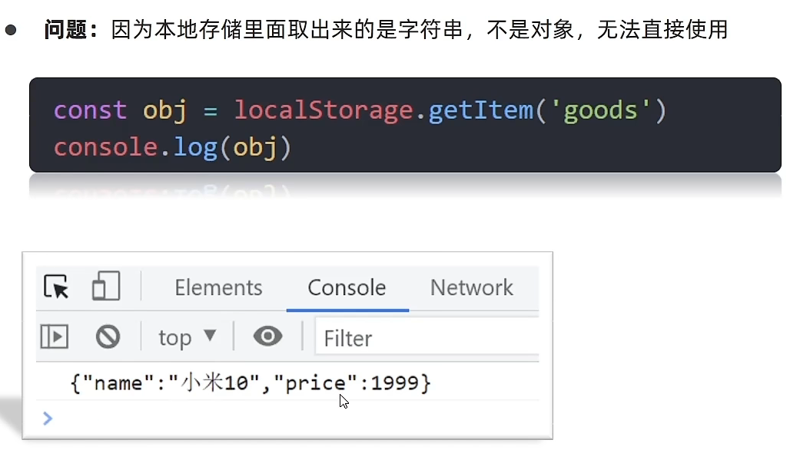


```html
  <script>
    const obj = {
      uname: 'pink老师',
      age: 18,
      gender: '女'
    }
    // 存储 复杂数据类型  无法直接使用
    // localStorage.setItem('obj', obj)  [object object]    
    // 取
    // console.log(localStorage.getItem('obj'))

    // 1.复杂数据类型存储必须转换为 JSON字符串存储
    localStorage.setItem('obj', JSON.stringify(obj))
    // JSON对象：属性和值有引号，而是引号统一是双引号
    // {"uname":"pink老师","age":18,"gender":"女"}
    // 取
    // console.log(typeof localStorage.getItem('obj')) // string
    // 2. 把JSON字符串转换为 对象
    const str = localStorage.getItem('obj') // {"uname":"pink老师","age":18,"gender":"女"}
    console.log(JSON.parse(str)) // {uname: 'pink老师', age: 18, gender: '女'}
  </script>
```


# PC端网页特效


## （1）元素偏移量offset系列

### offset概述

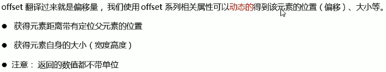


### offset系列的属性

动态获取到该元素**带有定位的父级元素、偏移量、自身宽高度（border+padding+width）**


```js
        //offset系列
        // 1.可以得到元素的偏移 位置 返回的不带单位的数值  
        console.log(father.offsetTop); 
        console.log(father.offsetLeft);
        //父亲没有定位，就以body为准
        console.log(son.offsetTop); 
        console.log(son.offsetLeft);
        // 2.可以得到元素的大小 宽度和高度 是包含padding*2 + border*2 + width
        console.log(w.offsetWidth);
        console.log(w.offsetHeight);
        // 3. 返回带有定位的父亲 否则返回的是body
        console.log(son.offsetParent); // 返回带有定位的父亲 否则返回的是body
        console.log(son.parentNode); // 返回父亲 是最近一级的父亲 亲爸爸 不管父亲有没有定位
```

```html
<style>
    div {
      /* 带有相对定位，不脱离文档 */
      position: relative;
      width: 200px;
      height: 200px;
      background-color: pink;
      margin: 100px;
    }

    p {
      width: 100px;
      height: 100px;
      background-color: purple;
      margin: 50px;
    }
  </style>

  <div>
    <p></p>
  </div>
  
  <script>
    const div = document.querySelector('div')
    const p = document.querySelector('p')
    console.log(div.offsetLeft) // 100 相对于body（无父元素或者没用祖先元素有定位）的左边框的偏移
    // 检测盒子的位置  最近一级带有定位的祖先元素，离其左边框的偏移
    console.log(p.offsetLeft) // 50
  </script>
```


### `元素对象.getBoundingClientRect`


返回的元素对象的偏移（top、bottom、left、right）是相对于浏览器的**可视窗口**

```
  <style>
    * {
      margin: 0;
      padding: 0;
    }
    body {
      height: 2000px;
    }

    div {
      width: 200px;
      height: 200px;
      background-color: pink;
      margin: 100px;
    }
  </style>

  <div></div>
  <script>
    const div = document.querySelector('div')
    console.log(div.getBoundingClientRect())
  </script>
```


### offset 与 style 区别


```html
<style>
    .box {
      width: 200px;
      height: 200px;
      background-color: pink;
      padding: 10px;
    }
  </style>

<body>
  <div class="box" style="width: 200px"></div>
  <script>
    var box = document.querySelector('.box');
    console.log(box.offsetWidth); //220
    console.log(box.offsetHeight); //220
    console.log(box.style.width); // 返回字符串，200px，不包含padding、border
    //box.offsetWidth = '300';offset属性是只读的
    box.style.width = '300px';
    console.log(box.offsetWidth); //320
    console.log(box.offsetHeight); //220
    console.log(box.style.width); //300px
  </script>
</body>
```


## （2）元素可视区client系列

### client概述


### client系列属性

动态获取到**该元素的 边框大小、元素大小(padding+width)等**。


## （3）元素滚动scroll系列

### scroll概述


### scroll系列的属性

动态的得到**该元素的 实际的大小(padding+width，内容超出也计入)、滚动卷去的距离等**。


<span style="color:red;">页面被卷去的头部</span>：写法如下：**`document.documentElement.scrollTop`**（常用）


**滚动事件`scroll`**：**滚动条滚动触发**的事件

```js
      // scroll滚动事件当我们滚动条发生变化会触发的事件
        div.addEventListener('scroll',function(){
            console.log(div.scrollTop);
        })
```


案例：

#### 案例：获取鼠标在盒子内的坐标

要求：我们在盒子内点击， 想要得到**鼠标距离盒子上面和左边的距离**。

案例分析：


```html
    <div class="box"></div>
    <script>
        var box = document.querySelector('.box');
        // 我们在盒子内点击， 想要得到鼠标距离盒子左右的距离。
        // 首先得到鼠标在页面中的坐标（ e.pageX, e.pageY）
        // 其次得到盒子在页面中的距离(box.offsetLeft, box.offsetTop)
        // 用鼠标距离页面的坐标减去盒子在页面中的距离， 得到 鼠标在盒子内的坐标
        box.addEventListener('mousemove',function(e){
            //e鼠标事件对象
            var x = e.clientX - box.offsetLeft;
            var y = e.clientY - box.offsetTop;
            this.innerHTML = 'x坐标是' + x + ' y坐标是' + y;
        })
    </script>
```


#### 案例：模态框拖拽

案例分析：


#### 案例：仿京东放大镜效果


#### 案例：仿京东固定导航栏

```html
  <style>
    * {
      margin: 0;
      padding: 0;
      /* border和padding划归到width和height范围内，可以理解为是IE的怪异盒模型 */
      box-sizing: border-box;
    }

    .content {
      overflow: hidden;
      width: 1000px;
      height: 3000px;
      background-color: pink;
      margin: 0 auto;
    }

    .backtop {
      display: none;
      width: 50px;
      left: 50%;
      margin: 0 0 0 505px;
      position: fixed;
      bottom: 60px;
      z-index: 100;
    }

    .backtop a {
      height: 50px;
      width: 50px;
      background: url(./images/bg2.png) 0 -600px no-repeat;
      opacity: 0.35;
      overflow: hidden;
      display: block;
      text-indent: -999em;
      cursor: pointer;
    }

    .header {
      /* fixed： 固定定位，脱离文档流。参照浏览器可视窗口（当前窗口）。 */
      position: fixed;
      /* 相对于浏览器可视窗口，偏移-80px = 自身的高度 隐藏了 */
      top: -80px;
      left: 0;
      width: 100%;
      height: 80px;
      background-color: purple;
      text-align: center;
      color: #fff;
      line-height: 80px;
      font-size: 30px;
      /* 过渡效果：指定一些属性发生变化时的切换方式 */
      transition: all .3s;
    }

    .sk {
      width: 300px;
      height: 300px;
      background-color: skyblue;
      margin-top: 500px;
    }
  </style>

  <div class="header">我是顶部导航栏</div>
  <div class="content">
    <div class="sk">秒杀模块</div>
  </div>
  <div class="backtop">
    
    <a href="javascript:;"></a>
  </div>

  <script>
    // 目标：当秒杀模块滚动到浏览器最上面时，显示顶部导航栏（初始时top=-80px）
    // 当页面滚动到 秒杀模块的时候，就改变 头部的 top值
    // 页面被卷去的头部 >=  秒杀模块偏移浏览器顶部的值 offsetTop
    const sk = document.querySelector('.sk')
    const header = document.querySelector('.header')
    // 1. 页面注册滚动事件scroll
    window.addEventListener('scroll',function() {
      // 页面被卷去的头部距离 document.documentElement.scrollTop
      // console.log(document.documentElement.scrollTop);
      const n = document.documentElement.scrollTop
      header.style.top = n >= sk.offsetTop ? 0 : '-80px'
    })
  </script>
```


## !!!三大系列总结


## 动画函数封装

### 动画实现原理

核心原理：通过**定时器setInterval(回调函数 , [间隔毫秒])不断移动盒子位置**


**偏移位置**：区域的偏移 **top left right bottom**，只有当有参照物（**设置了定位** ）时，这些**才有用**，否则用margin、padding控制偏移

```js
       var timer = setInterval(function(){
            if(div.offsetLeft >= 400){
                clearInterval(timer);
            }else{
                div.style.left = div.offsetLeft + 1 + 'px';
            }
        },20);
```


### 动画函数简单封装

上面给某个元素实现动画，页面很多元素都需要实现，怎么办？将动画封装成一个函数，供元素调用。


**动画对象**也就是**使用动画的元素对象。**

```js
    <script>
        //简单函数封装:2个参数 obj目标元素对象 和 target目标位置
        function animate(obj,target){
            var timer = setInterval(function(){
                if(obj.offsetLeft == target){
                    clearInterval(timer);
                }else{
                    obj.style.left = obj.offsetLeft + 1 + 'px';
                }
            },20);
        }
        
        var div = document.querySelector('div');
        var span = document.querySelector('span');
        //调用函数
        animate(div,300);
        animate(span,400);
    </script>
```


### 动画函数给不同元素记录不同定时器

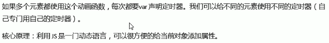

```js
        // var obj = {};
        // obj.name = 'andy';
        //简单函数封装:2个参数 obj目标元素对象 和 target目标位置
        // 给不同的元素指定了不同的定时器
        function animate(obj,target){
            //2.当我们不断地点击按扭，这个元素的速度会越来越快，因为开启了太多的定时器
            //解决方案：让我们的元素只有一个定时器执行--先清除以前的定时器，只保留当前的一个定时器执行
            clearInterval(obj.timer);
            obj.timer = setInterval(function(){//1.给目标元素对象obj添加属性 obj.属性名=属性值，这样定时器就成了该元素的单独属性
                if(obj.offsetLeft == target){
                    clearInterval(obj.timer);
                }else{
                    obj.style.left = obj.offsetLeft + 1 + 'px';
                }
            },20);
        }
```


### 缓动动画

#### 缓动效果原理


```js
function animate(obj,target){
            // 先清除以前的定时器，只保留当前的一个定时器执行
            clearInterval(obj.timer)
            obj.timer = setInterval(function(){
                //步长值写到定时器里面，每次都会变化
                var step = (target - obj.offsetLeft) / 10;
                if(obj.offsetLeft == target){
                    clearInterval(obj.timer);
                }else{
               // 把每次加1 这个步长值改为一个慢慢变小的值  步长公式：(目标值 - 现在的位置) / 10
                    obj.style.left = obj.offsetLeft + step + 'px';
                }
            },15);
        }
```

上面可以把步长值改为整数，不要出现小数问题,且**步长值大于0（往大了取）和小于0（往小了取）**:

***var* step = (*target* - *obj*.offsetLeft) / 10;** 

**step = step>0 ? Math.ceil(step) : Math.floor(step);**

**匀速动画** 就是 盒子是当前的位置 +  **固定的值** 1 

**缓动动画**就是  盒子当前的位置 + **变化的值**(目标值 - 现在的位置) / 10）


#### 缓动动画多个目标值之间移动

调用多次。

```js
        btn500.addEventListener('click',function(){
            animate(span,500);
        })
        btn800.addEventListener('click',function(){
            animate(span,800);
        })
```

**最终完善的动画函数：**

```js
function animate(obj,target){
            // 先清除以前的定时器，只保留当前的一个定时器执行
            clearInterval(obj.timer)
            obj.timer = setInterval(function(){
                //步长值写到定时器里面，每次都会变化
                //把步长值改为整数，不要出现小数问题，步长值大于0（往大了取）和小于0（往小了取）
                var step = (target - obj.offsetLeft) / 10;
                step = step>0 ? Math.ceil(step) : Math.floor(step);
                if(obj.offsetLeft == target){
                    clearInterval(obj.timer);
                }else{
                    // 把每次加1 这个步长值改为一个慢慢变小的值  步长公式：(目标值 - 现在的位置) / 10
                    obj.style.left = obj.offsetLeft + step + 'px';
                }
            },15);
        }
```


#### 缓动动画添加回调函数


将一个匿名**函数**作为**实参**传递给另一个函数。

**回调函数写的位置：定时器结束的位置**

```js
function animate(obj,target,callback){
            //console.log(callback); //callback = function(){}
            // 先清除以前的定时器，只保留当前的一个定时器执行
            clearInterval(obj.timer)
            obj.timer = setInterval(function(){
                var step = (target - obj.offsetLeft) / 10;
                step = step>0 ? Math.ceil(step) : Math.floor(step);
                if(obj.offsetLeft == target){
                    clearInterval(obj.timer);
                    //回调函数写到定时器结束里面，动画结束才执行
                    /*if(callback){//如果有匿名函数作为实参传递过来
                        //调用函数作为实参传过来的函数
                        callback();
                    }*/ 等于以下写法：
                    callback && callback();
                }else{
                    obj.style.left = obj.offsetLeft + step + 'px';
                }
            },15);
        }

btn800.addEventListener('click',function(){
            animate(span,800,function(){
                //alert('你好吗');等动画函数执行完才执行
                span.style.backgroundColor = 'red';
            });
        })

```


#### 动画函数的使用

**动画函数封装到单独JS文件里面**

​       因为以后经常使用这个动画函数，可以**单独封装到一个JS文件里面**，使用的时候**引用**这个JS文件即可。

```
animate(obj, target, [function(){...}]);
```

作用：**obj元素对象实现动画效果，缓动移动到目标位置target，执行完动画效果后，执行function(){}回调函数。**


## 常见网页特效案例

### 案例：网页轮播图

**轮播图结构：**

```html
           <div class="focus fl">
                <!-- 左侧按钮 -->
                <a href="javascript:;" class="arrow-l">
                    &lt;
                </a>
                <!-- 右侧按钮 -->
                <a href="javascript:;" class="arrow-r">  </a>
                <!-- 核心的滚动区域 -->
                <ul>
                    <li>
                        <a href="#"></a>
                    </li>
                    ......很多li
                </ul>
                <!-- 小圆圈 -->
                <ol class="circle">
                    动态生成小圈圈个数=图片个数=ul下的li
                </ol>
            </div>
```

轮播图也成为焦点图，是网页中比较常见的网页特效


功能1：


功能2：动态生成小圆圈


功能3：点击小圆圈，有颜色变化


功能4：点击小圆圈，移动图片 当然移动的是 ul 


```js
    // 3. 动态生成小圆圈  有几张图片，就生成几个小圆圈
    var ul = focus.querySelector('ul');
    var ol = focus.querySelector('.circle');
    for(var i =0; i < ul.children.length; i++){
        // 创建一个小li 
        var li = document.createElement('li');
        // 记录当前小圆圈的索引号 通过自定义属性来做
        li.setAttribute('index', i);
        // 把小li插入到ol 里面
        ol.appendChild(li);
        // 4. 小圆圈的排他思想 我们可以直接在生成小圆圈的同时直接绑定点击事件
        li.addEventListener('click',function(){
            // 干掉所有人 把所有的小li 清除 current 类名
            for (var i = 0; i < ol.children.length; i++) {
                ol.children[i].className = '';
            }
            // 留下我自己  当前的小li 设置current 类名
            this.className = 'current';
            // 5. 点击小圆圈，移动图片 当然移动的是 ul 
            //animate(obj,target,callback);
            // ul 的移动距离 小圆圈的索引号 乘以 图片的宽度 注意是负值
            // 当我们点击了某个小li 就拿到当前小li 的索引号
            var focusWidth = focus.offsetWidth; //最终改成全局变量
            var index = this.getAttribute('index');
            console.log(focusWidth);
            console.log(index);
            animate(ul, -index * focusWidth);
        })
    }
        
    // 把ol里面的第一个小li设置类名为 current
    ol.children[0].className = 'current';
```

功能6：


功能5：


功能7：

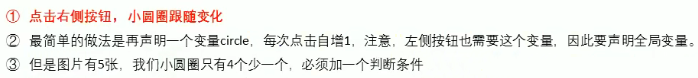

bug：

功能8：左侧按扭

功能9：自动播放


```js
// 10. 自动播放轮播图
    var timer = setInterval(function() {
        //手动调用点击事件
        arrow_r.click();
    }, 2000);

```


### 节流阀

防止轮播图按扭**连续点击造成播放过快**


### 案例：返回顶部

前面写了仿淘宝固定栏，这次实现点击返回顶部模块，就让窗口滚动到页面的最上方。


### 案例：筋斗云案例

要求：


案例分析：


```js
            // 2. 给所有的小li绑定事件 
            // 这个current 做为筋斗云的起始位置
            var current = 0;
            for(var i=0; i<lis.length; i++){
                // (1) 鼠标经过把当前小li 的位置做为目标值
                lis[i].addEventListener('mouseenter',function(){
                    animate(cloud,this.offsetLeft);
                });
                // (2) 鼠标离开就回到 起始的位置--目标值改为current 
                lis[i].addEventListener('mouseleave',function(){
                    animate(cloud,current);
                });
                // (3) 当我们鼠标点击，就把当前位置做为目标值-起始值
                lis[i].addEventListener('click',function(){
                    current = this.offsetLeft;
                })
            }
```


# 移动端网页特效


## 触屏事件

移动端是**没有鼠标的**。


### 触屏事件touch


```html
  <style>
    div {
      width: 300px;
      height: 300px;
      background-color: pink;
    }
  </style>

  <div></div>

  <script>
    //1.获取元素
    const div = document.querySelector('div');
    
    //2.触屏事件的三个事件：
    //(1)手指在DOM元素上 触摸 事件
    div.addEventListener('touchstart', function () {
      console.log('我触摸到你了');
    });
    //(2)手指在DOM元素上 移动 事件
    div.addEventListener('touchmove', function () {
      console.log('我滑动你了');
    });
    //(3)手指在DOM元素上 移开 事件
    div.addEventListener('touchend', function () {
      console.log('我移开你了');
    });
  </script>
```


### 触摸事件对象TouchEvent


触摸事件对象重点看三个常见**对象列表**：


因为平时我们都是**给元素注册触摸事件**，所以重点记住**targetTouches**

**targetTouches[0]** 就可以得到正在触摸dom元素的第一个手指的相关信息比如 手指的坐标等等


### 移动端拖动元素


拖动元素三部曲：


## 移动端常见特效案例

### 案例：移动端轮播图


### 案例：返回顶部


```js
       window.addEventListener('scroll',function(){
            if(window.pageYOffset >= main.offsetTop){//滚动到main区域就显示
                goBack.style.display = 'block';
            }else{
                goBack.style.display = 'none';
            }
        });
        goBack.addEventListener('click',function(){
            //window.scroll(0,0); //一下就到顶部
            animate(window,0); //缓动动画效果
        });

        //动画函数
        function animate(obj, target, callback){
            clearInterval('obj.timer');
            obj.timer = setInterval(function(){
                var step = (target - window.pageYOffset) / 10;
                step = step>0 ? Math.ceil(step) : Math.floor(step);
                if(window.pageYOffset == target){
                    clearInterval(obj.timer);
                    callback && callback;
                }else{
                    // 把每次加1 这个步长值改为一个慢慢变小的值  步长公式：(目标值 - 现在的位置) / 10
                // obj.style.left = window.pageYOffset + step + 'px';
                window.scroll(0, window.pageYOffset + step);
                }
            },15)
        }
```


## 移动端JS插件

### 什么是插件


移动端要求的是快速开发，所以我们经常会借助于一些插件来帮我完成操作，那么什么是插件呢？


### Swiper插件

中文官网地址：Swiper中文网-**轮播图**幻灯片js插件,H5页面前端开发(https://www.swiper.com.cn/)


从**demo文件夹**里面选中你想要实现的轮播效果，查看其**源代码**，找到需要**引入的js和css文件**以及**复制里面的结构html、样式css、js代码**。

参数更改：

查看网址中**API文档**，可以**更改js代码**

更改css样式，可以先查找，然后重写覆盖。


### fastclick插件

**移动端click事件300ms延时问题解决方案**

三种解决方案：


封装成函数tap


**3.使用插件。fastclick插件解决300ms延迟**

fastclick.js插件:(https://github.com/ftlabs/fastclick)


```js
    <script src="fastclick.js"></script>    
    <script>
        //fastclick 插件的使用语法规范：
        if('addEventListener' in document) { // 页面存在
            document.addEventListener('DOMContentLoaded', function() {
                FastClick.attach(document.body);
            }, false);
        }
    
        var div = document.querySelector('div');
        div.addEventListener('click',function(){
            alert(11); //没有click300ms的延时了
        })
    </script>
```


### 其他移动端常见插件


### 插件的使用总结


从**demo文件夹**里面选中你想要实现的轮播效果，查看其**源代码**，找到需要**引入的js和css文件**以及**复制里面的结构html、样式css、js代码**。


## 移动端常用开发框架

**框架**，顾名思义就是一套架构，它会**基于自身的特点**向用户**提供一套较为完整的解决方案**。框架的**控制权在框架本身**，使用者要按照框架所规定的某种规范进行开发。

**插件**，一般是为了**解决某个问题**而专门存在，其功能单一，并且比较小。


### Bootstrap框架

**Bootstrap**是一个简洁、直观、强悍的**前端开发框架**，它让web开发更迅速、简单。


# jQuery


## jQuery 概述

### JavaScript 库

**仓库**：可以把很多东西放到这个仓库里面。找东西只需要到仓库里面查找到就可以了

**JS库**就是一个**JS文件**——**封装了一些方法和函数**，可以直接使用。


**常见的 JavaScript 库：**


这些库都是**对原生 JavaScript代码的封装**，**内部都是用 JavaScript 实现的**，我们主要学习的是jQuery。


### jQuery 概念

**jQuery 是一个快速、简洁的 JavaScript 库**，其设计的宗旨是“Write Less, Do More”,即倡导写更少的代码，做更多的事情。

**j—JavaScript ，Query——查询**的意思。意思就是**查询js**，把**js中的 DOM操作 做了封装**，我们可以快速的**查询使用**里面的功能。


**jQuery的优点：**


## jQuery基本使用

### jQuery的下载

官网地址：https://jquery.com/

点开其中的版本，复制其中的内容，然后创建 **jquery.min.js 文件**，再黏贴即可。

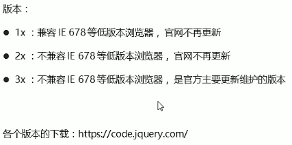


### jQuery的使用步骤

step1：引入jQuery文件

step2：使用即可

```html
    <!-- 先引入jquery文件，再使用即可 -->
    <script src="jquery.min.js"></script>
```


### jQuery的入口函数


```html
    <script>
        //$('div').hide();
        //jQuery的入口函数：
        //1.等着页面DOM加载完毕再去执行 js代码
        /* $(document).ready(function(){
            $('div').hide();
        }); */
        //2.等着页面DOM加载完毕再去执行 js代码
        $(function(){
            $('div').hide();
        })
    </script>
    <div></div>
```


### jQuery的顶级对象$


**$('element' /DOM对象)**    把**元素（DOM对象）利用$包装成jQuer对象**，就可以调用jQuery的方法

```html
    <div></div>
    <script>
        //1. $是jQuery的 别称
        /* $(function() {
            alert(11);
        }); */
        jQuery(function() {
            alert(11);
            $('div').hide(); //$('element') 把元素利用$包装成jQuer对象，就可以调用jQuery的方法
        });
        //2. $也是jQuery的 顶级对象
    </script>
```


### jQuery对象和DOM对象


​           4.**jQuery对象只能使用jQuery的方法**，**DOM对象则使用原生的JavaScript属性和方法**

```html
    <div></div>
    <span></span>
    <script>
        //1. DOM对象：用原生js获取过来的对象 就是DOM对象
        var myDiv = document.querySelector('div');//myDiv是DOM对象
        var mySpan = document.querySelector('span');//mySpan也是DOM对象
        console.dir(myDiv);
        //2. jQuery对象：用jQuery方式获取过来的对象是jQue对象，伪数组形式存储。 本质：通过$把DOM元素包装成jQuery对象。
        $('div'); //$('div') 是一个jQuery对象
        $('span'); //$('span') 是一个jQuery对象
        console.dir($('div'));
        
        //3. jQuery对象只能使用jQuery的方法，DOM对象则使用原生的JavaScript属性和方法
        //$('div').style.display = 'none'; //jQuery对象不能使用原生js的属性和方法
        //myDiv.hide(); //DOM对象不能使用jQuery的方法
    </script>
```

**两者的相互转换**：


1、DOM对象 转换为 jQuery对象：**$('element' /DOM对象)**

```js
        //(1) 直接获取视频，得到的就是jQuery对象
        $('video');
        //(2) 已经使用原生js获取过来（DOM对象）
        var myVideo = document.querySelector('video'); //myVideo是DOM对象
        $(myVideo); 
        //$(myVideo).play(); //没用，jQuery没有play这个方法
```

2、jQuery对象 转换为 DOM对象


```js
        //2. jQuery对象 转换为 DOM对象
        //myVideo.play();
        $('video')[0].paly();
        $('video').get(0).paly();
```


## jQuery常用API


### jQuery 选择器

原生 JS 获取元素方式很多，很杂，而且兼容性情况不一致，因此jQuery给我们做了封装，**使 获取元素 统一标准**。


#### jQuery 层级选择器


```js
 //jQuery获取元素--$('选择器')
        $(function(){
            console.log($('.nav'));
            console.log($('.dad li'));//后代选择器，儿子、孙子，6个li
            console.log($('.dad>li'));//子代选择器，亲儿子，4个li
        })
```

#### jQuery 隐式迭代

知识铺垫：


隐式迭代（重要）


```html
    <div>惊喜不，意外不</div>
    <div>惊喜不，意外不</div>
    <div>惊喜不，意外不</div>
    <div>惊喜不，意外不</div>
    <ul>
        <li>相同的操作</li>
        <li>相同的操作</li>
        <li>相同的操作</li>
    </ul>
    <script>
        //1. 获取四个div元素
        $('div'); //伪数组形式
        //console.log($('div'));
        //2. 给四个div设置背景颜色为pink, jQuery不能使用element.style.属性='属性值'
        $('div').css('background','pink');
        //3. 隐式迭代：把匹配的所有元素内部进行遍历循环，给每一个元素添加css这个方法
        $('ul>li').css('color','red');
    </script>
```

#### jQuery 筛选选择器

对比css的**结构伪类选择器**

筛选选择器的作用：**获取到的一组元素中，选择哪些或那个**


```js
   $(function(){
            $('ul li:first').css('color','red'); //获取ul的后代li中，第一个li元素
            $('ul li:eq(2)').css('color','blue'); //获取ul的 li元素中，选择索引号为2的元素
            $('ol li:odd').css('color','skyblue'); //获取的ol的 li元素中，选择索引号为奇数的元素
            $('ol li:even').css('color','pink'); //偶数
        })
```

#### jQuery 筛选方法

重点


```js
    <script>
        //都是筛选方法，注意带括号()
        $(function(){
            //1. 兄第元素
            //$('ol .item').siblings('li').css('color','red');//查找所有对应的亲兄弟元素，不包括自己
            $('ol .item').nextAll().css('color','red'); //查找当前元素之后所有的同辈元素
            $('ol .item').prevAll().css('color','blue');//查找当前元素之前所有的同辈元素
            //2. 第n个元素
            //(1) :eq(index) 获取到的元素中，选择索引号为2的元素,选择器的方式
            $('ul li:eq(2)').css('color','blue');
            //(2) eq(index)  $('li').eq(2) = $('li:eq(2)') 选择方法的方式，推荐
            $('ul li').eq(3).css('color','blue');
            //3. 判断是否有某个类名
        })
        
    </script> 
```

#### jQuery 的排他思想

```js
    $(function(){
            //1. 隐式迭代 给所有的按扭都绑定了点击事件
            $('button').click(function(){
                //(1) 当前的元素变化背景颜色
                $(this).css('background','red');
                //(2) 其余的兄弟去掉背景颜色 隐式迭代
                $(this).siblings('button').css('background','');
            //siblings(selector)选择所有的selector兄弟元素，不包括自己

                /* $('button').css('background','');
                $(this).css('background','red'); */
            })
        })
```

#### jQuery 链式编程


```js
    $(function(){
            //1. 隐式迭代 给所有的按扭都绑定了点击事件
            $('button').click(function(){
                /* //(1) 当前的元素变化背景颜色
                $(this).css('background','red');
                //(2) 其余的兄弟去掉背景颜色 隐式迭代
                $(this).siblings('button').css('background','');                 */
                //链式编程
                // $(this).css('background','red').siblings('button').css('background','');
                //我的颜色为红色，我的button兄弟的颜色为空
                // $(this).siblings('button').css('color','red');
                //我的button兄弟颜色为红色，我本身不变
                $(this).siblings('button').parent().css('color','red');
                //我的button兄弟的爸爸颜色为红色
            })
        })
```


### jQuery 样式操作

jQuery可以使用css方法来修改简单元素样式；也可以操作类，修改多个样式。

#### css方法


```js
    <script>
        //操作样式-css方法
        $(function(){
            //1.只写属性,返回属性值 200px
            console.log($('div').css('width')); 
            //2.属性必须加引号，但属性值如果是数组可以不加引号和单位
            //$('div').css('width','300px');
            // $('div').css('width',300);
            //3.
            $('div').css({
                width: 300,
                height: '300px',
                backgroundColor: 'red'
                //复合属性，要使用驼峰命名法；如果值不是数字，需要加引号
            });
        })
    </script>
```

#### 设置类样式方法

作用等同于以前的**classList**，可以操作类样式，注意操作类里面的**参数不要加点.**

与元素className 区别：


```html
    <div class="current"></div>
    <script>
        $(function(){
            //1. 添加类 addClass('类名')  
            $('div').click(function(){
                //$(this).addClass('current');
            });
            //2.移除类 removeClass('类名')
            $('div').click(function(){
                //$(this).removeClass('current');
            });
            //3.切换类 toggleClass('类名')
            $('div').click(function(){
                $(this).toggleClass('current');
            });
        })
    </script>
```

#### 案例：tab切换栏

结构：大的div 里面两个div


```js
   <script>
        $(function(){
            $('.tab_list ul li').click(function(){
                //1.点击上部li，当前li添加current类，其余兄弟移除类
                $(this).addClass('current').siblings('li').removeClass('current');
                //2.点击的同时，获取当前li的索引号
                var index = $(this).index(); //获取点击li的索引号
                console.log(index);
                //3.让下部对应的索引号的item显示，其余item隐藏
                $('.tab_con .item').eq(index).show().siblings('.item').hide();
            })
        })
    </script>
```

获取当前**元素的索引号方法 index()**：$('对象').**index()**;


### jQuery 效果

jQuery 给我们封装了很多**动画效果**，最为常见的如下：


#### 显示隐藏效果

**显示：**如果选择的元素是可见的，这个方法将不会改变任何东西。无论这个元素是通过**hide()方法**隐藏的还是在CSS里设置了**display:none;**，这个方法都将有效。

+ **show( [speed],[easing],[fn] )      显示**
+ **hide( [speed],[easing],[fn] )     隐藏**
+ **toggle( [speed],[easing],[fn] )    切换**

参数：


```js
   <script>
        $(function(){
            $('button').eq(0).click(function(){
                $('div').show('1000',function(){
                    $('div').text('我显示出来了');
                });
            });
            $('button').eq(1).click(function(){
                $('div').hide('1000',function(){
                    alert(1);
                });
            });
            $('button').eq(2).click(function(){
                $('div').toggle();
            });
            //一般情况下，我们都不加参数，直接显示隐藏即可
        })
    </script>
```


#### 滑动效果 和 事件切换

**滑动：**方法里面的**参数和show()  hide()  toggle()一样**。

+ **slideDown( [speed],[easing],[fn] )      下滑动**
+ **slideUp( [speed],[easing],[fn] )      上滑动**
+ **slideToggle( [speed],[easing],[fn] )      切换滑动**

```js
    <script>
        $(function(){
            $('button').eq(0).click(function(){
                //下滑动 slideDown()
                $('div').slideDown();
            });
            $('button').eq(1).click(function(){
                //上滑动 slideUp()
                $('div').slideUp();
            });
            $('button').eq(2).click(function(){
                //切换滑动 slideToggle()
                $('div').slideToggle();
            });
            //一般情况下，我们都不加参数，直接显示隐藏即可
        })
    </script>
```

**事件切换：**


新浪下拉菜单那个案列：

```js
            //1. 事件切换 hover 就是鼠标经过和鼠标离开的复合写法
            //里面两个函数，前面一个是鼠标经过，后面一个是鼠标离开
            // $('ul>li').hover(function() {
            //     $(this).children('ul').slideDown(200);
            // }, function() {
            //     $(this).children('ul').slideUp(200);
            // });
            //2. 事件切换 hover 只写一个函数，鼠标经过和鼠标离开都会触发该函数
            $('ul>li').hover(function() {
                $(this).children('ul').slideToggle();
            });
```


#### 动画队列 和 停止排队方法


这样的话，不管有多少个动画或者效果在排队执行，**只会执行最后一个。**

```js
    $('ul>li').hover(function() {
                //stop() 方法必须写到动画的前面,执行最后一次动画
                $(this).children('ul').stop().slideToggle();
            });
```


#### 淡入淡出效果

方法里面的参数还是和上面的方法一样。 fade褪色

+ **fadeIn( [speed],[easing],[fn] )     淡入效果**
+ **fadeOut( [speed],[easing],[fn] )     淡入效果**
+ **fadeToggle( [speed],[easing],[fn] )     切换效果**
+ 如下


```JS
    <script>
        $(function(){
            $('button').eq(0).click(function(){
                //淡入效果 fadeIn()
                $('div').fadeIn(1000);
            });
            $('button').eq(1).click(function(){
                //淡出效果 fadeOut()
                $('div').fadeOut(1000);
            });
            $('button').eq(2).click(function(){
                //淡入淡出切换效果 fadeToggle()
                $('div').fadeToggle();
            });
            $('button').eq(3).click(function(){
                //修改透明度 fadeTo(speed, opacity, [easing],[fn]),速度和透明度必须要写
                $('div').fadeTo(1000, .5)
            });
        })
    </script>
```

**案例：突出显示**

```html
    <div class="father">
        <div></div>
        <div></div>
        <div></div>
        <div></div>
        <div></div>
        <div></div>
    </div>
    <script>
        $(function() {
            $('.father div').hover(function(){
                //鼠标经过时，其他的div标签透明度为0.5
                $(this).siblings('div').stop().fadeTo(400,0.5);
            },function(){
                //鼠标离开时，其他div透明度改为1
                $(this).siblings('div').stop().fadeTo(400,1);
            });
        })
    </script>
```


#### 自定义动画animate方法

+ **animate( params,[speed],[easing],[fn] )**

**params**:一组包含作为动画属性和终值的样式属性和及其值的集合**{键值对}**

**{**

​        **属性：'属性值' ，**

​        **属性：'属性值'**

**}**


```html
    <button>动起来</button>
    <div></div>
    <script>
        $(function() {
            $('button').click(function() {
                $('div').animate({
                    left: 500,
                    top: 300,
                    width: 300,
                    opacity: .4
                });
            })
        })
    </script>
```


#### 案例：王者荣耀手风琴


```html
    <script>
        $(function() {
            // 鼠标经过某个小li 有两步操作：
            $('.king li').mouseenter(function() {
            // 1.当前小li 宽度变为 224px，同时里面的小图片淡出，大图片淡入
                $(this).stop().animate({
                    width: 224
                }).find('.small').stop().fadeOut().
                siblings('.big').stop().fadeIn();
                // 2.其余兄弟小li 宽度变为69px， 小图片淡入， 大图片淡出
                $(this).siblings('li').stop().animate({
                    width: 69
                }).find('.small').stop().fadeIn().
                siblings('.big').stop().fadeOut();
            })
        })
     </script>
```


### jQuery 属性操作

#### 设置或获取元素固有属性值 prop()


获取在**匹配的元素集中的第一个元素的属性值**。

```js
    $(function() {
            //element.prop('属性名')  获取元素固有的属性值
            console.log($('a').prop('href'));
            //element.prop('属性名','属性值')  修改属性值
            $('a').prop('title','我们都挺好');
            $('input').change(function() {
                console.log($(this).prop('checked'));//选中复选框为true，没选中为false
            })
        })
```


#### 设置或获取元素自定义属性值 attr()


```js
      <div index="1" data-index="3">我是div</div>    
          //2.attr()
          //console.log($('div').prop('index')); //获取不到自定义属性
            console.log($('div').attr('index'));//1
            $('div').attr('index','2');
            console.log($('div').attr('index'));//2
            console.log($('div').attr('data-index'));//3
```


#### 数据缓存 data()


```js
    //3.data() 数据缓存 这个里面的数据是存放在元素的内存里面
            $('span').data('uname','andy');
            console.log($('span').data('uname'));
            console.log($('div').data('index'));//3 去掉data-，获取H5自定义属性data-index
```


### jQuery 文本属性操作

主要针对元素的 **内容** 和 **表单的值** 操作


​                    **val()                 //获取表单里面的内容**

​                    **val('内容')       //设置表单里面的内容**

```html
    <div>
        <span>我是内容</span>
    </div>
    <input type="text" value="请输入内容">
    <script>
        // 1. 获取设置元素内容 html()  相当于innerHTML
        console.log($("div").html()); //<span>我是内容</span>
        //$("div").html("123");
        
        // 2. 获取设置元素文本内容 text()
        console.log($('div').text()); //我是内容
        $('div').text('123');
        
        // 3. 获取设置表单值 val()
        console.log($('input').val());
        $('input').val('123');
    </script>
```


### jQuery 元素操作

主要是遍历、创建、添加、删除元素操作


### jQuery 尺寸、位置操作


