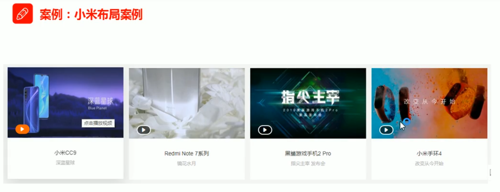

# 新浪导航案例


```html
<!DOCTYPE html>
<html lang="en">
<head>
  <meta charset="UTF-8">
  <meta http-equiv="X-UA-Compatible" content="IE=edge">
  <meta name="viewport" content="width=device-width, initial-scale=1.0">
  <title>Document</title>
  <style>
    .nav {
      border-top: 3px solid #ff8500;
      border-bottom: 1px solid #edeef0;
      height: 41px;
      line-height: 41px;
      background-color: #fcfcfc;
      
    }
    .nav a{
      /* a属于行内元素 此时必须要转换 行内块元素 */
      display: inline-block;
      text-decoration: none;
      height: 41px;
      font-size: 12px;
      color: #4c4c4c;
      padding: 0 20px;
    }
    .nav a:hover {
      background-color: #eee;
      color: #ff8500;
    }
  </style>
</head>
<body>
  <div class="nav">
    <a href="#">新浪导航</a>
    <a href="#">手机新浪网</a>
    <a href="#">移动客户端</a>
    <a href="#">微博</a>
    <a href="#">三个字</a>
</div>
</body>
</html>
```


# 产品模块


```html
<!DOCTYPE html>
<html lang="en">

<head>
  <meta charset="UTF-8">
  <meta http-equiv="X-UA-Compatible" content="IE=edge">
  <meta name="viewport" content="width=device-width, initial-scale=1.0">
  <title>Document</title>
  <style>
    * {
      margin: 0;
      padding: 0;
    }

    body {
      background-color: #f5f5f5;
    }

    a {
      color: #333;
      text-decoration: none;
    }

    .box {
      width: 298px;
      height: 415px;
      background-color: #fff;
      /* 让块级元素水平居中 */
      margin: 100px auto;
    }

    .box img {
      /* 图片的宽度和父亲一样宽 */
      width: 100%;
    }

    .box .review {
      height: 70px;
      font-size: 14px;
      /* 因为这个段落没有 width属性 所有 padding不会撑开盒子的宽度 */
      padding: 0 28px;
      margin-top: 30px;
    }

    .box .appraise {
      font-size: 12px;
      color: #b0b0b0;
      margin-top: 20px;
      padding: 0 28px;
    }

    .info {
      font-size: 14px;
      margin-top: 15px;
      padding: 0 28px;
    }

    .info h4 {
      /* 使其变成行内块元素，横着排 */
      display: inline-block;
      font-weight: 400;

    }

    .info span {
      color: #ff6700;
    }

    .info em {
      /* 把倾斜的字体设置正常，给斜体标签（em，i）改为不斜体字体 */
      font-style: normal;
      color: #ebe4e0;
      margin: 0 6px 0 15px;
    }
  </style>
</head>

<body>
  <div class="box">
    
    <p class="review">快递牛，整体不错蓝牙可以说秒连。红米给力</p>
    <div class="appraise">来自于 117384232 的评价</div>
    <div class="info">
      <h4> <a href="#">Redmi AirDots真无线蓝...</a></h4>
      <em>|</em>
      <span> 99.9元</span>
    </div>
  </div>
</body>

</html>
```


# 新闻快报


```html
<!DOCTYPE html>
<html lang="en">
<head>
  <meta charset="UTF-8">
  <meta http-equiv="X-UA-Compatible" content="IE=edge">
  <meta name="viewport" content="width=device-width, initial-scale=1.0">
  <title>Document</title>
  <style>
    * {
      margin: 0;
      padding: 0;
    }
    .box {
      border: 1px solid #ccc;
      width: 248px;
      height: 163px;
      margin: 100px auto;
    }
    .box h3 {
      height: 32px;
      line-height: 32px;
      border-bottom: 1px dotted #ccc;
      font-weight: 400;
      font-size: 14px;
      padding-left: 15px;
    }
    .box ul {
      margin-top: 7px;
      list-style: none;
    }
    .box ul li a {
      text-decoration: none;
      font-size: 12px;
      color: #666;
    }
    .box ul li a:hover {
      text-decoration: underline;
    }
    .box ul li {
      height: 23px;
      line-height: 23px;
      padding-left: 20px;
    }
  </style>
</head>
<body>
  <div class="box">
    <h3>品优购快报</h3>
    <ul>
      <li><a href="#">【特惠】爆款耳机5折秒！</a></li>
      <li><a href="#">【特惠】母亲节，健康好礼低至5折！</a></li>
      <li><a href="#">【特惠】爆款耳机5折秒！</a></li>
      <li><a href="#">【特惠】9.9元洗100张照片！</a></li>
      <li><a href="#">【特惠】长虹智能空调立省1000</a></li>
    </ul>
  </div>
</body>
</html>
```


# 小米布局案例


```html
<!DOCTYPE html>
<html lang="en">

<head>
  <meta charset="UTF-8">
  <meta name="viewport" content="width=device-width, initial-scale=1.0">
  <meta http-equiv="X-UA-Compatible" content="ie=edge">
  <title>浮动元素搭配标准流父盒子1</title>
  <style>
    .box {
      width: 1200px;
      height: 460px;
      background-color: pink;
      margin: 0 auto;
    }

    .left {
      float: left;
      width: 230px;
      height: 460px;
      background-color: purple;
    }

    .right {
      float: left;
      width: 970px;
      height: 460px;
      background-color: skyblue;
    }
  </style>
</head>

<body>
  <div class="box">
    <div class="left">左侧</div>
    <div class="right">右侧</div>
  </div>
</body>

</html>
```



```html
<!DOCTYPE html>
<html lang="en">

<head>
  <meta charset="UTF-8">
  <meta name="viewport" content="width=device-width, initial-scale=1.0">
  <meta http-equiv="X-UA-Compatible" content="ie=edge">
  <title>浮动元素搭配标准流父盒子2</title>
  <style>
    * {
      margin: 0;
      padding: 0;
    }

    li {
      list-style: none;
    }

    .box {
      width: 1226px;
      height: 285px;
      background-color: pink;
      margin: 0 auto;
    }

    .box li {
      width: 296px;
      height: 285px;
      background-color: purple;
      float: left;
      margin-right: 14px;
    }

    /* 这里必须写 .box .last 要注意权重的问题  20 */
    .box .last {
      margin-right: 0;
    }
  </style>
</head>

<body>
  <ul class="box">
    <li>1</li>
    <li>2</li>
    <li>3</li>
    <li class="last">4</li>
  </ul>
</body>

</html>
```


```html
<!DOCTYPE html>
<html lang="en">

<head>
    <meta charset="UTF-8">
    <meta name="viewport" content="width=device-width, initial-scale=1.0">
    <meta http-equiv="X-UA-Compatible" content="ie=edge">
    <title>浮动布局练习3</title>
    <style>
        .box {
            width: 1226px;
            height: 615px;
            background-color: pink;
            margin: 0 auto;
        }

        .left {
            float: left;
            width: 234px;
            height: 615px;
            background-color: purple;
        }

        .right {
            float: left;
            width: 992px;
            height: 615px;
            background-color: skyblue;
        }

        .right>div {
            float: left;
            width: 234px;
            height: 300px;
            background-color: pink;
            margin-left: 14px;
            margin-bottom: 14px;
        }
    </style>
</head>

<body>
    <div class="box">
        <div class="left">左青龙</div>
        <div class="right">
            <div>1</div>
            <div>2</div>
            <div>3</div>
            <div>4</div>
            <div>5</div>
            <div>6</div>
            <div>7</div>
            <div>8</div>
        </div>
    </div>
</body>

</html>
```


# 淘宝焦点图布局


```html
<!DOCTYPE html>
<html lang="en">

<head>
  <meta charset="UTF-8">
  <meta http-equiv="X-UA-Compatible" content="IE=edge">
  <meta name="viewport" content="width=device-width, initial-scale=1.0">
  <title>Document</title>
  <style>
    * {
      margin: 0;
      padding: 0;
    }

    li {
      list-style: none;
    }

    .tb-promo {
      width: 520px;
      height: 280px;
      margin: 100px auto;
      position: relative;
    }

    .tb-promo>img {
      width: 520px;
      height: 280px;
    }

    .prev,
    .next {
      position: absolute;
      /* 绝对定位的盒子垂直居中 */
      top: 50%;
      margin-top: -15px;
      /* 加了绝对定位的盒子可以直接设置高度和宽度 */
      width: 20px;
      height: 30px;
      background: rgba(0, 0, 0, .3);
      text-align: center;
      line-height: 30px;
      color: #fff;
      text-decoration: none;
    }

    .prev {
      left: 0;
      border-top-right-radius: 15px;
      border-bottom-right-radius: 15px;
    }

    .next {
      right: 0;
      border-top-left-radius: 15px;
      border-bottom-left-radius: 15px;
    }

    .promo-nav {
      position: absolute;
      bottom: 15px;
      left: 50%;
      margin-left: -35px;
      width: 70px;
      height: 13px;
      /* background-color: pink; */
      background: rgba(255, 255, 255, .3);
      border-radius: 7px;
    }

    .promo-nav li {
      float: left;
      /* 设置了浮动，有行内块元素的性质，可以给宽高 */
      width: 8px;
      height: 8px;
      background-color: #fff;
      border-radius: 50%;
      margin: 3px;
    }

    /* 不要忘记选择器权重的问题 */
    .promo-nav .selected {
      background-color: #ff5000;
    }
  </style>
</head>

<body>
  <div class="tb-promo">
    
    <!-- 左侧按钮箭头 -->
    <a href="#" class="prev"> &lt; </a>
    <!-- 右侧按钮箭头 -->
    <a href="#" class="next"> &gt; </a>
    <!-- 小圆点 -->
    <ul class="promo-nav">
      <li class="selected"></li>
      <li></li>
      <li></li>
      <li></li>
      <li></li>
    </ul>
  </div>
</body>

</html>
```


# 土豆案例


```html
<!DOCTYPE html>
<html lang="en">
<head>
  <meta charset="UTF-8">
  <meta http-equiv="X-UA-Compatible" content="IE=edge">
  <meta name="viewport" content="width=device-width, initial-scale=1.0">
  <title>Document</title>
  <style>
    .tudou {
      width: 444px;
      height: 320px;
      background-color: pink;
      position: relative;
      margin: 50px auto;
    }
    .tudou > img {
      width: 100%;
      height: 100%;
    }
    .mask {
      display: none;
      width: 100%;
      height: 100%;
      background: rgba(0, 0, 0, .3) url(images/arr.png) center no-repeat;
      /* 绝对定位：脱离文档流，参照物看祖先元素 */
      position: absolute;
      top: 0;
      left: 0;
    }
    .tudou:hover .mask {
      display: block;
    }
  </style>
</head>
<body>
  <div class="tudou">
    <div class="mask"></div>
    
  </div>
</body>
</html>
```


