# Web标准


Web标准提出的最佳体验方案：结构、样式、行为相分离。

简单理解：结构写到HTML文件中，表现写到CSS文件中，行为写到JavaScript文件中。


------


# VSCode使用

1、快速复制一行

快捷键：`shift+alt+下箭头（下箭头）`

2、选定多个相同的单词

快捷键：`ctrl+d`

先选定一个单词，然后按下`ctrl+d`可以往下依次选择相同的单词，这样可以同时修改相同的单词

3、快速定位到某一行代码

快捷键：`ctrl+g`

当页面过长，上下滚动页面不方面，可以利用快捷键，快速定位到指定的代码行

4、选择某个区块

快捷键：`shift+alt`然后拖动鼠标

可以选择一个区块进行操作


------


# Chrome调试工具


------


# Emmet语法

## 快速生成HTML结构的语法


```html
5.
  <!-- .nav -->
  <div class="nav"></div>
  <!-- div#banner -->
  <div id="banner"></div>
  <!-- p.one -->
  <p class="one"></p>
6.
  <!-- .demo$*5 -->
  <div class="demo1"></div>
  <div class="demo2"></div>
  <div class="demo3"></div>
  <div class="demo4"></div>
  <div class="demo5"></div>
  <!-- p.demo$*4 -->
  <p class="demo1"></p>
  <p class="demo2"></p>
  <p class="demo3"></p>
  <p class="demo4"></p>
7.
  <!-- div{$}*5 -->
  <div>1</div>
  <div>2</div>
  <div>3</div>
  <div>4</div>
  <div>5</div>
```


## 快速生成CSS样式语法


------


# PS

## PS基本操作

ps：图片处理软件，美工用来做图，前端用来**测量宽高**、**吸取颜色**、**切图**


1）拿到设计稿之后：使用ps打开

（1）右键点击图片-->打开方式 选ps

（2）ps里面，文件-->打开，选中相应的图片


2）**图片的放大和缩小：**

​     **Ctrl+**

​     **Ctrl-**

​     Alt+鼠标滚轮


3）**图片的移动**：**按住空格**，鼠标变为小手形状，**拖动图片**即可


4）如何调整出来**标尺**：

​        **Ctrl+r**

​        **视图里面找到标尺**，把对勾勾选上

作用：**拖动参考线方便测量**，点击标尺，可以拖出一条参考线

 

5）**测量图片大小**：

   使用**矩形选框工具**（左侧竖着的第二个工具）

选好后，如果觉得没对准，可以 **点击右键-->变换选区**，再对准即可。

记完数据，Ctrl+D——取消选区

如何查看数据大小：**窗口-->信息**。可以**查看选取的宽高**像素px


6）**吸取颜色**：

​          使用**吸管工具** I

​          吸取颜色完成后，点击左下角的背景色，会右弹窗，在弹窗里面右#十六进制的颜色值可以让你复制


  7）**截图**：

​          （1）使用快捷键截图===每次只能截取一个

​            使用选框工具框选尼亚截取的区域

​              ctrl+c==ctrl+n===回车===ctrl+v=======ctrl+s

​              

​          （2）**切片工具** (裁剪工具进行切换)

​            使用**切片工具**框选你要留住的区域，点击 **文件-->存储为web所用格式ctrl+alt+shift+s，弹窗里面点击存储**，

​            弹窗======格式:**仅限图像**，切片:**所有用户切片**


## PS切图

PS有很多的切图方式：图层切图、**切片切图**、PS插件切图等。

### （1）常见的图片格式

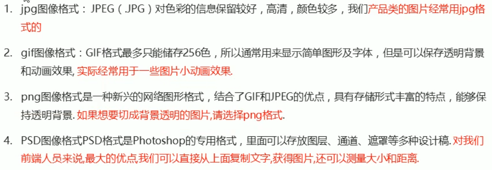

前三种可以直接放入代码中，第四种不行，是我们美工给开发人员的页面。


### （2）图层切图


先左边栏选择**移动工具**


然后，点击图片一些元素，右边栏就会有图层信息


如果有图片、文字、边框分离，可以选中（shift）这些图层，右键—>**合并图层**


最后，选择要提取的图层，右键—>**快速导出为PNG**


### （3）切片切图


左边栏选择**切片工具**


然后，选择要切图的区域（可以调整，删除可以按Del），点击 **文件—> 导出 —> 存储为web设备所用格式**


可以选择图片格式，优化，然后点击 **存储**


切片选择：**选中的切片**


注意：如果切取的图片要**让背景透明**，可以将图层移到最下面，把 **背景 设为不可见**。这样切出来的图片背景是透明的


原本有背景：


背景透明的图片：


### （4）PS插件切图

安装：


安装好了，在PS**窗口**中就可以看到：


使用技巧


首先，指定一个文件夹，用来保存我们的切图

选中要切的图层（跟图层切图一样，用 **移动工具** ，选中要切的图层）

最后点击 **导出选中图层**，即可在文件夹中找到

说明：

（1）如果有需要选中多个图层，这里不需要跟（1）一样合并图层，可以直接勾选Cutterman中的 **合并选中的图层**。

（2）可以对图层的一部分区域进行切图：

首先，还是先选中要切的图层（跟图层切图一样，用 **移动工具** ，选中要切的图层），然后，用 **矩形选框工具** 选中该图层的区域，此时点击 **导出选中图层** 即可。


## 像素大厨

功能强大，可替代PS。

用该软件PxCook，直接打开.psd文件。

下载地址：https://fancynode.com.cn/pxcook


------


# snipaste工具


------


# HTML

## HTML语法规范

1、基本语法概述 


+ 双标记**<标记></标记>**

​       **<标记 属性="属性值"   属性="属性值">  </标记>**

+ 单标记**</标记>**

​       **<标记 属性="属性值" />**

​        例如：`<br/>`

**ctrl+/** 可以快捷注释

2、标签关系

双标签关系可以分为两类：**包含关系（父子关系）** 和 **并列关系**


## HTML基本结构标签


HTML文档（页面）的后缀名是.html或者.htm。


## HTML常用标签

### 1、标签的语义

学习标签，要记住每个标签的语义。简单理解就是指<span style="color:red;">标签的含义</span>，即这个标签是用来干嘛的。

根据标签的语义，在合适的地方给一个最为合理的标签，可以让页面结构更清晰。


### 2、标题标签  `<h1> - <h6>`


### 3、段落`<p>`和换行`<br/>`标签


### 4、文本格式化标签

在网页中，有时候需要设置 粗体、斜体、下划线 等效果，这就是HTML中的文本格式化标签，使得文字以特殊的方式显示。

标签语言：突出重要性。


```html
    我是<strong>加粗</strong>的文字<br>
    我是<b>加粗</b>的文字<br>
    我是<em>倾斜</em>的文字<br>
    我是<i>倾斜</i>的文字<br>
    我是<del>删除线</del><br>
    我是<s>删除线</s><br>
    我是<ins>下划线</ins><br>
    我是<u>下划线</u><br>
```


### 5、补充标签

水平线`<hr>`

斜体字`<i></i>`   `<em></em>`

上标`<sup></sup> `   下标`<sub></sub>`

文本居中`<center></center>`

预格式化文本`<pre></pre>`  保留空格, tab , 回车 , 空行(你输什么文本都会显示)

opacity 属性指定了一个元素的**不透明度**

```css
/* 完全不透明 */
opacity: 1;
opacity: 1.0;

/* 半透明 */
opacity: 0.6;

/* 完全透明 */
opacity: 0.0;
opacity: 0;

opacity: inherit;
```

在css中 transparent到底是什么意思呢? **transparent** 它代表着**全透明黑色**，即一个类似**rgba(0,0,0,0) 最后一个值为0**这样的值。

例如在css属性中定义：**background:transparent**，意思就代表**背景透明**。

实际上background默认的颜色就是透明的属性，所以写和不写都是一样的。

```css
.dom {
    color: transparent;
    border: 1px solid transparent;
    background: transparent;
}
```


水平线的设置：在<hr>标签里面设置属性、属性值，改变水平线的颜色、宽度、阴影去除noshade等等；

<hr color="red" width="600" align="left">
<hr color="red" width="600" align="right">
<hr>
<hr noshade> <!--默认有阴影，这是取消阴影-->

------


### 6、特殊符号和注释

特殊符号：重点记住空格、大于号、小于号。

空格符还有`&emsp;`


注释


### 7、div 和 span 标签

**div 和 span标签：**两者都是没有语义的，它们就是一个盒子，用来装内容的。

div标签，**没有具体含义**，用来划分页面的区域，独占一行。就是一个盒子，**把页面划分成块**

快捷键：`div{内容}*n` 

span标签，**修饰**，没有实际意义，主要应用在**对于文本独立修饰的时候**，一行上可以有多个span，内容有多宽就占用多宽的空间距离**（行内元素）**

`<span style="color: gray;">SPORTS</span>`

<h3>体育<span style="color: gray;">SPORTS</span></h3>


## 图片``和路径

### 1、图像标签

` `是空标签，意思是说，它**只包含属性**，并且没有闭合标签。用于定义HTML页面中的图像。

1、要在页面上显示图像，你需要使用**src属性**。src 指 "source"。它用于**指定图像文件的路径和文件名**。

```html

```

**URL 指存储图像的位置**。如果名为 "pulpit.jpg" 的图像位于 www.runoob.com 的 images 目录中，那么其 URL 为 http://www.runoob.com/images/pulpit.jpg。

2、**alt 属性**用来为图像定义一串**预备的可替换的文本**。

替换文本属性的值是用户定义的。**当图片刷新不了**，显示不出来，会显示alt的（属性值）文本

```html

```

3、**title属性**：**指针悬停**在图片上会显示的**文本提示**（title的属性值）

```html

```

4、**height（高度） 与 width（宽度）属性**用于设置**图像的高度与宽度**。属性值默认单位为像素:

```html

    <!-- width和height只写一个，图片会相应比例缩小，不会变形 -->
    
    
```

提示: **指定图像的高度和宽度**是一个很好的习惯。如果图像指定了高度宽度，页面加载时就会保留指定的尺寸。如果没有指定图片的大小，加载页面时有可能会破坏HTML页面的整体布局。


### 2、路径

根目录：打开目录文件夹的第一层就是根目录


相对路径是从**代码所在的这个文件**出发，去寻找目标文件的，而我们这里所说的上一级、下一级和同一级就是图片相对于HTML代码页面的位置。


```html


```


## 超链接

### 1、`<a>`标签及其属性

`<a>`标签用于定义超链接，作用是从一个页面链接到另一个页面

```html
<a herf="（跳转到的）页面路径、网站网址"  title="鼠标悬停上去之后的提示信息"   target="链接页面的弹出方式（新窗口还是旧窗口）" > 文本或图像 </a>
```

`target`属性：

+ **`target="_self"`** （默认值），旧窗口打开

+ **`target="_blank"`** **新窗口打开**

```html
<a href="https://www.baidu.com">百度1</a>
<a href="https://www.baidu.com" target="_blank">百度2</a>
```

**内容可以是文字、图片，点击即可跳转**

```html
<a href="https://www.baidu.com">
       //内容是图片
</a>
```


### 2、标签分类


```html
  <h4>1.外部链接</h4>
  <a href="http://www.qq.com" target="_self"> 腾讯</a>
  <!-- target 打开窗口的方式  默认的值是 _self 当前窗口打开页面  _blank 新窗口打开页面 -->
  <a href="http://www.itcast.cn" target="_blank">传智播客</a>

  <h4>2.内部链接: 网站内部页面之间的相互链接</h4>
  <a href="gongsijianjie.html" target="_blank">公司简介</a>

  <h4>3.空链接:#</h4>
  <a href="#">公司地址</a>

  <h4>4.下载链接: 地址链接的是 文件.exe或者是zip等压缩包形式</h4>
  <a href="img.zip">下载文件</a>

  <h4>5.网页元素的链接</h4>
  <a href="http://www.baidu.com"></a>
```


### 3、锚点链接

锚点作用：当我们点击链接，可以快速定位到页面中的某个位置


```html
    /* 锚点作用：页面不同区域的跳转，使用a超链接
        <a href="#锚点名字">
        <div id="锚点名字"></div> 
        点击a 跳转到相应的区域div
     */
</head>
<body>
    <ul>
        <li>
            <a href="#md1">京东秒杀</a>
        </li>
        <li>
            <a href="#md2">双11优选</a>
        </li>
        <li>
            <a href="#md3">频道优选</a>
        </li>
        <li>
            <a href="#md4">特色广场</a>
        </li>
    </ul>

    <div id="md1">
        京东秒杀
    </div>
    <div id="md2">
        双11优选
    </div>
    <div id="md3">
        频道优选
    </div>
    <div id="md4">
        特色广场
    </div>
</body>
```


## 列表

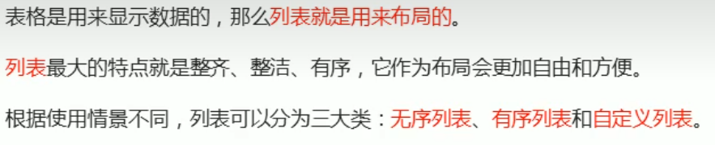


### 无序列表unordered list


```html
<!--    1、ul里面只能放li标签，但是li标签里面可以放其他标签。
        2、默认的是黑色的实心圆
        3.ul里面的属性type=disc，circle，square none 分别是实心圆、空心圆、方形、无-->
    <ul type="square">
            <li>蒸羊羔</li>
            <li>蒸熊掌</li>
            <li>烧花鸭</li>
    </ul>
```


### 有序列表order list

```
<ol></ol>里面只能放<li></li>标签，但是<li></li>里面可以随意放标签
```

数字是自动生成**默认有1. 2. 3. ...**.等有序数字

```html
<!-- 有序列表
    1.<ol></ol>里面只能放<li></li>标签，
        但是<li></li>里面可以随意放标签
    2.数字是自动生成，默认有1. 2. 3. ....等有序数字，可以用type属性改
    3.ol里面属性type：属性值只能是1，a,A,i,I这五个
        在type后面，属性strat:取值只能是数字，从哪开始
-->
<!-- //从A往后第10个J开始 -->
    <ol type="A" start="10"> 
        <li>把冰箱打开</li>
        <li>把大象塞进去</li>
        <li>关上冰箱</li>
    </ol>
```


### 自定义列表definition lists

自定义列表的使用场景：自定义列表常用于对术语或者名词进行解释和描述，定义列表的列表项前没有任何项目符号。

自定义列表以 `<dl>` 标签开始。每个自定义**列表项**以 `<dt>` 开始。每个自定义**列表项的定义**以 `<dd>` 开始


dt和dd是兄弟关系，但是通常是一个dt对应多个dd。dl里面只能包含dt和dd，但是dt和dd里面可以放任何标签

```html
  <dl>
    <dt>关注我们</dt>
    <dd>新浪微博</dd>
    <dd>官方微信</dd>
    <dd>联系我们</dd>
    <dt>关注我们</dt>
    <dd>新浪微博</dd>
    <dd>官方微信</dd>
    <dd>联系我们</dd>
  </dl>
```


## 表格

### 1、表格的作用


### 2、表格的基本语法


**table标签**创建数据表格，**table标签里面只能有tr行标签，tr标签里面只能有td单元格标签，但td单元格里面可以放任何标签**

快捷键：`table>tr*2>td*2`

```html
<table>
    <tr>
        <td>单元格内容</td>
        ...
    </tr>
    <tr>
        ...
    </tr>
    ...
  </table>
```


### 3、表头单元格标签`th`

一般表头单元格位于**表格的第一行**或第一列，表头单元格里面的文本内容加粗居中显示。

`<th>表头内容</th>`，其实**就是列名**，突出显示。


### 4、表格结构标签


```html
<table>
    <caption>列表标题</caption>
    <thead>
      <tr>
        <th>...</th>
        ...
      </tr>
    </thead>
    <tbody>
      <tr>
        <td>...</td>
        ...
      </tr>
      ...
    </tbody>
</table>
```

【说明】表格标签这部分属性，在实际开发中不常用，后面通过CSS来设置。

### `<table>`属性

1. **宽度   `width`**    width的属性值单位：**px像素，百分比%（相对于父元素）**

   比如这个width="50%",父元素是body（一般是div），占整个页面一半

2. **高度   `height`**   height的属性值单位：px，百分比%（但是和width不同，它是**内容决定的**，可能是行高、单元格高）

3. **边框   `border`  （外边框）**，值为"**1**"或者""，规定表格单元是否拥有边框，默认为""，没有边框

4. **边框颜色   `bordercolor`**

5. **背景颜色   `bgcolor`**

6. **表格水平对齐   `align="left或right或center"`**，**整个表格的水平位置**     align对齐，对准

6. 表格**文字对齐**  **`text-align="left或right或center"` 文字水平对齐**

7. **`cellspacing="单元格之间的间距`**"  单位是像素px  cell细胞、单元格   spacing间距，经常设置为0

8. **`cellpadding="单元格边沿与内容之间的空隙`**"  默认1像素。   padding 填充

```html
<table border="1" 
       width="50%" 
       height="500px"
       align="center"
       bordercolor="red"
       bgcolor="yellow"
       cellspacing="20"
       cellpadding="100">
        <tr>
            <td>1</td>
            <td>2</td>
        </tr>
        <tr>
            <td>3</td>
            <td>4</td>
        </tr>
</table>
```


### `<tr>`属性  table row

1. **行高度   `height`**  （行tr**没有宽度width设置**，单元格td有width设置）

2. **背景颜色   `bgcolor`**

3. **文字水平对齐   `align="left或right或center"`**

4. **文字垂直对齐   `valign="top或middle或bottom"`**   

   (这一行会变化，以行为单位)

```html
<table border="1" width="300" height="300" bgcolor="yellow" align="center">
        <tr height="100" bgcolor="green" align="center" valign="middle">
            <td>1</td>
            <td>2</td>
        </tr>
        <tr>
            <td>3</td>
            <td>4</td>
        </tr>
    </table>
```

注意：tr标签是行内元素的容器，而td标签则是行内元素。


### `<td>`属性  table data 

1. **宽度   `width`** ：如果一个单元格设置了宽度，会影响这个单元格<span style="color:red;">所在列一整列</span>的宽度
2. **高度   `height`**：如果一个单元格设置了高度，会影响这个单元格**所在行**一整**行**的高度，但是会被所在`tr`设置的`height`覆盖
3. **背景颜色   `bgcolor`**
4. **文字 水平对齐   `align="left或right或center"`**
5. **文字 垂直对齐   `valign="top或middle或bottom"`**   

```html
<!-- td:  属性width,如果一个单元格设置了宽度，会影响这个单元格所在列一整列的宽度
          属性height,如果一个单元格设置了高度，会影响这个单元格所在行一整行的高度-->
    <table border="1" bgcolor="yellow" width="300" height="300" align="center" >
        <tr>
            <td width="200">1</td> <!-- 这是表格第一行第一个单元格 -->
            <td height="200">2</td>
        </tr>
        <tr>
            <td bgcolor="green">3</td>
            <td align="right" valign="top">4</td>
        </tr>
    </table>
```


### 表格table的细线边框


表格单元格之间会重合的边框，使用`border-collapse: collapse;`可以解决。

```css
table,
    td,
    th {
      border: 1px solid pink;
      /* 合并相邻的边框 */
      border-collapse: collapse;
      font-size: 14px;
      text-align: center;
    }
```


### 表格合并


**`colspan="所要合并的单元格的列数"`** ，必须给**td**   column列  span跨度

**`rowspan="所要合并的单元格的行数"`**，必须给**td**

```html
<table border="1" width="500px" height="249px" cellspacing="0" >
    <tr>
      <td colspan="2">1.1</td>
      <!-- <td>1.2</td> -->
      <td>1.3</td>
    </tr>
    <tr>
      <td rowspan="2">2.1</td>
      <td>2.2</td>
      <td>2.3</td>
    </tr>
    <tr>
      <!-- <td>3.1</td> -->
      <td>3.2</td>
      <td>3.3</td>
    </tr>
  </table>
```


## 表单

### 1、表单的作用

使用表单的目的是为了：<span style="color:red">收集用户的信息</span>。

在我们网页中，我们也需要跟用户进行交互，收集用户资料，此时就需要表单。


### 2、表单的组成


#### 1）表单域


```html
<form action="demo.php" method="POST" name="name1">
</form>
```


#### 2）表单控件

`<input>`：


`<input>`中除了`type`属性外，还有一些其他属性：（在不同的type属性值下，input的属性也各有其属性）


```html
<form method="get或者post" action="向何处发送表单数据">
    get,在url中可以看到，默认
    post
    <input type=""  placeholder="提示信息" name="" value=""> 
    A. 属性type定义输入框的类型
       a.文本框 type="text"  
         密码框 type="password"
       b.提交框 type="submit"和<button type="submit">提交按扭</button>一样，  submit 提交
       c.按钮框 type="button" 单纯的按扭
       d.重置框 type="reset" 清空的效果
    
    B.属性placeholder描述输入字段预期值的简短的 提示信息
    C.属性name 必须 设置，否则在提交表单时，用户在其输入的数据不会被发送给服务器
    D.属性value
</form>

  <form action="xxx.php" method="get">
    <!-- text 文本框 用户可以里面输入任何文字 -->
    用户名: <input type="text" name="username" placeholder="请输入用户名" maxlength="6" value="name"> <br>
    <!-- password 密码框 用户看不见输入的密码 -->
    密码: <input type="password" name="pwd"> <br>
    <!-- radio 单选按钮  可以实现多选一，单选 -->
    <!-- name 是表单元素名字 这里性别单选按钮必须有相同的名字name 才可以实现多选1 -->
    <!-- 单选按钮和复选框可以设置checked 属性, 当页面打开的时候就可以默认选中这个按钮 -->
    性别:  <input type="radio" name="sex" value="男"> 男
          <input type="radio" name="sex" value="女" checked="checked"> 女
          <input type="radio" name="sex" value="人妖"> 人妖 
    <br>
    <!-- checkbox 复选框  可以实现多选 -->
    爱好:  <input type="checkbox" name="hobby" value="吃饭"> 吃饭 
          <input type="checkbox" name="hobby"> 睡觉
          <input type="checkbox" name="hobby" checked="checked"> 打豆豆
    <br>
    <!-- 点击了提交按钮,可以把 表单域 form 里面的表单元素 里面的值 提交给后台服务器 -->
    <input type="submit" value="免费注册">
    <!-- 重置按钮可以还原表单元素初始的默认状态 -->
    <input type="reset" value="重新填写">
    <!-- 普通按钮 button  后期结合js 搭配使用-->
    <input type="button" value="获取短信验证码"> <br>
    <!-- 文件域 使用场景 上传文件使用的 -->
    上传头像: <input type="file">
  </form>

```

`<label>`标签：


```html
  <label for="text"> 用户名:</label> <input type="text" id="text">
  <input type="radio" id="nan" name="sex"> <label for="nan">男</label>
  <input type="radio" id="nv" name="sex"> <label for="nv">女</label>
```


## 表单进阶

### 1、单选框type="radio"

step1:**input标签**里的**type的属性值是radio** ,这是单选框的属性值

stpe2：**一组的单选框只能选择一个**，要在这一组中，每一个input加上**name属性，而且属性值相同**。

```html
    <div>您对于京东首页的满意度如何</div>
    <div>
        <input type="radio" name="a">非常满意
    </div>
    <div>
        <input type="radio" name="a">满意
    </div>
    <div>
        <input type="radio" name="a">一般
    </div>
    <div>
        <input type="radio" name="a">不满意
    </div>
type="radio"  name属性值必须一样,单选框只选一个
```


扩展：

（1）上述这种只能点击小圆圈选中，**单选框也可以实现点击中文字选择**：加**lable标签**，内容是要点击的中文字，注意input的**属性id和lable的属性for 属性值要相同**。会使得文字和小圆圈空一格

将内容放在一个label的标签里，**for属性**让这个标签指向id为man的标签，这里我们就需要给input标签**加上一个id选择器**，好让这个label标签指向这个input，两句代码加起来的含义是：当点击男时，这个标签就**执行**指向的标签也就是input标签

`<label for="id属性值一样">中文字</label>`


**（2）可以实现默认情况下选择的一个值，就要用到`checked`属性**

想让谁是**默认值**，可以在它input标签上加上**`checked="checked"`**这个属性，当**属性和属性值相同**的时候，可以**省略**属性值，直接写一个checked就可以生效。	

<div>
   <input type="radio" name="a" checked="checked">非常满意
</div>
**（3）设置有些选项不能选，是禁用的，只需在input里加上`disabled`属性**

<div>
        <input type="radio" name="a" disabled>不满意
</div>


disabled属性也可以用在tpye="其他"上面，比如tpye="text"文本框

<div>
        <input type="text" name="username" value="禁用，不用点击输入了" disabled>
</div>

**（4）设置`readonly`只读功能，也是不能修改的。**

<div>
        <input type="text" value="只读文本框" readonly>
    </div>


readonly对文本框、密码等等有用，对单选框、复选框没用。


### 2、复选框type="chechbox"

复选框也就是多选，checkbox 复选框

step1：**input标签**里的**type属性值是“checkbox”**，

step2：其他的和单选框的属性差不多，**一定要写name属性**，**一组选项的name属性值也是相同的**。

（1）要想**选择文字即可选中**，就加上**label标签**。

（2）想**默认选中**某些值，就在input里加上**checked属性**即可。

（3）想要**禁选**一些选项，**只需在input里加一个disabled属性**

```html
 <div>您的兴趣爱好：</div>
    <div>
       <input type="checkbox" name="a" id="cy">
       <label for="cy">抽咽</label>
       <input type="checkbox" name="a" checked>喝酒
       <input type="checkbox" name="a" disabled>烫头
       <input type="checkbox" name="a">唱歌
    </div>
```


### 3、type="file"、type="image"、type="hidden"

**1) 上传文件 type="file"**

将input标签里面的**type属性值为file，即type="flie"**。

```html
   <div>
        <div>请上传文件</div>
        <!-- 上传文件 -->
        <div>
            <input type="file">
        </div>
    </div>
```


**2) 图片按扭提交 type="image"**

form表单**提交**交还有一种方式,就是**type=”image”加上src属性**

src 属性只能与`<input type="image">` 配合使用。它规定作为**提交按钮显示的图像的 URL**。

```html
<div>
    <div>图片按扭--代替提交按扭type="submit"</div> 
    <form action="" method="POST">
       <input type="image" src="image/submit.jpg">
     </form>
</div>
```


**3）隐藏字段 type="hidden"**

```html
<input type="hidden" name="" id="" value="带给后端的个人信息">
```


### 4、下拉菜单select+option

使用场景：在页面中，如果有多个选项让用户选择，并且想要节约页面空间时，我们可以使用`<select>`标签控件定义下拉列表。

 通过**select和option联合使用**，出现下拉菜单的效果

select 选择，选取      option 选项

  <div>
    <div>你的收货地址：</div>
    <select>
      <option>辽宁</option>
      <option>山东</option>
      <option>山西</option>
      <option>河南</option>
      <option>河北</option>
    </select>
  </div>

**select的属性：**

**（1）size **：含义是**显示几个选项在眼前**（不是选几个），默认是只显示一个。

设置了size=“3”，选项显示三个在眼前，效果如下：

   <div>
        <div>你的收货地址：</div>
        <select size="3">
            <option>辽宁</option>
            <option>山东</option>
            <option>山西</option>
            <option>河南</option>
            <option>河北</option>
            <option>江西</option>
            <option>湖南</option>
        </select>
    </div>

**（2）muitiple**：如果**想多选**，就要用到muitiple这个属性，没有属性值。**直接加上muitiple属性就行了**，**没有属性值**，按住**ctrl或者shift**都可以实现多选。

  <div>
    <div>你的选择：</div>
    <select size="3" multiple>
      <option>座子</option>
      <option>椅子</option>
      <option>电脑</option>
      <option>台灯</option>
      <option>本子</option>
      <option>书包</option>
      <option>铅笔</option>
    </select>
  </div>


**optipn的属性：**

**（1）value  **：value属性，这个属性**一定要写**，这个属性是**写给后端看的**，写了这个属性**后端才知道你选择了那个值**，例如：

```html
<option value="ln">辽宁</option>
<option value="sd">山东</option>
```

**（2）selected**：指的是**默认选中的是哪个值**，**没有属性值**，直接**在option里面写上这个属性**就可以

默认选中江西`<option selected>江西</option>`

  <div>
        <div>你的收货地址：</div>
        <select size="3">
            <option value="ln">辽宁</option>
            <option value="sd">山东</option>
            <option>山西</option>
            <option>河南</option>
            <option>河北</option>
            <option selected>江西</option>
            <option>湖南</option>
        </select>
    </div>


在select可以多选muitiple的情况下，可以设置多个默认选中

<div>
        <div>你的选择：</div>
        <select size="3" multiple>
            <option selected>座子</option>
            <option>椅子</option>
            <option selected>电脑</option>
            <option>台灯</option>
            <option selected>本子</option>
            <option>书包</option>
            <option>铅笔</option>
         </select>
</div>


### 5、文本域(多行文本输入框textarea)


**所有属性：**


说明：

（1）

textarea标签的**value值是写在标签内部的**，也就是**内容部分**。

所以当你标签像下面这个放的时候，其实文本域中就多了一个空行。

正常情况：


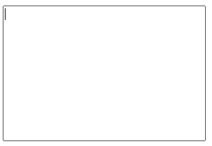

将标签上下对齐放：**文本域会多放一些空格、空行**


（2）

因为这个能输入多少个字符受字体大小和字体类型影响，所以我们**一般不这么设置行rows和列cols**，我们**一般是用css设置**。默认是宽和高都可以**拉右下角变大**

<div>
   <textarea cols="30" rows="10" placeholder="请输入意见"></textarea>
</div>
**css设置宽高**：即使用css固定了文本域的宽和高，它的大小也是可以通过拉右下角变大的

```html
    <style>
        textarea{
            width: 300px;
            height: 300px;
        }
    </style>
```

**resize属性**：**控制宽和高固定**，resize是重新设置大小的意思，有四个属性值：**vertical、horizontal、both、none；**

+ **vertical**：设置垂直方向上的大小（**垂直拖拽**），水平方向上固定大小（不可以拖拽）。  vatical垂直

+ **horizontal**：设置水平方向上的大小（**水平拖拽**），垂直方向上高度固定（不可以拖拽）。  horizontal水平

+ **both**：是**两个都可以扩大**，也是**默认值**

+ **none**：是**都不能扩大**，**都固定**。<span style="color:red">防止拖拽文本域</span>，此时没有右下角的拉动效果。

```css
textarea{
            width: 300px;
            height: 300px;
            /* resize: vertical; */
            /* resize: horizontal; */
            /* resize: both; */
               resize: none;
        }
```


### 6、字段集fieldset


最外面**有一个边框而且边框上还有一个小的缺口放了文字**，字段集效果。

作用：清晰，将一些单选框、复选框分别在一个框框展示。

step1：

```html
<fieldset>  
</fieldset>
```

step2：在fleldset标签里面加上**legend标签**就可以**在边框上加上一个小缺口文字**

```html
<fieldset>
        <legend>性别</legend>
</fieldset>
```


step3：再在里面加上我们的选项（单选框、复选框、文本框等等）标签：

```html
<fieldset>
        <legend>性别</legend>
        <input type="radio" name="aaa">男<br>
        <input type="radio" name="aaa">女
</fieldset>
```


## HTML5新增


### 新增语义化标签


语义化：**见名知意的标签**

1. 代码结构清晰，**方便阅读**，有利于团队合作开发。
2. 方便其他设备解析（如屏幕阅读器、盲人阅读器、移动设备）以语义的方式来渲染网页。
3. 有利于搜索引擎优化（SEO）。


### 新增音频audio标签

音频也是支持三种格式：**mp4,Wav,Ogg.**


所以一般的时候音频文件都使用mp3.

**格式：**

```html
<audio src="文件地址" controls="controls"></audio>
```

属性：


+ **src：属性值音频的URL**

+ **controls**: **属性值也是controls**（所以可以省略），向用户**显示控制栏**（播放按扭，声音）

+ **loop：属性值也是loop**，**循环播放**，播放完，重新开始播放 loop循环

+ **autoplay：属性值也是autoplay，自动播放**，就绪后马上播放。（谷歌浏览器禁止了，只能通过后面js完成）

+ **muted**：规定播放时**静音**


### 新增视频video标签


语法：

```html
<video src="文件地址" controls="controls"></video>
```

属性：


+ **poster：属性值图片的URL**，规定**视频下载时显示的图象**，或者在用户点击**播放按扭前显示的图象**。当设置了自动播放`autoplay`，就会直接播放，就不用该属性了。

+ **height：**设置播放器的**高度**

+ **width：**设置播放器的**宽度**

也可以通过**CSS设置**宽高，理解为一个盒子，可以设置宽高。

```css
  <style>
    video {
      width: 100%;
    }
  </style>

  <video src="media/mi.mp4"   autoplay muted loop poster="media/mi9.jpg"></video
```

总结：

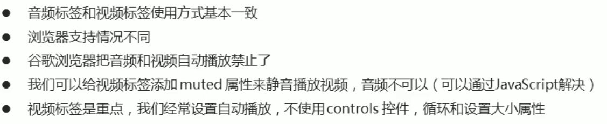

需要注意一下：

- 谷歌浏览器把音频和视频的自动播放`autoplay`禁止了，所以视频需要添加`muted`属性。但是音频不能通过`muted`控制，需要js进行控制。
- 一般网页中视频经常设置为自动播放`autoplay`，所以不适用`controls`，当然如果有需要也是通过js来实现，毕竟为了显示的ui统一。


### 增强表单-input


**（1）type="color"颜色属性值**

这个单独的type=“color”input标签是没有什么意义的，要配合form标签使用，这个颜色属性值，结果如上面所示，可以选择颜色，可以通过吸管工具或者直接点击颜色区域选择，这个功能是为了**让用户选择自己想要的颜色，然后提交给后端的**，看下面点击提交以后，**网页的网址就会加上对应颜色值**，默认黑色

<div>
        颜色选择:<input type="color" name="color">
       <input type="submit" name="submit">
</div>
**（2）type="email"邮箱属性值**

填入**正确的邮箱格式（空白提交也可以）**，**一定要加@**，不然网页就会提示你**邮箱格式不正确**，填好了，点击提交，此时的**网址就会加上你的邮箱信息**，当然是必须要在input里**写上name属性**才可以。

<div>
        邮箱:<input type="email" name="email" >
        <input type="submit" >
</div>


**(3）type="url"网址属性值**

这个网址输入的时候，**一定要输入完整的网址**，要**加上**前面的**http/https协议**，不然他就会提示你请输入网址。

<div>
      url地址(完整地址):<input type="url" name="url">
</div>
**（4）type="tel"电话号码属性值**

这个tel属性值，在**手机端可以用**，在电脑端因为能输入字母所以就没什么用

<div>
     电话号码:<input type="tel">
</div>
**（5）type="range"滑块属性值**

range里面的属性：

+ **min**是滑块最左边代表的值，

+ **max**是滑块最右边代表的值，

**默认滑块最左边是0，最右边是100**，现在设置了以后，**滑块就从min到max了**，

+ **value设置的是初始值**，默认是0-100或者设置了min-max的**中间值**

+ **step是步长**，从左到右滑动滑块**默认步长是1**，现在设置了步长，step=”10“   那**滑块滑一次**就是10,。

<div>
    滑块效果:<input type="range" name="range" min="100" max="200" value="100" step="10">
</div>
**（6）type="number"数字类型属性值**

<div>
   数字类型:<input type="number" name="number" >
</div>


只写上面这个属性的话，结果可以输入多个数字，**点击右边那个上下的箭头可以变大变小**

属性（和range差不多）：

+ **min和max**值，那输入框里的数字就只能在这**两个值之间**，

+ **value：设置初始数字值**

+ **step：点上下箭头一次加或减属性值**，step="3"，点一下+-3

<div>
   数字类型:<input type="number" name="number"        min="0" max="10" value="3" step="2">
</div>
**（7）type="search"属性值**

就是可以输入东西，就多了个后面的**X号**，点击X号会清除你所写的内容

<div>
       搜索:<input type="search" name="search">
</div>
**（8）type="date | month | week | time | datetime-local"日期属性值（最重要）**

<div>
            日期选择:<input type="date">
            月份选择:<input type="month">
            周数选择:<input type="week">
               时间:<input type="time">
            <input type="datetime-local">
</div>


### 增强表单-数据列表

**数据列表**（**选项列表**）：这个选项列表是比如我们在淘宝搜索框输入了一些词，然后搜索框下面会出现一些词供你选和参考，这就是数据列表。


格式：


```html
<!-- 数据列表、选项列表 -->
    <input type="text" list="mylist" >
    <!--普通输入框,通过list属性绑定数据列表-->

    <datalist id="mylist">
        <option value="手机"></option>
        <option value="手表"></option>
        <option value="手办"></option>
        <option value="手套"></option>
        <option value="手环"></option>
        <option value="手镯"></option>
        <option value="手抓饭"></option>
        <option value="手抓饼"></option>
        <option value="手打牛肉丸"></option>
    </datalist>
```

可以达到上面图片那种的**模糊查找**功能

普通的输入框 type="text"，通过list属性和数据列表datalist绑定，**list属性值**和**datalist里面的选择器id值**相同


### 增强表单-属性


**autofocus属性**：**聚焦**，作用给文本框、单复选框或按扭控件加上该属性，打开页面时，**该框自动获得国标焦点**，只能一次用在一个标签身上（一个页面就一个）；

**multiple属性**：可以**输入一个或多个值**，每个值之间用**逗号（英文）**分开。常用于**上传文件 type="file"**，选择多个文件

**required属性**：是**验证输入不能为空**。

**pattern属性**：将**属性值**设为**某个格式的正则表达式**，在提交时会**检查其内容是否符合给定的格式**。

```HTML
    <form action="">
    <input type="search" name="sear" id="" required="required" placeholder="pink老师" autofocus="autofocus"
      autocomplete="off">
    <input type="file" name="" id="" multiple="multiple">
    <input type="text" pattern="[0-9][A-Z]{3}" placeholder="输入内容：一个数字和三个大写字母">
    <input type="submit" value="提交">
  </form>
```


### 广义的HTML5


------


# CSS

## CSS简介


## CSS语法规范

使用HTML时，需要遵从一定的规范，CSS也是如此。要想熟练地使用CSS对网页进行修饰，首先需要了解CSS样式规则。


（1）**每个CSS样式**由两部分组成，即**选择符**（器）和**声明**，声明又分为**属性和属性值**；

（2）属性必须放在**花括号**{}中，属性与属性值用**冒号:**连接；

（3）每条声明用**分号;**结束。

（4）当一个属性有多个属性值的时候，**属性值与属性值不分先后顺序**，用**空格**隔开。

**选择器（选择符 ：标签、.class、#id、*等）{**

​     **属性：属性值；**//声明

​    **属性：属性值1    属性值2....**;

**}**

脸{

​      眼睛：放大1公分;

​      鼻子：垫高1公分;

​      嘴：缩小1公分  上嘴唇  下嘴唇;

}


## CSS代码风格

符合实际开发书写方式

**1）样式格式书写**


**2）样式大小写风格**


**3）样式空格风格**


## CSS-引入到HTML的方式

### 1、行内样式


**内联样式-嵌入式样式**-- 在HTML**元素中**使用**"style" 属性**

当特殊的样式需要**应用到个别元素**时，就可以使用内联样式。

```html
<p style="color:blue;margin-left:20px;">这是一个段落。</p>
```

### 2、内部样式表

在HTML文档头部 <head> 区域使用<style> 元素 来包含CSS

```html
<head>
<style type="text/css">
   body {background-color:yellow;}
   p {color:blue;}
</style>
</head>
```

### 3、外部引用

 使用外部 CSS 文件，利用**link**或者**import**引入css文件

```html
<head>
<link rel="stylesheet" type="text/css" href="css文件路径"> //case1
    
<style type="text/css">
    @import url("css文件的路径")  //case2
</style>
</head>
```


二者差别：

a.link属于XHTML标签，而@import完全是CSS提供的一种方式

b.**link引用的CSS会同时被加载**，而**@import引用的CSS**会等到**页面全部被下载完再被加载**，所以加载时页面没有样式，速度会慢

rel=relation  stylesheet样式表

最好的方式是通过外部引用CSS文件.


### 样式表的优先级

**前提是相同的属性**，三种方式就近原则，**1行内>2内部>3外部**

但是 **!import可以改变优先级**，谁有谁高级


## CSS-选择器

选择器的作用：

为什么要用选择器？

​        要使用CSS对HTML页面中的**元素**实现**一对一，一对多，多对一**的控制，这就需要用到CSS选择器。

​        选择器（选择符）就是根据不同需求把不同的标签选出来。简单来说，就是<span style="color:red">选择标签用的</span>

### 1、基础（简单）选择器

#### 1）标签选择器


**标签名（element选择器）**如：`div{width:100px; height:100px; background:red;}`

**语法：`标签名称 {属性: 属性值}`** 

缺点：范围很广，**所有的标签都会改变**

说明：

a）元素选择符就是以**文档语言对象类型**作为选择符，即使用结构中元素名称作为选择符

b）**所有的页面元素（标签）**都可以作为选择符

```html
<style>
    /* 标签选择器 : 写上标签名 */
    p {
        color: green;
    }
    div {
        color: pink;
    }
</style>
```

#### 2）class类选择器


**class选择器/类选择器**：`.class名 {属性：属性值;}`

说明：

a）当我们使用class选择符时，应**先为每个元素定义一个class名称**

b）class选择符的语法：如

```html
<div class="top1 top2  （可以选择多个类，空格隔开）"></div>

.top1{width:200px;  height:100px;  background:green;}
```

**多类名：**

使用场景：


一个标签可以选**多个类名**，（一个类也可以被多个标签选中），多个类名之间必须用**空格隔开**，若多个类中有相同的属性，看style里面位置—**后面优先**（**id选择器不行）**

用法：class选择符更适合定义一类样式

```html
  <style>
    .box {
      width: 150px;
      height: 100px;
      font-size: 30px;
    }
    .red {
      background-color: red;
    }
    .green {
      background-color: green;
    }
  </style>

  <div class="box red">红色</div>
  <div class="box green">绿色</div>
  <div class="box red">红色</div>
```

#### 3）id选择器

语法：`#id名 {属性：属性值;}`

说明：

a）当我们使用id选择符时，应**先为每个元素定义一个id属性**

如：`<div id="box"></div>`

b）id选择符语法是 **"#"加上自定义的id名**。如

```html
#box{width:300px;   height:300px;}
```

c）起名时要取英文名，不能用关键字：（所有的标记和属性都是关键字）

d）**<span style="color:red;">一个id名称只能对应文档中一个具体的元素对象。（唯一性）</span>>**虽然效果会显示，但是不建议，**一一对应**

```html
    <style>
        #box1{
            background-color: yellow;
        }
        #box2{
            background-color: red;
        }
        #box3{
            background-color: green;
        }
    </style>
<body>
    <div id="box1">11111111111</div>
    
    <!-- 不可以多选，否则都没有作用 -->
    <div id="box1  box2">111111111111111</div>
    
    <!-- 不建议，一个id只能对应文档中一个元素对象 -->
    <div id="box1">aaaaaaaaaaaaa</div>
    
    <div id="box2">22222222222</div>
    <div id="box3">33333333333</div>
</body>
```

#### 4）*通配符选择器

语法：`* {属性：属性值;}`

说明：通配选择符的写法是**"*"**，其含义就是 **<span style="color:red">所有元素</span>**。

`* {margin:0;  padding:0;}`：代表**清除所有元素的默认边距值和填充值**。这是一个常用的做法


```html
  <style>
    * {
      margin: 0;
      /*外边距*/
      padding: 0;
      /*内边距*/
     }
  </style>

    <h1>标题</h1>
    <div>1111111111</div>
    <ul>
      <li>111111</li>
      <li>222222</li>
      <li>333333</li>
    </ul>
```

#### 5）,群组（并集）选择器

**群组选择器**:  **多个选择器共用一个声明**

语法：**`选择符1，选择符2，选择符3......{属性：属性值;} ` 如：#top1,#nav1,h1,.box{width:300px;}**


说明：当有**多个选择符**要应用**相同的声明**时**，可以将选择符用**","**逗号**分隔的方式，合并为一组。节约代码量


### 2、组合器选择器

组合器是解释**选择器之间关系**的某种机制。

CSS 选择器可以包含多个简单选择器。在简单选择器之间，我们可以包含一个组合器。

CSS 中有四种不同的组合器：

- 后代选择器 (空格)
- 子选择器 (`>`)
- 相邻兄弟选择器 (`+`)
- 通用兄弟选择器 (`~`)

#### 1）后代选择器 (空格)

后代选择器匹配属于**指定元素后代的所有元素**。

语法： **`选择符1  选择符2,选择符3... {...}`**  


多个后代用**空格**隔开，在选择符1下面的选择符2（孩子）才有效果，包括孙子，只要是选择符1下面的所有选择符2都有效果

**标签里面的包含标签有相对应效果**

```html
  <style>
    div p,b {
      background-color: yellow;
    }

    p b {
      background-color: red;
    }
  </style>

  <!-- div p  包含（后代）选择器，在div下的所有p,b标签才有效果,在p下的所有b才有对应效果 -->
  <div>
    hahahaha<!--没有效果-->
    <p>
      11111111111111111111
    </p>
    <b>44444444444444444444
      <p>55555555555555555</p> <!--孙子也有效果-->
    </b>
  </div>
  <p>
    <b>22222222222222222222</b>
  </p>
  <div>
    <b>333333333333333333</b>
  </div>
```

#### 2）子选择器 (`>`)

防止后代有嵌套，导致有重复标签（比如列表）

子选择器匹配属于**指定元素子元素的所有元素**。

语法：**`选择器 > 标签 {...}`**       ”亲儿子“，标签会嵌套，但是这种就只会对**亲儿子**有效果，对儿子嵌套的标签（孙子）没效果

```html
  <style>
    div>p {
      background: yellow;
    }
  </style>

  <div>
    <p>div 中的段落 1。</p>
    <p>div 中的段落 2。</p>
    <!-- 非子但属后代 -->
    <section>
      <p>div 中的段落 3。</p>
    </section>
    <p>div 中的段落 4。</p>
  </div>
```

段落1、2、4都有效果。

```html
  <style>
    .nav>a {
      color: red;
    }
  </style>

  <div class="nav">
    <a href="#">我是儿子</a>
    <p>
      <a href="#">我是孙子，没有效果</a>
    </p>
  </div>
```


#### 3）相邻兄弟选择器 (`+`)

相邻兄弟选择器匹配**所有作为指定元素的同级且相邻的第一个元素（第一个兄弟）**。

兄弟（同级）元素必须具有相同的父元素，“相邻”的意思是“紧随其后”。

```html
  <style>
    b+p {
      background: yellow;
    }
  </style>

  <h1>相邻兄弟选择器</h1>
  <div>
    <b>1111111111</b>
    <!-- b+p：b和p具有相同父元素div，在b后面紧随其后的p元素有效果（b的第一个兄弟） -->
    <p>2222222222</p>
    <p>3333333333</p>
  </div>
```


#### 4）通用兄弟选择器 (`~`)

通用兄弟选择器匹配属于**指定元素的同级元素的所有元素**。

```html
  <style>
    b+p {
      background: yellow;
    }
  </style>

  <h1>相邻兄弟选择器</h1>
  <div>
    <b>1111111111</b>
    <!-- b+p：b和p具有相同父元素div，在b后面所有的兄弟p元素有效果 -->
    <p>2222222222</p>
    <p>3333333333</p>
  </div>
```


### 3、伪类选择器

作用：伪类用于**定义元素的特殊状态**。<span style="color:red">定义元素特定状态时的样式</span>（悬停、复选框选中、获得焦点等等）

例如，它可以用于：

- 设置鼠标悬停在元素上时的样式
- 为已访问和未访问链接设置不同的样式
- 设置元素获得焦点时的样式

语法：

```html
selector:pseudo-class {
  property: value;
}
```

所有的伪类：

| 选择器                                                       | 例子                  | 例子描述                                                     |
| :----------------------------------------------------------- | :-------------------- | :----------------------------------------------------------- |
| [:active](https://www.w3school.com.cn/cssref/selector_active.asp) | a:active              | 选择活动的链接。                                             |
| [:checked](https://www.w3school.com.cn/cssref/selector_checked.asp) | input:checked         | 选择每个被选中的 <input> 元素。                              |
| [:disabled](https://www.w3school.com.cn/cssref/selector_disabled.asp) | input:disabled        | 选择每个被禁用的 <input> 元素。                              |
| [:empty](https://www.w3school.com.cn/cssref/selector_empty.asp) | p:empty               | 选择没有子元素的每个 <p> 元素。                              |
| [:enabled](https://www.w3school.com.cn/cssref/selector_enabled.asp) | input:enabled         | 选择每个已启用的 <input> 元素。                              |
| [:first-child](https://www.w3school.com.cn/cssref/selector_first-child.asp) | p:first-child         | 选择作为其父的首个子元素的每个 <p> 元素。                    |
| [:first-of-type](https://www.w3school.com.cn/cssref/selector_first-of-type.asp) | p:first-of-type       | 选择作为其父的首个 <p> 元素的每个 <p> 元素。                 |
| [:focus](https://www.w3school.com.cn/cssref/selector_focus.asp) | input:focus           | 选择获得焦点的 <input> 元素。                                |
| [:hover](https://www.w3school.com.cn/cssref/selector_hover.asp) | a:hover               | 选择鼠标悬停其上的链接。                                     |
| [:in-range](https://www.w3school.com.cn/cssref/selector_in-range.asp) | input:in-range        | 选择具有指定范围内的值的 <input> 元素。                      |
| [:invalid](https://www.w3school.com.cn/cssref/selector_invalid.asp) | input:invalid         | 选择所有具有无效值的 <input> 元素。                          |
| [:lang(*language*)](https://www.w3school.com.cn/cssref/selector_lang.asp) | p:lang(it)            | 选择每个 lang 属性值以 "it" 开头的 <p> 元素。                |
| [:last-child](https://www.w3school.com.cn/cssref/selector_last-child.asp) | p:last-child          | 选择作为其父的最后一个子元素的每个 <p> 元素。                |
| [:last-of-type](https://www.w3school.com.cn/cssref/selector_last-of-type.asp) | p:last-of-type        | 选择作为其父的最后一个 <p> 元素的每个 <p> 元素。             |
| [:link](https://www.w3school.com.cn/cssref/selector_link.asp) | a:link                | 选择所有未被访问的链接。                                     |
| [:not(*selector*)](https://www.w3school.com.cn/cssref/selector_not.asp) | :not(p)               | 选择每个非 <p> 元素的元素。                                  |
| [:nth-child(*n*)](https://www.w3school.com.cn/cssref/selector_nth-child.asp) | p:nth-child(2)        | 选择作为其父的第二个子元素的每个 <p> 元素。                  |
| [:nth-last-child(*n*)](https://www.w3school.com.cn/cssref/selector_nth-last-child.asp) | p:nth-last-child(2)   | 选择作为父的第二个子元素的每个<p>元素，从最后一个子元素计数。 |
| [:nth-last-of-type(*n*)](https://www.w3school.com.cn/cssref/selector_nth-last-of-type.asp) | p:nth-last-of-type(2) | 选择作为父的第二个<p>元素的每个<p>元素，从最后一个子元素计数 |
| [:nth-of-type(*n*)](https://www.w3school.com.cn/cssref/selector_nth-of-type.asp) | p:nth-of-type(2)      | 选择作为其父的第二个 <p> 元素的每个 <p> 元素。               |
| [:only-of-type](https://www.w3school.com.cn/cssref/selector_only-of-type.asp) | p:only-of-type        | 选择作为其父的唯一 <p> 元素的每个 <p> 元素。                 |
| [:only-child](https://www.w3school.com.cn/cssref/selector_only-child.asp) | p:only-child          | 选择作为其父的唯一子元素的 <p> 元素。                        |
| [:optional](https://www.w3school.com.cn/cssref/selector_optional.asp) | input:optional        | 选择不带 "required" 属性的 <input> 元素。                    |
| [:out-of-range](https://www.w3school.com.cn/cssref/selector_out-of-range.asp) | input:out-of-range    | 选择值在指定范围之外的 <input> 元素。                        |
| [:read-only](https://www.w3school.com.cn/cssref/selector_read-only.asp) | input:read-only       | 选择指定了 "readonly" 属性的 <input> 元素。                  |
| [:read-write](https://www.w3school.com.cn/cssref/selector_read-write.asp) | input:read-write      | 选择不带 "readonly" 属性的 <input> 元素。                    |
| [:required](https://www.w3school.com.cn/cssref/selector_required.asp) | input:required        | 选择指定了 "required" 属性的 <input> 元素。                  |
| [:root](https://www.w3school.com.cn/cssref/selector_root.asp) | root                  | 选择元素的根元素。                                           |
| [:target](https://www.w3school.com.cn/cssref/selector_target.asp) | #news:target          | 选择当前活动的 #news 元素（单击包含该锚名称的 URL）。        |
| [:valid](https://www.w3school.com.cn/cssref/selector_valid.asp) | input:valid           | 选择所有具有有效值的 <input> 元素。                          |
| [:visited](https://www.w3school.com.cn/cssref/selector_visited.asp) | a:visited             | 选择所有已访问的链接。                                       |


#### 锚（链接）伪类


```css
/* 下面表示，超链接初始状态link和访问过后visited的状态是一样的，
           而鼠标悬停hover和激活（按下时）active状态是一样的，这是常用的一种方式*/
    a {
      color: green;
    }
    a:hover {
      color:blue
    }

第二种：
    /*超链接的初始状态*/
    a:link {
      color: black;
    }
    /* 超链接的访问状态*/
    a:visited {
      color: green;
    }
    /* 超链接的鼠标悬停状态*/
    a:hover {
      color: blue;
    }
    /* 超链接的激活（按下时）状态*/
    a:active {
      color: red;
    }
```

伪类可以与 CSS 类结合使用：

1. 当鼠标悬浮在`<div>`标签这个样式上的时候，a的背景颜色设置为黄色

```css
div:hover{
    background-color : yellow;
}
```

2.  使用a 控制其他块的样式：

   **使用a控制a的后代元素 b**：指针悬停a的元素上，b的效果

   ```css
   .a:hover .b {
       background-color:blue;
   }
   ```

​       这里的a是标签,不仅仅只用于a标签, 也可以是**别的选择器**,  比如

```css
.info:hover .date{
    color: white ;
}
```

```html
  <style>
    p {
      display: none;
      background: yellow;
      padding: 10px;
    }
    div:hover p {
      display: block;
    }
  </style>

  <div>
    鼠标悬停在div上，就显示p元素信息
    <p>我显示了</p>
  </div>
```


#### 结构伪类


这里**E**不代表父元素，而是**要被选择的子元素**，比如 li，而不是ul，父元素是默认的，可能有有很多。


**E:nth-child(n)**   当n是数字时，选中第n个子元素。


```css
    /* 1.把所有的偶数 even的孩子选出来 */
    ul li:nth-child(even) {
      background-color: green;
    }

    /* 2.把所有的奇数 odd的孩子选出来 */
    ul li:nth-child(odd) {
      background-color: yellow;
    }

    /* 3.nth-child(n) 从0开始 每次加1 往后面计算  这里面必须是n 不能是其他的字母 选择了所有的孩子*/
    ol li:nth-child(n) {
      background-color: pink;
    }

    /* 4.nth-child(2n)选择了所有的偶数孩子 等价于 even*/
    ol li:nth-child(2n) {
      background-color: pink;
    }

    /* 5.nth-child(2n+1)选择了所有的奇数孩子 等价于 odd */
    ol li:nth-child(2n+1) {
      background-color: skyblue;
    }

    /* n从0开始，0+3=3，选中3以后的所有孩子 */
    ol li:nth-child(n+3) {
      background-color: pink;
    }

    /* 选中前3个孩子 */
    ol li:nth-child(-n+3) {
      background-color: pink;
    }
 
  <ul>
    <li>我是第1个孩子</li>
    ...
  </ul>
  <ol>
    <li>我是第1个孩子</li>
    ...
  </ol>
```


**E:first-child**伪类和**E:last-child**伪类经常会引起误解。例如 **`li:first-child`** 是用来定位**！！！所有`<li>`元素中所有第一个作为  子级元素的li元素**，而不是定位`<li>`元素的第一个子级元素。除非指定父元素，`ul li:first-child`。

**E:only-child**	用来定位一个父元素下**仅有的一个子元素E**，**没有任何兄弟元素的元素**，独生子女

**E:empty**	用来定位一个**没有子级元素的元素E**，并且**该元素E也没有任何文本内容**，空格都不行

**E:root**	用来定位 HTML 页面中的**根元素**（<html>）

```html
  <style>
    li:first-child {
      background-color: pink;
    }
    li:last-child {
      background-color: green;
    }
    li:nth-child(3) {
      background-color: yellow;
    }
    li:only-child {
      background-color: grey;
    }
  </style>

  <ol>
    <li>1</li>
    <li>2</li>
    <li>3</li>
    <li>4</li>
    <li>5</li>
  </ol>
  <ul>
    <li>1</li>
    <li>2</li>
    <li>3</li>
    <li>4</li>
    <li>5</li>
  </ul>
  <ul>
    <li>1</li>
  </ul>
```


**E:first-of-type**	用来定位**一组同类型的兄弟元素**中的**第一个元素**

**E:last-of-type**	用来定位**一组同类型的兄弟元素**中的**最后一个元素**

**E:nth-of-type(n)**	用来定位**一组同类型的兄弟元素**中的**正序第n个元素**

**E:nth-last-of-type(n)**	用来定位**一组同类型的兄弟元素**中的**倒序第n个元素**

其实用法跟上面的差不多，但是有区别：nth-child 会把所有的盒子都排列序号

```css
    ul li:first-of-type {
      background-color: pink;
    }

    ul li:last-of-type {
      background-color: pink;
    }

    /* ul li:nth-of-type(even) {
      background-color: skyblue;
    } */

    /* nth-child 会把所有的盒子都排列序号 */
    /* 执行的时候首先看  :nth-child(1) 之后回去看 前面的div */
    /* 这里没有效果，先把所有盒子排序：光头强p为1，熊大div为2，熊二div为3，先选择序列号1，但不是div而是p，所有没选中 */
    section div:nth-child(1) {
      background-color: red;
    }

    /* nth-of-type 会把指定元素的盒子排列序号 */
    /* 执行的时候首先看  div指定的元素  之后回去看 :nth-of-type(1) 第几个孩子 */
    /* 这里有效果，选中一系列div中第1孩子div */
    section div:nth-of-type(1) {
      background-color: blue;
    }
  </style>
</head>

<body>
  <ul>
    <li>我是第1个孩子</li>
    <li>我是第2个孩子</li>
    <li>我是第3个孩子</li>
    <li>我是第4个孩子</li>
    <li>我是第5个孩子</li>
    <li>我是第6个孩子</li>
    <li>我是第7个孩子</li>
    <li>我是第8个孩子</li>
  </ul>
  <!-- 区别 -->
  <section>
    <p>光头强</p>
    <div>熊大</div>
    <div>熊二</div>
  </section>
```


#### 目标伪类

**E:target{}** 用来匹配页面的URL中**某个标识符的目标元素**

用来**匹配锚点指向的元素**，突出显示活动的HTML锚

该类选择器是动态选择器，只有在该选择器以**指向元素时，才能显示效果**。

```html
  <style>
    div.contain {
      display: none;
    }

    div.contain:target {
      display: block;
    }
  </style>

  <div>
    <a href="#aaa">aaa</a>
    <div id="aaa" class="contain">
      Lorem ipsum dolor sit amet, consectetur adipisicing elit. Voluptates quidem ea autem delectus corrupti, tenetur ex
      assumenda ratione voluptatibus architecto. Fugit velit iste dicta, beatae id consectetur eos accusantium incidunt!
    </div>
  </div>
  <div>
    <a href="#bbb">bbb</a>
    <div id="bbb" class="contain">
      Lorem ipsum dolor sit amet, consectetur adipisicing elit. Voluptates quidem ea autem delectus corrupti, tenetur ex
      assumenda ratione voluptatibus architecto. Fugit velit iste dicta, beatae id consectetur eos accusantium incidunt!
    </div>
  </div>
  <div>
    <a href="#ccc">ccc</a>
    <div id="ccc" class="contain">
      Lorem ipsum dolor sit amet, consectetur adipisicing elit. Voluptates quidem ea autem delectus corrupti, tenetur ex
      assumenda ratione voluptatibus architecto. Fugit velit iste dicta, beatae id consectetur eos accusantium incidunt!
    </div>
  </div>
```


#### UI元素状态伪类

**E:enabled**  匹配所有用户界面（form表单）中处于**可用状态**的E元素

**E:disabled** 匹配所有用户界面（form表单）中处于**不可用状态**的E元素

**E:checked** 匹配所有用户界面（form表单）中处于**选中状态**的E元素

**E:focus** 匹配**获得鼠标焦点**的E元素

**E:selection** 匹配E元素中**被用户选中**或处于**高亮状态**的部分

```html
  <style>
    input {
      width: 200px;
      transition: all .3s;
    }
    /* focus伪类选择器  获得焦点 */
    input:focus {
      width: 300px;
    }
  </style>

  <input type="text">
```

```html
  <style>
    input:enabled {
      background: red;
    }

    input:disabled {
      background: yellow;
    }

    input:focus {
      background: blue;
    }

    input:checked {
      background: green;
    }

    div::selection {
      background: yellow;
      color: red;
    }
  </style>

  <input type="text">
  <div>
    <!-- 默认选中这部分文字会是白色字体，蓝色背景 -->
    Lorem ipsum dolor sit, amet consectetur adipisicing elit. Repellendus vitae vero voluptatibus non consectetur quidem
    laudantium. Sunt, officia autem error tempore, omnis minus quos sit obcaecati natus, aliquid debitis consequatur!
  </div>
```


#### 否定和动态伪类


**E:not(selector) { 属性 : 属性值; }**  选择**未被选择器selector所选中**，且类型为**E的元素**


### 4、伪元素选择器

CSS 伪元素用于设置元素指定部分的样式。


- 

 语法：**`选择器:: 伪元素 { 属性：属性值}`**（这里单引号和双引号都可以）

```html
selector::pseudo-element {
  property: value;
}
```


（1）**::after**

伪元素 ::after 能够**在指定元素的 后面 插入一些内容**，是一个<span style="color:red">行内元素</span>

在 ::after 中需要使用 **`content` 属性**来**定义要追加的内容**，而且在 ::after 中必须定义 content 属性才会生效（没有需要插入的内容时可以将 content 属性的值定义为空`""`）。

```css
/*下面的例子在每个 <h1> 元素的内容之后插入一幅图像：*/
h1::after {
  content: url(smiley.gif);
}
<h1>这是一个标题</h1>
```


（2）**::before**

伪元素 ::before 能够**在指定元素的 前面 插入一些内容**

与 ::after 相似，::before 中也需要使用 **`content 属性`**来定义要追加的内容，而且在 ::before 中必须定义 content 属性才会生效（没有需要插入的内容时可以将 content 属性的值定义为空`""`）。

```css
下面的例子在每个 <h1> 元素的内容之前插入一幅图像：
h1::before {
  content: url(smiley.gif);
}
```


（3）**::first-letter**

伪元素 ::first-letter 用来设置**指定元素中内容  第一个字符 的样式**，通常用来配合 **font-size 和 float 属性制作首字下沉效果**。

**注意：**`::first-letter` 伪元素只适用于**块级元素**。

```css
p::first-letter {
  color: #ff0000;
  font-size: xx-large;
}
```


（4）**::first-line**

伪元素`::first-line`用来设置**指定元素中内容 第一行 的样式**

**注意：**`::first-line` 伪元素只能应用于**块级元素**。

```css
p::first-line {
  color: #ff0000;
  font-variant: small-caps;
}
```


（5）**::selection**

伪元素 ::selection 用来**设置对象被选中（双击or拖动）时的样式**，需要注意的是，伪元素 ::selection 中**只能定义元素被选中时的 color、background、cursor、outline 以及 text-shadow（IE11 尚不支持定义该属性）**等属性。

```html
  <style>
    ::selection {
      color: red;
      background: yellow;
    }
  </style>

  <h1>请选择本页中的文本：</h1>
  <p>这是一个段落。</p>
  <div>这是 div 元素中的文本。</div>
```


（6）**::placeholder**

伪元素 ::placeholder 用来设置**表单元素（`<input>`、`<textarea>` 元素）的占位文本**（通过 HTML 的 placeholder 属性设置的文本）


### 5、属性选择器

作用：选择**带有特定属性的 HTML 元素**设置样式


说明：

E——元素

att——属性  什么属性都可以class id name type等等等等

value——属性值

**1.`E[att]`**   选择**具有att属性的E元素**。**E是可以省略的**，如果省略则表示可以匹配满足条件的**任意元素**。

`div[class]{...}`：选中定义了属性class的div元素

```html
   <style>
        /* 属性选择器*/
        div[class] {
            background: yellow;
        }
    </style>

    <div class="box1">div-11111</div>
    <div class="box2">div-22222</div>
    <div>div-33333</div>
    <p class="p1">p-11111</p>
    <p class="p2">p-22222</p>
    <p>p-33333</p>
```


**2.`E[att=“value”]`**	选择**E标记**，且该标记**定义了att属性**，且att**属性值等于value**。**E是可以省略的**，如果省略则表示可以匹配满足条件的**任意元素**。（重点）

```css
/* 选中定义了属性class，且属性值为"box1"的div元素 */
    div[class="box1"]{
        border: 1px solid blue;
    }
/* 只选择 type =text 文本框的input 选取出来 */
    input[type=text] {
      color: pink;
    }
```


**3.`E[att~=“value”]`**	选择**E标记**，且该标记**定义了att属性**，此属性值是一个**词列表，并且以空格隔开**，其中词列表中包含了一个value词，而且等号前面的“〜”不能不写


**4.`E[att^=“value”]`**	选择**E标记**，且该标记**定义了att属性**，att**属性值包含前缀为value的子字符串**。需要注意的是**E是可以省略的**，如果省略则表示可以匹配满足条件的**任意元素**。例如，div[id^=section]表示匹配包含id属性，且id属性值是以“section”字符串开头的div元素。

```css
/* 选择首先是div 然后 具有class属性 并且属性值 必须是 icon开头的这些元素 */
    div[class^=icon] {
      color: red;
    }

  <div class="icon1">小图标1</div>
  <div class="icon2">小图标2</div>
  <div class="icon3">小图标3</div>
  <div class="icon4">小图标4</div>
```


**5.`E[attr$=“value”]`**	选择**E标记**，且该标记**定义了att属性**，att**属性值包含后缀为value的子字符串**。与E[att^=value]选择器一样，**E元素可以省略**，如果省略则表示可以匹配满足条件的**任意元素**。例如，div[id$=section]表示匹配包含id属性，且id属性值是以“section”字符串结尾的div元素。

```css
  section[class$=data] {
      color: blue;
    }
    
  <section class="icon1-data">我是安其拉</section>
  <section class="icon2-data">我是哥斯拉</section>
```


**6.`E[att*=“value”]`**	选择**E标记**，且该标记**定义了att属性**，att**属性值包含value子字符串**。该选择器与前两个选择器一样，**E元素也可以省略**，如果省略则表示可以匹配满足条件的**任意元素**。例如，div[id*=section]表示匹配包含id属性，且id属性值包含“section”字符串的div元素。


### 选择器的权重


群组选择器，逗号隔开，权重并不是几个选择器累加。

**类选择器、属性选择器、伪类选择器 权重都是10**

**伪元素选择器**和标签选择器一样，权重为1


## CSS-文本属性font


### 1、大小、字体

**`font-size`  字体大小**：**单位是px**，浏览器默认**16px**，设计图常用字号是**12px**

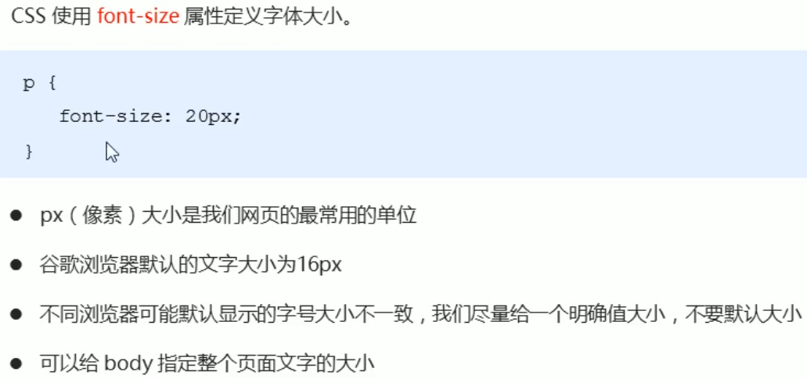


**`font-family`  字体**：当字体是中文字体、英文字体中**有空格时**，**需要加引号**；**多个字体**中间用**逗号**链接，先解析第1个字体，如果没有就解析第2个字体，以此类推。默认**微软雅黑** 


### 2、文字颜色

**color** 三种写法

```html
<style>
        .p1{
            /* color: red;  */

            /* red，green，blue。0-255，0最弱，255最强 */
            /* color: rgb(0, 0, 255); */

            /* 六位十六进制，#000000--#ffffff */
            color: #111111;
        }
</style>
```

开发中最常用的是十六进制


### 3、加粗、倾斜

**`font-weight` 加粗 **   （标签,**`<b></b> <strong></strong>`**）

**font-weight: bolder（更粗的）/ bold (加粗的) / normal（常规，默认）**；

**font-weight:**可以取**100-900**；**100-500不加粗，600-900加粗**（数字后面不跟单位）

+ **100 细体** lighter

+ **400 正常** normal

+ **700 加粗** bold

+  **900 更粗** bolder


**`font-style`  倾斜**         (标签，**`<i></i>  <em></em>`**)

**font-style: **

+ **italic  斜体字 **
+ **oblique  倾斜  **
+ **normal  常规 **

```html
  <style>
      p {
          font-style: italic;
      }
      em {
          /* 让倾斜的字体不倾斜   就是赶紧脉动回来 */
          font-style: normal;
      }
    </style>

    <p>同学,上课时候的你</p>
    <em>下课时候的你</em>
```

注意：平时我们很少给文字加斜体，反而要<span style="color:red;">给斜体标签（em，i）改为不斜体字体</span>


### 4、文本水平对齐、行间距(行高)

**`text-align` 文字水平对齐**

+ **left  水平靠左**
+ **center  水平居中**
+ **right  水平居右**
+ **justify  水平两端对齐**，但**只对多行**起作用。 justify**使全行排满**，一般用于**多行英文文本**

```html
  <style>
    h1 {
      /* 本质是让h1盒子里面的文字水平居中对齐 */
      /* text-align: center; */
      text-align: right;
    }
  </style>

  <h1>水平对齐的标题</h1>
```


**`line-height`行高** ：用于设置行间的距离（行高）。可以控制**<span style="color:red;">文本行与行之间的距离</span>**。

行高改变的是上间距和下间距。但是**整个=行间距**


 **line-height高度=height高度**，可以使**单行文本垂直居中**


如果是多行文本，在line-height=height时，**每行的高度都是该取值**，**会溢出**，后面会学习多行文本的垂直居中显示

```css
<style>
    div {
      /* 单行文本垂直居中 line-height = height */
      line-height: 60px;
      height: 60px;
    }
    p {
      line-height: 40px;
    }
  </style>
```


### 5、首行缩进、文字间距

**`text-indent` 首行缩进**  text-indent可以取**负值**。 indent缩进

text-indent属性**只对第一行起作用**, 

​    a.可以**取两个字体大小的值（看font-size**）

​    b.属性值为**2em，可以任何情况空两个字体大小**

```html
&emsp;&emsp; //两个字体的空格
```

```css
  <style>
    p {
      font-size: 24px;
      /* 文本的第一行首行缩进 多少距离  */
      /* text-indent: 20px; */
      /* 如果此时写了2em 则是缩进当前元素 2个文字大小的距离  */
      text-indent: 2em;
    }
  </style>
```


**文本间距**：**词间距**和**字符间距**

**`letter-spacing`  字(母)间距**   控制**文字和文字**之间的间距，英文文本就是**字母与字母**之间的间距，一般英文文体单位是单词，用word-spacing    letter字母

**`word-spacing`  单词间距**  英文文体中**单词之间**的间距，默认0px，取负值会交叉

```css
<style>
        .p1{
            letter-spacing: 10px;
        }
        .p2{
            letter-spacing: 10px;
        }
        .p3{
            word-spacing: 10px;
        }
</style>
```


### 6、文本修饰线

**`text-decoration` 文本修饰**

**text-decoration：**

+ **none(没有，可用于取消超链接的下划线等类似操作) **

+ **underline(下划线) **

+ **overline(上划线)  **

+ **line-through(删除线)**;

删除线`<del></del>`   `<s></s>`

下划线：`<u></u>`

重点：重点记住<span style="color:red">如何添加下划线？ 如何删除下划线？</span>

```css
.p4 {
     /* text-decoration: underline;
        text-decoration: overline;
        text-decoration: line-through; */
        /* 多属性值，用空格隔开就行 */
        text-decoration: underline overline line-through;
 }

  a {
      /* 取消a默认的下划线 */
      text-decoration: none;
      color: #333;
    }
```


### 7、复合属性、检索大小写

**`text-transform`  大小写**  transform转换

**text-transform：capitalize / lowercase / uppercase / none;**

+ **capitalize首字母大写**  

+ **lowercase小写  **

+ **uppercase大写**

```css
  .p1{
        /* capitalize英文文本每一个单词 首字母 都大写 */
        text-transform: capitalize;   
    }

    .p2{
        /* lowercase英文文本每一个单词的 每一个字母 都小写 */
        text-transform: lowercase;
    }
    .p3{
        /* uppercase英文文本每一个单词的 每一个字母 都大写 */
        text-transform: uppercase;
     }
```


**`font` 文本简写**


**font**是**font-style(倾斜)   font-weight(加粗)   font-size(大小) / line-height(行高)   font-family(字体)**  的简写

**`font：font-style  font-weight  font-size/line-height  font-family`**

eg：font: italic  700  20px / 50px  "宋体" ; 

**顺序不能改变**，必须同时指定**font-size**和**font-family**属性时才起作用

```css
 .box1{
        font: italic 700 30px/50px "宋体";
  }
 .box2{
        font: 20px "宋体";
  }
```


## 元素显示类型

什么是元素显示模式？


### 1、块元素block

`div p h1-h6 ul li ol li dl dt dd table blockqute(块引用) form  marquee  pre  address textarea `

```css
/* 块元素:
    display:block; 
    display:list-item;
*/
   /* p标签放文本可以,不能放块级元素 */
```


（1）**矩形区域**显示。默认情况下，**<span style="color:red;">块元素都会占据一行</span>**。默认情况下，块元素会**按顺序自上而下**的排列（真霸道，**一个块级元素独占一行**）

（2）**元素的高度、宽度、行高以及顶和底边距都可设置**。设置宽高，width、height、margin、padding、border都可控制

（3）元素**宽度**width在不设置的情况下，**是它本身父容器的100%（和父元素的宽度一致）**，除非设定一个宽度。

（4）**块元素一般都作为其他元素的容器**，它可以容纳其他内联元素和块元素。我们把这种容器比喻为一个盒子

块状元素也可以通过代码 **display:inline;** **将元素设置为内联元素**。如下代码就是将块状元素div转换为内联元素，从而使div元素具有内联元素特点。

```css
div{
   display:inline;
 }
<p>
   <div>这里有问题</div>
</p>
```


### 2、行内元素inline

行内元素：

`a  span  br  i  em  strong  b   lable q  var cite  code sup  sub  del u  `


（1）行内元素的表现形式是以**<span style="color:red;">行内逐个进行显示</span>**,  和其他元素都在一行上。**横着排**；

（2）元素的**高度、宽度及上下内外边距（有假象）不可设置**；**<span style="color:red">尽量只能设置左右内外边距</span>**

​          也可以**设置border 会显示完整**，**但左右边框存在宽度**，而上**下边框没有宽度**（假象）

（3）行内元素不可以定义自己的宽度和高度。**元素的宽度**就是**它包含的文字或图片等<span style="color:red;">内容的宽度</span>**，不可改变。

（4）也会遵循盒模型基本规则，但对于margin和padding个别元素不生效

```html
<style>
    span {
      width: 100px;
      height: 100px;
      background-color: hotpink;
    }
  </style>

  <span>pink老师你怎么穿着品如的衣服呢</span> <strong>品如的衣服</strong>
  <span>pink老师</span> <strong>品如的衣服</strong>

  <a href="http://www.baidu.com">
    <a href=""></a>
  </a>
```


### 3、行内块元素inline-block

**行内块元素：同时具备块元素和行内元素的特点**

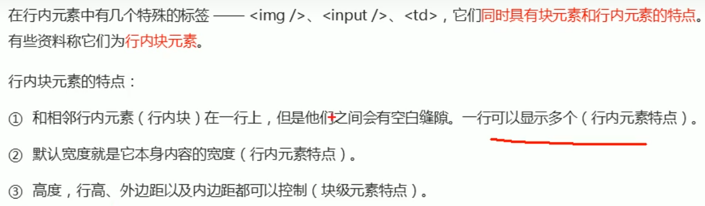

常用的行内块元素有：

`img  input  select  textarea  td`

```css
        /* 行内块元素,可以设置高宽
        display:inline-block */
        img{
            width: 50px;
            height: 50px;
        }
        input{
            width: 100px;
            height: 100px;
        }
```

**盒子模型**

```html
       /* span行内元素 */
        span{
            background: yellow;
            padding: 10px;
            margin: 10px;
            /* 行内元素不能设置上下内外边距,只能设置左右边距 */
        }

        img{
            padding: 10px;
            margin: 10px;
           /* 行内块元素可以设置边距,宽高,具有块元素和行内元素的特点 */
        }
        
        
    <div>111111111111111111111111111111111</div>
    <span>我是span标签</span> <b>11111111111</b>
    <div>11111111111111111111111111111111</div>
    
    
    <div>22222222222222222222222222</div>
```


### 元素类型互相转换


```html
   /*  display:block\list-item;  块元素
       display:inline;           行内元素
       display:inline-block;     行内块元素
   */
  <style>
    a {
      width: 150px;
      height: 50px;
      background-color: pink;
      /* 把行内元素 a 转换为 块级元素 */
      display: block;
    }
    div {
      width: 300px;
      height: 100px;
      background-color: purple;
      /* 把 div 块级元素转换为行内元素 */
      display: inline;
    }
    span {
      width: 300px;
      height: 30px;
      background-color: skyblue;
      display: inline-block;
    }
  </style>

  <a href="#">金星阿姨</a>
  <a href="#">金星阿姨</a>
  <div>我是块级元素</div>
  <div>我是块级元素</div>
  <span>行内元素转换为行内块元素</span>
  <span>行内元素转换为行内块元素</span>
```

**`display: none;`  隐藏**

### 二级菜单

```html
  <style>
    .hide {
      display: none;
    }
    /* .box所作用的标签的指针悬停时，所有的效果 */
    .box:hover {
      background: yellow;
    }
    /* 先让ul正常情况下隐藏起来(link初始状态和visited访问过后的状态) */
    .box ul {
      display: none;
    }
    /* .box所作用的标签指针悬停时，ul的效果 */
    .box:hover ul {
      background: yellow;
      display: block;
    }
  </style>

  <div class="hide">1111111111111111</div>
  <!--此时div不再是block块元素，而是不显示none  -->
  <div class="box">
    军事
    <ul>
      <li>1111111</li>
      <li>2222222</li>
      <li>3333333</li>
    </ul>
  </div>
```


案例：简洁版小米侧边栏


## CSS-列表属性list-style


（1）**定义列表符合样式**     **`list-style-type：disc(实心圆) / circle(空心圆) / square(方形) / none(去掉符号)常用`**

区别无序列表ul里面的type属性

```html
ul里面的属性type=disc，circle，square none 分别是实心圆、空心圆、方形、无-->
    <ul type="square">
            <li>蒸羊羔</li>
            <li>蒸熊掌</li>
            <li>烧花鸭</li>
    </ul>
```


（2）**将图片设置为列表符合样式**   **`list-style-image：url(路径);`**

可以将列表前面的**序列**换成自己想要的**图片**，效果更加

```css
        .li1{
            list-style-image: url(./image/1.jpg);
        }
        .li2{
            list-style-image: url(./image/2.jpg);
        }
        .li3{
            list-style-image: url(./image/3.jpg);
        }
 
    <ul>
        <li class="li1">111111</li>
        <li class="li2">222222</li>
        <li class="li3">333333</li>
    </ul>
```


（3）设置**列表项标记的放置位置**     **list-style-position**

**`list-style-position：outside;`** 列表的**外面**  默认值

**`list-style-position：inside;`** 列表的**里面**

```html
     li{
            border: 1px solid red;
            /* 序列在里面还是外面 */
            list-style-position: inside; 
        }
```


（4）**简写  list-style** 

**`list-style：list-style-type  liast-style-image  liasy-style-position ;`**

三个属性值**顺序可以随意改变**

**`list-style：none;`**  这是**最常用**的，**去除列表符号**，这样就可以自定义列表符号了。

```css
   .box{ 
          /* list-style: none url(./image/1.jpg) inside; */
          list-style: none;
        }
```


## CSS-背景属性background


### **1、**背景颜色

**`background-color: transparent | color`**

属性值：

+ `transparent`：背景色**透明**
+ `color`：颜色的三种写法


#### （1）背景颜色半透明


```css
  div {
      width: 300px;
      height: 300px;
      /* background-color: black; */
      /* background: rgba(0, 0, 0, 0.3); */
      background: rgba(0, 0, 0, .3);
    }
```


### 2、背景图片、大小

  **`background-image: none | url();`**


说明：

 一般小图标、装饰的小图片、超大背景图不要用插入图片img，使用背景图片`background-image: url(...);`，方便调整位置

当图片较小，默认是**平铺占满**整个区域

当图片较大，大于区域时，图片会占满整个区域，而且**显示不完整**

```css
 div {
      width: 300px;
      height: 300px;
      background-color: yellow;
      /* 背景图片background-image:url(); */
      background-image: url(./images/logo.png);
      /* 当图片较小时，默认是平铺（x,y都平铺 repeat）占满整个区域 */
      /* 当图片较大，大于区域时，图片会占满整个区域，而且显示不完整 */
    }
```


**background-size——背景图片的大小（缩放）**, 可以定义背景图片的大小，可能会导致变形


**`background-size：width图片宽度  height图片高度;`**

只写**一个参数**时，肯定**是宽度width的值**，高度省略了，会等比例缩放。

写百分比单位时，相对于**父盒子**的宽高。

```css
 background-size: cover;
      /* 
      1.  400px  400px
      2.  100%  100%   百分比相对于父盒子的宽高
      3.  cover：把背景图片扩展至足够大，以使背景图片完全覆盖背景区域,也许无法显示在背景定位区域中  cover 覆盖
      4.  contain：把图象扩展至最大尺寸，以使其宽度和高度完全适应内容区域。铺不满盒子，留白  contain包含
      */
```

```css
    div {
      width: 500px;
      height: 500px;
      border: 2px solid red;
      background: url(images/dog.jpg) no-repeat;
      /* background-size: 图片的宽度 图片的高度; */
      background-size: 500px 200px;
      /* 1.只写一个参数 肯定是宽度 高度省略了  会等比例缩放 */
      background-size: 500px;
      /* 2. 里面的单位可以跟%  相对于父盒子来说的 */
      background-size: 50%;
      /* 3. cover 等比例拉伸 要完全覆盖div盒子  可能有部分背景图片显示不全 */
      background-size: cover;
      /* 4. contain 高度和宽度等比例拉伸 当宽度或者高度 铺满div盒子就不再进行拉伸了 可能有部分空白区域 */
      background-size: contain;
    }

  <div></div>
```

cover：


contain：


### **3**、背景图片的平铺

**background-repeat——背景图片的平铺**。

当图片较小时（或者图片没有覆盖满区域），**图片小于指定的区域**，需要适合的平铺效果，或者不平铺。

**`background-repeat: no-repeat | repeat | repeat-x | repeat-y;`**

+ **no-repeat**  不会平铺
+ **repeat**  x、y都会平铺（默认值）
+ **repeat-x**  平铺满x方向
+ **repeat-y**  平铺满y方向

注意：页面元素既可以添加**背景颜色background-color**也可以添加**背景图片background-image**，只不过**<span style="color:red">背景图片会压住背景颜色</span>**

```css
/* 当图片较小时，默认是平铺占满整个区域x、y方向都平铺 */
/* background-repeat 设置背景平铺 */
  div {
      width: 300px;
      height: 300px;
      background-color: pink;
      background-image: url(images/logo.png);
      /* 1.背景图片不平铺 */
      background-repeat: no-repeat;
      /* 2.默认的情况下,背景图片是平铺的 */
      /* background-repeat: repeat; */
      /* 3. 沿着x轴平铺 */
      /* background-repeat: repeat-x; */
      /* 4. 沿着Y轴平铺 */
      /* background-repeat: repeat-y; */
      /* 页面元素既可以添加背景颜色也可以添加背景图片 只不过背景图片会压住背景颜色 */
    }
```

1、不平铺


3、沿着x轴平铺


4、沿着y轴平铺


### 4、背景图片的定位


**`background-position：水平位置x  垂直位置y;` **

默认情况下，背景图片的定位属性为`background-position: 0% 0%;`

注意：**可以给负值**，但是负值会“**跑出**”盒子，因为只显示在盒子里大小的区域，精灵图常用。

```css
background-position: center center;
   /* 
   1.  20px  20px
   2.  10%   10%
   3.  left / center / right    top / center / bottom
   */
```

**（1）参数是方位名词**


如果只写了一个参数，则另一个轴都是**默认取值center**（水平居中 or 垂直居中）

```css
       /* background-position:  方位名词; */
      /* background-position: center top; */
      /* background-position: right center; */
         background-position: center right;
      /* 如果是方位名词  right center 和 center right 效果是等价的 跟顺序没有关系 */
         background-position: center right;

      /* 此时 第一个参数right是 x轴右边对齐  第二个参数省略，y轴是垂直居中center */
         background-position: right;
      /* 此时 第一个参数top是 y轴顶部对齐  第二个参数省略，x轴是水平居中center */
         background-position: top;
```

**（2）参数精确的单位**


```css
      /* 20px 50px; x轴一定是 20  y轴一定是 50 */
         background-position: 20px 50px;
         background-position: 50px 20px;
      /* 只写一个数值，则默认是x轴的偏移，y轴默认是垂直居中center */
         background-position: 20px;
```

只写一个数值，则默认是x轴的偏移，y轴默认是垂直居中center：`background-position: 20px;`


**（3）参数是混合单位**

如果指定的两个值是（1）和（2）的混合使用，则**第一个值是x轴的，第二个值是y轴的**。

```css
    div {
      width: 300px;
      height: 300px;
      background-color: pink;
      background-image: url(images/logo.png);
      background-repeat: no-repeat;
      /* 20px center  一定是x轴偏移20；y轴是center等价于   background-position: 20px */
      background-position: 20px center;
      /* 水平是居中对齐  垂直是 20 */
      background-position: center 20px;
    }
 
  <div></div>
```

`background-position: center 20px;`


### **5、**背景图片的固定（背景附着）

**background-attachment——设置背景图片是否固定或者随着页面的其余部分滚动**。         attachment附着     scroll滚动   fixed固定

background-attachment后期可以制作**视差滚动**的效果。

**`background-attachment:  scroll(滚动 默认) / fixed(固定）`**  

说明：

图片固定在浏览器窗口里面，**固定之后就相对于浏览器窗口**，**跟盒子没有关系了**。（固定了，**如果到了盒子区域则可显示，要是不在，则显示不出来**）

**<span style="color:red">fixed固定后background-position定的位置是相对于浏览器</span>**，而不是盒子。比如，`background-position:center center` 处在浏览器的中间，而不是盒子。

```css
    body {
      background-image: url(images/bgnow.jpg);
      background-repeat: no-repeat;
      background-position: center top;
      /* 把背景图片固定住 */
      background-attachment: fixed;
      color: #fff;
      font-size: 20px;
    }
 
  <p>天王盖地虎, pink老师一米五</p>
  <p>天王盖地虎, pink老师一米五</p>
  <p>天王盖地虎, pink老师一米五</p>
  <p>天王盖地虎, pink老师一米五</p>
  <p>天王盖地虎, pink老师一米五</p>
  ...
```

拉动滚动条，背景图片固定不动：

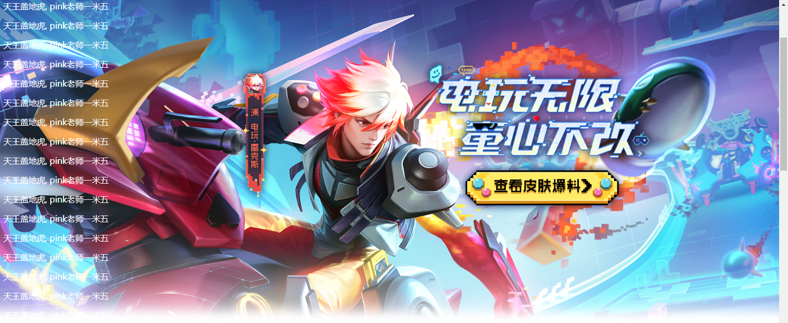


### 6、简写  

**background**

复合写法：

1. 用空格隔开
2.  **顺序可以换**
3. 可以只取一个值，放在后面能覆盖前面的值


注意：**background-size不能复合使用，单独**。但是可以写在`/`后面比如：

`background: url(./images/desktop_1.jpg) no-repeat top center/cover;`

```css
 .box1{
         /* background-color: yellow;
         background-image: url(image/4.jpg);
         background-repeat: no-repeat;
         background-position: center center;
         background-attachment: fixed; */
         background: yellow url(image/4.jpg) no-repeat center center fixed;
       }

  .box2{
         background-color: yellowgreen;
         background:url(image/4.jpg) no-repeat;
                
        /* 这里背景颜色显示不出来。
        因为在background里面没有定义颜色，默认白色，后面覆盖前面 */
         }
```


## CSS的三大特性

### 1、层叠性


一般是后面的覆盖前面的。


### 2、继承性

只继承父亲的部分样式：`text-` `font-`  `line-`  `color`


```css
    body {
      color: pink;
      /* font: 12px/24px 'Microsoft YaHei'; */
      font: 12px/1.5 'Microsoft YaHei';
    }

    div {
      /* 子元素继承了父元素 body 的行高 1.5 */
      /* 这个1.5 就是当前元素文字大小font-size的1.5倍   所以当前div的行高就是1.5*14px=21px */
      font-size: 14px;
    }

    p {
      /* 1.5 * 16 =  24 p的行高 */
      font-size: 16px;
    }

    /* li 没有手动指定文字大小  则会继承父亲（ul继承body，li继承ul）的文字大小，即body 12px  
       所以li的文字大小为12px  当前li的行高就是  12 * 1.5  =  18
        */

  <div>粉红色的回忆</div>
  <p>粉红色的回忆</p>
  <ul>
    <li>我没有指定文字大小</li>
  </ul>
```


### 3、优先级

#### 选择器的权重

<span style="color:red;">行内样式style="...;" > id选择器 > class类选择器，伪类选择器 > 元素（标签）选择器 > *通配符，继承</span>


注意：


```css
  <style>
    /* 复合选择器会有权重叠加的问题 */
    /* 权重虽然会叠加,但是永远不会有进位 */
    /* ul li 权重  0,0,0,1 + 0,0,0,1  =  0,0,0,2     2 */
    ul li {
      color: green;
    }

    /* li 的权重是 0,0,0,1    1 */
    li {
      color: red;
    }

    /* .nav li  权重    0,0,1,0  +  0,0,0,1  =  0,0,1,1    11 */
    .nav li {
      color: pink;
    }
  </style>

  <ul class="nav">
    <li>大猪蹄子</li>
    <li>大肘子</li>
    <li>猪尾巴</li>
  </ul>
```

```css
  <style>
    /* .nav li  权重是 11 */
    .nav li {
      color: red;
    }

    /* 需求把第一个小li 颜色改为 粉色加粗 ? */
    /* .pink  权重是 10    .nav .pink  20  */
    .nav .pink {
      color: pink;
      font-weight: 700;
    }
  </style>

  <ul class="nav">
    <li class="pink">人生四大悲</li>
    <li>家里没宽带</li>
    <li>网速不够快</li>
    <li>手机没流量</li>
    <li>学校没wifi</li>
  </ul>
```


## CSS-盒子模型

页面布局要学习的三大核心，盒子模型、浮动和定位。

### 1、看透网页布局的本质


### 2、盒子模型（Box Model）组成

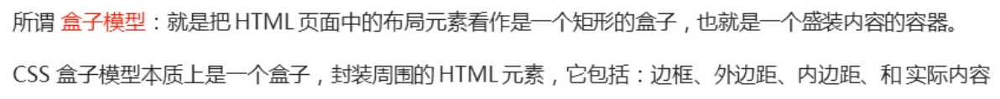


盒子模型包含**边界、边框、补白、内容区**

- **content 内容 ** 电脑
- **padding 填充、内边距（内容与边框的距离、留白）**  泡沫盒（包裹电脑）

- **border  边框**   最外面包装
- **margain  边缘 **   与其他快递的距离

说明：一个盒子的**宽度和高度**，不仅仅是自定义的宽和高，**还得加上内边距、边框、外边框**

TE-90R KG3

#### 1）内边距padding

内边距padding：**边框开始与内容的距离、留白**

四个方向：**padding-left**、**padding-right、padding-top、padding-bottom**

取值：


```css
padding: 100px 30px;
            /* 取值：
                1个值，4个方向一样，都是等于该值
                2个值，上下  左右（top、bottom前面的值  left、right后面的值）
                3个值，上 左右 下
                4个值，上 右 下 左 （上开始顺时针转）*/
```

内边距特性：

（1）**背景色可以蔓延到内边距padding**

（2）可以设置单一方向吗？可以

**padding-left**、**padding-right、padding-top、padding-bottom**


```css
    *{
        margin: 0;
        padding: 0;
        /* 总有一些标签会默认一些内边距和外边距,这是我们设置就比较乱，
        所以一般在最开始写上这个通配选择器，取消这些标签的默认边距，后续我们自定义 */
     }
    div {
      width: 200px;
      height: 200px;
      background-color: pink;
      padding-left: 20px;
      padding-top: 30px;
    }

  <div>
    盒子内容是content盒子内容是content盒子内容是content盒子内容是content
  </div>
```


这样盒子的真实宽是220px，高是230px

（3）**不可以取负值**

（4）内边距会影响盒子实际大小


（5）padding内边距**不会影响盒子大小的情况**

如果盒子**本身没有指定width/height属性**，则此时padding内边距不会撑开盒子大小。

```css
    h1 {
      /* 宽度没指定，默认是父元素body，此时padding不会影响宽度，但是高度设置了，加了padding后为260px */
      /* width: 100%; */
      height: 200px;
      background-color: pink;
      padding: 30px;
    }

    div {
      width: 300px;
      height: 100px;
      background-color: purple;
    }

    div p {
      /* 没必要写 width: 100%; 写了的话会超出div的宽度
      不写的话，本身就会和父亲一样宽，此时加内边距，不会超出div,此时p的宽高300*60（60——行内元素可以设置左右边距）
       */
      /* width: 100%; */
      padding: 30px;
      background-color: skyblue;
    }

  <h1></h1>
  <div>
    <p></p>
  </div>
```


#### 2）边框border

**`border: border-width  border-style(solid/double/dashed/dotted)  border-color`**（三个属性值，空格隔开，没有顺序）

- **solid 实线**
- **double 双实线（宽度的内外两条）**
- **dashed 虚线** 
- **dotted 圆点线** 

边框特性：

（1）**背景色可以蔓延到边框border**

（2）可以设置**单一方向（四个方向）**

 **border-top、border-bottom、border-left、border-right**

每个方向都有三个属性，可以复写，也可以分别写：`border-top-color`上边框颜色，`border-bottom-width`下边框粗细...

（3）border的**三个属性**可以复写，也有分别写的：

​    

 这三个属性（同padding）取值：
          1个值，4个方向一样，都是等于该值
          2个值，上下  左右（top、bottom前面的值  left、right后面的值）
          3个值，上 左右 下
          4个值，上 右 下 左 （上开始顺时针转）

```css
    .box1 {
      width: 200px;
      height: 200px;
      background-color: yellow;
      border: 10px dotted red;
      /* （1）背景色 也能蔓延到边框 */
    }

    .box2 {
      width: 200px;
      height: 200px;
      background-color: blue;
      border-top: 5px solid red;
      border-right: 10px dotted yellow;
      /* （2）可以设置单一方向 */
    }

    .box3 {
      width: 200px;
      height: 200px;
      background-color: green;
      /* （3）边框的三个属性可以分别写 */
      border-width: 5px 10px 20px;
      border-style: dashed dotted;
      border-color: red blue yellow pink;
    }

        /*  border-width:  边框线的宽度
            border-style:  边框线样式（solid\double\dashed\dotted）
            border-color: 边框颜色
            这三个属性（同padding）取值：
                1个值，4个方向一样，都是等于该值
                2个值，上下  左右（top、bottom前面的值  left、right后面的值）
                3个值，上 左右 下
                4个值，上 右 下 左 （上开始顺时针转）*/
```


（4）**表格table的细线边框**


表格单元格之间会重合的边框，使用`border-collapse: collapse;`可以解决。

```css
table,
    td,
    th {
      border: 1px solid pink;
      /* 合并相邻的边框 */
      border-collapse: collapse;
      font-size: 14px;
      text-align: center;
    }
```

（5）边框会影响盒子实际大小


#### 4）外边距margin

margin外边距：用于设置外边距，即控制**<span style="color:red">盒子和盒子之间的距离</span>**

取值个数：同上面padding和border一样

外边距特性：

（1）背景色**不可以蔓延到外边距margin**（区别padding、border）

（2）可以设置四个方向的边距, **margin-方向**  

**margin-top、margin-bottom、margin-left、margin-right**

（3）清除内外边距


```css
    /* 这句话也是我们css 的第一行代码 */
    * {
      margin: 0;
      padding: 0;
    }
    
    span {
      background-color: pink;
      margin: 20px;
    }

  123
  <ul>
    <li>abcd</li>
  </ul>
  <span>行内元素尽量只设置左右的内外边距</span>
```


（4）margin外边距**可以取负值**（仅有margin可以取负值），以后会常用**设置盒子自身的偏移**。

```css
    .box1 {
      width: 100px;
      height: 100px;
      background-color: green;
      /* margin-bottom: -20px; */
    }
    .box2 {
      width: 100px;
      height: 100px;
      background-color: yellow;
      margin-top: -20px;
      margin-left: -30px;
    }

  <div class="box1"></div>
  <div class="box2"></div>
```

box2黄色盒子`margin`设置了负值


（5）外边距可以让**块级盒子**<span style="color:red;">水平居中</span>。**`margin: xx auto;`**


设置两个值，0是上下的值（可以随意设置），**auto**是左右的值(随着浏览器窗口改变)。**横向居中**这是一个重要应用

上下设置为auto是没有意义的

```css
  <style>
    .header {
      width: 600px;
      height: 200px;
      background-color: pink;
      /* 块级盒子水平居中 */
      margin: 100px auto;
      /* 让是行内元素和行内块元素的子元素水平居中 */
      text-align: center;
    }
    /* 行内元素或者行内块元素(因为没有宽高)水平居中给其父元素添加 text-align:center 即可 */
  </style>

  <div class="header">
    <span>里面的文字</span>
  </div>
  <div class="header">
    
  </div>
```


注意：使用margin定义块元素的<span style="color:red;">垂直外边距</span>时，可能会出现外边距的合并


```css
  <style>
    .damao,
    .ermao {
      width: 200px;
      height: 200px;
      background-color: pink;
    }

    .damao {
      margin-bottom: 100px;
    }

    .ermao {
      margin-top: 200px;
    }
  </style>

  <div class="damao">大毛</div>
  <div class="ermao">二毛</div>
```

最终的垂直外边距为（200>100）200px


```css
  <style>
    .father {
      width: 400px;
      height: 400px;
      background-color: purple;
      margin-top: 50px;
      /* border-top: 1px solid transparent; */
      /* padding: 1px; */
      overflow: hidden;
    }
    
    .son {
      width: 200px;
      height: 200px;
      background-color: pink;
      /* 父元素有上边距同时子元素也有上边距，此时子元素的上边距设置没有效果，而父元素会塌陷较大的外边距值，100>50，取100px */
      margin-top: 100px;
    }
  </style>

  <div class="father">
    <div class="son"></div>
  </div>
```


解决：


（1）兄弟关系，两个盒子垂直外边距与水平外边距问题

**垂直方向**——外边距**<span style="color:red">取最大值</span>**.(注意：并不是两个距离之和)

**水平方向**——外边距会进行**合并处理**.(距离之和)

（2）父子关系，给子加外边距margin，但作用于父身上了,怎么解决?

1. 为父元素定义内边距padding。子margin-top——>父的padding-top，注意高度计算

2. 给父盒子设置边框border,
   子盒子设置margin-top;这样就会作用在子盒子自身了
3. 给子盒子或者父盒子加一个浮动，漂浮起来，此时子盒子设置
   margin-top会有效果
4. 给父盒子加上 overflow:hidden. BFC,此时子盒子设置
   margin-top会有效果


## CSS3新增

### 1、文本阴影text-shadow

**text-shadow 属性**——为**文本添加阴影**。


最简单的用法是只指定**水平偏移x和垂直偏移y**：

x**正值往右**偏移，**负值往左**偏移

y**正值往下**偏移，**负值往上**偏移

说明：

（1）可以是**负值**

（2）模糊距离（程度）**不能是负值**，负值就不显示阴影了

（3）可以在一个文本下可以**设置几种阴影效果**，**逗号，**隔开

```css
    div {
      font-size: 30px;
      color: orangered;
      font-weight: 700;
      text-shadow: 15px 15px 6px rgba(0, 0, 0, .3);
    }

    h5 {
      text-shadow: 5px -10px 2px red, 5px 10px 2px yellow;
    }

  <div>
    你是阴影,我是火影
  </div>
  <h5>文本阴影</h5>
```


### 2、盒子阴影box-shadow

CSS3中新增了盒子阴影，我们可以使用**box-shadow**属性——**为盒子添加阴影**。

语法：`box-shadow: h-shadow v-shadow [blur spread color inset];`

```css
box-shadow: h-shadow v-shadow [blur spread color inset];
div.box{
 /* x水平偏移量 | y垂直偏移量 | 阴影模糊距离（虚实） | 阴影大小 | 阴影颜色 | inset内阴影(默认outset，但是outset不可以写) */
    box-shadow: 2px 2px 2px 1px rgba(0, 0, 0, 0.2);
}
```


前面两个个属性值同文本阴影一样：

x**正值往右**偏移，**负值往左**偏移

y**正值往下**偏移，**负值往上**偏移

同样，第三个**模糊距离blur**属性**不可以取负值**，否则会不显示。

默认外阴影（outset不可以写上去，会不显示），`inset`设置内阴影

```css
    div {
      width: 200px;
      height: 200px;
      background-color: pink;
      margin: 100px auto;
      box-shadow: 10px 10px 10px 10px rgba(0, 0, 0, .3) ;
    }
    
    /* 原先盒子没有影子,当我们鼠标经过盒子就添加阴影效果 */
    div:hover {
      box-shadow: 10px 10px 3px -4px rgba(0, 0, 0, .3);
    }
```


### 3、圆角边框border-radius

**上：**

在CSS3中，新增了圆角边框样式，这样我们的**盒子**就可以变圆角了。
**border-radius**属性——用于设置**元素的外边框圆角**

#### （1）圆角边框的原理


#### （2）取值

参数值可以为**数值px**或**百分比（相对于宽高）**的形式，**不允许负值**

```css
	一组值:
	border-radius: 四个角;
	border-radius: 左上右下13  右上左下24;
	border-radius: 左上1  右上左下24   右下3;
	border-radius: 左上1  右上2  右下3  左下4;顺时针
	两组值:
	border-radius:水平/垂直;
```

（1）一组值的原理：

+ 该属性是一个简写属性，可以跟四个值，分别代表**左上角，右上角，右下角，左下角**

+ 一组值时可以分开写:**border-top-left-radius、border-top-right-radius、border-bottom-left-radius、border-bottom-right-radius**

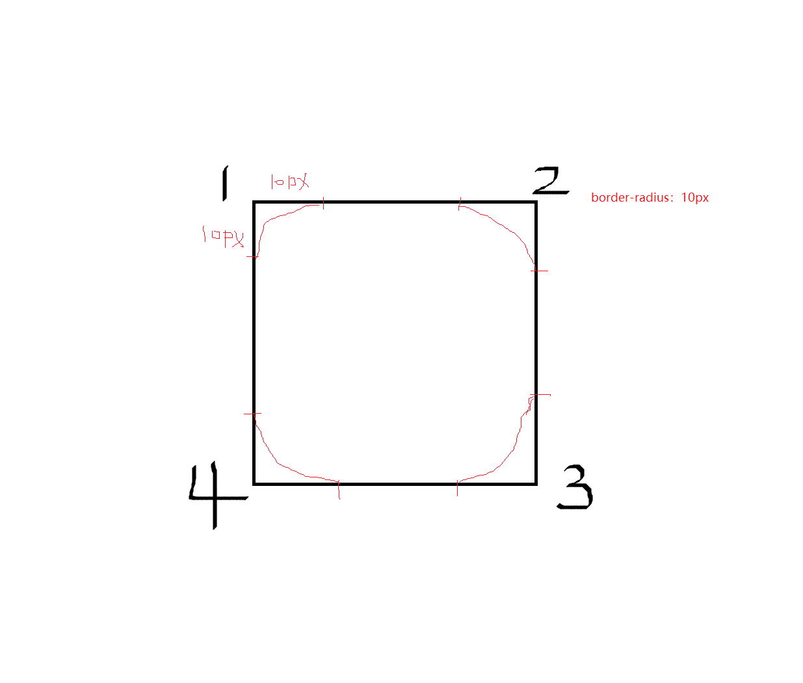

（2）两组值的原理：**border-raddius: 水平/垂直**

可以这么写：

`border-radius: 10px 20px 30px 40px/50px 60px 70px 80px`

<span style="color:red">水平和垂直的属性值</span>一一对应：10px和50px是角1   20px和60px是角2  30px和70px是角3  40px和80px是角4。

也可以有1个值、2个值、3个值、4个值


**下：**常用的写法

#### （3）元素正方形

**正圆**：想要设置为一个圆，把**数值修改为<span style="color:red">width=height的一半</span>即可**，或者直接写为**<span style="color:red;">50%</span>**（推荐）

注意：如果正方形div**有边框border、内边距padding**，那么**他的宽高不仅仅是width和height**（标准盒模型），得加上border边框厚度和内边距padding。（直接写50%没有这些问题）

```css
    div {
      width: 200px;
      height: 200px;
      background-color: green;
      margin: 0 auto;
    }
    .zfx1 {
      /* 元素是正方形，正圆：数值设置宽高的一半，或者直接写50% */
      border-radius: 100px;
      /* border-radius: 50%; */
    }
    .zfx2 {
      border: 10px solid red;
      padding: 10px;
      /* 此时加了边框和内边距，盒子的大小为：240*240 */
      border-radius: 120px;
      /* border-radius: 50%; */
    }
 
  <div class="zfx1"></div>
  <br>
  <div class="zfx2"></div>
```

但是加了margin，此时加不加margin，都可以。 ？？

```css
    .box {
      width: 200px;
      height: 200px;
      background-color: green;
      border: 10px solid red;
      padding: 15px;
      margin: 20px;
      /* 此时盒子实际大小 200 + 10*2 + 15*2 + 20*2 = 290  290*290  145也可以，125（不算margin）也可以*/
      /* border-radius: 145px; */
      border-radius: 125px;
    }

  <div class="box"></div>
```


#### （4）元素长方形

（1）**椭圆**：元素是长方形，半径是 **50%**或者设置**border-radius: 水平方向为width的一半/垂直方向为height的一半**

```css
    .box {
      width: 500px;
      height: 200px;
      background-color: green;
      /* border-radius: 50%; */
      border-radius: 250px/100px;
    }
 
  <div class="box"></div>
```


（2）设置为**高度height的一半**就可以做类似田径场的效果


（3）text: 半圆、四分之一圆

```css
    .box1 {
      width: 200px;
      height: 100px;
      background: red;
      /* 半圆 */
      border-radius: 100px 100px 0 0;
    }

    .box2 {
      width: 200px;
      height: 100px;
      background: green;
      /* 半圆 */
      border-radius: 0 0 100px 100px;
    }

    .box3 {
      width: 100px;
      height: 200px;
      background-color: blue;
      /* 半圆 */
      border-radius: 100px 0 0 100px;
    }

    .box4 {
      width: 100px;
      height: 200px;
      background-color: purple;
      /* 半圆 */
      border-radius: 0 100px 100px 0;
    }

    .box5 {
      width: 200px;
      height: 200px;
      background: yellow;
      /* 四分之一圆 */
      /* border-radius: 200px 0 0 0; */
      /* border-radius: 0 200px 0 0; */
      /* border-radius: 0 0 200px 0; */
      border-radius: 0 0 0 200px;
    }
```


## CSS-浮动属性

### 1、网页布局三种方式

1）**标准流**（普通流/文档流）

2）**浮动**

3）**定位**


为什么需要浮动？


```css
  <style>
    div {
      width: 150px;
      height: 200px;
      background-color: pink;
      /* 转成行内块元素，会在一行上显示（行内元素特点），但是会有空白间隙，不好控制，用浮动就不会 */
      /* display: inline-block; */
      float: left;
    }
  </style>

  <div>1</div>
  <div>2</div>
  <div>3</div>
```


### 2、浮动


```css
    .left,
    .right {
      float: left;
      width: 200px;
      height: 200px;
      background-color: pink;
    }

    .right {
      float: right;
    }
 
  <div class="left">左青龙</div>
  <div class="right">右白虎</div>
```

浮动的**作用**：

（1）浮动产生原来的目的是做**文字环绕效果** ——**文字会被挤出来**

（2）就是**让 竖着 的东西 横着来**

**float属性**：**left**(元素靠左边浮动) / **right**(元素靠右边浮动) / **none**(元素不浮动);

区别：一般正常的标准流（文档流），**竖向排列**，独占一行


### 3、浮动的特性

（1）<span style="color:red">浮动元素会脱离标准流（脱标，半脱离标准流）</span>


浮动绿色的`float：left; `的效果：绿色的区域会漂浮起来（浏览器**左上角**开始，如果有其他区域（块元素），一般在其他区域下面左上角开始），相应的**下面的区域默认补上来**  （会**半脱离文本流**，腾出地来），但是**红色**虽然被覆盖，但是**文字会被挤出来**。


```html
    .red {
      width: 100px;
      height: 100px;
      background-color: red;
      float: left;
    }
    .green {
      width: 200px;
      height: 150px;
      background-color: green;
    }
    .blue {
      width: 100px;
      height: 100px;
      background-color: blue;
      float: left;
    }

  <div class="red"></div>
  <div class="green">大家好，我是绿色div中的文字，被浮动的红色挤出来显示</div>
  <!-- 红色div会先左浮动,影响下面的标准流，飘在绿色上面（前提：绿色div区域大于红色div），
      但是绿色div中的字体会被挤出来显示 -->
  <div class="blue"></div>
  <!--这个blue不会浮动到红色div旁边，因为绿色div是不浮动的，所以默认又从绿色div下面开始，存浮动 -->
```


其实被挡住的div里面的内容会被挤出来显示，内容可以是子盒子，文字等等


（2）浮动的元素会**一行内显示（没有空白缝隙）并且元素<span style="color:red">顶部对齐</span>**。（从浏览器**左上角**开始，如果有其他区域（块元素），一般在其他区域下面左上角）

如果多个盒子都设置了浮动，则它们会按照属性值一行内显示并且顶端对齐排列


```css
    div {
      float: left;
      width: 200px;
      height: 200px;
      background-color: pink;
    }

    .two {
      background-color: purple;
      height: 249px;
      /* 高度不一样，按照的是顶部对齐 */
    }

    .four {
      background-color: skyblue;
    }
  </style>

  <div>1</div>
  <div class="two">2</div>
  <div>3</div>
  <div class="four">4</div>
```


（3）浮动的元素会**具有<span style="color:red;">行内块元素</span>的特性**（虽然也是一行排列，但是**浮动的盒子中间没有缝隙，而行内块元素有**）


```css
    /* 任何元素都可以浮动。不管原先是什么模式的元素，添加浮动之后具有 行内块元素 相似的特性。 */
    /* 如果行内元素有了浮动,则不需要转换块级\行内块元素就可以直接给高度和宽度 */
    span,
    div {
      float: left;
      width: 200px;
      height: 100px;
      background-color: pink;
    }
    p {
      float: right;
      /* p原本是块级元素，没有给width应该继承父元素宽度，但是设置了浮动，宽度默认是内容撑开，行内块元素中的行内元素特点 */
      height: 200px;
      background-color: purple;
    }

  <span>1</span>
  <span>2</span>

  <div>div</div>
  <p>ppppppp</p>
```


### 4、浮动元素经常和标准流父级搭配


### 5、常见网页布局


```html
  <style>
    * {
      margin: 0;
      padding: 0;
    }

    li {
      list-style: none;
    }

    .top {
      height: 50px;
      background-color: gainsboro;
    }

    .banner {
      width: 980px;
      height: 150px;
      margin: 10px auto;
      background-color: gainsboro;
    }

    .box {
      width: 980px;
      /* 父盒子这里要定义高度 */
      height: 300px;
      margin: 0 auto;
    }

    .box li {
      background-color: gainsboro;
      float: left;
      height: 300px;
      width: 237px;
      margin-right: 10px;
    }

    .box .last {
      margin-right: 0px;
    }

    .footer {
      /* 只要是通栏的盒子(和浏览器一样宽) 不需要指定宽度 */
      background-color: gainsboro;
      height: 200px;
      margin-top: 10px;
    }
  </style>

  <div class="top">top</div>
  <div class="banner">banner</div>
  <div class="box">
    <ul>
      <li>1</li>
      <li>2</li>
      <li>3</li>
      <li class="last">4</li>
    </ul>
  </div>
  <div class="footer">footer</div>
```


### 6、浮动布局的注意点


### 7、清浮动

#### （1）为什么要请浮动

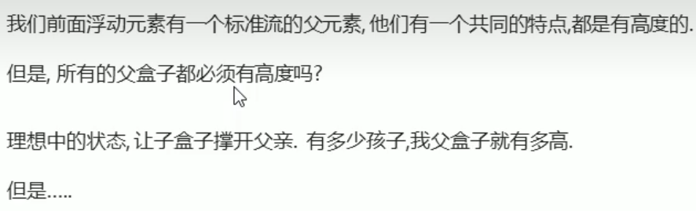

```html
  <style>
    .box {
      width: 800px;
      /* 父元素不定义高度or 高度很小 */
      border: 1px solid blue;
      margin: 0 auto;
    }

    .damao {
      float: left;
      width: 300px;
      height: 200px;
      background-color: purple;
    }

    .ermao {
      float: left;
      width: 200px;
      height: 200px;
      background-color: pink;
    }

    .footer {
      height: 200px;
      background-color: black;
    } 
  </style>

  <div class="box">
    <div class="damao">大毛</div>
    <div class="ermao">二毛</div>
  </div>
  <div class="footer"></div>
```

当父元素不定义高度height时，子元素不浮动时，子盒子会撑开盒子。


但是，当子元素设置了浮动float，**浮动的盒子不保留原先位置，**父元素没有设置高度（或者高度很小被覆盖），**高度塌陷**，**高度为0**（或原来很小的值）。


此时，其他盒子补上去。会被覆盖，导致布局混乱。


这就是为什么我们要清除浮动：

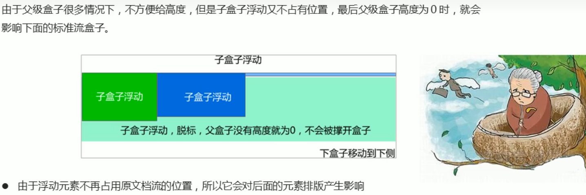


#### （2）清除浮动的本质


清除浮动**只是改变元素的排列方式**，**该元素还是漂浮着的**，不占据文档位置


#### （3）清除浮动的4种方法

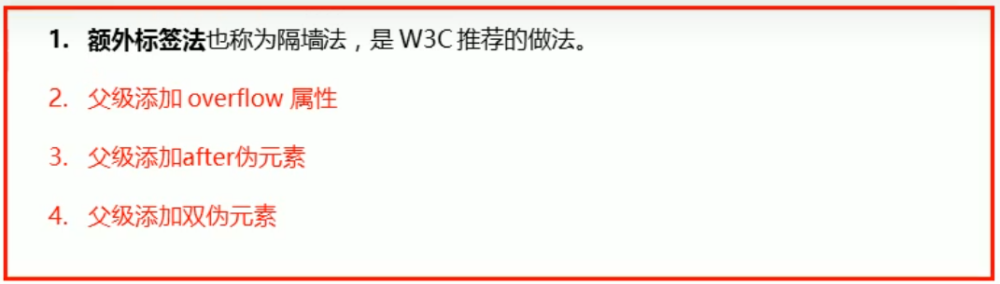

（1）<span style="color:red;">额外标签法（隔墙法）</span>，W3C推荐的做法


在所有浮动子元素的最后添加一个子盒子，必须是块元素，且为这个子盒子添加清除浮动`clear: both;`

```html
  <style>
    .box {
      width: 800px;
      border: 1px solid blue;
      margin: 0 auto;
    }

    .damao {
      float: left;
      width: 300px;
      height: 200px;
      background-color: purple;
    }

    .ermao {
      float: left;
      width: 200px;
      height: 200px;
      background-color: pink;
    }

    .footer {
      height: 200px;
      background-color: black;
    }

    .clear {
      clear: both;
    }
  </style>

  <div class="box">
    <div class="damao">大毛</div>
    <div class="ermao">二毛</div>
    <div class="ermao">二毛</div>
    <div class="ermao">二毛</div>
    <div class="ermao">二毛</div>
    <!-- 在所有子元素最后添加一个子盒子，且为其添加清除浮动clear: both; -->
    <div class="clear"></div>
    <!-- 这个新增的盒子要求必须是块级元素不能是行内元素 -->
    <!-- <span class="clear"></span> -->
  </div>
  <div class="footer"></div>
```


当子元素有很多时，也会自动撑开父盒子高度。


（2）<span style="color:red;">父级添加 overflow 属性</span>


```css
  .box {
      /* 清除浮动：给父级元素添加overflow */
      overflow: hidden;
      width: 800px;
      border: 1px solid blue;
      margin: 0 auto;
    }
```


（3）<span style="color:red;">父级添加 ::after 伪元素</span>


如下图：也和额外标签法（隔墙法）一样，相当于在父元素的最后面插入一个盒子。


```css
    /* 给父盒子添加 */
    .clearfix:after {
      content: "";
      display: block;
      height: 0;
      clear: both;
      visibility: hidden;
    }

    .clearfix {
      /* IE6、7 专有 */
      *zoom: 1;
    }

    <div class="box clearfix">
```


（4）<span style="color:red;">父级添加双伪元素</span>


在父元素前后都生成了一个盒子。


```css
    .clearfix:before,
    .clearfix:after {
      content: "";
      display: table;
    }

    .clearfix:after {
      clear: both;
    }

    .clearfix {
      *zoom: 1;
    }
```


清除浮动总结：


## CSS-定位position

为什么需要定位？


### 1、定位组成


#### 1）定位模式

定位模式决定元素的定位方式，它通过CSS的position属性来设置：


说明：

**文档流脱离和不脱离**：偏移后**原本的区域**会不会占着，地方会不会腾出来，块区域不再占位置

**边偏移位置**：区域的偏移 **`top` `left` `right` `bottom`**，只有当有参照物（设置了定位 ）时，这些**才有用**，否则用margin、padding控制偏移。

**参照物**：偏移的参照物，相对于哪个盒子偏移

#### 2）边偏移

只有在定位中才能用。


### 2、静态定位static

**static  **：   **默认值**，静态的，无定位，网页一般**从左到右，从上到下**（标准流），当然也得分块元素和行内元素。


### 3、相对定位relative

**relative**：**相对定位**，**不脱离**文档流（不腾地）。参照物**相对于自己的初始位置**。

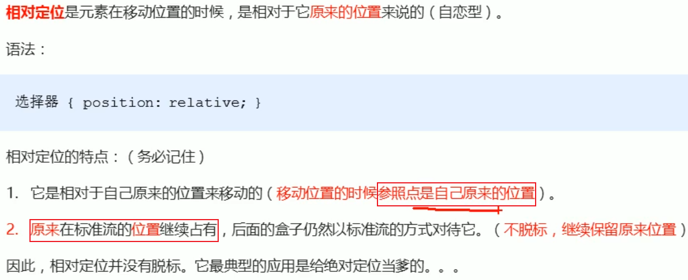

```css
    .box1 {
      /* 相对自身偏移，且不脱离标准流，下面的box2没有补上来 */
      position: relative;
      top: 100px;
      left: 100px;
      width: 200px;
      height: 200px;
      background-color: pink;
    }

    .box2 {
      width: 200px;
      height: 200px;
      background-color: deeppink;
    }
 
  <div class="box1"></div>
  <div class="box2"></div>
```


### 4、绝对定位absolute

**absolute：  绝对定位，脱离文档流（把地腾出来了）**。参照物是它的<span style="color:red;">祖先元素</span>来说的。


**祖先元素的情况**决定参照物：

A）当**没有祖先元素** 或者 **祖先元素没有定位**时，参照物是**<span style="color:red">浏览器</span>**（Document文档）。


```css
    .father {
      /*父元素没有定位*/
      width: 500px;
      height: 500px;
      background-color: skyblue;
    }

    .son {
      position: absolute;
      /* top: 10px;
      left: 10px; */
      top: 100px;
      right: 200px;
      /* left: 0;
      bottom: 0; */
      width: 200px;
      height: 200px;
      background-color: pink;
    }
 
  <div class="father">
    <div class="son"></div>
  </div>
```


B）当**有祖先元素且祖先元素有定位（相对、绝对、固定定位）**，偏移设置的参照物是**<span style="color:red">最近一级的有定位祖先元素</span>**。


```css
    .yeye {
      position: relative;
      width: 800px;
      height: 800px;
      background-color: hotpink;
      padding: 50px;
    }

    .father {
      position: relative;
      width: 500px;
      height: 500px;
      background-color: skyblue;
    }

    .son {
      position: absolute;
      left: 30px;
      bottom: 20px;
      width: 200px;
      height: 200px;
      background-color: pink;
    }

  <div class="yeye">
    <div class="father">
      <div class="son"></div>
    </div>
  </div>
```

当父元素有定位时，参照物是父元素


当父元素没有定位时，往后找有定位的祖先元素，这里爷爷有定位


### 子绝父相

<span style="color:red;">子级是绝对定位，父级是相对定位</span>

一般都是**子绝父相**：**父元素是相对定位relative ，子元素是绝对定位absolute**，**父元素不脱离文本流**，而**子元素脱离文本流**，设置偏移是相对于父元素的。

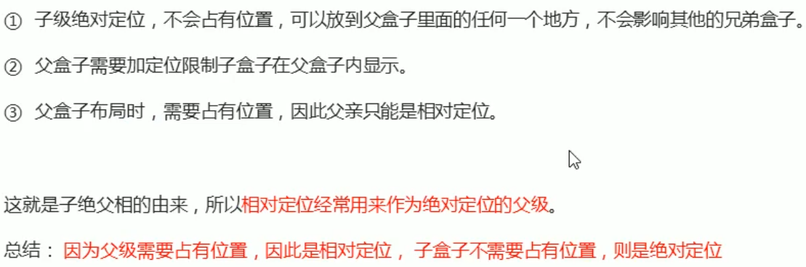

```css
    .dad {
      width: 500px;
      height: 500px;
      background: yellow;
      margin: 0 auto;
      /* 当父元素没有设置定位position(不等于static)时，son的top和left是相对浏览器的 */
      /* 当父元素设置定位relative相对定位时，son的偏移参照物是父元素 */
      position: relative;
      /* 当父元素设置定位absolute绝对定位时，父元素参照物也要看其父元素情况 */
      position: absolute;
    }

    .son {
      width: 200px;
      height: 200px;
      background: red;
      left: 100px;
      top: 100px;
      position: absolute;
    }
 
  <div class="dad">
    <div class="son"></div>
  </div>
```


### 5、固定定位fixed

**fixed**： **固定定位**，**脱离文档流**。偏移时参照物是**浏览器的 可视窗口（当前窗口）**。


```css
    .dj {
      /* 固定定位：参照浏览器可视窗口（当前窗口） */
      position: fixed;
      top: 100px;
      left: 40px;
    }

    .ad {
      width: 100px;
      height: 200px;
      background: red;
      /* 固定在右下角 */
      position: fixed;
      right: 0;
      bottom: 0;
    }

  <div class="dj">
    
  </div>
  <div class="ad"></div>
```


小技巧：


```css
    .w {
      width: 800px;
      height: 1400px;
      background-color: pink;
      margin: 0 auto;
    }

    .fixed {
      position: fixed;
      /* 1. 走浏览器宽度的一半 */
      left: 50%;
      /* 2. 利用margin 走版心盒子宽度的一半距离（多5px隔开一点空隙） */
      margin-left: 405px;
      width: 50px;
      height: 150px;
      background-color: skyblue;
    }
 
  <div class="fixed"></div>
  <div class="w">版心盒子 800像素</div>
```


### 6、粘性定位sticky

**sticky**：   **粘性定位 ，可以做吸顶效果**。必须要**添加top、botton、left、right其中一个才有效**，一般是距离顶部多少才黏住窗口，一般是top：0；

**不脱离文档流**，占有原先位置。参照物是**浏览器的可视窗口**（当前窗口）。

粘性定位是css3.0新增加的，兼容不好。


```css
    body {
      height: 3000px;
    }

    .nav {
      background: pink;
      width: 500px;
      height: 50px;
      margin: 200px auto;
      /* 设置nav的粘性定位sticky,还要设置top值，距离顶部多少才黏住窗口 */
      position: sticky;
      /* top: 10px; */
      top: 0;
    }

  <div class="nav">我是导航栏</div>
```


### 7、定位总结


### 8、定位叠放次序z-index


case1：没有设置z-index或者值相同时，**后写的**对象优先显示在上层，

case2：设置后，**数值越大，层越靠上**

```css
    .box {
      /* 绝对定位，脱离文档流，参照物看祖先元素情况 */
      position: absolute;
      top: 0;
      left: 0;
      width: 200px;
      height: 200px;
    }

    .xiongda {
      background-color: red;
      z-index: 1;
    }

    .xionger {
      background-color: green;
      left: 50px;
      top: 50px;
      z-index: 2;
    }

    .qiangge {
      background-color: blue;
      left: 100px;
      top: 100px;
      z-index: -1;
    }

  <div class="box xiongda">熊大</div>
  <div class="box xionger">熊二</div>
  <div class="box qiangge">光头强</div>
```


### 9、定位的扩展

#### （1）绝对定位的深入探索

case1 **父子关系**：父盒子想在子盒子上层，层级高与子。设置父的z-inde没用，可以**设置子的z-index为负数**

```css
       .box{
            width: 200px;
            height: 200px;
            background: yellow;
            position: relative;/*父元素相对定位*/
            /* 父盒子想在子盒子上层，层级高与子
               1、设置父的z-inde没用，可以设置子的z-index为负数 */
            /* z-index: 100; */
        }
        .child{
            width: 100px;
            height: 100px;
            background: red;
            position: absolute;/*子元素绝对定位*/
            top: 10px;
            left: 10px;
            z-index: -1;
        }
```

case2 兄弟关系：兄弟关系的绝对定位，**只需比较z-index大小**即可


#### （2）定位控制水平垂直居中

之前学过水平方向的居中 `margin:0 auto;`  


**1）整个浏览器的水平垂直居中**

先设置**绝对定位absolute**，参照物是**浏览器**（没有祖先元素），**偏移上50%，左50%**

再设置**margin-top 负值 为盒子高的一半，margin-left 负值 为盒子宽一半**


```css
    .box {
      width: 200px;
      height: 200px;
      background: pink;
      /* margin: 0 auto; */
      /* 1. 先设置绝对定位，参照物看父元素，没有就是浏览器，让其偏移top和left */
      position: absolute;
      top: 50%;
      left: 50%;
      /* 2. 再设置margin-top负值为盒子高一半（上移），margin-left负值为盒子宽一半（左移） */
      margin-top: -100px;
      margin-left: -100px;
    }
 
  <div class="box"></div>
```

**2）父盒子里面的子盒子水平垂直居中**

其实跟上面一样，只不过**参照物变成了父盒子**，可以利用**子绝父相**的方法，再利用上面的方法即可

```css
      .box{
            width: 500px;
            height: 500px;
            background: yellow;
            margin: 0 auto;
            /* 父相 */
            position: relative; 
        }
        .child{
            width: 200px;
            height: 200px;
            background: red;
            /* 子绝 */
            position: absolute;
            top: 50%;
            left: 50%;
            margin-top: -100px;
            margin-left: -100px;
        }
        
    <div class="box">
        <div class="child"></div>
    </div>
```

下面学了2D平移`translate()`也可以实现，就是把第2步换成`transform: translate(-50%, -50%);`——向上和向左平移盒子自身宽高的一半（百分比是相对于自身盒子宽高计算的）。


#### （3）定位的特性

**脱离文档流的**都会有这种特性。


```css
    span {
      /* 行内元素添加绝对or固定定位（脱离文档流），可以直接设置高度和宽度 */
      position: absolute;
      top: 300px;
      width: 200px;
      height: 150px;
      background-color: pink;
      margin-left: 50px;
    }

    div {
      /* 块元素没有设置宽高，默认宽继承父元素 */
      /* 但是设置了绝对or固定定位，默认就是内容撑开 */
      position: absolute;
      /* width: 100px; */
      height: 100px;
      background-color: skyblue;
    }

  <span>123</span>

  <div>abcd</div>
```


### 10、定位与浮动的区别

`float`：红色漂浮起来(浏览器左上角开始，或者其他块区域（如果有的话）下的左下角)，相应的下面的区域默认补上来 （会**半脱离文本流**，腾出地来。红色区域会覆盖黄色区域，但是**文字会被全部挤出来**  ，**其他文本如何环绕该元素显示 **


`absolute`：参照物是浏览器**第一屏左上角**（没有祖先元素），**脱离文本流**，相应下面区域也会补上来。红色区域会覆盖黄色区域，但是**文字不会被全部挤出来** 


```css
.box {
      /* 1.浮动的元素不会压住下面标准流的文字 */
      float: left;
      /* 2. 绝对定位（固定定位） 会压住下面标准流所有的内容。 */
      /* position: absolute; */
      width: 150px;
      height: 150px;
      background-color: pink;
    }
 
  <div class="box"></div>
  <p>阁下何不同风起，扶摇直上九万里</p>
```


## 网页布局总结


## 元素的显示与隐藏


### 1、display属性


```css
    .peppa {
      /* 显示与隐藏 */
      display: none;
      /* display: block; */
      width: 200px;
      height: 200px;
      background-color: pink;
    }

    .george {
      width: 200px;
      height: 200px;
      background-color: skyblue;
    }

  <div class="peppa">佩奇</div>
  <div class="george">乔治</div>
```

都是块元素，显示


设置佩奇盒子`display: none;`,则佩奇盒子隐藏，且**不占有原来的位置**，下面的标准流会补上来


### 2、visibility可见性


```css
    .baba {
      /* 显示与隐藏 */
      visibility: hidden; 
      width: 200px;
      height: 200px;
      background-color: pink;
    }

    .mama {
      width: 200px;
      height: 200px;
      background-color: skyblue;
    }
 
  <div class="baba">猪爸爸</div>
  <div class="mama">猪妈妈</div>
```

都是块元素，显示


设置猪爸爸盒子`visibility: hidden;`，则猪爸爸盒子隐藏，但是会**占有原来的位置**。


### 3、overflow溢出

文本、内容太多，**超出了设定的区域大小**，这**<span style="color:red">溢出的部分</span>**如何处理？显示在区域外部、隐藏、滚动条？


**`overflow: visible \ hidden \ scroll \ auto \ inherit`** 

+ **overflow: visible;**  visible默认值，溢出内容会**显示在元素之外** 
+ **overflow:hidden;**  溢出内容**会隐藏，不显示** 
+ **overflow: scroll; ** 滚动，溢出内容**以滚动方式显示**，不管有没有溢出，**都会显示滚动条**，且横纵轴都有
+ **overflow: auto;**  区别scroll，如果**有溢出会添加滚动条，没有溢出正常显示**。（常用）
+ **overflow: inherit;**  规定会遵**从父元素继承overflow属性的值** 

```css
    .peppa {
      /* overflow: visible; */
      /* overflow: hidden; */
      /* scroll 溢出的部分显示滚动条  不溢出也显示滚动条 */
      /* overflow: scroll; */
      /* auto 溢出的时候才显示滚动条 不溢出不显示滚动条 */
      overflow: auto;
      width: 200px;
      height: 200px;
      border: 3px solid pink;
      margin: 100px auto;
    }

  <div class="peppa">
    《小猪佩奇》，又名《粉红猪小妹》（台湾名为粉红猪），英文名为《Peppa
    Pig》，是由英国人阿斯特利（Astley）、贝克（Baker）、戴维斯（Davis）创作。《小猪佩奇》是一部英国卡通动画片，讲述了佩奇一家四口（包括佩奇、爸爸、妈妈和弟弟乔治）的日常生活，每集都有不同的故事和主题，如去海滩、打扮、探险、学习等。该动画片以纯洁、温馨的氛围和幽默的表现方式深受儿童们的喜爱，也备受家长们的好评。
  </div>
```

`overflow: visible;`溢出内容会**显示在元素之外** 


`overflow:hidden;`  溢出内容**会隐藏，不显示** 


`overflow: scroll; ` 滚动，溢出内容**以滚动方式显示**，不管有没有溢出，**都会显示滚动条**，且横纵轴都有。


没有溢出时，也会出现滚动条。（区别auto）


`overflow: auto;`  区别scroll，如果**有溢出会添加滚动条，没有溢出正常显示**。（常用）


没有溢出时，正常显示。（区别scroll）

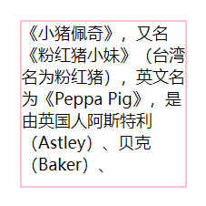

**`overflow-x: X轴溢出;`**      **`overflow-y: Y轴溢出;`**

**overflow两个方向**：配合起来使用，使用x溢出，隐藏y，使用y溢出，隐藏x

`overflow-x：visible \ hidden \ scroll \ auto \ inherit`

`overflow-y: visible \ hidden \ scroll \ auto \ inherit`

```css
    .box {
      /* overflow-x: auto;
      overflow-y: hidden; */
      overflow-x: hidden;
      overflow-y: auto;
      width: 300px;
      height: 200px;
      border: 5px solid red;
      margin: 100px auto;
    }
```


## 精灵图

### 1、为什么需要精灵图


### 2、精灵图（sprites）的使用


一张图片**整合**了很多导航图、小图标等等，用**`background-position`**调到合适偏移，让div显示这个图标。

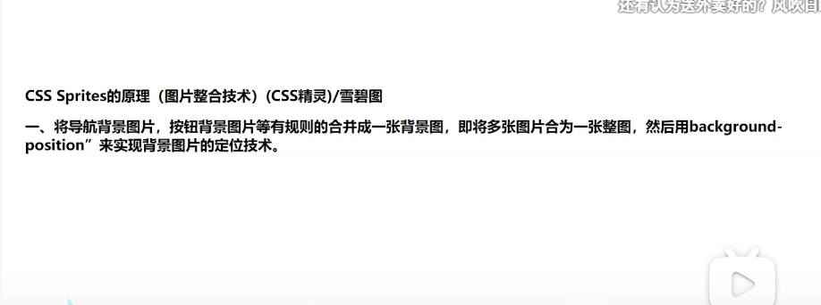


**图片的左上角默认位于div区域（远小于图片大小）的左上角**，通过背景图片定位，**让其偏移（一般是往左往上移动，是负值）。让特定的图标位于div左上角**，让这个div显示图中其中一个小图

**`background-position：水平位置  垂直位置;` 可以给负值**。

```css
    .box1 {
      width: 58px;
      height: 58px;
      background: url(images/sprites.png) no-repeat -183px 0;
    }
    .box2 {
      width: 30px;
      height: 27px;
      background: url(images/sprites.png) no-repeat -153px -106px;
      margin-top: 20px;
    }

  <div class="box1"></div>
  <div class="box2"></div>
```


## 字体图标

### 字体引入@font-face


语法：用**@font-face**引入字体，然后直接用`font-family`属性引用就行

```css
  @font-face {
        font-family: <YourWebFontName>;
        src: url(自定义的字体的存放路劲);
      }
        
   选择器 {
        font-family:<YourWebFontName>
        /*还可以设置文本的一些属性：颜色、大小、文字阴影*/
      }
```

```css
        @font-face {
            font-family: kerwin;
            src: url(font/STHUPO.TTF);
        }
        @font-face {
            font-family: zyk;
            src: url(font/ygyxsziti2.0.ttf);
        }

        .box1{
            font-family: kerwin;
            font-size: 50px;
        }
        .box2{
            font-family: zyk;
            font-size: 50px;
            color: red;
            text-shadow: 5px 0 0 green;
        }
```


### 1、字体图标的产生

字体图标使用场景：主要用于显示网页中通用、常用的一些**小图标**。


下面是京东网页的图标：

```css
.iconfont {
    font-size: 26px;
    color: #496bae;
    margin-right: 4px;
}
```


### 2、字体图标的优点


### 3、字体图标的下载


icomoon字库下载：


阿里图标的在线使用：

搜索图标 ==> 加入购物车 ==>添加至项目 ==> Font class ==>生成代码，复制 ==> 在`public`的index.html文件夹中引入


```html
<link rel="stylesheet" href="https://at.alicdn.com/t/c/font_3966746_2kdivrenqbj.css">
```

然后将样式（在图标下方会标注）class写入相应的标签里


```html
<span class="iconfont icon-up-arrow"></span>
<span class="iconfont icon-down-arrow"></span>
```


### 4、字体图标的引用

icomoon字库下载与使用：


打开`style.css`文件，复制上面的内容到页面的`style`标签里面，这样就完成了**字体声明`font-face`**。

3.打开`demo.html`文件，复制**对应的图标**直接黏贴放入到**对应的标签**内容里，小方框。


4.在对应的标签里面引入`font-family`，还可以跟文字一样设置大小`font-size`、颜色`color`


总结：


### 5、字体图标的追加


上传后会自动选中上传的图标：


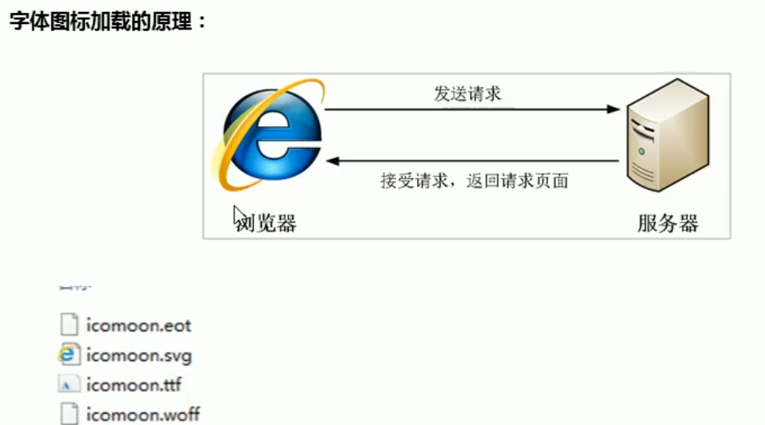


## CSS三角形

当我们设置盒子的宽高为0，只设置边框时的效果：

```css
    .box1 {
      width: 0;
      height: 0;
      /* border: 10px solid pink; */
      border-top: 40px solid pink;
      border-right: 40px solid red;
      border-bottom: 40px solid blue;
      border-left: 40px solid green;
    }
```

这个盒子的大小：80px * 80px


首先设置边框（粗一点），且**取消盒子的高度和宽度**，其次：

方法一：想要哪一个方向的三角形，就把**其他三个方向的边框颜色搞透明**

方法二：可以**把四个边框的颜色都透明，再单独设置一个边的边框颜色**，可以用`border-top-color` 

三角的大小由**边框的粗细**决定。

```css
     /* 三角形：设置边框（粗一点），取消高度和宽度，
        1.想要哪一个方向的三角形，就把其他三个方向的颜色搞透明
        2.可以把四个边都透明，再单独设置一个边颜色    */
           /* top没透明，所以是向下三角形 */
    .box1 {
      width: 0;
      height: 0;
      border-top: 20px solid pink;
      /* 其他三个方向的边框设置透明*/
      border-bottom: 20px solid transparent;
      border-left: 20px solid rgba(0,0,0,0);
      border-right: 20px solid transparent;
    }
    .box2 {
      width: 0;
      height: 0;
      border: 20px solid transparent;
      /* 下面两种都可以 */
      border-top-color: green;
      /* border-top: 20px solid green; */
      margin-top: 50px;
    }
 
  <div class="box1"></div>
  <br>
  <div class="box2"></div>
```


案例：导航的小三角形

```css
    .box {
      width: 100px;
      height: 50px;
      background: lightblue;
      line-height: 50px;
      text-align: center;
      color: white;
    }

    span {
      width: 0;
      height: 0;
      /*span是行内元素，要转换成行内块元素（）*/
      display: inline-block;
      /* 向下的小三角 */
      border: 5px solid transparent;
      border-top-color: black;
      /*相对定位，其实这里可以设置子绝父相，就不用设置span为行内块元素了，因为设置绝对定位或者固定定位，元素有行内元素特点*/
      position: relative;
      /*偏移上部2.5px*/
      top: 2.5px;
    }

    /* 
      .box span{
          display: none;
       }
    这个是初始状态正常情况下，让它隐藏 
    */
    /* 我们这里span正常显示top向下的三角形，指针悬停时显示bottom向上的三角形 */
    .box:hover span {
      /* 向上的小三角 */
      border: 5px solid transparent;
      border-bottom: 5px solid black;
      top: -2.5px;
    }
  </style>

  <div class="box">
    导航
    <span></span>
  </div>
```


案例：京东小三角效果

```css
    .jd {
      position: relative;
      width: 120px;
      height: 249px;
      background-color: pink;
    }

    .jd span {
      width: 0;
      height: 0;
      border: 20px solid transparent;
      border-bottom-color: red;
      /* 为了照顾兼容性 */
      line-height: 0;
      font-size: 0;
      /* 设置定位 */
      position: absolute;
      right: 15px;
      top: -40px;
    }

    <div class="jd">
        <span></span>
    </div>
```

当我们不设置偏移时，三角的位置：


设置偏移，尤其是top，要往上移动，top取负值，负多少跟**盒子大小（即边框粗细）**有关：`top:-40px;`


## CSS用户界面样式

什么是界面样式：


### 1、鼠标样式cursor

**`cursor: default | pointer | move | text | not-allowed`**


```css
    .box {
      width: 200px;
      height: 200px;
      background-color: pink;
      /* cursor: pointer; */
      /* cursor: move; */
      /* cursor: text; */
      cursor: not-allowed;
    }
 
  <ul>
    <li style="cursor: default;">我是默认的小白鼠标样式</li>
    <li style="cursor: pointer;">我是鼠标小手样式</li>
    <li style="cursor: move;">我是鼠标移动样式</li>
    <li style="cursor: text;">我是鼠标文本样式</li>
    <li style="cursor: not-allowed;">我是鼠标禁止样式</li>
  </ul>
  <div class="box"></div>
```


### 2、轮廓线outline


### 3、防止拖拽文本域

resize属性**：**控制宽和高固定**，resize是重新设置大小的意思，有四个属性值：**vertical、horizontal、both、none；**

+ **vertical**：设置垂直方向上的大小（**垂直拖拽**），水平方向上固定大小（不可以拖拽）。  vatical垂直

+ **horizontal**：设置水平方向上的大小（**水平拖拽**），垂直方向上高度固定（不可以拖拽）。  horizontal水平

+ **both**：是**两个都可以扩大**，也是**默认值**

+ **none**：是**都不能扩大**，**都固定**。<span style="color:red">防止拖拽文本域</span>，此时没有右下角的拉动效果。

```css
    input,textarea {
      /* outline: 0; */
      outline: none;
    }
    textarea {
      /* resize: both; */
      /* resize: horizontal; */
      /* resize: vertical; */
      resize: none;
    }
 
  <!-- 1. 取消表单轮廓 -->
  <input type="text">
  <!-- 2. 防止拖拽文本域 -->
  <textarea name="" id="" cols="30" rows="10"></textarea>
```


## vertical-align属性应用

**`vertical-align: baseline（默认值）| top | middle | bottom   `**

用于图片``、表单`<input>`、文本域`textarea`（块元素）和文字的<span style="color:red">垂直对齐</span>


```css
    img {
      /* vertical-align: baseline; */
      /* vertical-align: bottom; */
      /* 让图片和文字垂直居中 */
      vertical-align: middle;
      /* vertical-align: top; */
    }

    textarea {
      vertical-align: middle;
    }
 
   pink老师是刘德华
  <br>
  <br>
  <textarea name="" id="" cols="30" rows="10"></textarea> 请您留言
```


### 1、图片、表单和文字对齐


### 2、解决图片底部默认空白缝隙问题


当我们在div盒子中放一张图片img，发现图片底部默认会有空白缝隙。


原因：


```css
    div {
      border: 2px solid red;
    }
    img {
      /* baseline不行，就是因为baseline造成的 */
      /* vertical-align: baseline; */
      /* 1. 设置vertical-align: top | bottom | middle */
      /* vertical-align: middle; */
      /* 2. 设置为块元素block */
      display: block;
    }

  <div>
     pink老师
  </div>
```


## 溢出的文字省略号显示

### 1、单行文本溢出显示省略号


必须满足**三个条件**：


```css
    div {
      width: 150px;
      height: 80px;
      background-color: pink;
      margin: 100px auto;
      /* 如果文字显示不开自动换行 */
      /* white-space: normal; */
      /* 1.如果文字显示不开也必须强制一行内显示 */
      white-space: nowrap;
      /* 2.溢出的部分隐藏起来 */
      overflow: hidden;
      /* 3. 文字溢出的时候用省略号来显示 */
      text-overflow: ellipsis;
    }
  
  <div>
    啥也不说，此处省略一万字lalalalala
  </div>
```


### 2、多行文本溢出显示省略号


使用起来，直接复制，然后注意设置盒子的大小


补充知识：

**（1）white-space属性**

**white-space**：该属性用来设置如何**处理元素内的空白**

**`white-space: normal | nowrap | pre | pre-wrap | pre-line | inherit`**

+ **normal**：默认值,空白会被浏览器忽略。如果文字显示不开，一般是**自动换行**。
+ **nowrap**：文本**不会换行**，<span style="color:red">强制在同一行内显示所有文本</span>，直到文本结束或者遇到`<br/>`标签为止
+ **pre**：预格式化文本`<pre></pre>`**保留空格, tab , 回车 , 空行(你输什么文本都会显示)**。与此类似的是，white-space:pre; 也会格式化文本。
+ **pre-wrap**：显示空格，回车，换行
+ **pre-line**：显示回车，换行


```css
    .box {
      width: 200px;
      height: 150px;
      background-color: pink;
      margin: 100px auto;
      white-space: normal;
      white-space: nowrap;
      white-space: pre;
    }
 
  <div class="box">
    《小猪佩奇》是一部英国卡通动画片，   讲述了佩奇一家四口（包括佩奇、爸爸、妈妈和弟弟乔治）的日常生活，每集都有不同的故事和主题，如去海滩、打扮、探险、学习等。
  </div>
```

normal：


nowrap：


pre：保留空格, tab , 回车 , 空行(你输什么文本都会显示)


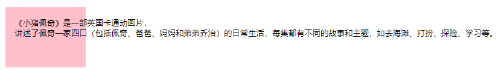


**（2）text-overflow属性**

**text-overflow  文本溢出**

+ **clip**： 默认值，不显示省略号（...）

+ **ellipsis**： 显示**省略标记**


## 布局技巧

### 1、margin外边距负值的运用

如下这个布局，利用浮动使其在一行上显示，且没有空白缝隙，但是会有边框合并，变粗两倍，此时使用margin设置负值可以解决。


可能会误解：都往左移动，是不是没有解决。但是设置浮动时，是没有空白间隙的，当第一个左移了，第二个就会贴着，再左移，以此类推。

```css
ul li {
      float: left;
      list-style: none;
      width: 150px;
      height: 200px;
      border: 1px solid red;
      margin-left: -1px;
    }

  <ul>
    <li>1</li>
    <li>2</li>
    <li>3</li>
    <li>4</li>
    <li>5</li>
  </ul>
```

没有设置margin-left，两个边框加在一起，为2px


设置左移1px，`margin-left`为-1px（负值为边框宽度）


```css
    ul li {
      position: relative;
      float: left;
      list-style: none;
      width: 150px;
      height: 200px;
      border: 1px solid red;
      margin-left: -1px;
    }    

    ul li:hover {
      /* 1. 如果盒子没有定位，则鼠标经过添加相对定位即可 */
      position: relative;
      border: 1px solid blue;
    }

    ul li:hover {
      /* 2.如果li都有定位，则利用 z-index提高层级 */
      z-index: 1;
      border: 1px solid blue;
    }
```

此时设置鼠标悬停在盒子上，边框的颜色变化，会出现问题：


解决：两种方法


总结：


### 2、文字围绕浮动元素


```css
    .box {
      width: 300px;
      height: 70px;
      background-color: pink;
      padding: 5px;
    }
    .pic {
      width: 120px;
      height: 60px;
      float: left;
      margin-right: 5px;
    }
    .pic img {
      width: 100%;
      
    }
 
  <div class="box">
    <div class="pic">
      
    </div>
    <p>【集锦】热身赛-巴西0-1秘鲁 内马尔替补两人血染赛场</p>
  </div>
```


### 3、行内块的巧妙运用


### 4、CSS三角强化


```css
    .box1 {
      width: 0;
      height: 0;
      /* 再把上边框的宽度设置大一些，且让其透明 */
      border-top: 100px solid transparent;
      border-right: 50px solid skyblue;
      /* 先设置下边框和左边框宽度为0 */
      border-bottom: 0px solid blue;
      border-left: 0px solid green;
    }
    .box2 {
      width: 0;
      height: 0;
      /* 简写：四个值：上 右 下 左 */
      /* 1. 只保留右边的边框有颜色 */
      border-color: transparent skyblue transparent transparent;
      /* 2. 样式都是solid */
      border-style: solid;
      /* 3. 下边框和左边框宽度都为0，上边框宽度要大，右边框宽度较小 */
      border-width: 100px 50px 0 0;
    }
 
  <div class="box1"></div>
  <br>
  <div class="box2"></div>
```


案例实现：

```css
    .box {
      width: 0;
      height: 0;
      border-color: transparent red transparent transparent;
      border-style: solid;
      border-width: 100px 50px 0 0;
    }

    .price {
      width: 160px;
      height: 24px;
      line-height: 24px;
      border: 1px solid red;
      margin: 100px auto;
    }

    .miaosha {
      position: relative;
      float: left;
      background-color: red;
      color: #fff;
      text-align: center;
      width: 90px;
      height: 100%;
      font-weight: 700;
      margin-right: 8px;
    }

    .miaosha i {
      position: absolute;
      right: 0;
      top: 0;
      width: 0;
      height: 0;
      border-color: transparent #fff transparent transparent;
      border-style: solid;
      border-width: 24px 10px 0 0;
    }

    .origin {
      font-size: 12px;
      color: gray;
      text-decoration: line-through;
    }
 
  <div class="box"></div>
  <div class="price">
    <span class="miaosha">
      ¥1650
      <i></i>
    </span>
    <span class="origin">¥5650</span>
  </div>
```


## CSS初始化


京东的初始化：

```css
/* 把我们所有标签的内外边距清零 */
* {
  margin: 0;
  padding: 0;
}
/* em 和 i 斜体的文字不倾斜 */
em,
i {
  font-style: normal;
}
/* 去掉li 的小圆点 */
li {
  list-style: none;
}

img {
  /* border 0 照顾低版本浏览器 如果 图片外面包含了链接会有边框的问题 */
  border: 0;
  /* 解决图片底侧有空白缝隙的问题 */
  vertical-align: middle;
}

button {
  /* 当我们鼠标经过button 按钮的时候，鼠标变成小手 */
  cursor: pointer;
}

a {
  color: #666;
  text-decoration: none;
}

a:hover {
  color: #c81623;
}

button,
input {
  /* "\5B8B\4F53" 就是宋体的意思 这样浏览器兼容性比较好 */
  font-family: Microsoft YaHei, Heiti SC, tahoma, arial, Hiragino Sans GB,
    "\5B8B\4F53", sans-serif;
}

body {
  /* CSS3 抗锯齿形 让文字显示的更加清晰 */
  -webkit-font-smoothing: antialiased;
  background-color: #fff;
  font: 12px/1.5 Microsoft YaHei, Heiti SC, tahoma, arial, Hiragino Sans GB,
    "\5B8B\4F53", sans-serif;
  color: #666;
}

.hide,
.none {
  display: none;
}
/* 清除浮动 */
.clearfix:after {
  visibility: hidden;
  clear: both;
  display: block;
  content: ".";
  height: 0;
}

.clearfix {
  *zoom: 1;
}
```


## 宽高自适应


**自适应**：**元素的大小**能够根据**窗口或子元素  自动调整**

1. **宽度自适应**

   **width不设置**或者等于**auto**是自适应

   应用：导航栏、通栏布局

```html
     div{
            /* width: 100px; 固定大小*/
            /* width: auto;自适应 */
            /* width: 100%; 这个不是自适应，大小不变，窗口小了会出现滚动跳显示*/
            height: 100px;
            background: yellow;
            padding-left: 100px;
        }

//应用：导航栏、通栏布局
```

2. **高度自适应**

高度自适应,同样，**不设置**或者等于**auto**

但当内容少时，自适应高度撑不开，可以设置**最小高度属性min-height :  xxpx;**让其在**内容少时也可以有一定高度**。内容多了也会自适应高度撑开。

```
        /* 
        min-height 最常用
        max-height
        min-width
        max-width
         */
```


### 浮动元素之父元素高度自适应

参考清浮动那一节代码，day02-23


**什么是高度塌陷？**

在文档流中，**父元素的高度height**默认是**被子元素撑开的**，也就是子元素多高，父元素就多高。但是当**子元素设置浮动**之后，子元素会**完全脱离文档流**，此时将会导致子元素**无法撑起父元素的高度**，导致**父元素的高度塌陷**。 

**高度塌陷的结果**

由于父元素的高度塌陷了，则父元素**下的所有元素都会向上移动**，这样将会导致**页面布局混乱**（具体情况具体分析，变化莫测）。

解决方法：

**1、给父元素设置  固定高度（不推荐）**

但是使用这种方式后，**父元素的高度**就**不能根据子元素自动撑高了**，此时**父元素的高度height确定**了，如果子元素过多，导致换行、遮挡补上来的div（补上来的div**默认在父元素设置的高度下面**），还是会混乱。如果可以固定高度，可以使用这种方式，否则，不推荐这种方式。

```html
    .box{
            height: 100px;
        } 
```

**2、** **额外标签法：** **加一个空div标签清除浮动（** **不推荐）**这个div不允许浮动

缺点：增加空标签，不利于代码可读性

```html
<!-- 当子元素设置浮动之后，子元素会完全脱离文档流，
        此时将会导致子元素无法撑起父元素的高度，导致父元素的高度塌陷 -->
    <div class="box">
        <div class="left"></div>
        <div class="right"></div>
    <!--3.额外标签法：加一个空div标签清除浮动clear:both; -->
        <div style="clear: both;"></div>
    </div>

    <div class="content"></div>
```

  **3、**在**父元素**中设置**overflow:hidden;** bfc 让浮动元素也计算高度，占据一定位置

```html
    .box{
            overflow: hidden;
        } 
```

#### overflow: hidden总结——溢出隐藏，高度塌陷，清除浮动

overflow：hidden是overflow属性的一个神奇用法，它可以帮助我们隐藏溢出的元素，清除浮动和解除坍塌。

**1.overflow:hidden 溢出隐藏**

给一个元素中设置overflow:hidden，那么该元素的内容若超出了给定的宽度和高度属性，**那么超出的部分将会被隐藏，不占位。**

**2.overflow:hidden 清除浮动**

**3.overflow:hidden 解决外边距塌陷**


**4、** **单伪元素after清除浮动：** **after+zoom（最好用的，最推荐的，兼容性也很好）**

**伪类选择器**   **选择器:元素   { }**

```html
        /*超链接的初始状态*/
            a:link{
                color:yellow;
            }
        /* 超链接的访问状态*/
            a:visited{
                color: red;
            }
        /* 超链接的鼠标悬停状态*/
            a:hover{
                color: green;
            }
        /* 超链接的激活（按下时）状态*/
        a:active{
            color: black;
        }
```


#### 隐藏

CSS 属性 `visibility` **显示或隐藏元素而不更改文档的布局**。该属性还可以隐藏 table中的行或列。取值：

**visible 元素正常显示**。

**hidden 隐藏元素，但是其他元素的布局不改变，相当于此元素变成透明**。要注意若将其子元素设为 `visibility: visible`，则该子元素依然可见。

**collapse**

```html
      .box1{
            width: 100px;
            height: 100px;
            background: yellow;
            /* display: none; */
            /* 不占位置的隐藏 */

            visibility: hidden;
            /* 占位隐藏，不改变布局 */
        }
        .box2{
            width: 100px;
            height: 100px;
            background: red;
        }

    <div class="box1"></div>
    <div class="box2"></div>
```


### 窗口自适应

**盒子根据窗口的大小进行改变**, 窗口自适应

**元素高度自适应窗口高度   html,body{height:100%;}**
       设置html的高度100%，那html的高度就和**浏览器窗口的高度一样高**，
       设置body的高度100%，那**body的高度就和html的高度一样高**
       **最终就实现了body的高度自适应了窗口的高度**

```html
      *{
            margin: 0;
            padding: 0;
        }
        .box{
            width: 100%;
            height: 100%;
            background: yellow;
        }
        html,body{
            height: 100%;
        }
```


### 两栏布局


**法一：左侧float:left;右侧margin-left：等于right的width;**

```html
       .left{
            width: 200px;
            height: 100%;
            background: red;
            float: left;/*让左侧div浮动起来，则下面的div会补上来，但会被覆盖一部分*/
        }
        .right{
            height: 100%;
            background: yellow;
            margin-left: 200px;
        /*红色div浮动覆盖区域，设置外边距，让覆盖区域远离 */
        }
    <div class="left"></div>
    <div class="right"></div>
```


**法二：左右两侧float:left，让右侧宽度设置 width:calc（100% - 右侧width）**

```html
       .left{
            width: 200px;
            height: 100%;
            background: red;
            float: left; 
        }
        .right{
            width:calc(100% - 200px);
            /* 自适应，100%宽度见去200px */
            height: 100%;
            background: yellow;
            float: left;
        
        }
```

.png)

**法三：左侧float:left; 右侧overflow:hidden；**

```
      .left{
            width: 200px;
            height: 100%;
            background: red;
            float: left;
        }
        .right{
            height: 100%;
            background: yellow;
            overflow: hidden;
        }
```


### 三栏布局

**实现效果：** 左右栏定宽，中间栏自适应


**法一：浮动布局： float + margin**，设置两边左右浮动，中间会补上去，但是会被覆盖，用margin设置左右外边距，达到效果。

```html
      *{
            margin: 0;
            padding: 0;
        }
        html,body{
            height: 100%;
        }

        .left,.right{
            width: 200px;
            height: 100%;
        }
        .left{
            background: yellow;
            float: left;
        }
        .right{
            background: red;
            float: right;    
        }
        .center{
            background: blue;
            height: 100%;
            margin: 0 200px 0 200px; 
        }

        <div class="left"></div>
        <div class="right"></div>
        <div class="center"></div>
```


**法二：左边左浮动，右边右浮动，中间计算 width：calc(100% - 两侧的宽width之和 )，再浮动上去**

```html
 .center{
         background: blue;
         height: 100%;
   /*width: 100%; 效果差不多，但是会覆盖，要是有内容，不好*/
         width: calc(100% - 400px);
         float: left;
        }
```

（还有很多方法.....）


实现效果：


先设置上中下，中middle的高度设置：height: calc(100% - 上下高height之和)；

再设置middle里面，左右两边浮动，中间center的高height为100%，高度占满middle，设置宽度width: calc(100% - 左右宽width之和)


```html
      *{
            margin: 0;
            padding: 0;
        }
        html,body{
            height: 100%;
        }
        .top,.bottom{
            width: 100%;
            height: 50px;
            background: grey;
        }
        .middle{
            height: calc(100% - 100px);
            background: yellow;
        }
        .left,.right{
            width: 100px;
            height: 100px;
            background: red;
            float: left;
        }
        .center{
            width: calc(100% - 200px);
            height: 100%;/*相对于父元素middle的100%*/
            background: blue;
            float: left;
        }

    <div class="top"></div>
    <div class="middle">
        <div class="left"></div>
        <div class="center"></div>
        <div class="right"></div>
    </div>
    <div class="bottom"></div>
```


------


# CSS3

## CSS3新增

### 1、CSS3的现状


### 2、新增选择器


### 3、怪异盒模型`border-box`

含义：更改原有布局盒子模型的计算方式通过**box-sizing属性**的属性值进行更改

**box-sizing属性**   允许您以特定的方式定义匹配某个区域的特定元素，有如下三个属性值：

+ **`content-box`**——**默认值。**宽度和高度仅仅应用到**元素的内容框**，在宽度和高度**之外**绘制元素的内边距padding和边框border。（**标准盒模型**）。它将元素的宽度和高度计算为内容区域的宽度和高度，不包括内边距和边框。

+ **`border-box`**——border和padding**划归到width和height范围内**，可以理解为是IE的**怪异盒模型**

+ **`padding-box`**——将**padding算入width**范围


区别：

**（1）标准盒模型**中，**width**指的是**内容区域content的宽度**；**height**指的是**内容区域content的高度**。

**标准盒模型下盒子的大小（扩张主义）** = **content** + **padding** + **border** 


 **（2）怪异盒模型**中的**width**指的是**内容、边框、内边距总的宽度（content + border + padding）**；**height**指的也是**内容、边框、内边距总的高度（content + border + padding）**

**怪异盒模型下盒子的大小（压缩主义）=width（content + border + padding）**

- 当**padding+border < 内容width** ，总宽度（没加margin）= **width 的值**，会压缩content内容区域
- 当**paddibg+border > 内容width** ，总宽（没加margin）= **内边距+边框** 内容content区域为0


```css
   div {
      width: 200px;
      height: 200px;
      background-color: pink;
      border: 20px solid red;
      padding: 15px;
      margin: 10px;
      box-sizing: content-box;
      /* 此时，盒子的大小为 width + padding + border = 200 + 15*2 + 20*2 = 270 */
    }

    p {
      width: 200px;
      height: 200px;
      background-color: pink;
      border: 20px solid red;
      padding: 15px;
      /* css3 盒子模型  盒子最终的大小就是 width  200 的大小 */
      box-sizing: border-box;
    }
```

作用：

正常盒子下，当增加内边距和边框时，如果想保证盒子和之前一样大，需要手动重新计算 width ，怪异盒子模型则省略该步


### 4、CSS3其他特性（了解）


#### （1）滤镜filter属性


```CSS
    img {
      /* blur是一个函数 小括号里面数值越大，图片越模糊 注意数值要加px单位 */
      filter: blur(15px);
    }

    img:hover {
      filter: blur(0);
    }
 
  
```

#### （2）calc()函数


```css
    .father {
      width: 300px;
      height: 200px;
      background-color: pink;
    }

    .son {
      /* width: 150px; */
      /* width: calc(150px + 30px); */
      width: calc(100% - 30px);
      height: 30px;
      background-color: skyblue;
    }
 
  <!-- 需求我们的子盒子宽度永远比父盒子小30像素 -->
  <div class="father">
    <div class="son"></div>
  </div>
```


## CSS3渐变

作用：CSS3渐变（gradient）可以让你**在两个或多个指定的颜色之间显示<span style="color:red">平稳的过渡</span>**。

以前，你必须使用图象来实现这些效果，现在通过使用CSS3渐变即可实现，此外，渐变效果的元素**在放大时**看起来效果更好，因为渐变（gradient）是**由浏览器生成的**。

CSS定义的**两种渐变类型**：

+ **线性渐变（linear-gradient）- 向下 | 向上 | 向左 | 向右 | 对角线** | 自定义

+ **径向渐变（radial-gradient）- 由其中心定义**

### 1）线性渐变linear-gradient

概念：线性渐变是**从“一个方向”向“另一个方向”的颜色渐变**

语法：

```css
background-image: linear-gradient(direction, color-stop1, color-stop2, ...);
```

+ **direction**：**默认为to bottom，从上到下**渐变；


（1）线性渐变**方向**示例代码：

```css
/*以下代码分别产生“从右到左”、“从左到右”、“从上到下”、“从下到上”的“红色–绿色”渐变*/
 
div { background:linear-gradient(to left, red , blue) } 
 
div { background:linear-gradient(to right, red , blue) }
 
/* 浏览器默认值 */ 
div { background:linear-gradient(to bottom, red , blue) } 
 
div { background:linear-gradient(to top, red , blue) }
```


（2）线性渐变**角方向**示例代码:

```css
/*分别产生到“右下角”、“右上角”、“左下角”、“左上角”的渐变*/
 
div { background: linear-gradient(to right bottom, red , blue); }
 
div { background: linear-gradient(to right top, red , blue); }
 
div { background: linear-gradient(to left bottom, red , blue); } 
 
div { background: linear-gradient(to left top, red , blue); }
```


（3）线性渐变**角度**示例代码:

如果希望对渐变角度做更多的控制，您可以定义一个角度，来取代预定义的方向（向下、向上、向右、向左、向右下...等等）。**值 0deg** 等于**向上（to top）**。**值 90deg** 等于**向右（to right）**。**值 180deg** 等于**向下（to bottom）**。


```css
/*值 0deg 等于向上（to top）。值 90deg 等于向右（to right）。值 180deg 等于向下（to bottom）。*/
div { background: linear-gradient(10deg, red, blue) }
```


### 2）径向渐变radial-gradient

概念：径向渐变是**从“一个点”向四周**的颜色渐变


语法：

```css
background-image: radial-gradient(center, shape, size, start-color, ..., last-color);
```

+ **center**：**渐变的起点位置**，可以为百分比，默认50% 50%正中心。

+ **shape**：shape 参数定义了形状。**circle** 表示圆形，**ellipse** 表示椭圆形，默认值，正方形显示一样

+ **size**：**渐变的大小**，即渐变到哪里停止。有四个值
  + closest-side  最近边
  + farthest-side  最远边
  + closest-corner 最近角
  + farthest-corner 最远角

说明：

**渐变 - 颜色节点均匀分布（默认情况下）**

**渐变 - 颜色节点不均匀分布**，**（设置百分比）**

`background-image: linear-gradient(to right,red 10%,green 50%,blue 75%);`;

表示含义：
10% 表示 red 的颜色中心线在线性渐变方向的 10% 的位置。
50% 表示 green 的颜色中心线在线性渐变方向的 50% 的位置。
75% 表示 blue 的颜色中心线在线性渐变方向的 75% 的位置。
前10%都是red，red到10%开始渐变,10% 到 50% 是 red-green 的过渡色，50%-75% 是 green-blue 的过渡色，75%以后都是blue。

**利用百分比设置几个纯色背景：**
`background-image: linear-gradient(to right,red 10%,green 10%,green 50%,blue 50%,blue 75%,yellow 75%)`;

前10%是red，10%-50%是green-green不渐变，50%-75%是blue-blue不渐变，75%之后都是yellow


**使用透明度（transparent）**

使用rgba()函数来定义颜色节点，rgba()函数中的**最后一个参数**定义颜色的**透明度**，**0**表示**完全透明**，**1**表示**完全不透明**。

rgba（0，0，0，1）的四个参数分别为红®、绿(G)、蓝(B)、透明度(A)，红绿蓝都是0-255之间的整数，分别代表颜色中各个颜色的成分。

`background-image: linear-gradient(to right, rgba(255,0,0,0), rgba(255,0,0,1));`定义背景从透明渐变为红色：


### 3）重复渐变repeating-radial-gradient

**repeating-radial-gradient()** 用于重复径向渐变：

```css
div { background: repeating-radial-gradient(red, yellow 10%, green 20%); }
```


## CSS3过渡transition

**transition** 是 css3新增的⼀个功能，可以实现元素**在一定的时间区间的平滑过渡**（当元素**从⼀个状态进⼊到另⼀个状态**时），经常⽤来制作⼀些动画效果。


说明：

（1）通过过渡可以**指定一些属性发生变化时的切换方式**，这种**变化**一般是对焦、点击、下面讲到的转换transform等等。需要**触发一个事件**（hover事件或click事件等）才会随时间改变其css属性。

（2）通过过渡可以创建一些非常好的效果，提升用户的体验。

语法：`transition: 执行过渡的属性 持续时间 运动曲线 延迟执行时间(何时开始);`

```css
transition:all 3s(1s=1000ms) linear 0s;
```


（1）**transition-property** 指定元素中**要执行过渡的属性**。如果希望所有的属性都发⽣过渡，就使⽤**all**；多个属性间使用`,`或者空格隔开（ transition-property: width,height;）

（2）**transition-duration**  指定**过渡的持续时间**，单位是s或者ms，必须写单位。**transition-duration 这个属性需要首先设置，否则时长为 0，就不会产生过渡效果。**

<span style="color:red">前两个属性一定要设置</span>。

（3）**transition-timing-function 运动曲线**。**过渡的时序函数**，指定**过渡的执行方式**。

属性值取值：

+ **ease** **慢速开始**，**先加速，再减速**，**慢速结束**的过渡效果（默认 cubic-bezier(0.25,0.1,0.25,1)）
+ **linear 线性**，**以相同速度（匀速）开始至结束**的过渡效果（cubic-bezier(0,0,1,1)）
+ **ease-in 慢速开始，加速运动**的过渡效果（cubic-bezier(0.42,0,1,1)）
+ **ease-out 快速开始，减速运动**的过渡效果（cubic-bezier(0,0,0.58,1)）
+ **ease-in-out 先加速再减速**过渡效果（cubic-bezier(0.42,0,0.58,1)）
+ **cubic-bezier(n,n,n,n)** 在 cubic-bezier 函数中定义自己的值 ，可以在cubic-bezier.com网站定制加速度曲线

（4）**transition-delay** **过渡延迟**。**多⻓时间后再执⾏**这个过渡动画。**默认是0**，单位为s。

```css
    div {
      width: 200px;
      height: 100px;
      background-color: pink;
      /* transition: 变化的属性 花费时间 运动曲线 何时开始; */
      transition: width .5s ease 0s, height .5s ease 1s;
      /* 如果想要写多个属性，利用逗号进行分割 */
      transition: width .5s, height .5s;
      /* 如果想要多个属性都变化，属性写all就可以了 */
      transition: height .5s ease 1s;
      /* 谁做过渡，给谁加 */
      transition: all 0.5s;
    }

    div:hover {
      width: 400px;
      height: 200px;
      background-color: skyblue;
    }
```

进度条案例：


```css
    .bar {
      width: 150px;
      height: 15px;
      border: 1px solid red;
      border-radius: 7.5px;
    }
    .bar_in {
      width: 50%;
      height: 100%;
      border-radius: 7px;
      background-color: red;
      /* 当有状态变化时，设置过渡效果 */
      transition: all 1s ease;
    }
    .bar:hover .bar_in {
      width: 100%;
    }
 
  <div class="bar">
    <div class="bar_in"></div>
  </div>
```


## CSS3 2D转换：平移-旋转-放缩-倾斜

### 变形（转换）属性——transform

1.变形就是指通过css来**改变元素的形状或位置**

2.变形不会影响到页面的布局（**<span style="color:red">不会脱离文档流</span>**）

3.平移元素`translate`，**百分比是相对于自身计算的**


### 二维坐标系


### 1）translate()-平移

2D平移是2D变形里面的一种功能，可以改变元素在页面中的位置，类似定位。


**将元素向指定的方向移动**，类似于position中的**相对定位`relative`**

两种写法：

+ `transform: translate（x轴，y轴）`前面一个值正值往右，负值往左。后面一个值正值往下，负值往上，可以**设置px或百分比**，百分比是**相对于自身宽高计算的**偏移

+ `transform: translateX()`沿着**x轴**平移;**正值往右，负值往左**

  `transform: translateY()`沿着**Y轴**平移;**正值往下，负值往上**

```css
    /* 移动盒子的位置： 1、定位   2、盒子的外边距  3、2d转换移动translate() */
    div {
      width: 100px;
      height: 100px;
      background-color: pink;
      /* 1. x就是x轴上移动位置 y 就是y轴上移动位置 中间用逗号分隔*/
      /* transform: translate(100px, 100px); */
      /* 2.1 我们如果只移动x坐标 */
      /* transform: translate(100px, 0); */
      /* transform: translateX(100px); */
      /* 2.2 我们如果只移动y坐标 */
      /* transform: translate(0, 100px); */
      /* transform: translateY(100px); */
    }

    div:first-child {
      /* transform: translate(30px, 30px); */
      transform: translate(50%,50%);
      /* transform: translateX(50px); */
      /* transform: translateY(50px); */
    }

    div:last-child {
      background-color: purple;
    }

  <div></div>
  <div></div>
```

如果里面的参数是 %，则 移动的距离是**盒子自身的宽度或者高度**来对比的。这里的 50% 就是 50px 因为盒子的宽度是 100px


让盒子实现**水平和垂直居中**：

```css
    div {
      width: 500px;
      height: 500px;
      background-color: pink;
      position: relative;
    }

    p {
      width: 200px;
      height: 200px;
      background-color: purple;
      position: absolute;
      top: 50%;
      left: 50%;
      /* margin-top: -100px;
      margin-left: -100px; */
      /* translate(-50%, -50%)  盒子往上往左走自己宽高的一半   */
      transform: translate(-50%, -50%);
    }

    span {
      /* translate 对于行内元素是无效的 */
      transform: translate(300px, 300px);
    }
```

还可以同时写几个平移，空格隔开就行：

```css
transform: translateX(100px) translateY(100px) translateZ(100px);
```


### 2）scale()-放缩

**scale()缩放**：scale()函数让元素**根据中心点（默认）对对象进行缩放**。scale规模，尺度


两种方法：

+ `transform:scale(x轴,y轴)`使元素**水平方向（宽度）**和**垂直方向（高度）**同时缩放（也就是X轴和Y轴同时缩放）。

  注意：**Y是一个可选参数，**如果没有设置Y值，**只有一个值，则表示X，Y两个方向的缩放倍数是一样的**。比如

  `transform:scale(2)`沿X和Y轴放大到原来的2倍;`transform:scale(.2)`沿X和Y轴缩小到原来的0.2倍;

+ `transform:scaleX(2)`沿X轴放大到原来的2倍;`transform:scaleX(.2)`沿X轴缩小到原来的0.2倍;

  `transform:scaleY(2)`沿Y轴放大到原来的2倍;`transform:scaleY(.2)`沿Y缩小到原来的0.2倍;

```css
    div {
      width: 200px;
      height: 200px;
      background-color: pink;
      margin: 100px auto;
      transform-origin: left bottom;
    }

    div:hover {
      /* transform: scale(x, y); */
      /* 1. 里面写的数字不跟单位 就是倍数的意思 1 就是1倍  2就是 2倍 */
      /* transform: scale(2, 2); */
      /* 2. 修改了宽度为原来的2倍  高度不变 */
      /* transform: scale(2, 1); */
      /* 3. 等比例缩放，同时修改宽度和高度，简单的写法：以下是 宽度修改了2倍，高度默认和第一个参数一样*/
      /* transform: scale(2); */
      /* 4. 我们可以进行缩小 小于1 就是缩放 */
      /* transform: scale(0.5, 0.5); */
      /* transform: scale(0.5); */
      /* 5. scale 的优势之处： 不会影响其他的盒子 而且可以设置缩放的中心点*/
      /* 设置宽高改变大小会影响其他的盒子 */
      /* width: 300px;
      height: 300px; */
      transform: scale(2);
    }
 
  <div></div>
  123123
```

案例：一些网址的图片，鼠标经过时，会有一个放大一点点的效果，采用放缩和过渡效果实现。

```css
    div {
      /* 设置溢出部分隐藏，这里放大了图片，如果不设置盒子会被撑大，设置了，就不会 */
      overflow: hidden;
      float: left;
      margin: 10px;
    }

    div img {
      /* 设置过渡效果 */
      transition: all .4s;
    }

    div img:hover {
      /* 鼠标悬停时，放大原来的1.1倍，默认是中心点放大，且只有一个值：宽度和高度都放大 */
      transform: scale(1.1);
    }

  <div>
    <a href="#"></a>
  </div>
  ......
```


```css
    li {
      list-style: none;
    }

    li {
      width: 50px;
      height: 50px;
      line-height: 50px;
      text-align: center;
      border: 1px solid green;
      border-radius: 50%;
      float: left;
      margin: 10px;
      cursor: pointer;
      transform: all .5s;
    }

    li:hover {
      transform: scale(1.1);
    }

  <ul>
    <li>1</li>
    <li>2</li>
    <li>3</li>
    <li>4</li>
    <li>5</li>
    <li>6</li>
    <li>7</li>
  </ul>
```


### 3）rotate()-旋转

如果这个值为**正值**，元素**相对原点中心顺时针**旋转；

如果这个值为**负值**，元素**相对原点中心逆时针**旋转。

eg：值 rotate(30deg) 把元素顺时针旋转 30 度。

语法：`transform: rotate(ndeg);`——按**指定的角度参数**旋转


```css
    img {
      width: 150px;
      border-radius: 50%;
      border: 5px solid pink;
      /* 顺时针旋转45度 */
      /* transform: rotate(45deg); */
      /* 过渡写到本身上，谁做动画给谁加 */
      transition: all 0.3s;
    }
    img:hover {
      transform: rotate(360deg);
    }

  
```


折扇效果：


三角：

```css
    div {
      position: relative;
      width: 249px;
      height: 35px;
      border: 1px solid #000;
    }

    div::after {
      content: "";
      /* 伪元素创建一个行内元素，又设置了绝对定位（脱离文档流，有行内块元素的特性） */
      position: absolute;
      top: 8px;
      right: 15px;
      width: 10px;
      height: 10px;
      /* 只设置两个边有边框，右边和下边，再顺时针旋转45度得到向下的小三角 */
      border-right: 1px solid #000;
      border-bottom: 1px solid #000;
      transform: rotate(45deg);
      transition: all 0.2s;
    }

    /* 鼠标经过div  里面的三角旋转，向上的小三角，原本旋转了45度，再旋转180度即可，但是会覆盖，所有旋转45+180=225度 */
    div:hover::after {
      transform: rotate(225deg);
    }
 
  <div></div>
```


### 4）skew()-倾斜

skew()倾斜：skew()函数能够**让元素倾斜显示**。

它可以将一个对象**以其中心位置**围绕着X轴和Y轴**按照一定的角度倾斜**。这与rotate()函数的旋转不同，rotate()函数只是旋转，而不会改变元素的形状。skew()函数**不会旋转**，而**只会改变元素的形状**。

两种方法：

+ `skew(x轴,y轴)`使元素在**水平**和**垂直**方向同时倾斜

+ `skewX(x)`仅使元素在**水平**方向倾斜变形（**X轴倾斜变形**）；正值，拽右下角3，往右边（—>）拉动，形成ndeg

  `skewY(y)`仅使元素在**垂直**方向倾斜变形（**Y轴倾斜变形**）; 正值，拽右下角3，往下边拉动，形成ndeg

里面的取值都是角度参数，和rotate的角度参数一个道理

eg：值 skew(10deg,10deg) ，拽右下角3，往右下拉动，形成10deg


### 5）transform-origin 设置变形的中心点

任何一个元素都有一个**中心点**，默认情况之下，其**中心点是居于元素自身X轴和Y轴的50%**处（50%  50% or center center）。

在没有重置`transform-origin`改变元素原点位置的情况下，CSS变形进行的**旋转、平移、缩放，扭曲**等操作都是**以元素自己中心位置进行变形**。但很多时候，我们可以通过**`transform-origin`**来对元素进行**原点位置改变**，使元素原点不在元素的中心位置，以达到需要的原点位置。

**transform-origin取值**和元素设置背景图片定位的`background-position`取值类似：

**`transform-origin：水平位置x 垂直位置y;` **


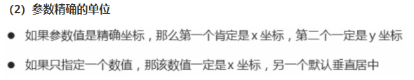


```css
           1.  20px  20px
           2.  10% 10%  
           3.  left / center / right    top / center / bottom
```


```css
    div {
      width: 200px;
      height: 200px;
      background-color: pink;
      margin: 100px auto;
      transition: all 1s;
      /* 1.可以跟方位名词 */
      /* transform-origin: left bottom; */
      /* 2. 默认的是 50%  50%  等价于 center  center */
      /* 3. 可以是px 像素 */
      transform-origin: 50px 50px;
    }

    div:hover {
      transform: rotate(360deg);
    }
```


```css
    div {
      overflow: hidden;
      width: 200px;
      height: 200px;
      border: 1px solid pink;
      margin: 10px;
      float: left;
    }

    div::before {
      content: "heima";
      /* 伪元素创建了一个行内元素，这里设置为块元素 */
      display: block;
      width: 100%;
      height: 100%;
      background-color: purple;
      /* 改变变形的中心点，为左下角（角4），默认是元素中心（center center） */
      transform-origin: left bottom;
      transform: rotate(180deg);
      transition: all .5s ease;
    }

    div:hover::before {
      transform: rotate(0deg);
    }
    
    <div></div>
```


### 2D-多属性综合写法

**`transform: 平移translate  缩放scale  旋转rotate  倾斜skew;`**

可以多属性一起使用，用**空格隔开**就行，但是**前后顺序不同，会影响效果**。


```css
    /* 平移+缩放 */
    transform: translateX(400px) scale(0.5);
    /*这里先位移400px，然后缩放0.5倍*/
    transform: scale(0.5) translateX(400px);
    /* 这里先缩放0.5倍，但是平移也缩放了相应倍数，400*0.5=200px */
```

```css
    /* 平移+旋转 */
    transform: translateX(400px) rotate(45deg);
    /* 这里先位移，在、然后旋转45度 */
    transform: rotate(45deg) translateX(400px);
    /* 先旋转45deg，但是把X轴也旋转了，导致平移方向变了*/
```

总结：多属性一起写是，**最好先把平移translate（）放前面，**让元素先位移，再去旋转、缩放。


## CSS3 3D转换


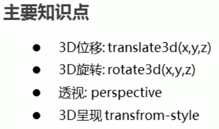

```css
设置3d舞台，默认是2d
transform-style: preserve-3d;
            /* flat——2d舞台
            preserve-3d——3d舞台 */
```


### 透视perspective


说明：父元素中设置的视距`perspective`的**值越大**，说明人的眼睛到屏幕的**距离也越大（远）**，**成像就越小**。

反而**值越小**，人的眼睛到屏幕的**距离也越小（近）**，**成像就越大**。（区别**z轴的近大远小**）。


### 1）translate3d()-3D平移


+ **translateZ()** 

+ **translate3d(x轴，y轴，z轴)**

`transform:translateZ(200px);` == `transform:translate3d(0,0,200px);`

（1）Z轴平移，调整元素在Z轴的位置，正常情况就是**调整元素和人眼之间的距离**,**距离越大，元素离人越近**

（2）Z轴平移属于**立体效果(近大远小)**，默认情况下网页是**不支持透视**，如果需要看见效果**<span style="color:red">必须要设置网页的视距</span>**。在**<span style="color:red">父元素中设置视距（景深）——`perspective`</span>**

```css
    body {
      /* 透视写到被观察元素的父盒子上面 */
      perspective: 200px;
    }

    div {
      width: 200px;
      height: 200px;
      background-color: pink;
      /* transform: translateX(100px); */
      /* transform: translateY(100px); */
      /* transform: translate(100px,100px); */
      transform: translateX(100px) translateY(100px) translateZ(100px);
      /* 1. translateZ 沿着Z轴移动 */
      /* 2. translateZ 后面的单位我们一般跟px */
      /* 3. translateZ(100px) 向外移动100px （向我们的眼睛来移动的） */
      /* 4. 3D移动有简写的方法 */
      /* transform: translate3d(x,y,z); */
      transform: translate3d(100px, 100px, 100px);
      /* 5. xyz是不能省略的，如果没有就写0 */
      transform: translate3d(0, 100px, 100px);
    }

  <div></div>
```


### 2）rotate3d()-3D旋转

3d： 通过3d旋转可以使用元素**沿着x y 或 z轴旋转指定的角度**。


如下分别是沿着X，Y和Z轴旋转（以下都是默认正值方向）：


（1）x轴正方向：

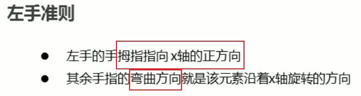


（2）y轴正方向：


（3）z轴正方向：顺时针


`transform: rotate3d(0,0,1,30deg);`——前三个取值是0~1，表示倍数，如上：x，y旋转0×30deg；z轴旋转1×30deg

```css
    body {
      perspective: 500px;
    }

    img {
      display: block;
      margin: 100px auto;
      transition: all 1s;
    }

    img:hover {
      /* transform: rotateX(45deg); */
      /* transform: rotateY(45deg); */
      /* transform: rotateZ(180deg); */
      /* transform: rotate3d(x,y,z,deg); */
      /* transform: rotate3d(1, 0, 0, 45deg); */
      /* transform: rotate3d(0, 1, 0, 45deg); */
      transform: rotate3d(1, 1, 0.5, 45deg);
    }
 
  
```


### 3）scale3d()-3D缩放

+ **scaleZ()**

+ **scale3d()**

**scale3d(1,1,sz) == scale(sz)**;    

让元素在Z轴上按比例缩放，默认为1。当值**大于1**时，元素**放大**；反正**小于1**大于0.01时，元素**缩小**。  


单独使用没有效果，要配合其他的变形。


### 3D呈现transfrom-style

​        之前讲的3D都是一个盒子具有3D效果，但是实际开发中经常会遇到一个父盒子带几个子盒子，父盒子是有3D效果，但是子盒子也有3D效果吗？？

`transform-style: preserve-3d;`


```css
    .box {
      /* 父元素添加视距 */
      perspective: 500px;
      position: relative;
      width: 200px;
      height: 200px;
      margin: 100px auto;
      transition: all 2s;
      /* 让子元素保持3d立体空间环境，给父元素添加3D呈现，影响的是子盒子——子元素开启3D立体空间 */
      transform-style: preserve-3d;
    }

    .box:hover {
      transform: rotateY(60deg);
    }

    .box div {
      position: absolute;
      top: 0;
      left: 0;
      width: 100%;
      height: 100%;
      background-color: pink;
    }

    .box div:last-child {
      background-color: purple;
      transform: rotateX(60deg);
    }
 
  <div class="box">
    <div></div>
    <div></div>
  </div>
```


案例：两面翻转盒子案例


```css
    body {
      perspective: 600px;
    }

    .box {
      position: relative;
      width: 300px;
      height: 300px;
      margin: 100px auto;
      transition: all .4s;
      /* 让背面的紫色盒子保留立体空间 给父级添加的 */
      transform-style: preserve-3d;
    }

    .box:hover {
      transform: rotateY(180deg);
    }

    .front,
    .back {
      position: absolute;
      top: 0;
      left: 0;
      width: 100%;
      height: 100%;
      border-radius: 50%;
      font-size: 30px;
      color: #fff;
      text-align: center;
      line-height: 300px;
    }

    .front {
      background-color: pink;
      z-index: 1;
      backface-visibility: hidden;
    }

    .back {
      background-color: purple;
      /* 像手机一样 背靠背 旋转 */
      transform: rotateY(180deg);
    }
 
  <div class="box">
    <div class="front">黑马程序员</div>
    <div class="back">pink老师这里等你</div>
  </div> 
```


## 动画animation


**animation**和transition的区别：

（1）动画和过渡类似，都可以实现一些**动态的效果**，不同的是**过渡要在某个属性发生变化时才会触发**，而动画可以**<span style="color:red">自动触发动态效果</span>**。

（2）设置动画效果，必须**先要设置一个关键帧**，关键帧**设置了动画执行的每一个步骤**


### 1、动画的基本使用


**动画序列：**


```css
      /* 1. 定义动画 */
      /*@keyframes后跟的是关键帧的名字（可以随便起）*/
      @keyframes identifier {
            /*from表示动画的开始位置 也可以使用0%*/
            from{
                margin-left: 0;
            }

            /*to表示动画的结束位置 也可以使用100%*/
            to{
                margin-left: 700px;
            }
        }
```

```css
    /* from to 等价于  0% 和  100% */
    /* 动画序列 */
    /* 1. 可以做多个状态的变化 keyframes关键帧 */
    /* 2. 里面的百分比要是整数 */
    /* 3. 里面的百分比就是 总的时间（我们这个案例10s）的划分 25% * 10  =  2.5s，说明25%设置的属性，在2.5s时变成这个状态 */

    /* 1. 定义动画 */
    @keyframes move {
      0% {
        /* 开始状态 */
        /* 可以不写 */
        transform: translate(0, 0);
      }

      25% {
        /* 接着前面的变化继续，不会覆盖 */
        transform: translate(1000px, 0)
      }

      50% {
        transform: translate(1000px, 500px);
      }

      75% {
        transform: translate(0, 500px);
      }

      100% {
        /* 结束状态 */
        transform: translate(0, 0);
      }
    }

    div {
      width: 100px;
      height: 100px;
      background-color: pink;
      /* 2. 调用动画 */
      /* 动画名称 */
      animation-name: move;
      /* 持续时间 */
      animation-duration: 10s;
    }

  <div></div>
```

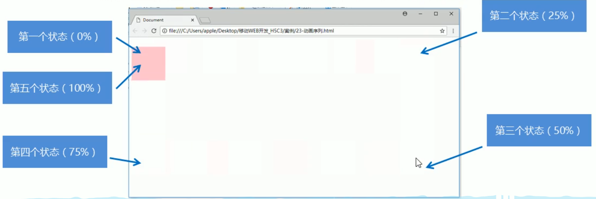


### 2、动画常用的属性


属性：

+ `animation-name:`指定当前元素要执行的**关键帧的名字**，指定所应用的动画名称

+ `animation-duration:`指定动画的**执行时间**，单位s或ms

+ `animation-timing-function:`指定动画的**运动曲线**，跟`transition-timing-function`用法一样

+ `animation-delay:`设置动画的**延时执行（何时开始）**，单位s或ms

+ `animation-iteration-count:`指定**动画执行的次数** 
  + **infinite   无限循环**
  
  + **number**   **整数值**，循环的次数
  
+ `animation-direction:`指定动画**运行的方向**
  + **normal** 默认值 从from向to运行 每次都是这样
  + **reverse** 从 to 向 from 运行 每次都是这样
  + **alternate** **从 from 向 to 开始重复**执行动画，重复要先设置上面`animation-iteration-count: infinite;`：先是从form - to，再是从to -from。（原本的重复是from-to，然后又回到起点从from-to）
  + **alternate-reverse** **从 to 向 from 开始重复**执行动画，重复要先设置上面`animation-iteration-count: infinite;`：先是从to - from，再是从from-to。

+ `animation-play-state:`设置动画的**执行状态**
  + **running** 默认值 动画**执行**
  + **paused** 动画**暂停**，一般**配合悬停设置**，比如：指针悬停时，动画暂停。

```css
    div:hover{
            /* 动画暂停 */
            animation-play-state: paused;
        }
```

+ `animation-fill-mode:`指定动画的**填充模式**
  + **none** 默认值 动画执行完毕元素**回到原来位置**
  + **forwards** 动画执行完毕元素会**停止在动画结束的位置**

```css
    div {
      width: 100px;
      height: 100px;
      background-color: pink;
      /* 动画名称 */
      animation-name: move;
      /* 持续时间 */
      animation-duration: 2s;
      /* 运动曲线 */
      /* animation-timing-function: ease; */
      /* 何时开始 */
      animation-delay: 1s;
      /* 重复次数  iteration 重复的 conut 次数  infinite  无限 */
      animation-iteration-count: infinite;
      /* 是否反方向播放 默认的是 normal  如果想要反方向 就写 alternate */
      animation-direction: alternate-reverse;
      /* 动画结束后的状态 默认的是 backwards  回到起始状态 我们可以让他停留在结束状态 forwards */
      animation-fill-mode: forwards;
    }

    div:hover {
      /* 鼠标经过div 让这个div 停止动画，鼠标离开就继续动画 */
      animation-play-state: paused;
    }
```


### 3、动画简写


可以添加（调用）多个动画，多个动画用`,`逗号隔开

```css
animation: bear .4s steps(8) infinite, move 3s forwards;
```

```css
      /* animation: name duration timing-function delay iteration-count direction fill-mode; */
         animation: move 2s linear 0s 1 alternate forwards;
      /* 前面2个属性 name  duration 一定要写 */
      /* animation: move 2s linear  alternate forwards; */
```


案例：热点图案例

```css
    body {
      background-color: #333;
    }

    .map {
      position: relative;
      width: 747px;
      height: 616px;
      background: url(media/map.png) no-repeat;
      margin: 0 auto;
    }

    .city {
      position: absolute;
      top: 227px;
      right: 193px;
      color: #fff;
    }

    .tb {
      top: 500px;
      right: 80px;
    }

    .dotted {
      width: 8px;
      height: 8px;
      background-color: #09f;
      border-radius: 50%;
    }

    .city div[class^="pulse"] {
      /* 保证我们小波纹在父盒子里面水平垂直居中 放大之后就会中心向四周发散 */
      position: absolute;
      top: 50%;
      left: 50%;
      transform: translate(-50%, -50%);
      width: 8px;
      height: 8px;
      /* 设置盒子阴影 */
      box-shadow: 0 0 12px #009dfd;
      border-radius: 50%;
      animation: pulse 1.2s linear infinite;
    }

    .city div.pulse2 {
      animation-delay: 0.4s;
    }

    .city div.pulse3 {
      animation-delay: 0.8s;
    }

    @keyframes pulse {
      0% {}

      70% {
        /* transform: scale(5);  我们不要用scale 因为他会让 阴影变大*/
        width: 40px;
        height: 40px;
        opacity: 1;
      }

      100% {
        width: 70px;
        height: 70px;
        opacity: 0;
      }
    }
 
  <div class="map">
    <div class="city">
      <!-- 蓝色小圆点 -->
      <div class="dotted"></div>
      <!-- 三个圆圈波纹 -->
      <div class="pulse1"></div>
      <div class="pulse2"></div>
      <div class="pulse3"></div>
    </div>
    <div class="city tb">
      <div class="dotted"></div>
      <div class="pulse1"></div>
      <div class="pulse2"></div>
      <div class="pulse3"></div>
    </div>
  </div>
```


### 5、运动曲线细节

`animation-timing-function:`指定动画的**运动曲线**，默认是`ease`


```css
    div {
      overflow: hidden;
      font-size: 20px;
      width: 0;
      height: 30px;
      background-color: pink;
      /* 让我们的文字强制一行内显示 */
      white-space: nowrap;
      /* steps 就是分几步来完成我们的动画 有了steps 就不要在写 ease 或者linear 了 */
      /* animation: w 4s linear forwards; */
      /* 分十步，一步一步完成动画，实现一个一个字出现（打字机效果） */
      animation: w 4s steps(10) forwards;
    }

    @keyframes w {
      0% {
        width: 0;
      }

      100% {
        width: 200px;
      }
    }
 
  <div>世纪佳缘我在这里等你</div>
```


案例：奔跑的熊大案例


```css
   body {
      background-color: #ccc;
    }

    div {
      position: absolute;
      /* 盒子大小只显示一个熊的大小 */
      width: 200px;
      height: 100px;
      background: url(media/bear.png) no-repeat;
      /* 我们元素可以添加多个动画， 用逗号分隔 */
      /* 小熊的走动必须是步长，一步一步来 */
      animation: bear .4s steps(8) infinite, move 3s forwards;
    }

    @keyframes bear {
      0% {
        background-position: 0 0;
      }

      100% {
        background-position: -1600px 0;
      }
    }

    @keyframes move {
      0% {
        left: 0;
      }

      100% {
        /* 水平居中 */
        left: 50%;
        /* margin-left: -100px; */
        transform: translateX(-50%);
      }
    }

  <div></div>
```


### Animate.css——CSS3动画库

```css
<!-- 引入 -->

<head>
  <link rel="stylesheet"      href="https://cdnjs.cloudflare.com/ajax/libs/animate.css/3.7.0 /animate.min.css">
</head>
```

首先要有一个基础类 “**animated**” ，如果没这个类，其他都是无用功！
然后**在后面再加一个动画类**，就能实现动画效果了（这里我用那个了bounce这个动画）。

```html
<div class="animated bounce"></div>
```

也可以之间定义class选择器，设置动画效果，在animated后面写

```css
.zyk{
     animation-iteration-count: infinite;
     animation-duration: 2s;
    }
然后直接引用
<div class="animated bounce zyk"></div>
```


## 浏览器的私有前缀

浏览器私有前缀是为了**兼容老版本**的写法，比较新版本的浏览器无需添加。


e
