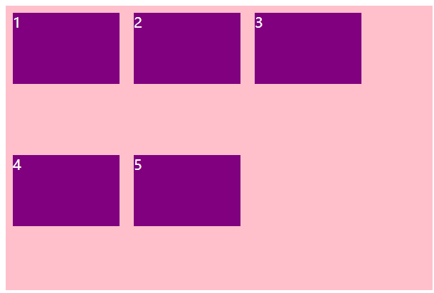
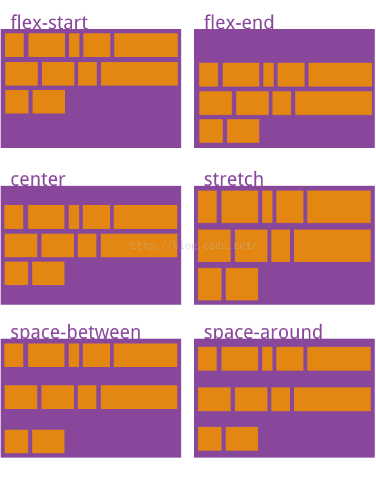
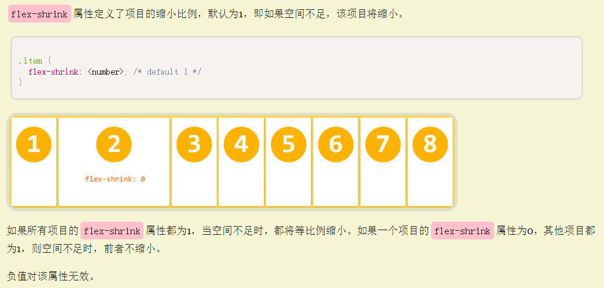
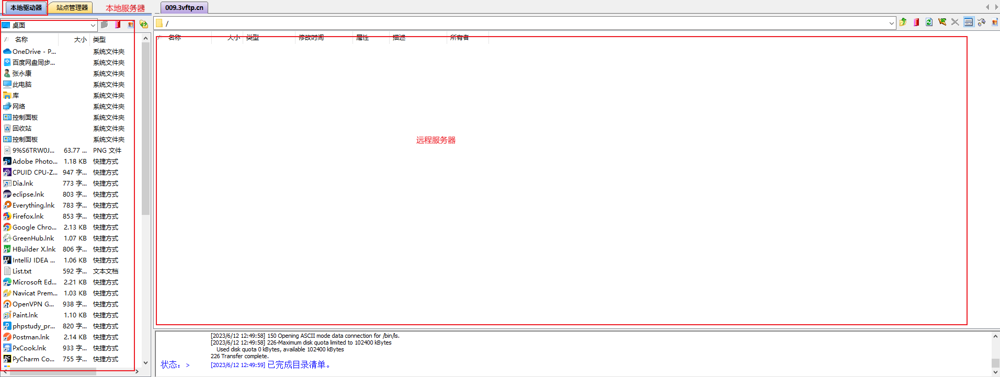

# 移动WEB开发之流式布局

## 1、移动端基础

### （1）浏览器的现状


### （2）手机屏幕的现状


### （3）常见移动端屏幕尺寸


### （4）移动端调试方法


谷歌浏览器的手机模拟器：

1. 鼠标右键 检查 或 F12 控制器界面方向
2. 选择 手机模式
3. 选择 手机类型及尺寸；调节适当的显示比例；换手机类型要点击刷新
4. 点右键 查看 页面元素；


### （5）移动端和PC端区别

pc端:

- 屏幕比较**大**
- 需要网页**固定版心**且需要考虑更多的**兼容性问题**

移动端:

- 屏幕比较**小** 网页的宽度大多都是**100%** (为了适配当前主流手机屏幕)
- 移动端基本也**不需要考虑兼容性问题**，可**放心使用CSS3**特性


## 2、viewport视口

定义：

**视口**：浏览器（PC、移动端）**显示页面内容的屏幕区域**；不同的屏幕的大小，我们看到的区域也是不同的；

PC端的页面直接放入手机屏显示，不友好，可以用**viewport**来解决

**（1）在pc端**

视口指：pc端中，**浏览器的可视区域**；

**（2）在移动端**

移动端的视口分三种：**Layout Viewport（布局视口）**、 **Visual Viewport（视觉视口）**、**Ideal Viewport（理想视口）**。

### 1）布局视口


**布局视口：**布局视口是**指 <span style="color:red;">网页的宽度width</span>**，一般**移动端浏览器**都**默认设置了布局视口的宽度**，根据设备的不同，布局视口的默认宽度有可能是768px、980px或者1024px等


### 2）视觉视口


**视觉视口**：视觉视口**是指用户正在<span style="color:red;">看到的网站的区域</span>**（眼睛可以看到的区域）。<span style="color:red">注意：是网站的区域</span>

这个区域的宽度**等同于移动设备的浏览器窗口的宽度**，如下图：


### 3）理想视口


**理想视口**：理想视口是指对**设备来讲最理想的视口尺寸**。采用理想视口的方式，可以使网页在**移动端浏览器**上获得最理想的浏览和阅读的宽度。理想：网页的宽度 = 移动设备的宽度


### meta视口标签

那么设置HTML宽度多少为合适呢？设置为屏幕的窗口大小应该正好合适


meta标签设置：

`width=device-width`：**移动端默认视口的宽度为980px** ，为了适应不同宽度的屏幕，需要将**网页width等于设备宽度**。**布局视口宽度 = 移动设备宽度**；

`user-scalable`：**是否允许用户缩放屏幕**。值：**no**(0不允许) **yes**(1允许)；

`initial-scale`：**初始化缩放比例**；1.0：不缩放；

`maximum-scale`：用户对页面的**最大缩放比例**；值：比例

`minimum-scale`：用户对页面的**最小缩放比例**；值：比例

### 标准的viewport设置


## 3、二倍图

### （1）物理像素点和屏幕分辨率

**物理像素点**

- 指计算机显示设备中的**最小单位**，即**一个像素点的大小**。每一个像素点可以理解为就是屏幕上的一个发光点。每个点可以发一个颜色，就是我们看到的画面。

**屏幕分辨率**

- 由**物理像素点的个数**来衡量，表示**屏幕水平和垂直方向的物理像素点的个数。**


### （2）物理像素&物理像素比


**CSS像素（开发像素）**：在**模拟器上显示**的分辨率，设备使用程序来描绘数据的虚拟像素，主要为了解决高分辨率屏幕不能与普通屏幕一一对应的问题。使用设备独立像素能**保证在高分屏和普通屏显示的布局、图像等尺寸保持一致**

**物理像素**：**真实的**分辨率。

- 像素指计算机显示设备中的**最小单位**，即一个像素点的大小。每一个像素点可以理解为就是屏幕上的一个发光点。每个点可以发一个颜色，就是我们看到的画面。

屏幕开发清晰度问题，在pc端1px对应1个物理像素点，但是**移动端的1px对应的物理像素点个数不一定**，1px对应的物理像素越多，清晰度越高。<span style="color:red">一个px能显示的物理像素点的个数</span>，称为<span style="color:red">物理像素比或屏幕像素比</span>。

比如：iphone6  1CSS像素==2物理像素    

​            S5  1CSS像素==3物理像素  

```css
    div {
      width: 1000px;
      height: 300px;
      background-color: pink;
    }
    /* 1. 物理像素 就是我们说的分辨率  iPhone8的物理像素是 750 */
    /* 2. 在 iPhone8里面  1px 开发像素  =  2个物理像素  */ 
```


**设计稿：**

   1. 采用css像素or**物理像素**？  css像素375px，物理像素750（为了清晰的页面），采用后者

   2. 每个手机提供1份or多份？其实提供**1份**。

      （1）百分比布局（流式布局）

      （2）弹性盒布局

      （3）**rem布局**


**图片分辨率**

假设：有200*200分辨率的图片，展示在宽度分别是320（iphone3）和640(iphone4)分辨率的手机上，展示的效果如下：


可以看出，不同的屏幕下，显示的图片大小是不一样的；物理像素点的宽度大小为1：0.5，物理像素点的数量：320（1 x 200=200长度）、640(0.5 x 400=200长度；都设为是200长度，才能保证显示的大小一样，这时320的屏幕是200像素点，而640的屏幕是400个像素点。

在移动端，我们可以通过设置CSS样式宽高200px后，会自动保证每个屏幕显示元素大小一样，它会**自动算出**不同屏幕下，背后**需要提供物理像素点需要多少个**。


### （3）二倍图


像针对640分辨率手机屏（iPhone4），要求设计给400*400图，对应我们CSS设置200px,有二倍的关系。


#### 多倍图切图 cutterman


命名：

- xxxxx@2x.png：二倍图
- xxxxx@3x.png：三倍图

```css
  <style>
    /* 我们需要一个50*50像素（css像素）的图片，将一个50*50的照片直接放到我们的iphone8里面会放大2倍  100*100 就会模糊 */
    /* 我们采取的是放一个100*100图片，然后手动的把这个图片 缩小为 50* 50 （css像素） */
    /* 我们准备的图片(100*100) 比 我们实际需要的大小(50*50) 大2倍，这就方式就是 2倍图 */
    img:nth-child(2) {
      width: 50px;
      height: 50px;
    }
  </style>

  <!-- 模糊的 -->
  <!-- 50*50的图片，会被放大2倍为100*100，模糊 -->
  
  <!-- 我们采取2倍图 -->
  <!-- 100*100的图片，但是设置css像素为50*50，最终还是100*100-->
  
```


```css
    /* 1. 我们有一个 50 * 50的盒子需要一个背景图片，但是根据分析这个图片还是要准备2倍， 100*100 */
    /* 2. 我们需要把这个图片缩放一半，也就是 50*50  background-size*/

    div {
      width: 50px;
      height: 50px;
      border: 1px solid red;
      background: url(images/apple100.jpg) no-repeat;
      background-size: 50px 50px;
    }
  </style>
</head>

<body>
  <div></div>
```


## 4、移动端开发选择


### （1）单独制作移动端页面


比如京东：

网页端，正常输入网址即可。

先选择手机模拟器（移动设备），再输入京东网址，就会出现京东商城手机版：

https://m.jd.com/


- 流式布局 (百分比布局)
- flex弹性布局 (强列推荐)
- less+rem+媒体查询布局
- 混合布局

### （2）响应式页面兼容移动端

通过判断屏幕宽度来改变样式，以适应不同终端。

缺点：**制作麻烦**，需要花很大精力去**调兼容性问题**。

- 响应式布局
- bootstrap


## 5、移动端技术解决方案

### （1）移动端浏览器


### （2）CSS初始化normalize.css


### （3）CSS3盒子模型box-sizing


```css
    div:nth-child(1) {
      /* 传统盒子模型= width + border + padding */
      width: 200px;
      height: 200px;
      background-color: pink;
      padding: 10px;
      border: 10px solid red;
      box-sizing: content-box;
    }

    div:nth-child(2) {
      /* 有了这句话就让盒子变成CSS3盒子模型 */
      /* padding 和 border 不会再撑大盒子了 */
      box-sizing: border-box;
      width: 200px;
      height: 200px;
      background-color: purple;
      padding: 10px;
      border: 10px solid blue;
    }
 
  <div></div>
  <div></div>
```


### （4）特殊样式


## 6、移动端常见布局


### 1）流式布局（百分比布局）


```css
    section {
      width: 100%;
      max-width: 980px;
      min-width: 320px;
      margin: 0 auto;
    }

    section div {
      float: left;
      width: 50%;
      height: 400px;
    }

    section div:nth-child(1) {
      background-color: pink;
    }

    section div:nth-child(2) {
      background-color: purple;
    }
 
  <section>
    <div></div>
    <div></div>
  </section>
```


### 案例：京东移动端首页

（1）技术选型


（2）搭建相关文件夹结构


（3）设置视口标签和引入初始化样式


### 2）flex布局-弹性盒

#### （1）传统布局与flex布局


弹性盒是一种新的布局方式，特别适合**移动端布局**。**控制 子元素的布局方式**。

说明：主轴和侧轴（交叉轴）的分辨：

​           当**主轴是水平方向**排列的，那么**侧轴就是垂直方向**排列的；（默认情况）

​           当**主轴是垂直方向**排列的，那么**侧轴就是水平方向**排列的。


#### （2）布局原理


```css
   div {
      display: flex;
      width: 80%;
      height: 300px;
      background-color: pink;
      /* 定义项目在主轴上的排列方式 */
      justify-content: space-around;
    }

    div span {
      /* width: 150px; */
      height: 100px;
      background-color: purple;
      margin-right: 5px;
      flex: 1;
    }

  <div>
    <span>1</span>
    <span>2</span>
    <span>3</span>
  </div>
```


#### （3）父元素**display: flex**    

设置让**父元素为弹性盒**，**<span style="color:red;">控制子元素布局</span>**！

+ 子元素默认**水平排列**,就是沿着主轴排列（默认**排在一行上**`nowrap`，压缩flex-shrink为1），默认下主轴为**x轴**

+ **子元素**是行内元素，**会被变成<span style="color:red">块元素</span>**，可以设置宽高

+ 只有**一个元素**的时候，给子元素添加**margin:auto**，实现子元素的自动**水平垂直居中**


#### （3）flex容器（父项）的属性

以下由6个属性是对父元素设置的


- **flex-direction**：`row|column|row-reverse|column-reverse`
- **flex-wrap**：`nowrap|wrap|wrap-reverse`
- **flex-flow**
- **justify-content**：`flex-start|flex-end|center|space-between|space-around`
- **align-items**：`flex-start|flex-end|center|baseline|stretch`
- **align-content**：`flex-start|flex-end|center|space-between|space-around`


##### 1）flex-direction设置主轴的方向


**flex-diretion属性：定义主轴的方向**，即项目的排列方向。

顺序制定了弹性盒子在父容器中的位置

+ **row**：默认值，主轴为**水平方向**，起点在**左端**

+ **row-reverse**：**翻转**横向排列，主轴为**水平方向**，起点在**右端**

+ **column**：主轴为**垂直方向**，起点在**上沿**

+ **column-reverse**：**翻转**纵向排列，主轴为**垂直方向**，起点在**下沿**


```css
    div {
      /* 给父级添加flex属性 */
      display: flex;
      width: 800px;
      height: 300px;
      background-color: pink;
      /* 默认的主轴是x轴——行row  那么y轴就是侧轴喽 */
      /* 我们的元素是跟着主轴来排列的 */
      flex-direction: row;
      /* 简单了解 翻转 */
      flex-direction: row-reverse;
      /* 我们可以把我们的主轴设置为y轴 那么x轴就成了侧轴 */
      flex-direction: column;
      flex-direction: column-reverse;
    }

    div span {
      width: 150px;
      height: 100px;
      background-color: purple;
    }
 
  <div>
    <span>1</span>
    <span>2</span>
    <span>3</span>
  </div>
```

row：


row-reverse:


column:


column-reverse:


##### 2）flex-wrap设置子元素是否换行

**flex-wrap属性**：定义**一条轴线排不下**，**如何换行**

默认情况下，**项目都排在一条线**（又称"**轴线**"）上。flex-wrap属性定义：如果一条轴线排不下，如何换行。会产生**多条轴线**

+ **nowrap**：默认值，**不换行**，**弹性盒子伸缩**，为项目**排在一条轴线上**


+ **wrap**：**换行，第一行在上方**。会产生**多条轴线**


+ **wrap-reverse**：**换行，第一行在下方**。会产生多条轴线


```css
    div {
      display: flex;
      width: 600px;
      height: 400px;
      background-color: pink;
      /* flex布局中，默认的子元素是不换行的， 如果装不开，会缩小子元素的宽度，放到父元素里面  */
      flex-wrap: nowrap;
      /* flex-wrap: wrap; */
      flex-wrap: wrap-reverse;
    }

    div span {
      width: 150px;
      height: 100px;
      background-color: purple;
      color: #fff;
      margin: 10px;
    }

  <div>
    <span>1</span>
    <span>2</span>
    <span>3</span>
    <span>4</span>
    <span>5</span>
  </div>
```

`flex-wrap: nowrap;`


`flex-wrap: wrap;`



`flex-wrap: wrap-reverse;`


##### 3）flex-flow

**flex-flow属性**：**flex-direction属性和flex-wrap属性的简写形式**，默认值为row nowrap

`flex-flow: row/column/row-reverse/column-reverse | nowrap/wrap/wrap-reverse ;`


##### 4）justify-content设置主轴上的子元素排列方式


**justify-content属性：定义项目在  主轴  上的对齐方式**

 说明：内容对齐**justify-content属性**应用在弹性容器上，把弹性子项**沿着弹性容器的主轴线对齐**

+ **flex-start**：默认值，主轴**左端**对齐

+ **flex-end** ：主轴**右端**对齐

+ **center**：主轴**居中**对齐

+ **space-between**：主轴**两端**对齐，**中间自动分配**，**项目之间的间隔都相等**

+ **space-around**：自动分配距离——**每个项目两侧的间隔相等**。所以，项目之间的间隔比项目与边框的间隔大一倍。


```css
    div {
      display: flex;
      width: 800px;
      height: 300px;
      background-color: pink;
      /* 默认的主轴是 x 轴 row */
      /* flex-direction: row; */
      /* justify-content: 是设置主轴上子元素的排列方式 */
      justify-content: flex-start;
      justify-content: flex-end;
      /* 让我们子元素居中对齐 */
      justify-content: center;
      /* 平分剩余空间 */
      justify-content: space-around;
      /* 先两边贴边， 在分配剩余的空间 */
      justify-content: space-between;
    }

    div span {
      width: 150px;
      height: 100px;
      background-color: purple;
    }

  <div>
    <span>1</span>
    <span>2</span>
    <span>3</span>
    <span>4</span>
  </div>
```

`justify-content: flex-start;`


`justify-content: flex-end;`


`justify-content: center;`


`justify-content: space-around;`


`justify-content: space-between;`


##### 5）align-items设置侧轴上的子元素排列方式（单行）


**align-items属性：定义项目在  侧轴  上的对齐方式**

这里的**align-items属性**，是**定义在父元素**弹性盒子里，所以，它**控制所有的项目（单行）在侧轴上的对齐方式**。

到项目属性里，在**项目里设置align-self属性**，可以控制单独的项目，**覆盖**父元素里的align-items属性。

属性值：

- **flex-start**：**侧轴的起点**对齐。
- **flex-end**：**侧轴的终点**对齐。
- **center**：**侧轴的中点**对齐。
- **baseline**: 项目的**第一行文字的基线对齐**。
- **stretch**（**默认值**）：如果项目**未设置高度或设为auto**，将**占满整个容器的高度**。


##### 6）align-content设置侧轴上的子元素的排列方式（多行）


**align-content属性**：**定义了多根轴线（在侧轴上）的对齐方式**。也可以说是**控制换行后各行的行间距**。（如果项目只有一根轴线，该属性不起作用）。特别是**设置flex-wrap属性换行了**，此时有多根轴线。

- **flex-start**：**与侧轴的起点**对齐。
- **flex-end**：**与侧轴的终点**对齐。
- **center**：**与侧轴的中点**对齐。
- **space-between**：**与侧轴两端**对齐，**轴线之间的间隔平均分布**。
- **space-around**：**每根轴线两侧的间隔都相等**。所以，轴线之间的间隔比轴线与边框的间隔大一倍。
- **stretch**（默认值）：如果项目**未设置高度或设为auto**，**轴线占满整个侧轴**。



```css
    div {
      display: flex;
      width: 800px;
      height: 400px;
      background-color: pink;
      /* 换行 */
      flex-wrap: wrap;
      /* 因为有了换行，此时我们侧轴上控制子元素的对齐方式我们用 align-content */
      align-content: flex-start;
      align-content: flex-end;
      align-content: center;
      align-content: space-between;
      align-content: space-around;
    }

    div span {
      width: 150px;
      height: 100px;
      background-color: purple;
      color: #fff;
      margin: 10px;
    }

  <div>
    <span>1</span>
    <span>2</span>
    <span>3</span>
    <span>4</span>
    <span>5</span>
    <span>6</span>
  </div>
```

`align-content: flex-start;`


`align-content: flex-end;`


`align-content: center;`


`align-content: space-between;`


`align-content: space-around;`


align-items和align-content的区别：


#### （4）项目（子项）的属性


以下6个属性**设置在项目上**。

- **flex-grow**
- **flex-shrink**
- **flex-basis**
- **flex**
- **order**
- **align-self**


##### 1）flex-grow定义项目如何分配剩余空间

**flex-grow属性：定义项目的放大比例**。

**默认为0**——即如果存在剩余空间，也**默认不放大**。


如果所有项目的flex-grow属性值**都为1**，则它们**将等分剩余空间**（如果有的话）。

如果**一个项目**的flex-grow**属性为2**，**其他项目都为1**，则前者占据的剩余空间将比其他项**多一倍**。

如果**只有一个**项目**设置了flex属性值>0**，它会**占据所有的剩余空间**，常用


##### 2）flex-shrink定义了项目的缩小比例

**flex-shrink属性：定义了项目的缩小比例**。




##### 3）flex-basis

**flex-basis属性：定义了在分配多余空间之前，项目占据 主轴 的空间**


##### 4）flex属性


**flex属性：是flex-grow, flex-shrink 和 flex-basis的简写**，默认值为**0 1 auto**。**后两个属性可选**。

该属性有两个快捷值：auto (1 1 auto) 和 none (0 0 auto)。

**建议优先使用这个属性**，而不是单独写三个分离的属性，因为浏览器会推算相关值。

```css
    section {
      display: flex;
      width: 60%;
      height: 150px;
      background-color: pink;
      margin: 0 auto;
    }

    section div:nth-child(1) {
      width: 100px;
      height: 150px;
      background-color: red;
    }

    section div:nth-child(2) {
      flex: 1;
      background-color: green;
    }

    section div:nth-child(3) {
      width: 100px;
      height: 150px;
      background-color: blue;
    }

    p {
      display: flex;
      width: 60%;
      height: 150px;
      background-color: pink;
      margin: 100px auto;
    }

    p span {
      /* 项目都没设置宽高，flex为1， 每个子项均分。*/
      flex: 1;
    }

    p span:nth-child(2) {
      /* 单独设置2，占两份 */
      flex: 2;
      background-color: purple;
    }

  <section>
    <div></div>
    <div></div>
    <div></div>
  </section>
  <p>
    <span>1</span>
    <span>2</span>
    <span>3</span>
  </p>
```


##### 5）order

**order属性：定义项目的排列顺序**。数值**越小**，排列**越靠前**，**默认为0**，可以取负值。


##### 6）align-self


**align-self属性**：允许**单个项目**有与其他项目不一样的**在  侧轴  上的对齐方式**，可**覆盖align-items属性——定义所有项目在侧轴上的对齐方式（单行）**。


该属性可能**取6个值**，除了auto，其他都与align-items属性完全一致。

+ **flex-start**：**侧轴的起点**对齐
+ **flex-end**：**侧轴的终点**对齐
+ **center**：**侧轴的中点**对齐
+ **baseline**：项目的**第一行文字的基线对齐**
+ **stretch**：如果项目**未设置高度（主轴是垂直时，宽度）或设为auto**，将**占满**整个容器的**高度**。
+ **auto**：表示**继承父元素的align-items属性**，如果没有父元素，则等同于stretch。

```css
    div {
      display: flex;
      width: 80%;
      height: 300px;
      background-color: pink;
      /* 让三个子盒子沿着侧轴底侧对齐 */
      /* align-items: flex-end; */
      /* 我们想只让3号盒子下来底侧 */
    }

    div span {
      width: 150px;
      height: 100px;
      background-color: purple;
      margin-right: 5px;
    }

    div span:nth-child(2) {
      /* 默认是0   -1比0小所以在前面 */
      order: -1;
    }

    div span:nth-child(3) {
      /* 子盒子设置自己在侧轴上的排列方式 */
      align-self: flex-end;
    }
 
  <div>
    <span>1</span>
    <span>2</span>
    <span>3</span>
  </div>
```


### 3）rem适配布局


#### （1）rem基础


+ **px**:  绝对长度单位，最常用

+ **em**:  相对单位，**相对于父元素的字体大小** 

+ **rem**: root em  相对单位， **相对于<span style="color:red">根元素（html）</span>**的**字体大小**，常用于响应式布局。 选择性使用rem作为单位，这样在不同尺寸的设备上，**通过修改根节点的font-size大小，实现等比例缩放**

rem和em它们之间其实很相似，只不过一个计算的规则是依赖根元素一个是依赖父元素计算。

rem取值分为两种情况，设置在根元素时和非根元素时，举个例子：

```css
/* 作用于根元素，相对于原始大小（16px），所以html的font-size为32px */
html {font-size: 2rem;}

/* 作用于非根元素，相对于根元素字体大小，所以为2*32px=64px */
p {font-size: 2rem;}

%%%%%%%%%%%%%%%%%%%%%%%%%%%%%%%%%%%%%%%%%%%%%%%%%%%%%%%

    html {
      font-size: 12px;
    }

    div {
      font-size: 12px;
      width: 15rem;
      height: 15rem;
      background-color: purple;
    }

    p {
      /* 1. em相对于 父元素 的字体大小来说的 */
      /* width: 10em;
      height: 10em; */
      /* 2. rem 相对于 html元素 字体大小来说的 */
      width: 10rem;
      height: 10rem;
      background-color: pink;
      /* 3.rem的优点就是可以通过修改html里面的文字大小来改变页面中元素的大小可以整体控制 */
    }
 
  <div>
    <p></p>
  </div>
```


#### （2）媒体查询@media

**什么是媒体查询**：

浏览器怎么知道屏幕大小？

含义：媒体查询可以让我们**根据设备显示器的特性**（如视口宽度、屏幕比例、设备方向：横向or纵向）**为其设定CSS样式**。

媒体查询由**媒体类型**和**一个或多个检测 媒体特性 的条件表达式**组成。

使用媒体查询，可以在**不改变页面内容的情况下**，为特定的一些输出设备定制显示效果。

作用：


**媒体查询操作方式**：

实际操作为：**对设备提出询问**（称作表达式）开始，如果表达式结果为**真**，媒体查询中的**CSS被应用**，如果表达式结果为**假**，媒体查询内的**CSS将被忽略。**

**语法结构**：


1）**mediatype**：**媒体类型**

+ **all**–所有设备
+ **print**–打印机和打印预览
+ **screen**–电脑屏幕，平板电脑，智能手机等（常用）
+ **speech**-屏幕阅读器等发声设备
+ ......

2）关键字：**and | not | only** ：逻辑操作符，将**媒体类型mediatype** 或 **多个媒体特性media feature**连接到一起做为媒体查询的条件。

+ **all**–用来把**多个媒体特性media feature组合起来**，合并到同一条媒体查询中。只有当**每个属性都为真时，这条查询的结果才为真**。在不使用not或only操作符的 情况下，媒体类型是可选的，**默认**为all。
+ **not**–用来对一条媒体查询的结果进行**取反（排除某种设备媒体类型）**
+ **only**–指定某个特定的媒体类型**（限定某种设备媒体类型**）

3）**media feature**：媒体特性，

+  **max-width**： 输出设备中**页面最大可视区域宽度**，**小于等于**这个width时，其中的css生效
+  **min-width**： 输出设备中**页面最小可视区域宽度**，**大于等于**这个width时，其中的css生效
+  max-height： 输出设备中页面最大可视区域高度
+  min-height： 输出设备中页面最小可视区域高度
+  width：定义输出设备中的页面可见区域宽度。

```css
  <style>
    /* 这句话的意思就是： 在我们屏幕上 并且 最大的宽度是 800像素 设置我们想要的样式 */
    /* max-width 小于等于800 */
    /* 媒体查询可以根据不同的屏幕尺寸在改变不同的样式 */

    @media screen and (max-width: 800px) {
      body {
        background-color: pink;
      }
    }

    @media screen and (max-width: 500px) {
      body {
        background-color: purple;
      }
    }
  </style>
```

横竖屏检测

css中通过媒体查询方法来判断是横屏还是竖屏


orientation取向，方向


**案例：根据页面宽度改变背景颜色**


注意：为了防止混乱，媒体查询我们要按照 **从小到大 or 从大到小** 的顺序来写，但是我们最喜欢的还是 **从小到大** 来写，这样代码更简洁


```css
    /* 1. 媒体查询一般按照从大到小或者 从小到大的顺序来 */
    /* 2. 小于540px 页面的背景颜色变为蓝色 */
    @media screen and (max-width: 539px) {
      body {
        background-color: blue;
      }
    }

    /* 3. 540 ~ 970 我们的页面颜色改为 绿色 */
    /* @media screen and (min-width: 540px) and (max-width: 969px) {
         body {
            background-color: green;
         }
        } */
    @media screen and (min-width: 540px) {
      body {
        background-color: green;
      }
    }

    /* 4. 大于等于970 我们页面的颜色改为 红色 */
    @media screen and (min-width: 970px) {
      body {
        background-color: red;
      }
    }

    /* 5. screen 还有 and 必须带上不能省略的 */
    /* 6. 我们的数字后面必须跟单位  970px   这个 px 不能省略的 */
```

断点：


#### （3）媒体查询 + rem实现元素动态大小变化


```css
    /* html {
      font-size: 12px;
    } */
    p {
      width: 100%;
      font-size: 2rem;
      height: 5rem;
      line-height: 5rem;
      text-align: center;
      color: #fff;
      background: green;
    }

    /* 从小到大的顺序 */
    @media screen and (max-width: 600px) {
      html {
        font-size: 12px;
      }
    }
    
    @media screen and (min-width: 601px) {
      html {
        font-size: 18px;
      }
    }
 
  <p>购物车</p>
```


#### （4）引入资源（理解）


```css
  <style>
    /* 当我们屏幕大于等于 640px以上的，我们让div 一行显示2个 */
    /* 当我们屏幕小于640 我们让div一行显示一个 */
    /* 一个建议： 我们媒体查询最好的方法是从小到大 */
    /* 引入资源就是 针对于不同的屏幕尺寸 调用不同的css文件 */
  </style>
  <link rel="stylesheet" href="style320.css" media="screen and (min-width: 320px)">
  <link rel="stylesheet" href="style640.css" media="screen and (min-width: 640px)">

<body>
  <div>1</div>
  <div>2</div>
</body>
```

style320.css文件

```css
div {
  width: 100%;
  height: 100px;
}

div:nth-child(1) {
  background-color: pink;
}

div:nth-child(2) {
  background-color: purple;
}
```

style640.css文件

```css
div {
  float: left;
  width: 50%;
  height: 100px;
}

div:nth-child(1) {
  background-color: pink;
}

div:nth-child(2) {
  background-color: purple;
}
```


#### （5）less基础

**维护CSS的弊端**


**Less介绍**


**Less使用**


**1）Less变量**


```less
// 定义一个粉色的变量
@color: deeppink;
// 错误的变量名  @1color   @color~@#
// 变量名区分大小写  @color  和  @Color 是两个不同的变量
// 定义了一个 字体为14像素的变量
@font14: 14px;

body {
  background-color: @color;
}

div {
  color: @color;
  font-size: @font14;
}

a {
  font-size: @font14;
}
```

**2）Less编译**


my.less文件

```less
// 定义一个粉色的变量
@color: deeppink;
// 定义了一个 字体为14像素的变量
@font14: 14px;

body {
  background-color: @color;
}

div {
  color: @color;
  font-size: @font14;
}

a {
  font-size: @font14;
}
```

保存后自动生成对应的my.css文件

```css
body {
  background-color: deeppink;
}
div {
  color: deeppink;
  font-size: 14px;
}
a {
  font-size: 14px;
}
```

在对应的页面中使用，引入my.css文件

```html
<link rel="stylesheet" href="my.css">
```

**3）Less嵌套**

less嵌套：子元素的样式**直接写到父元素**里面就好了


```less
.header {
  width: 200px;
  height: 200px;
  background-color: pink;
  // 1. less嵌套 子元素的样式直接写到父元素里面就好了
  a {
    color: red;
    // 2. 如果有伪类、交集选择器、 伪元素选择器 我们内层选择器的前面需要加&
    &:hover {
      color: blue;
    }
  }
}

.nav {
  .logo {
    color: green;
  }

  &::before {
    content: "";
  }
}
```

```css
.header {
  width: 200px;
  height: 200px;
  background-color: pink;
}
.header a {
  color: red;
}
.header a:hover {
  color: blue;
}
.nav .logo {
  color: green;
}
.nav::before {
  content: "";
}

```

```html
<link rel="stylesheet" href="nest.css">

<body>
  <div class="header">
    <a href="#">文字</a>
  </div>
  <div class="nav">
    <div class="logo">传智播客</div>
  </div>
</body>
```

**4）Less运算**


```less
@baseFont: 50px;
@border: 5px + 5;

html {
  font-size: @baseFont;
}

div {
  width: 200px - 50;
  height: (200px + 50px) * 2;
  border: @border solid red;
  background-color: #666 - #222;
}

img {
  width: 82rem / @baseFont;
  height: 82rem / @baseFont;
}
```

```css
html {
  font-size: 50px;
}
div {
  width: 150px;
  height: 500px;
  border: 10px solid red;
  background-color: #444444;
}
img {
  width: 82rem / 50px;
  height: 82rem / 50px;
}
```


#### （6）rem适配方案


**rem实际开发适配方案**


**rem适配方案技术使用（市场主流）**


##### 1）rem实际开发适配方案1

<span style="color:red">rem + 媒体查询 + less技术</span>

原理：现在字体根据rem写死了，可以根据界面大小，来**改变font-size**？

rem布局的本质是**等比缩放**，一般是基于宽度

假设我们将**屏幕宽度平均分成100份**，**每一份的宽度用x表示**，**x = 屏幕宽度 / 100**，如果将**x**作为单位，x前面的数值就代表屏幕宽度的百分比

```css
p {width: 50x} /* 屏幕宽度的50% */ 
```

如果想要**页面元素随着屏幕宽度等比变化**，我们需要上面的**x单位**，不幸的是**css中并没有这样的单位**；幸运的是在css中有rem，**通过rem**这个桥梁，可以**实现神奇的x**

如果**让html元素字体的大小，恒等于  屏幕宽度的1/100**，那1rem和1x就等价了。

```css
html {fons-size: width / 100;}
p {width: 50rem;} /* 50rem = 50x = 屏幕宽度的50% */ 
```

**!!!关键**：**如何让html字体大小一直等于屏幕宽度的1/100呢？**


```css
    @media screen and (min-width: 320px) {
      html {
        font-size: 21.33px;
      }
    }

    @media screen and (min-width: 750px) {
      html {
        font-size: 50px;
      }
    }

    div {
      width: 2rem;
      height: 2rem;
      background-color: pink;
    }

    /* 1. 首先我们选一套标准尺寸 750为准 
       2. 我们用屏幕尺寸 除以 我们划分的份数 得到了 html 里面的文字大小 但是我们知道不同屏幕下得到的文字大小是不一样的 */
    /* 3. 页面元素的rem值 =  页面元素在 750像素的下px值 / html 里面的文字大小 */

<body>
  <div></div>
</body>
```

**案例：苏宁网移动端首页**

网站：https://m.suning.com/


##### 2）rem实际开发适配方案2


**案例：苏宁网移动端首页**


step1：调px和rm的换算，设置-->搜索px，看到**Cssrem：Root Font Size**，默认16，可以**改成html的font-size基准**

step2：按f1-->选中**px to rem**，将所有的单位换成rem


## 7、响应式开发

### 响应式布局

介绍：响应式布局可以通过**同一份代码**快速、有效适配手机、平板、PC设备等**所有的屏幕**。

对页面进行响应式的设计实现，需要**对相同内容进行不同宽度的布局设计**，有两种方式：**pc优先**（从pc端开始向下设计）；**移动优先**（从移动端向上设计）。无论基于那种模式的设计，**要兼容所有设备**，布局响应时不可避免地需要对模块布局做一些变化（**发生布局改变的临界点**称之为**断点**）

响应式布局涉及**屏幕宽度变化(媒体查询)**和布局知识[传统布局方案(百分比、浮动、清除浮动、定位)]


五个原则：


#### （1）响应式开发原理


#### （2）响应式布局容器


但是我们也可以根据实际情况自己定义划分

```css
    .container {
      height: 150px;
      background-color: pink;
      margin: 0 auto;
    }

    /* 1. 超小屏幕下  小于768  布局容器的宽度为 100% */
    @media screen and (max-width: 767px) {
      .container {
        width: 100%;
      }
    }

    /* 2. 小屏幕下  大于等于768  布局容器改为 750px */
    @media screen and (min-width: 768px) {
      .container {
        width: 750px;
      }
    }

    /* 3. 中等屏幕下 大于等于 992px   布局容器修改为 970px */
    @media screen and (min-width: 992px) {
      .container {
        width: 970px;
      }
    }

    /* 4. 大屏幕下 大于等于1200 布局容器修改为 1170 */
    @media screen and (min-width: 1200px) {
      .container {
        width: 1170px;
      }
    }

<body>
  <!-- 响应式开发里面，首先需要一个布局容器 -->
  <div class="container"></div>
</body>
```

**案例：响应式导航**


```css
  <style>
    * {
      margin: 0;
      padding: 0;
    }

    ul {
      list-style: none;
    }

    .container {
      width: 750px;
      margin: 0 auto;
    }

    .container ul li {
      float: left;
      width: 93.75px;
      height: 30px;
      line-height: 30px;
      text-align: center;
      color: #ccc;
      font-size: 14px;
      background-color: green;
    }

    @media screen and (max-width: 767px) {
      .container {
        width: 100%;
      }

      .container ul li {
        width: 33.33%;
      }
    }
  </style>

  <div class="container">
    <ul>
      <li>导航1</li>
      <li>导航2</li>
      <li>导航3</li>
      <li>导航4</li>
      <li>导航5</li>
      <li>导航6</li>
      <li>导航7</li>
      <li>导航8</li>
    </ul>
  </div>
```


### Bootstrap前端开发框架

#### （1）Bootstrap简介


#### （2）Bootstrap的使用


下载好的Bootstrap文件夹里面**有css、fonts、js三个文件夹**，直接复制，黏贴到我们创建的**bootstrap文件夹下面**


在Bootstrap中文网中，入门--基本模板

```html
<!doctype html>
<html lang="zh-CN">
  <head>
    <meta charset="utf-8">
    <meta http-equiv="X-UA-Compatible" content="IE=edge">
    <meta name="viewport" content="width=device-width, initial-scale=1">
    <!-- 上述3个meta标签*必须*放在最前面，任何其他内容都*必须*跟随其后！ -->
    <title>Bootstrap 101 Template</title>

    <!-- Bootstrap -->
    <link rel="stylesheet" href="https://stackpath.bootstrapcdn.com/bootstrap/3.4.1/css/bootstrap.min.css" integrity="sha384-HSMxcRTRxnN+Bdg0JdbxYKrThecOKuH5zCYotlSAcp1+c8xmyTe9GYg1l9a69psu" crossorigin="anonymous">

    <!-- HTML5 shim 和 Respond.js 是为了让 IE8 支持 HTML5 元素和媒体查询（media queries）功能 -->
    <!-- 警告：通过 file:// 协议（就是直接将 html 页面拖拽到浏览器中）访问页面时 Respond.js 不起作用 -->
    <!--[if lt IE 9]>
      <script src="https://cdn.jsdelivr.net/npm/html5shiv@3.7.3/dist/html5shiv.min.js"></script>
      <script src="https://cdn.jsdelivr.net/npm/respond.js@1.4.2/dest/respond.min.js"></script>
    <![endif]-->
  </head>
  <body>
    <h1>你好，世界！</h1>

    <!-- jQuery (Bootstrap 的所有 JavaScript 插件都依赖 jQuery，所以必须放在前边) -->
    <script src="https://cdn.jsdelivr.net/npm/jquery@1.12.4/dist/jquery.min.js" integrity="sha384-nvAa0+6Qg9clwYCGGPpDQLVpLNn0fRaROjHqs13t4Ggj3Ez50XnGQqc/r8MhnRDZ" crossorigin="anonymous"></script>
    <!-- 加载 Bootstrap 的所有 JavaScript 插件。你也可以根据需要只加载单个插件。 -->
    <script src="https://stackpath.bootstrapcdn.com/bootstrap/3.4.1/js/bootstrap.min.js" integrity="sha384-aJ21OjlMXNL5UyIl/XNwTMqvzeRMZH2w8c5cRVpzpU8Y5bApTppSuUkhZXN0VxHd" crossorigin="anonymous"></script>
  </body>
</html>
```


```html
<!DOCTYPE html>
<html lang="en">

<head>
  <meta charset="UTF-8">
  <meta http-equiv="X-UA-Compatible" content="IE=edge">
  <meta name="viewport" content="width=device-width, initial-scale=1.0">
  <!--[if lt IE 9]>
      <script src="https://cdn.jsdelivr.net/npm/html5shiv@3.7.3/dist/html5shiv.min.js"></script>
      <script src="https://cdn.jsdelivr.net/npm/respond.js@1.4.2/dest/respond.min.js"></script>
    <![endif]-->
  <title>Document</title>
  <!-- 一定不要忘记引入bootstrap的样式文件 -->
  <link rel="stylesheet" href="bootstrap/css/bootstrap.min.css">
  <style>
    /* 利用我们自己写的样式覆盖原先的样式 */
    .login {
      width: 100px;
      height: 60px;
    }
  </style>
</head>

<body>
  <button type="button" class="btn btn-success">Success</button>
  <!-- 别的标签使用相同的类也可以达到效果：是用类来控制的 -->
  <div class="btn btn-success login">Success</div>
  <span class="btn btn-danger">Danger</span>
</body>

</html>
```


#### （3）布局容器

Bootstrap 需要为页面内容和栅格系统包裹一个 `.container` 容器。我们提供了两个作此用处的类。注意，由于 `padding` 等属性的原因，这两种容器类**不能互相嵌套**。

一个页面可以有多个容器。


### Bootstrap栅格系统

网站https://v3.bootcss.com/css/#grid


#### （1）栅格系统简介


#### （2）栅格选项参数

栅格系统用于通过一系列的行（row）与列（column）的组合来创建页面布局，你的内容就可以放入这些创建好的布局中。

- “行（row）”必须包含在 `.container` （固定宽度）或 `.container-fluid` （100% 宽度）中，以便为其赋予合适的排列（aligment）和内补（padding）。
- 通过“行（row）”在水平方向创建一组“列（column）”。
- 你的内容应当放置于“列（column）”内，并且，只有“列（column）”可以作为行（row）”的直接子元素。
- 类似 `.row` 和 `.col-xs-4` 这种预定义的类，可以用来快速创建栅格布局。Bootstrap 源码中定义的 mixin 也可以用来创建语义化的布局。
- 通过为“列（column）”设置 `padding` 属性，从而创建列与列之间的间隔（gutter）。通过为 `.row` 元素设置负值 `margin` 从而抵消掉为 `.container` 元素设置的 `padding`，也就间接为“行（row）”所包含的“列（column）”抵消掉了`padding`。
- 负值的 margin就是下面的示例为什么是向外突出的原因。在栅格列中的内容排成一行。
- 栅格系统中的列是通过指定1到12的值来表示其跨越的范围。例如，三个等宽的列可以使用三个 `.col-xs-4` 来创建。
- 如果一“行（row）”中包含了的“列（column）”大于 12，多余的“列（column）”所在的元素将被作为一个整体另起一行排列。


```html
    [class^="col"] {
      border: 1px solid #ccc;
    }

    .row:nth-child(1) {
      background-color: pink;
    }
 
  <div class="container">
    <!-- 在不同屏幕尺寸下，划分不同的份数 -->
    <div class="row">
      <div class="col-lg-3 col-md-4 col-sm-6 col-xs-12">1</div>
      <div class="col-lg-3 col-md-4 col-sm-6 col-xs-12">2</div>
      <div class="col-lg-3 col-md-4 col-sm-6 col-xs-12">3</div>
      <div class="col-lg-3 col-md-4 col-sm-6 col-xs-12">4</div>
    </div>
    <!-- 如果孩子的份数相加等于12 则孩子能占满整个 的container 的宽度 -->
    <div class="row">
      <div class="col-lg-6">1</div>
      <div class="col-lg-2">2</div>
      <div class="col-lg-2">3</div>
      <div class="col-lg-2">4</div>
    </div>
    <!-- 如果孩子的份数相加 小于 12 则会？ 则占不满整个container 的宽度 会有空白 -->
    <div class="row">
      <div class="col-lg-6">1</div>
      <div class="col-lg-2">2</div>
      <div class="col-lg-2">3</div>
      <div class="col-lg-1">4</div>
    </div>
    <!-- 如果孩子的份数相加 大于 12 则会？多于的那一列会 另起一行显示  -->
    <div class="row">
      <div class="col-lg-6">1</div>
      <div class="col-lg-2">2</div>
      <div class="col-lg-2">3</div>
      <div class="col-lg-3">4</div>
    </div>
  </div>
```

宽度设备>=1200px


中等屏幕>=992px


小屏设备>=768px


超小屏幕<768px


#### （3）列偏移

使用 `.col-md-offset-*` 类可以**将列向右侧偏移**。这些类实际是通过使用 `*` 选择器为当前元素增加了**左侧的边距（margin）**。

例如，`.col-md-offset-4` 类将 `.col-md-4` 元素向右侧偏移了4个列（column）的宽度。

```html
    .row div {
      height: 50px;
      background-color: pink;
      border: 1px solid gray;
    }
 
  <div class="container">
    <div class="row">
      <div class="col-md-3">左侧</div>
      <!-- 偏移的份数 = 12 - 两个盒子占的份数 = 6 -->
      <div class="col-md-3 col-md-offset-6">右侧</div>
    </div>
    <div class="row">
      <!-- 如果只有一个盒子 那么就偏移 = (12 - 8) / 2 -->
      <div class="col-md-8 col-md-offset-2">中间盒子</div>
    </div>
    <div class="row">
      <div class="col-md-4">.col-md-4</div>
      <div class="col-md-4 col-md-offset-4">.col-md-4 .col-md-offset-4</div>
    </div>
    <div class="row">
      <div class="col-md-3 col-md-offset-3">.col-md-3 .col-md-offset-3</div>
      <div class="col-md-3 col-md-offset-3">.col-md-3 .col-md-offset-3</div>
    </div>
    <div class="row">
      <div class="col-md-6 col-md-offset-3">.col-md-6 .col-md-offset-3</div>
    </div>
  </div>
```


#### （4）列嵌套

为了使用内置的栅格系统将内容再次嵌套，可以通过添加一个新的 `.row` 元素和一系列 `.col-sm-*` 元素到已经存在的 `.col-sm-*` 元素内。被嵌套的行（row）所包含的列（column）的个数不能超过12（其实，没有要求你必须占满12列）。


```css
    .row>div {
      height: 50px;
      background-color: pink;
      /* margin: 0 10px; */
    }

  <div class="container">
    <div class="row">
      <div class="col-md-4">
        <!-- 我们列嵌套最好加1个行 row 这样可以取消父元素的padding值 而且高度自动和父级一样高 -->
        <div class="row">
          <div class="col-md-4">a</div>
          <div class="col-md-8">b</div>
        </div>
      </div>
      <div class="col-md-4">2</div>
      <div class="col-md-4">3</div>
    </div>
  </div>
```


#### （5）列排序


```html
    .row div {
      height: 50px;
      background-color: pink;
      border: 1px solid green;
    }
 
  <div class="container">
    <div class="row">
      <div class="col-md-4 col-md-push-8">左侧</div>
      <div class="col-md-8 col-md-pull-4">右侧</div>
    </div>
  </div>
```


### 响应式工具

https://v3.bootcss.com/css/#responsive-utilities

有针对性的使用这类工具类，从而避免为同一个网站创建完全不同的版本。相反，通过使用这些工具类可以在不同设备上提供不同的展现形式。


```html
    .row div {
      height: 300px;
      background-color: purple;
    }

    .row div:nth-child(3) {
      background-color: pink;
    }

    span {
      font-size: 50px;
      color: #fff;
    }

  <div class="container">
    <div class="row">
      <div class="col-xs-3">
        <span class="visible-lg">我会显示哦</span>
      </div>
      <div class="col-xs-3">2</div>
      <div class="col-xs-3 hidden-md hidden-xs">我会变魔术哦</div>
      <div class="col-xs-3">4</div>
    </div>
  </div>
```


### vh与vw

目标：实现在**不同宽度**的设备中，网页元素尺寸**等比缩放**效果


上面提到想**让页面元素随着页面宽度变化**，需要一个新的单位x，x等于屏幕宽度的1/100。

**vw**：view-height 相对于视口的宽度，**1vw 等于视口宽度的1%**（总视口宽度为100vw）

**vh**：view-width 相对于视口的高度， **1vh 等于视口高度的1%**（总视口高度为100vh）

这里视口指的是**布局视口**


**计算：**


iphone6 100vw=375px  1vw=3.75px   假如有宽为60px的，就是 60 / 3.75vw

iphone6 plus 100vw=414px  1vw=4.14px

说明：

​        没有滚动条时：100vw=100%

​        有了滚动条时：100vw！=100%，因为100vw包含滚动条，窗口大；       100%，刨除滚动条的剩余空间。

经发现，这不就是单位x吗，没错根据定义可以发现**1vw=1x**，有了vw我们完全可以绕过rem这个中介了，下面两种方案是等价的，可以看到vw比rem更简单，毕竟rem是为了实现vw么

vw还可以和rem方案结合，这样计算html字体大小就**不需要用js**了

```css
  .box {
      /* width: 100px;
      height: 100px; */
      width: 26.66vw;
      height: 26.66vw;
      background-color: pink;
    }
 
  <div class="box"></div>
```

在iphone6 100vw=375px下：26.66`*`3.75=100     100`*`100


在iphone6 plus 100vw=414px下：26.66`*`4.14=110.36   110.36*110.36


**vw 和 vmin 的区别**

https://m.bilibili.com/


横屏：vmin根据宽度和高度**哪个更小来划分**，横屏情况高度小，根据**视口的高度**划分，1vmin就是高度的1%


## 横向滚动

横向的导航栏，**li太多**，这时候，可以设置**弹性盒子**，默认flex-shrink为1会收缩，**设置子元素flex-shrink都为0，不收缩**，会溢出，让弹性盒子溢出时，**设置overflow：auto；滚动条显示**。


## 多列布局columns

所谓多列布局指的就是您可以将文本内容**分成多块**，然后让这些块**并列显示**，类似于报纸、杂志那样的排版形式。


**六大属性：**

| 属性              | 说明                                                         |
| :---------------- | :----------------------------------------------------------- |
| column-**count**  | 指定元素应该**分为几列**，列数                               |
| column-**width**  | 指定**每个列的宽度**                                         |
| columns           | **column-width** 与 **column-count** 属性的简写属性          |
| column-**fill**   | 指定**如何填充每个列**，balance auto                         |
| column-**gap**    | 指定**列与列之间的间隙**                                     |
| column-**rule**   | 简写形式，设置**列与列之间的  边框宽度、样式、颜色**（类似于border） |
| column-rule-color | 指定列与列之间边框的颜色                                     |
| column-rule-style | 指定列与列之间边框的样式                                     |
| column-rule-width | 指定列与列之间边框的宽度                                     |
| column-**span**   | 指定**元素应该横跨多少列**                                   |


**1、column-count 属性**：用来设置**将元素分为几列**  count数量

属性值：

+ **正整数**  使用大于0的**具体整数值**将元素划分为指定的**列数**

+ **auto**   **默认值**，由**其他属性决定**具体的**列数**，比如 column-width


**2、column-width 属性**：**设置每个列的宽度**，用得少，设置宽度，会和列数冲突。比如，宽度太大，内容占满了，列数就变了

属性值：

+ **auto**  由**浏览器决定**列的宽度
+ **length**  为**每个列指定具体的宽度**，单位px


说明：**columns 属性**：是一个简写属性，用来同时设置**列的宽度**和**列的数量**

语法：**columns: column-width column-count;**


**3、column-fill 属性**：设置**如何填充每个列**   fill填充

属性值：

+ **balance**  **默认值**，每个列**都会填充一部分**，使**内容的高度尽可能平衡**
+ **auto**  按**顺序对每个列填充占满，列内容的高度会各有不同**

balance，列的高度平衡，每个列都会填充一部分，都不会占满


auto，会按顺序将每个列都占满，各列高度会不同。


**4、column-gap 属性**：设置**列与列之间的间距**  gap间距

属性值：

+ **length**  将列与列之间的间隔设置为**指定的宽度**，单位px
+ **normal**  将列与列之间的间隔设置为**与 font-size 属性相同的大小**，即 **1em**


**5、column-rule 属性**：是一个**简写**属性，它与 border 属性非常相似，用来设置**列与列之间边框的宽度、样式和颜色**。

语法：

**column-rule: column-rule-width column-rule-style column-rule-color;**

1. **column-rule-width** 表示**边框的宽度**；

2. **column-rule-style** 表示**边框的样式**，下表中列举了一些样式的可选值；

| 值     | 描述                                             |
| ------ | ------------------------------------------------ |
| none   | 不定义边框样式                                   |
| hidden | 隐藏边框样式                                     |
| dotted | 定义点状边框                                     |
| dashed | 定义虚线边框                                     |
| solid  | 定义实线边框                                     |
| double | 定义双实线边框                                   |
| groove | 定义 3D grooved 边框，边框效果取决于宽度和颜色值 |
| ridge  | 定义 3D ridged 边框，边框效果取决于宽度和颜色值  |
| inset  | 定义 3D inset 边框，边框效果取决于宽度和颜色值   |
| outset | 定义 3D outset 边框，边框效果取决于宽度和颜色值  |

3. **column-rule-colo**r 表示**边框的颜色**。


**6、column-span 属性**：设置**元素横跨多少列（横跨所有列all|不横跨none）**，一般是设置一些标题元素   span跨度，横跨

属性值：

+ **none**  默认值，**不跨越列**
+ **all**  **横跨所有列**


 **break-inside属性**：可以告知浏览器在图像、代码片段、表格以及列表内部**避免中断**

| 值           | 描述                                       |
| ------------ | ------------------------------------------ |
| auto         | 默认，在元素内**自动**进行分页、分列、分区 |
| **avoid**    | 避免在元素内出现**页、列、区域中断**，常用 |
| avoid-column | 避免在元素内分列                           |
| avoid-page   | 避免在元素内分页                           |
| avoid-region | 避免在元素内分区                           |
| initial      | 将此属性设置为其**默认值**                 |
| inherit      | 从其父元素**继承**此属性                   |

**break-inside: avoid;**
解决瀑布流图片队列**文字换列问题**


------


# 品优购项目

## Web服务器

### 1、什么是Web服务器


### 2、本地服务器


### 3、远程服务器


### 4、将自己的网站上传到远程服务器


打开cuteFTP，输入上面的主机，用户名，密码，点击链接：




选中本地服务器的代码（全选，拖到远程服务器就行），如下图所示，就完成了部署在远程服务器上了。


之后访问这个网址，就可以了。


# 课程总结


